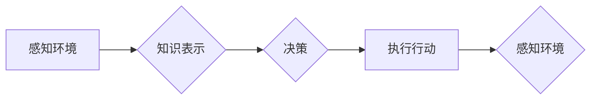

> AI Agent, 大模型应用, 智能体, 决策, 行为, 知识表示, 规划, 学习

## 1. 背景介绍

在人工智能领域，大模型的蓬勃发展为构建更智能、更具自主性的代理系统提供了强大的工具。AI Agent，即智能体，是人工智能领域的核心概念之一，它代表着能够感知环境、做出决策并执行行动的智能系统。随着大模型技术的进步，AI Agent 的能力和应用场景也得到了飞速发展。

传统的AI Agent通常基于规则或模板，其行为模式相对固定。而大模型驱动的AI Agent则能够通过学习海量数据，建立更复杂的知识表示，并根据环境变化做出更灵活、更智能的决策。

## 2. 核心概念与联系

**2.1 AI Agent 的定义**

AI Agent是一个能够感知环境、做出决策并执行行动的智能系统。它是一个独立的实体，能够自主地完成任务，并与环境进行交互。

**2.2 AI Agent 的组成部分**

* **感知模块:** 负责收集环境信息，例如传感器数据、文本信息、图像信息等。
* **知识表示模块:** 将感知到的信息转化为可理解的知识表示，例如知识图谱、符号逻辑等。
* **决策模块:** 根据知识表示和目标，做出最优的行动决策。
* **执行模块:** 将决策转化为实际行动，例如控制机器人运动、生成文本、执行代码等。

**2.3 AI Agent 与大模型的关系**

大模型可以为AI Agent提供强大的能力，例如：

* **自然语言理解:** 大模型可以理解和处理自然语言文本，帮助AI Agent感知环境信息。
* **知识表示学习:** 大模型可以学习复杂的知识表示，帮助AI Agent建立更丰富的知识库。
* **决策推理:** 大模型可以进行复杂的决策推理，帮助AI Agent做出更智能的决策。
* **行为生成:** 大模型可以生成各种各样的行为，帮助AI Agent执行任务。

**2.4  AI Agent 的类型**

* **简单反射式 Agent:** 仅根据当前状态做出反应，没有记忆和学习能力。
* **模型-基于 Agent:** 建立环境模型，根据模型预测未来状态并做出决策。
* **基于学习的 Agent:** 通过学习数据，不断改进决策策略。

**2.5 Mermaid 流程图**



## 3. 核心算法原理 & 具体操作步骤

### 3.1  算法原理概述

大模型驱动的AI Agent通常基于深度学习算法，例如强化学习、迁移学习等。

* **强化学习:** AI Agent通过与环境交互，获得奖励和惩罚信号，不断调整行为策略，以最大化累积奖励。
* **迁移学习:** 利用预训练的大模型，将已有的知识迁移到新的任务中，提高学习效率。

### 3.2  算法步骤详解

**3.2.1 强化学习算法步骤:**

1. **环境建模:** 建立环境模型，描述环境状态、动作空间和奖励函数。
2. **策略初始化:** 初始化AI Agent的策略，例如随机策略或贪婪策略。
3. **环境交互:** AI Agent与环境交互，根据策略选择动作，并获得奖励和下一个状态。
4. **策略更新:** 根据奖励信号，更新AI Agent的策略，使其朝着最大化累积奖励的方向发展。
5. **重复步骤3-4:** 持续与环境交互，更新策略，直到达到预设的目标或收敛。

**3.2.2 迁移学习算法步骤:**

1. **预训练:** 在大规模数据集上预训练大模型，使其获得丰富的知识表示。
2. **特征提取:** 将预训练模型应用于目标任务，提取特征表示。
3. **微调:** 在目标任务数据集上微调模型参数，使其适应新的任务。

### 3.3  算法优缺点

**3.3.1 强化学习算法:**

* **优点:** 可以学习复杂的决策策略，适应动态变化的环境。
* **缺点:** 需要大量的训练数据和计算资源，训练过程可能很慢。

**3.3.2 迁移学习算法:**

* **优点:** 可以利用预训练模型的知识，提高学习效率，减少训练数据需求。
* **缺点:** 预训练模型的知识可能与目标任务不完全匹配，需要进行微调。

### 3.4  算法应用领域

* **机器人控制:** 训练机器人完成复杂的任务，例如导航、抓取、组装等。
* **游戏 AI:** 开发更智能的游戏对手，提高游戏体验。
* **个性化推荐:** 根据用户的行为和偏好，推荐个性化的商品或服务。
* **医疗诊断:** 辅助医生诊断疾病，提高诊断准确率。

## 4. 数学模型和公式 & 详细讲解 & 举例说明

### 4.1  数学模型构建

**4.1.1 强化学习模型:**

强化学习模型通常使用马尔可夫决策过程 (MDP) 来描述环境和智能体的交互。

* **状态空间 (S):** 环境可能存在的各种状态。
* **动作空间 (A):** 智能体可以执行的各种动作。
* **转移概率 (P):** 从一个状态执行一个动作后转移到另一个状态的概率。
* **奖励函数 (R):** 智能体在某个状态执行某个动作后获得的奖励。

**4.1.2 迁移学习模型:**

迁移学习模型通常使用预训练模型的特征表示作为输入，并对这些特征进行微调，以适应新的任务。

### 4.2  公式推导过程

**4.2.1 强化学习算法中的Bellman方程:**

Bellman方程描述了价值函数的更新规则，用于计算在某个状态下执行某个动作的期望回报。

$$
V(s) = \max_a \sum_{s'} P(s'|s,a) [R(s,a,s') + \gamma V(s')]
$$

其中:

* $V(s)$ 是状态 $s$ 的价值函数。
* $a$ 是智能体可以执行的动作。
* $P(s'|s,a)$ 是从状态 $s$ 执行动作 $a$ 后转移到状态 $s'$ 的概率。
* $R(s,a,s')$ 是在状态 $s$ 执行动作 $a$ 后转移到状态 $s'$ 获得的奖励。
* $\gamma$ 是折扣因子，控制未来奖励的权重。

**4.2.2 迁移学习算法中的知识蒸馏:**

知识蒸馏是一种将知识从大模型迁移到小模型的技术。

小模型的输出分布被调整为与大模型的输出分布尽可能接近。

$$
KL(P_{student}(y|x) || P_{teacher}(y|x))
$$

其中:

* $P_{student}(y|x)$ 是小模型的输出分布。
* $P_{teacher}(y|x)$ 是大模型的输出分布。
* $KL$ 是KL散度。

### 4.3  案例分析与讲解

**4.3.1 强化学习案例:**

AlphaGo 是一个使用强化学习算法训练的围棋AI，它击败了世界冠军，展现了强化学习在复杂决策问题上的强大能力。

**4.3.2 迁移学习案例:**

BERT 是一个预训练的语言模型，它在各种自然语言处理任务上都取得了优异的性能。许多研究人员利用BERT的预训练知识，在特定领域的任务上进行微调，取得了显著的提升。

## 5. 项目实践：代码实例和详细解释说明

### 5.1  开发环境搭建

* **操作系统:** Linux/macOS
* **编程语言:** Python
* **深度学习框架:** TensorFlow/PyTorch
* **其他工具:** Git, Jupyter Notebook

### 5.2  源代码详细实现

```python
# 强化学习示例代码 (使用 TensorFlow)

import tensorflow as tf

# 定义环境
class Environment:
    def __init__(self):
        # ...

    def step(self, action):
        # ...

# 定义策略网络
class PolicyNetwork(tf.keras.Model):
    def __init__(self):
        # ...

    def call(self, state):
        # ...

# 定义价值网络
class ValueNetwork(tf.keras.Model):
    def __init__(self):
        # ...

    def call(self, state):
        # ...

# 训练循环
for episode in range(num_episodes):
    state = environment.reset()
    done = False
    while not done:
        action = policy_network(state)
        next_state, reward, done = environment.step(action)
        # ... (更新策略网络和价值网络)
        state = next_state

```

### 5.3  代码解读与分析

* **环境类:** 定义了智能体与环境交互的规则，包括状态空间、动作空间、奖励函数等。
* **策略网络:** 学习预测在给定状态下执行哪个动作最优。
* **价值网络:** 学习估计在给定状态下获得的期望回报。
* **训练循环:** 迭代地与环境交互，更新策略网络和价值网络的参数。

### 5.4  运行结果展示

训练完成后，可以评估AI Agent在环境中的性能，例如完成任务的成功率、平均奖励等。

## 6. 实际应用场景

### 6.1  机器人控制

* **工业机器人:** 自动化生产线，提高生产效率。
* **服务机器人:** 提供家政服务、医疗服务等。
* **探索机器人:** 探索未知环境，例如深海、太空等。

### 6.2  游戏 AI

* **游戏对手:** 提供更智能、更具挑战性的游戏体验。
* **游戏剧情:** 自动生成游戏剧情，提高游戏可玩性。
* **游戏测试:** 自动测试游戏，发现bug。

### 6.3  个性化推荐

* **电商推荐:** 根据用户的购买历史和偏好，推荐个性化的商品。
* **内容推荐:** 根据用户的阅读历史和兴趣，推荐个性化的内容。
* **广告推荐:** 根据用户的兴趣和行为，推荐个性化的广告。

### 6.4  未来应用展望

* **自动驾驶:** 开发更安全、更可靠的自动驾驶系统。
* **医疗诊断:** 辅助医生诊断疾病，提高诊断准确率。
* **教育:** 提供个性化的教育服务，提高学习效率。

## 7. 工具和资源推荐

### 7.1  学习资源推荐

* **书籍:**
    * 《Reinforcement Learning: An Introduction》
    * 《Deep Learning》
* **在线课程:**
    * Coursera: Reinforcement Learning Specialization
    * Udacity: Deep Learning Nanodegree

### 7.2  开发工具推荐

* **深度学习框架:** TensorFlow, PyTorch
* **环境模拟器:** OpenAI Gym, MuJoCo
* **代码编辑器:** VS Code, Atom

### 7.3  相关论文推荐

* **AlphaGo:** Mastering the game of Go with deep neural networks and tree search
* **BERT:** BERT: Pre-training of Deep Bidirectional Transformers for Language Understanding

## 8. 总结：未来发展趋势与挑战

### 8.1  研究成果总结

大模型驱动的AI Agent取得了显著的进展，在机器人控制、游戏 AI、个性化推荐等领域取得了突破性成果。

### 8.2  未来发展趋势

* **更强大的大模型:** 随着计算能力的提升，大模型将变得更加强大，能够处理更复杂的任务。
* **更智能的算法:** 新的算法将被开发出来，使AI Agent能够学习更复杂的知识和技能。
* **更广泛的应用场景:** AI Agent将应用于更多领域，例如自动驾驶、医疗诊断、教育等。

### 8.3  面临的挑战

* **数据获取和标注:** 训练大模型需要大量的训练数据，获取和标注这些数据