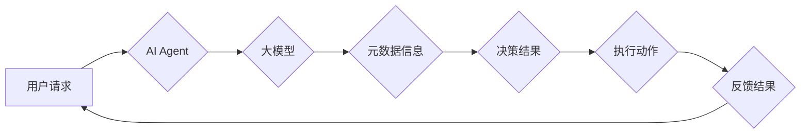

> 大模型、AI Agent、元数据、应用开发、实践案例

## 1. 背景介绍

近年来，大模型技术取得了飞速发展，其强大的泛化能力和知识表示能力为人工智能领域带来了革命性的变革。大模型能够处理海量数据，学习复杂的模式，并生成高质量的文本、图像、代码等内容。

然而，单纯的模型训练并不能完全解决实际应用问题。为了将大模型的强大能力真正应用于实际场景，我们需要将其与其他技术结合，构建更加智能、灵活、可定制的应用系统。

AI Agent（人工智能代理）作为一种能够自主感知环境、做出决策并执行行动的智能体，为大模型的应用提供了新的思路和方向。通过将大模型作为AI Agent的核心组件，我们可以构建出能够理解用户需求、执行任务、并与环境交互的智能助手。

## 2. 核心概念与联系

### 2.1 大模型

大模型是指参数量巨大、训练数据量庞大的深度学习模型。其强大的学习能力使其能够在各种自然语言处理、计算机视觉、语音识别等领域取得突破性进展。

### 2.2 AI Agent

AI Agent是一种能够自主感知环境、做出决策并执行行动的智能体。它通常由以下几个核心组件组成：

* **感知模块:** 用于获取环境信息，例如传感器数据、文本、图像等。
* **决策模块:** 用于根据环境信息和目标进行决策，例如选择行动、制定策略等。
* **执行模块:** 用于执行决策，例如控制机器人运动、生成文本、发送指令等。

### 2.3 元数据

元数据是指描述数据的结构、内容、属性等信息的额外数据。它可以帮助我们更好地理解和利用数据，例如：

* **数据类型:** 文本、图像、音频等。
* **数据格式:** JSON、CSV、XML等。
* **数据来源:** 网站、数据库、传感器等。
* **数据时间戳:** 数据采集时间。

### 2.4 核心概念联系

将大模型与AI Agent结合，可以构建出更加智能、灵活的应用系统。大模型可以作为AI Agent的决策模块，利用其强大的学习能力和知识表示能力，帮助AI Agent做出更准确、更合理的决策。

元数据可以为AI Agent提供关于环境和数据的丰富信息，帮助AI Agent更好地理解环境，并做出更有效的决策。

**Mermaid 流程图**



## 3. 核心算法原理 & 具体操作步骤

### 3.1 算法原理概述

大模型与AI Agent的结合主要基于以下几个核心算法原理：

* **强化学习:** AI Agent通过与环境交互，学习最优的策略，以最大化奖励。
* **自然语言处理:** 大模型可以理解和生成自然语言，帮助AI Agent与用户进行自然交互。
* **知识图谱:** 大模型可以构建知识图谱，存储和推理知识，帮助AI Agent更好地理解世界。

### 3.2 算法步骤详解

1. **环境建模:** 建立AI Agent与环境的交互模型，定义环境状态、动作空间、奖励函数等。
2. **大模型训练:** 使用大模型训练算法，例如Transformer、BERT等，使其能够理解自然语言、生成文本、进行知识推理等。
3. **AI Agent设计:** 设计AI Agent的架构，包括感知模块、决策模块、执行模块等，并选择合适的算法实现。
4. **强化学习训练:** 使用强化学习算法训练AI Agent，使其能够学习最优的策略，以最大化奖励。
5. **元数据融合:** 将元数据信息融入AI Agent的决策模块，帮助AI Agent更好地理解环境和做出更合理的决策。
6. **系统部署:** 将训练好的AI Agent部署到实际应用场景中，并进行持续监控和优化。

### 3.3 算法优缺点

**优点:**

* **智能化:** AI Agent能够自主感知环境、做出决策，提高应用系统的智能化水平。
* **可定制化:** 可以根据不同的应用场景，定制不同的AI Agent，满足个性化需求。
* **高效性:** 大模型的强大学习能力可以帮助AI Agent更快地学习和适应环境。

**缺点:**

* **复杂性:** 设计和训练AI Agent是一个复杂的过程，需要专业的技术人员和大量的计算资源。
* **安全性和可靠性:** AI Agent的决策可能会受到外部因素的影响，需要保证其安全性和可靠性。
* **伦理问题:** AI Agent的决策可能会涉及到伦理问题，需要进行充分的思考和讨论。

### 3.4 算法应用领域

大模型与AI Agent的结合在各个领域都有广泛的应用前景，例如：

* **客服机器人:** 提供24小时在线客服，解答用户疑问，处理简单事务。
* **智能助理:** 帮助用户管理日程安排、发送邮件、查找信息等。
* **个性化推荐:** 根据用户的兴趣爱好，推荐个性化的商品、服务、内容等。
* **自动驾驶:** 帮助车辆感知环境、做出决策，实现自动驾驶功能。

## 4. 数学模型和公式 & 详细讲解 & 举例说明

### 4.1 数学模型构建

**强化学习模型:**

AI Agent的决策过程可以建模为一个马尔可夫决策过程 (MDP)，其中：

* **状态空间 (S):** 环境可能存在的各种状态。
* **动作空间 (A):** AI Agent可以执行的各种动作。
* **转移概率 (P):** 从一个状态执行一个动作后，转移到另一个状态的概率。
* **奖励函数 (R):** AI Agent在某个状态执行某个动作后获得的奖励。

**目标:** 找到一个策略 π，使得在该策略下，AI Agent获得的总奖励最大化。

### 4.2 公式推导过程

**Bellman方程:**

Bellman方程是强化学习中一个重要的公式，用于计算状态价值函数。状态价值函数 V(s) 表示在状态 s 下，按照最优策略执行的动作序列所能获得的期望总奖励。

$$V(s) = \max_{\pi} \sum_{t=0}^{\infty} \gamma^t R(s_t, a_t)$$

其中：

* γ 是折扣因子，控制未来奖励的权重。
* R(s_t, a_t) 是在状态 s_t 执行动作 a_t 后获得的奖励。

### 4.3 案例分析与讲解

**例子:**

假设有一个AI Agent需要学习玩一个简单的游戏，游戏目标是收集尽可能多的金币。

* **状态空间:** 游戏中的地图状态，例如玩家位置、金币位置等。
* **动作空间:** 玩家可以执行的各种动作，例如向上、向下、向左、向右移动等。
* **转移概率:** 执行某个动作后，玩家位置的变化概率。
* **奖励函数:** 收集金币获得奖励，撞到障碍物扣除奖励。

通过强化学习算法，AI Agent可以学习到最优的策略，例如如何移动到金币的位置，如何避开障碍物等。

## 5. 项目实践：代码实例和详细解释说明

### 5.1 开发环境搭建

* Python 3.7+
* TensorFlow/PyTorch
* OpenAI Gym

### 5.2 源代码详细实现

```python
import gym
import tensorflow as tf

# 定义AI Agent
class Agent:
    def __init__(self, state_size, action_size):
        self.state_size = state_size
        self.action_size = action_size
        self.model = tf.keras.models.Sequential([
            tf.keras.layers.Dense(64, activation='relu', input_shape=(state_size,)),
            tf.keras.layers.Dense(action_size)
        ])

    def act(self, state):
        # 使用模型预测动作概率
        probs = self.model(state)
        # 根据概率选择动作
        action = tf.random.categorical(probs, 1)[0, 0]
        return action

# 创建环境
env = gym.make('CartPole-v1')

# 初始化AI Agent
agent = Agent(state_size=env.observation_space.shape[0], action_size=env.action_space.n)

# 训练AI Agent
for episode in range(1000):
    state = env.reset()
    done = False
    while not done:
        action = agent.act(state)
        next_state, reward, done, _ = env.step(action)
        # 更新模型参数
        # ...
        state = next_state

# 测试AI Agent
state = env.reset()
while True:
    action = agent.act(state)
    state, _, done, _ = env.step(action)
    env.render()
    if done:
        break
env.close()
```

### 5.3 代码解读与分析

* **AI Agent类:** 定义了AI Agent的结构和行为，包括状态空间、动作空间、模型、动作选择等。
* **模型:** 使用深度神经网络作为AI Agent的决策模型，输入状态信息，输出动作概率。
* **训练过程:** 使用强化学习算法训练AI Agent，通过与环境交互，学习最优的策略。
* **测试过程:** 使用训练好的AI Agent与环境交互，观察其行为。

### 5.4 运行结果展示

运行代码后，AI Agent将在环境中执行动作，并尝试完成游戏目标。

## 6. 实际应用场景

### 6.1 智能客服

AI Agent可以作为智能客服，通过自然语言处理技术理解用户问题，并提供准确的答案。

### 6.2 个性化推荐

AI Agent可以根据用户的兴趣爱好，推荐个性化的商品、服务、内容等。

### 6.3 自动化办公

AI Agent可以自动化完成一些重复性的办公任务，例如发送邮件、安排会议等。

### 6.4 未来应用展望

随着大模型技术的不断发展，AI Agent的应用场景将会更加广泛，例如：

* **医疗诊断:** AI Agent可以辅助医生进行诊断，提高诊断准确率。
* **教育辅助:** AI Agent可以作为个性化学习助手，帮助学生学习和掌握知识。
* **金融风险控制:** AI Agent可以帮助金融机构识别和控制风险。

## 7. 工具和资源推荐

### 7.1 学习资源推荐

* **书籍:**
    * 《深度学习》
    * 《强化学习：原理、算法和应用》
* **在线课程:**
    * Coursera: 深度学习
    * Udacity: 强化学习

### 7.2 开发工具推荐

* **TensorFlow:** 开源深度学习框架
* **PyTorch:** 开源深度学习框架
* **OpenAI Gym:** 强化学习环境库

### 7.3 相关论文推荐

* **Attention Is All You Need:** https://arxiv.org/abs/1706.03762
* **Deep Reinforcement Learning with Double Q-learning:** https://arxiv.org/abs/1509.06461

## 8. 总结：未来发展趋势与挑战

### 8.1 研究成果总结

大模型与AI Agent的结合取得了显著的成果，在各个领域都有广泛的应用前景。

### 8.2 未来发展趋势

* **模型规模和能力的提升:** 大模型的规模和能力将继续提升，使其能够处理更复杂的任务。
* **多模态学习:** AI Agent将能够处理多种模态数据，例如文本、图像、音频等。
* **可解释性增强:** 研究如何提高AI Agent的决策可解释性，使其更加透明和可信赖。

### 8.3 面临的挑战

* **数据获取和标注:** 大模型训练需要海量数据，数据获取和标注成本较高。
* **计算资源需求:** 训练大模型需要大量的计算资源，