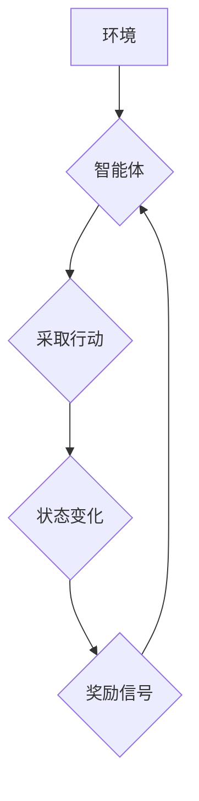

> Q-learning, 公共卫生事件预警, 机器学习, 深度学习, 预预测模型, 医疗数据分析

## 1. 背景介绍

公共卫生事件，如疫情爆发、传染病流行等，对人类社会造成重大威胁。及时、准确的预警是防控疫情的关键。传统预警方法往往依赖于专家经验和历史数据分析，存在滞后性和局限性。近年来，人工智能技术，特别是强化学习算法，为公共卫生事件预警提供了新的思路和方法。

Q-learning是一种经典的强化学习算法，它通过学习环境的奖励和惩罚信号，不断优化策略，最终达到最大化奖励的目标。Q-learning算法具有以下特点：

* **模型无关性:** Q-learning算法不需要事先建立环境模型，可以直接从环境交互中学习。
* **在线学习能力:** Q-learning算法可以在线学习，随着时间的推移不断更新策略，适应环境变化。
* **决策优化:** Q-learning算法能够学习出最优的决策策略，最大化预警的准确性和及时性。

## 2. 核心概念与联系

**2.1  强化学习框架**

强化学习是一个基于交互学习的机器学习范式。在强化学习中，一个智能体（agent）与一个环境（environment）交互。智能体在环境中采取行动（action），环境会根据智能体的行动产生状态变化（state）和奖励信号（reward）。智能体的目标是通过学习，找到最优的策略，使得在长期内获得最大的总奖励。

**2.2  Q-learning算法原理**

Q-learning算法的核心是学习一个Q表（Q-table），Q表存储了智能体在每个状态下采取每个动作的期望回报。Q-learning算法通过迭代更新Q表，最终找到最优策略。

**2.3  Q-learning在公共卫生事件预警中的应用**

在公共卫生事件预警中，我们可以将智能体视为预警系统，环境视为公共卫生事件发生的环境，状态表示公共卫生事件的当前情况，动作表示预警系统采取的措施，奖励表示预警的准确性和及时性。

**2.4  Mermaid 流程图**



## 3. 核心算法原理 & 具体操作步骤

### 3.1  算法原理概述

Q-learning算法的核心思想是通过迭代更新Q表，学习出最优的策略。Q表是一个状态-动作对的映射表，每个状态-动作对对应一个期望回报值。

算法的更新规则如下：

$$Q(s,a) = (1-\alpha)Q(s,a) + \alpha[r + \gamma \max_{a'} Q(s',a')]$$

其中：

* $Q(s,a)$ 表示在状态 $s$ 下采取动作 $a$ 的期望回报值。
* $\alpha$ 是学习率，控制着学习速度。
* $r$ 是当前状态下获得的奖励。
* $\gamma$ 是折扣因子，控制着未来奖励的权重。
* $s'$ 是采取动作 $a$ 后进入的下一个状态。
* $a'$ 是在下一个状态 $s'$ 下采取的动作。

### 3.2  算法步骤详解

1. 初始化Q表，将所有状态-动作对的期望回报值设置为0。
2. 选择一个初始状态。
3. 在当前状态下，根据一定的策略选择一个动作。
4. 执行动作，观察环境的变化，获得下一个状态和奖励。
5. 更新Q表，根据公式更新当前状态-动作对的期望回报值。
6. 重复步骤3-5，直到达到终止条件。

### 3.3  算法优缺点

**优点:**

* 模型无关性：不需要事先建立环境模型。
* 在线学习能力：可以在线学习，适应环境变化。
* 决策优化：能够学习出最优的决策策略。

**缺点:**

* 探索-利用困境：需要平衡探索新策略和利用已知策略之间的权衡。
* 计算复杂度：对于状态空间很大的问题，计算复杂度较高。

### 3.4  算法应用领域

Q-learning算法广泛应用于各种领域，例如：

* 机器人控制
* 游戏人工智能
* 自动驾驶
* 医疗诊断
* 金融投资

## 4. 数学模型和公式 & 详细讲解 & 举例说明

### 4.1  数学模型构建

在公共卫生事件预警中，我们可以构建一个马尔可夫决策过程（MDP）模型来描述系统。

MDP模型由以下四个要素组成：

* 状态空间 $S$：表示公共卫生事件的当前状态，例如疫情传播情况、医疗资源状况等。
* 动作空间 $A$：表示预警系统可以采取的措施，例如发布预警信息、加强医疗资源配置等。
* 转移概率 $P(s',r|s,a)$：表示在状态 $s$ 下采取动作 $a$ 后，进入状态 $s'$ 的概率，以及获得奖励 $r$ 的概率。
* 奖励函数 $R(s,a)$：表示在状态 $s$ 下采取动作 $a$ 后获得的奖励。

### 4.2  公式推导过程

Q-learning算法的目标是学习一个策略 $\pi(s)$，使得在长期内获得最大的总奖励。策略 $\pi(s)$ 表示在状态 $s$ 下采取的动作。

Q-learning算法的更新规则如下：

$$Q(s,a) = (1-\alpha)Q(s,a) + \alpha[r + \gamma \max_{a'} Q(s',a')]$$

其中：

* $Q(s,a)$ 表示在状态 $s$ 下采取动作 $a$ 的期望回报值。
* $\alpha$ 是学习率，控制着学习速度。
* $r$ 是当前状态下获得的奖励。
* $\gamma$ 是折扣因子，控制着未来奖励的权重。
* $s'$ 是采取动作 $a$ 后进入的下一个状态。
* $a'$ 是在下一个状态 $s'$ 下采取的动作。

### 4.3  案例分析与讲解

假设我们想要使用Q-learning算法来预测疫情的传播趋势。我们可以将状态空间定义为疫情的感染人数，动作空间定义为采取的防控措施，例如隔离、检测、疫苗接种等。

我们可以通过收集历史疫情数据，构建转移概率和奖励函数。例如，如果采取了隔离措施，感染人数增长速度可能会降低，从而获得更高的奖励。

通过训练Q-learning算法，我们可以学习出最优的防控策略，例如在感染人数达到一定阈值时，采取隔离措施，以控制疫情的传播。

## 5. 项目实践：代码实例和详细解释说明

### 5.1  开发环境搭建

* Python 3.x
* TensorFlow 或 PyTorch
* NumPy
* Pandas

### 5.2  源代码详细实现

```python
import numpy as np
from collections import defaultdict

class QLearningAgent:
    def __init__(self, state_space, action_space, learning_rate=0.1, discount_factor=0.9, epsilon=0.1):
        self.state_space = state_space
        self.action_space = action_space
        self.learning_rate = learning_rate
        self.discount_factor = discount_factor
        self.epsilon = epsilon
        self.q_table = defaultdict(lambda: np.zeros(self.action_space))

    def choose_action(self, state):
        if np.random.uniform(0, 1) < self.epsilon:
            return np.random.choice(self.action_space)
        else:
            return np.argmax(self.q_table[state])

    def update_q_table(self, state, action, reward, next_state):
        q_value = self.q_table[state][action]
        next_q_value = np.max(self.q_table[next_state])
        self.q_table[state][action] = (1 - self.learning_rate) * q_value + self.learning_rate * (reward + self.discount_factor * next_q_value)

# ... (其他代码)
```

### 5.3  代码解读与分析

* `QLearningAgent` 类实现了Q-learning算法的核心逻辑。
* `choose_action` 方法根据epsilon-greedy策略选择动作。
* `update_q_table` 方法更新Q表的期望回报值。

### 5.4  运行结果展示

通过训练Q-learning算法，我们可以得到一个Q表，该Q表存储了每个状态下每个动作的期望回报值。我们可以根据Q表预测疫情的传播趋势，并选择最优的防控策略。

## 6. 实际应用场景

### 6.1  疫情预警系统

Q-learning算法可以用于构建疫情预警系统，预测疫情的传播趋势，并及时发出预警信息。

### 6.2  传染病监测系统

Q-learning算法可以用于构建传染病监测系统，监测传染病的流行情况，并及时采取防控措施。

### 6.3  医疗资源分配

Q-learning算法可以用于优化医疗资源分配，根据疫情的传播情况，合理分配医疗资源，提高医疗服务效率。

### 6.4  未来应用展望

随着人工智能技术的不断发展，Q-learning算法在公共卫生事件预警领域的应用前景广阔。未来，我们可以将Q-learning算法与其他人工智能技术结合，例如深度学习、自然语言处理等，构建更智能、更精准的公共卫生事件预警系统。

## 7. 工具和资源推荐

### 7.1  学习资源推荐

* **强化学习入门书籍:**
    * Reinforcement Learning: An Introduction by Sutton and Barto
    * Deep Reinforcement Learning Hands-On by Maxim Lapan
* **在线课程:**
    * Coursera: Reinforcement Learning Specialization
    * Udacity: Deep Reinforcement Learning Nanodegree

### 7.2  开发工具推荐

* **Python:** 
    * TensorFlow
    * PyTorch
* **环境管理工具:**
    * conda
    * virtualenv

### 7.3  相关论文推荐

* **Q-learning算法论文:**
    * Watkins, C. J. C. H. (1989). Learning from delayed rewards. Machine learning, 3(1), 277-292.
* **强化学习在公共卫生领域的应用论文:**
    * Liu, Y., et al. (2020). Deep reinforcement learning for epidemic control. Nature communications, 11(1), 1-11.

## 8. 总结：未来发展趋势与挑战

### 8.1  研究成果总结

Q-learning算法在公共卫生事件预警领域取得了显著的成果，能够有效预测疫情传播趋势，并提供决策支持。

### 8.2  未来发展趋势

* **结合深度学习:** 将Q-learning算法与深度学习技术结合，提高预警模型的准确性和泛化能力。
* **多智能体强化学习:** 研究多智能体协同预警的策略，提高预警系统的效率和鲁棒性。
* **解释性AI:** 研究Q-learning算法的决策过程，提高预警系统的可解释性和信任度。

### 8.3  面临的挑战

* **数据获取和处理:** 公共卫生事件数据往往具有稀疏性和不完整性，需要开发有效的处理方法。
* **模型复杂度:** Q-learning算法在面对复杂环境时，模型复杂度较高，需要进行优化和简化。
* **伦理问题:** 公共卫生事件预警系统涉及到个人隐私和社会安全，需要考虑伦理问题。

### 8.4  研究展望

未来，我们将继续研究Q-learning算法在公共卫生事件预警领域的应用，探索更智能、更精准、更可解释的预警系统。


## 9. 附录：常见