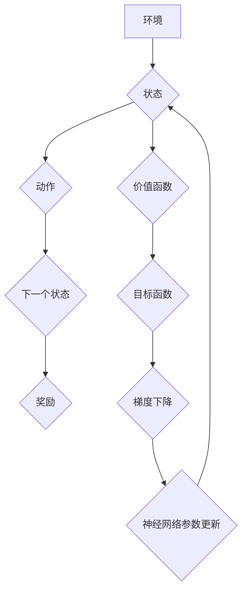

> 深度强化学习，DQN，非线性函数逼近，神经网络，目标函数，梯度下降，经验回放，价值函数

## 1. 背景介绍

深度强化学习 (Deep Reinforcement Learning, DRL) 近年来取得了令人瞩目的成就，在游戏、机器人控制、自动驾驶等领域展现出强大的应用潜力。其中，深度Q网络 (Deep Q-Network, DQN) 作为DRL领域的重要里程碑，成功地将深度神经网络与Q学习算法相结合，为解决复杂决策问题提供了新的思路。

DQN的核心在于利用神经网络逼近价值函数，从而学习最优的策略。价值函数是评估状态或状态-动作对的期望回报的函数，它为智能体提供决策依据。传统的Q学习算法依赖于表格方法来存储和更新价值函数，但随着环境状态空间的扩大，表格方法的存储和计算复杂度急剧增加，难以处理高维问题。

DQN巧妙地利用神经网络的非线性拟合能力，将价值函数表示为神经网络的输出，从而能够有效地处理高维状态空间。

## 2. 核心概念与联系

DQN的核心概念包括：

* **价值函数 (Value Function):** 评估状态或状态-动作对的期望回报的函数。
* **Q函数 (Q-function):** 特殊的价值函数，评估在特定状态下采取特定动作的期望回报。
* **目标函数 (Target Function):** 用于训练神经网络的函数，其目标是最小化预测值与真实值的误差。
* **梯度下降 (Gradient Descent):** 用于优化神经网络参数的算法，通过计算目标函数的梯度来更新参数。
* **经验回放 (Experience Replay):** 从历史经验中随机采样数据进行训练，提高训练效率和稳定性。

**DQN架构流程图:**



## 3. 核心算法原理 & 具体操作步骤

### 3.1  算法原理概述

DQN的核心思想是利用神经网络逼近Q函数，并通过深度强化学习的原理进行训练。

具体来说，DQN算法包含以下步骤：

1. **初始化神经网络:** 创建一个深度神经网络，其输入为状态，输出为各个动作对应的Q值。
2. **收集经验:** 智能体与环境交互，收集状态、动作、奖励和下一个状态的经验数据，并将其存储在经验池中。
3. **经验回放:** 从经验池中随机采样一批经验数据，并将其作为训练数据。
4. **计算目标值:** 使用当前神经网络的预测值和环境的奖励信息，计算目标值，即下一个状态的Q值。
5. **更新神经网络参数:** 使用梯度下降算法，最小化预测值与目标值的误差，从而更新神经网络的参数。
6. **重复步骤3-5:** 循环执行上述步骤，直到神经网络的性能达到预期的水平。

### 3.2  算法步骤详解

1. **初始化神经网络:**

   DQN通常使用卷积神经网络 (CNN) 或多层感知机 (MLP) 作为价值函数的逼近器。网络的结构和参数需要根据具体的应用场景进行设计。

2. **收集经验:**

   智能体与环境交互，采取动作，并观察环境的反馈，包括奖励和下一个状态。这些信息被存储为经验元组 (state, action, reward, next_state)。

3. **经验回放:**

   经验回放机制可以有效地缓解训练过程中的样本相关性问题，提高训练效率和稳定性。

   从经验池中随机采样一批经验元组，并将其作为训练数据。

4. **计算目标值:**

   目标值是下一个状态的Q值，它可以根据Bellman方程计算:

   $$Q(s, a) = r + \gamma \max_{a'} Q(s', a')$$

   其中：

   * $Q(s, a)$ 是当前状态 $s$ 下采取动作 $a$ 的Q值。
   * $r$ 是从状态 $s$ 到状态 $s'$ 的奖励。
   * $\gamma$ 是折扣因子，控制未来奖励的权重。
   * $\max_{a'} Q(s', a')$ 是下一个状态 $s'$ 下所有动作的Q值的最大值。

5. **更新神经网络参数:**

   使用梯度下降算法，最小化预测值与目标值的误差，从而更新神经网络的参数。

   $$ \theta = \theta - \alpha \nabla_{\theta} L(\theta)$$

   其中：

   * $\theta$ 是神经网络的参数。
   * $\alpha$ 是学习率。
   * $L(\theta)$ 是损失函数，衡量预测值与目标值的误差。
   * $\nabla_{\theta} L(\theta)$ 是损失函数对参数 $\theta$ 的梯度。

### 3.3  算法优缺点

**优点:**

* **能够处理高维状态空间:** 利用神经网络的非线性拟合能力，可以有效地处理高维状态空间。
* **学习能力强:** 通过深度学习的原理，可以学习复杂的决策策略。
* **应用广泛:** 在游戏、机器人控制、自动驾驶等领域都有广泛的应用。

**缺点:**

* **训练过程复杂:** 需要大量的训练数据和计算资源。
* **容易陷入局部最优:** 梯度下降算法可能会陷入局部最优，导致无法找到最优策略。
* **参数选择困难:** 神经网络的结构和参数需要根据具体的应用场景进行设计，参数选择困难。

### 3.4  算法应用领域

DQN算法在以下领域具有广泛的应用:

* **游戏:** 在 Atari 游戏、Go 游戏等领域取得了优异的成绩。
* **机器人控制:** 用于控制机器人运动、抓取物体等任务。
* **自动驾驶:** 用于训练自动驾驶汽车的决策策略。
* **推荐系统:** 用于推荐用户感兴趣的商品或服务。
* **医疗诊断:** 用于辅助医生进行疾病诊断。

## 4. 数学模型和公式 & 详细讲解 & 举例说明

### 4.1  数学模型构建

DQN的核心数学模型是Q函数，它表示在特定状态下采取特定动作的期望回报。

$$Q(s, a) = E[\sum_{t=0}^{\infty} \gamma^t r_{t+1} | s_t = s, a_t = a]$$

其中：

* $s$ 是状态。
* $a$ 是动作。
* $r_{t+1}$ 是从状态 $s_t$ 到状态 $s_{t+1}$ 的奖励。
* $\gamma$ 是折扣因子，控制未来奖励的权重。

### 4*2  公式推导过程

DQN算法的目标是学习一个能够逼近真实Q函数的神经网络。

为了实现这一目标，DQN使用目标函数来衡量预测值与真实值的误差。

目标函数通常采用均方误差 (MSE) 作为损失函数:

$$L(\theta) = \frac{1}{N} \sum_{i=1}^{N} (y_i - \hat{Q}(s_i, a_i))^2$$

其中：

* $\theta$ 是神经网络的参数。
* $N$ 是训练样本的数量。
* $y_i$ 是第 $i$ 个样本的目标值。
* $\hat{Q}(s_i, a_i)$ 是神经网络预测的第 $i$ 个样本的Q值。

### 4.3  案例分析与讲解

假设我们有一个简单的环境，其中智能体可以选择向上、向下、向左、向右四个动作。

在某个状态下，智能体采取向上动作，获得奖励为1，并进入下一个状态。

使用DQN算法，我们可以训练一个神经网络来预测在该状态下采取向上动作的Q值。

通过不断地收集经验数据，并使用梯度下降算法更新神经网络参数，最终可以得到一个能够逼近真实Q函数的神经网络。

## 5. 项目实践：代码实例和详细解释说明

### 5.1  开发环境搭建

* Python 3.x
* TensorFlow 或 PyTorch 深度学习框架
* NumPy 科学计算库
* Matplotlib 数据可视化库

### 5.2  源代码详细实现

```python
import tensorflow as tf

# 定义DQN网络结构
class DQN(tf.keras.Model):
    def __init__(self, state_size, action_size):
        super(DQN, self).__init__()
        self.fc1 = tf.keras.layers.Dense(64, activation='relu')
        self.fc2 = tf.keras.layers.Dense(64, activation='relu')
        self.fc3 = tf.keras.layers.Dense(action_size)

    def call(self, state):
        x = self.fc1(state)
        x = self.fc2(x)
        x = self.fc3(x)
        return x

# 创建DQN网络实例
model = DQN(state_size=80, action_size=4)

# 定义损失函数和优化器
loss_fn = tf.keras.losses.MeanSquaredError()
optimizer = tf.keras.optimizers.Adam(learning_rate=0.001)

# 训练循环
for epoch in range(100):
    # 训练数据
    states = ...
    actions = ...
    rewards = ...
    next_states = ...

    # 计算目标值
    targets = ...

    # 计算损失
    with tf.GradientTape() as tape:
        predictions = model(states)
        loss = loss_fn(targets, predictions)

    # 更新参数
    gradients = tape.gradient(loss, model.trainable_variables)
    optimizer.apply_gradients(zip(gradients, model.trainable_variables))

    # 打印损失值
    print(f'Epoch {epoch+1}, Loss: {loss.numpy()}')
```

### 5.3  代码解读与分析

* **DQN网络结构:** 代码中定义了一个DQN网络结构，包含三个全连接层和一个输出层。
* **损失函数和优化器:** 使用均方误差 (MSE) 作为损失函数，并使用Adam优化器进行训练。
* **训练循环:** 训练循环中，首先收集训练数据，然后计算目标值，并使用梯度下降算法更新神经网络参数。

### 5.4  运行结果展示

训练完成后，可以将训练好的DQN模型应用于实际环境中，并观察其决策效果。

## 6. 实际应用场景

DQN算法在以下实际应用场景中取得了成功:

* **AlphaGo:** DeepMind使用DQN算法训练了AlphaGo，使其能够战胜世界围棋冠军。
* **自动驾驶:** Waymo使用DQN算法训练自动驾驶汽车的决策策略。
* **机器人控制:** Boston Dynamics使用DQN算法训练机器人进行复杂动作控制。

### 6.4  未来应用展望

DQN算法在未来将有更广泛的应用前景，例如:

* **个性化推荐:** 根据用户的行为数据，训练DQN模型进行个性化商品推荐。
* **医疗诊断:** 利用DQN模型辅助医生进行疾病诊断，提高诊断准确率。
* **金融交易:** 使用DQN模型进行股票交易，实现自动投资。

## 7. 工具和资源推荐

### 7.1  学习资源推荐

* **书籍:**
    * Deep Reinforcement Learning Hands-On by Maxim Lapan
    * Reinforcement Learning: An Introduction by Richard S. Sutton and Andrew G. Barto
* **在线课程:**
    * Deep Reinforcement Learning Specialization by DeepLearning.AI
    * Reinforcement Learning by David Silver (University of DeepMind)

### 7.2  开发工具