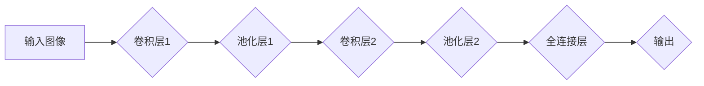

> 卷积神经网络(CNN)、深度学习、图像识别、特征提取、卷积操作、池化操作、全连接层

## 1. 背景介绍

在人工智能领域，卷积神经网络(CNN) 作为一种强大的深度学习模型，在图像识别、物体检测、语音识别等领域取得了突破性的进展。其灵感来源于生物视觉系统，通过模拟人类视觉神经元对图像进行处理的方式，能够自动学习图像特征，并实现高精度识别。

传统的机器学习方法需要人工提取图像特征，这不仅耗时费力，而且难以捕捉到图像的复杂结构。而CNN 则通过卷积操作和池化操作，自动学习图像的局部和全局特征，从而提高了识别精度和效率。

## 2. 核心概念与联系

卷积神经网络的核心概念包括卷积层、池化层和全连接层。

**2.1 卷积层**

卷积层是CNN 的核心组成部分，其作用是通过卷积核对输入图像进行卷积运算，提取图像的局部特征。卷积核是一个小的矩阵，它在图像上滑动，并与图像的局部区域进行卷积运算。卷积运算的结果是一个特征图，它表示图像中特定特征的分布。

**2.2 池化层**

池化层的作用是降低特征图的维度，同时保留其最重要的信息。常见的池化操作包括最大池化和平均池化。最大池化选择每个区域的最大值作为输出，而平均池化则计算每个区域的平均值作为输出。池化操作可以有效地减少计算量，并提高模型的鲁棒性。

**2.3 全连接层**

全连接层将池化层的输出作为输入，并将其连接到所有神经元。全连接层的作用是将提取到的特征进行分类或回归。

**2.4 CNN 架构流程图**



## 3. 核心算法原理 & 具体操作步骤

### 3.1 算法原理概述

卷积神经网络的核心算法是卷积操作和池化操作。卷积操作通过卷积核对图像进行滑动运算，提取图像的局部特征。池化操作则通过最大池化或平均池化，降低特征图的维度，并保留其最重要的信息。

### 3.2 算法步骤详解

1. **输入图像预处理:** 将输入图像转换为适合CNN处理的格式，例如调整大小、归一化等。
2. **卷积操作:** 使用卷积核对输入图像进行卷积运算，提取图像的局部特征。
3. **激活函数:** 将卷积层的输出通过激活函数进行非线性变换，提高模型的表达能力。
4. **池化操作:** 对卷积层的输出进行池化操作，降低特征图的维度，并保留其最重要的信息。
5. **重复步骤2-4:** 将卷积层、池化层和激活函数重复若干层，形成多层卷积神经网络。
6. **全连接层:** 将池化层的输出作为输入，连接到全连接层，进行分类或回归。
7. **损失函数:** 使用损失函数计算模型的预测结果与真实值的误差。
8. **反向传播:** 使用反向传播算法，更新模型参数，降低模型的损失函数值。
9. **训练和测试:** 将模型训练在训练集上，并测试在测试集上，评估模型的性能。

### 3.3 算法优缺点

**优点:**

* 自动学习图像特征，无需人工提取特征。
* 能够处理高维数据，并提取图像的复杂结构。
* 具有较高的识别精度和鲁棒性。

**缺点:**

* 训练时间长，需要大量的计算资源。
* 模型参数众多，容易过拟合。
* 对数据质量要求较高，数据不干净会导致模型性能下降。

### 3.4 算法应用领域

卷积神经网络在图像识别、物体检测、语音识别、自然语言处理等领域都有广泛的应用。

## 4. 数学模型和公式 & 详细讲解 & 举例说明

### 4.1 数学模型构建

卷积神经网络的数学模型可以表示为一个多层神经网络，其中每一层都包含卷积层、池化层和激活函数。

**4.1.1 卷积操作:**

卷积操作的数学公式如下：

$$
y(i,j) = \sum_{m=0}^{M-1} \sum_{n=0}^{N-1} x(i+m,j+n) * w(m,n)
$$

其中：

* $y(i,j)$ 是卷积层的输出特征图上的像素值。
* $x(i+m,j+n)$ 是输入图像上的像素值。
* $w(m,n)$ 是卷积核的权重值。
* $M$ 和 $N$ 是卷积核的大小。

**4.1.2 池化操作:**

池化操作的数学公式取决于具体的池化操作类型。例如，最大池化操作的数学公式如下：

$$
y(i,j) = \max_{m=0}^{k-1} \max_{n=0}^{l-1} x(i*s+m,j*s+n)
$$

其中：

* $y(i,j)$ 是池化层的输出特征图上的像素值。
* $x(i*s+m,j*s+n)$ 是输入特征图上的像素值。
* $s$ 是池化窗口的大小。
* $k$ 和 $l$ 是池化窗口的大小。

### 4.2 公式推导过程

卷积操作和池化操作的数学公式推导过程可以参考相关机器学习和深度学习教材。

### 4.3 案例分析与讲解

以图像识别为例，CNN 可以学习到图像中不同物体特征的表示。例如，卷积层可以学习到边缘、纹理等低级特征，而池化层可以学习到物体形状、位置等高级特征。最终，全连接层将这些特征进行分类，识别出图像中的物体。

## 5. 项目实践：代码实例和详细解释说明

### 5.1 开发环境搭建

使用 Python 语言和 TensorFlow 或 PyTorch 深度学习框架进行开发。

### 5.2 源代码详细实现

```python
import tensorflow as tf

# 定义卷积神经网络模型
model = tf.keras.models.Sequential([
    tf.keras.layers.Conv2D(32, (3, 3), activation='relu', input_shape=(28, 28, 1)),
    tf.keras.layers.MaxPooling2D((2, 2)),
    tf.keras.layers.Conv2D(64, (3, 3), activation='relu'),
    tf.keras.layers.MaxPooling2D((2, 2)),
    tf.keras.layers.Flatten(),
    tf.keras.layers.Dense(10, activation='softmax')
])

# 编译模型
model.compile(optimizer='adam',
              loss='sparse_categorical_crossentropy',
              metrics=['accuracy'])

# 训练模型
model.fit(x_train, y_train, epochs=10)

# 评估模型
loss, accuracy = model.evaluate(x_test, y_test)
print('Test loss:', loss)
print('Test accuracy:', accuracy)
```

### 5.3 代码解读与分析

* `tf.keras.models.Sequential` 创建一个顺序模型，其中层级依次连接。
* `tf.keras.layers.Conv2D` 定义卷积层，参数包括卷积核大小、激活函数和输入形状。
* `tf.keras.layers.MaxPooling2D` 定义最大池化层，参数包括池化窗口大小。
* `tf.keras.layers.Flatten` 将多维特征图转换为一维向量。
* `tf.keras.layers.Dense` 定义全连接层，参数包括神经元数量和激活函数。
* `model.compile` 编译模型，指定优化器、损失函数和评价指标。
* `model.fit` 训练模型，参数包括训练数据、训练轮数等。
* `model.evaluate` 评估模型，参数包括测试数据和真实标签。

### 5.4 运行结果展示

训练完成后，模型会输出测试集上的损失值和准确率。

## 6. 实际应用场景

卷积神经网络在图像识别、物体检测、语音识别、自然语言处理等领域都有广泛的应用。

### 6.1 图像识别

CNN 可以用于识别图像中的物体、场景和人物。例如，在自动驾驶汽车中，CNN 可以识别道路上的车辆、行人和其他障碍物。

### 6.2 物体检测

CNN 可以用于检测图像中多个物体的类别和位置。例如，在安防监控系统中，CNN 可以检测图像中的人脸、车辆和其他异常物体。

### 6.3 语音识别

CNN 可以用于将语音信号转换为文本。例如，在智能语音助手中，CNN 可以识别用户的语音指令。

### 6.4 自然语言处理

CNN 可以用于处理自然语言文本，例如文本分类、情感分析和机器翻译。

### 6.5 未来应用展望

随着深度学习技术的不断发展，卷积神经网络的应用场景将会更加广泛。例如，CNN 可以用于医疗图像分析、药物发现、金融风险评估等领域。

## 7. 工具和资源推荐

### 7.1 学习资源推荐

* 深度学习书籍：
    * 《深度学习》
    * 《动手学深度学习》
* 在线课程：
    * Coursera 上的深度学习课程
    * Udacity 上的深度学习课程

### 7.2 开发工具推荐

* TensorFlow
* PyTorch
* Keras

### 7.3 相关论文推荐

* 《ImageNet Classification with Deep Convolutional Neural Networks》
* 《AlexNet》
* 《VGGNet》

## 8. 总结：未来发展趋势与挑战

### 8.1 研究成果总结

卷积神经网络在图像识别、物体检测、语音识别等领域取得了突破性的进展，其自动学习特征的能力和高识别精度使其成为深度学习领域的重要模型。

### 8.2 未来发展趋势

* 模型效率提升：研究更高效的卷积神经网络架构，降低模型训练和推理时间。
* 模型解释性增强：研究更有效的模型解释方法，提高对模型决策的理解。
* 跨模态学习：研究跨图像、文本、音频等不同模态的深度学习模型。

### 8.3 面临的挑战

* 数据获取和标注：深度学习模型需要大量的训练数据，数据获取和标注成本较高。
* 模型可解释性：深度学习模型的决策过程难以解释，这限制了其在一些安全关键领域中的应用。
* 硬件资源限制：训练大型深度学习模型需要大量的计算资源，这限制了模型规模的增长。

### 8.4 研究展望

未来，卷积神经网络的研究将继续朝着更高效、更可解释、更跨模态的方向发展。


## 9. 附录：常见问题与解答

**1. 卷积神经网络和传统神经网络有什么区别？**

卷积神经网络专门设计用于处理图像数据，它利用卷积操作和池化操作自动学习图像特征，而传统神经网络需要人工提取特征。

**2. 如何选择合适的卷积核大小？**

卷积核的大小与图像分辨率和特征提取层次有关。较小的卷积核可以捕捉局部特征，而较大的卷积核可以捕捉全局特征。

**3. 如何防止卷积神经网络过拟合？**

可以使用正则化技术、数据增强、Dropout 等方法来防止卷积神经网络过拟合。

**4. 如何评估卷积神经网络的性能？**

可以使用准确率、召回率、F1-score 等指标来评估卷积神经网络的性能。

**5. 如何部署卷积