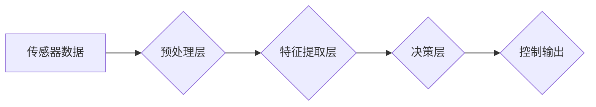

> 无人驾驶, 神经网络, 映射, 深度学习, 计算机视觉, 决策控制

## 1. 背景介绍

无人驾驶汽车，作为未来交通运输的重要方向，近年来发展迅速。其核心技术之一是神经网络系统，它能够模拟人类大脑的学习和决策过程，实现对周围环境的感知、理解和控制。本文将深入探讨无人驾驶车辆中的神经网络系统，分析其核心概念、算法原理、数学模型以及实际应用场景，并展望其未来发展趋势。

## 2. 核心概念与联系

**2.1 神经网络**

神经网络是一种模仿人类大脑结构和功能的人工智能算法。它由相互连接的神经元组成，每个神经元接收输入信号，对其进行处理，并输出信号。神经网络通过调整连接权重来学习数据模式，实现对复杂问题的建模和预测。

**2.2 映射关系**

在无人驾驶车辆中，神经网络通过映射关系将传感器数据转换为驾驶决策。例如，摄像头捕捉到的图像会被映射为道路场景的语义信息，如行人、车辆、交通信号灯等；雷达数据会被映射为周围车辆的距离和速度信息。这些映射关系是神经网络学习的核心，也是其实现感知和决策的关键。

**2.3 架构图**



## 3. 核心算法原理 & 具体操作步骤

**3.1 算法原理概述**

无人驾驶车辆中的神经网络系统通常采用深度学习算法，例如卷积神经网络（CNN）和循环神经网络（RNN）。

* **卷积神经网络（CNN）**：擅长处理图像数据，通过卷积操作提取图像特征，并进行分类和识别。
* **循环神经网络（RNN）**：擅长处理序列数据，例如时间序列数据，能够学习数据之间的依赖关系，用于预测未来状态。

**3.2 算法步骤详解**

1. **数据收集和预处理**: 收集大量真实驾驶场景数据，包括图像、雷达数据、激光雷达数据等，并进行预处理，例如数据清洗、归一化等。
2. **模型构建**: 根据任务需求选择合适的深度学习模型，例如CNN用于图像识别，RNN用于驾驶决策预测。
3. **模型训练**: 使用训练数据训练神经网络模型，通过反向传播算法调整模型参数，使模型输出与真实标签尽可能接近。
4. **模型评估**: 使用测试数据评估模型性能，例如准确率、召回率、F1-score等。
5. **模型部署**: 将训练好的模型部署到无人驾驶车辆中，用于实时感知和决策。

**3.3 算法优缺点**

* **优点**: 能够学习复杂数据模式，实现高精度感知和决策。
* **缺点**: 需要大量数据进行训练，训练时间长，模型解释性差。

**3.4 算法应用领域**

* **图像识别**: 识别道路场景中的行人、车辆、交通信号灯等。
* **路径规划**: 根据周围环境信息规划行驶路径。
* **决策控制**: 根据感知信息做出驾驶决策，例如加速、减速、转向等。

## 4. 数学模型和公式 & 详细讲解 & 举例说明

**4.1 数学模型构建**

神经网络模型可以表示为一个多层感知器，每个层包含多个神经元。每个神经元接收来自上一层的输入信号，对其进行线性变换并应用激活函数，输出信号传递到下一层。

**4.2 公式推导过程**

* **线性变换**:  $z = W x + b$
    * $z$：神经元的输出
    * $W$：权重矩阵
    * $x$：输入向量
    * $b$：偏置项
* **激活函数**: $a = f(z)$
    * $a$：神经元的激活输出
    * $f(z)$：激活函数，例如ReLU、Sigmoid等

**4.3 案例分析与讲解**

假设一个神经网络层包含3个神经元，每个神经元接收2个输入信号。权重矩阵 $W$ 为一个3x2的矩阵，偏置项 $b$ 为一个3x1的向量。

```
W = [[w11, w12],
     [w21, w22],
     [w31, w32]]

b = [b1, b2, b3]
```

输入向量 $x$ 为一个2x1的向量。

```
x = [x1, x2]
```

则该层的输出 $z$ 为：

```
z = W * x + b
```

每个神经元的输出 $a$ 通过激活函数 $f(z)$ 计算得到。

## 5. 项目实践：代码实例和详细解释说明

**5.1 开发环境搭建**

使用Python语言和深度学习框架TensorFlow或PyTorch搭建开发环境。

**5.2 源代码详细实现**

```python
import tensorflow as tf

# 定义模型结构
model = tf.keras.models.Sequential([
    tf.keras.layers.Conv2D(32, (3, 3), activation='relu', input_shape=(64, 64, 3)),
    tf.keras.layers.MaxPooling2D((2, 2)),
    tf.keras.layers.Conv2D(64, (3, 3), activation='relu'),
    tf.keras.layers.MaxPooling2D((2, 2)),
    tf.keras.layers.Flatten(),
    tf.keras.layers.Dense(10, activation='softmax')
])

# 编译模型
model.compile(optimizer='adam',
              loss='sparse_categorical_crossentropy',
              metrics=['accuracy'])

# 训练模型
model.fit(x_train, y_train, epochs=10)

# 评估模型
loss, accuracy = model.evaluate(x_test, y_test)
print('Test loss:', loss)
print('Test accuracy:', accuracy)
```

**5.3 代码解读与分析**

这段代码定义了一个简单的卷积神经网络模型，用于图像分类任务。

* `tf.keras.models.Sequential`：定义一个顺序模型，层级结构清晰。
* `tf.keras.layers.Conv2D`：卷积层，用于提取图像特征。
* `tf.keras.layers.MaxPooling2D`：最大池化层，用于降维和提高模型鲁棒性。
* `tf.keras.layers.Flatten`：将多维数据转换为一维向量。
* `tf.keras.layers.Dense`：全连接层，用于分类。
* `model.compile`：编译模型，指定优化器、损失函数和评价指标。
* `model.fit`：训练模型，使用训练数据进行训练。
* `model.evaluate`：评估模型，使用测试数据评估模型性能。

**5.4 运行结果展示**

训练完成后，模型可以用于预测新的图像类别。

## 6. 实际应用场景

**6.1 自动驾驶汽车**

无人驾驶汽车利用神经网络系统感知周围环境、规划路径、控制车辆行驶。

**6.2 智能交通系统**

神经网络可以用于交通流量预测、拥堵情况分析、交通信号灯优化等。

**6.3 自动驾驶机器人**

自动驾驶机器人利用神经网络系统感知环境、避障、导航。

**6.4 未来应用展望**

神经网络技术在无人驾驶领域还有巨大的发展潜力，未来将应用于更复杂的场景，例如复杂天气条件下的驾驶、高速公路驾驶、城市道路驾驶等。

## 7. 工具和资源推荐

**7.1 学习资源推荐**

* **书籍**:
    * 深度学习
    * 构建深度学习模型
* **在线课程**:
    * Coursera深度学习课程
    * Udacity无人驾驶汽车工程师课程

**7.2 开发工具推荐**

* **深度学习框架**: TensorFlow, PyTorch
* **仿真平台**: CARLA, Gazebo

**7.3 相关论文推荐**

* End to End Learning for Self-Driving Cars
* Deep Reinforcement Learning for Autonomous Driving

## 8. 总结：未来发展趋势与挑战

**8.1 研究成果总结**

近年来，神经网络技术在无人驾驶领域取得了显著进展，例如图像识别、路径规划、决策控制等方面都取得了突破。

**8.2 未来发展趋势**

* **模型更深更复杂**: 探索更深层次、更复杂的网络结构，提高模型的表达能力和泛化能力。
* **数据更加丰富**: 收集更多样化的驾驶场景数据，例如不同天气条件、不同路况下的数据，提高模型的鲁棒性和可靠性。
* **算法更加高效**: 研究更有效的训练算法，降低训练时间和资源消耗。
* **安全性更加可靠**: 加强模型安全性测试和验证，确保无人驾驶系统在实际应用中安全可靠。

**8.3 面临的挑战**

* **数据标注**: 高质量的标注数据是深度学习模型训练的基础，但标注数据成本高，效率低。
* **模型解释性**: 深度学习模型的决策过程难以解释，这对于安全性和可信赖性至关重要。
* **安全性和可靠性**: 无人驾驶系统需要在各种复杂场景下安全可靠地运行，这仍然是一个巨大的挑战。

**8.4 研究展望**

未来，无人驾驶技术将继续发展，神经网络系统将发挥越来越重要的作用。研究人员将继续探索更先进的算法、更强大的计算能力和更安全的解决方案，推动无人驾驶技术向更广泛的应用领域扩展。

## 9. 附录：常见问题与解答

**9.1 如何选择合适的深度学习模型？**

选择合适的深度学习模型取决于具体的应用场景和数据特点。例如，图像识别任务通常使用卷积神经网络，而时间序列预测任务通常使用循环神经网络。

**9.2 如何解决数据标注问题？**

数据标注是一个耗时和成本高昂的任务。一些方法可以提高数据标注效率，例如使用自动标注工具、 crowdsourcing 等。

**9.3 如何提高模型的安全性？**

提高模型安全性的方法包括：

* 使用安全的训练数据
* 采用安全的设计原则
* 进行严格的安全性测试和验证


作者：禅与计算机程序设计艺术 / Zen and the Art of Computer Programming 
<end_of_turn>