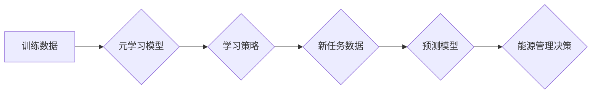

> 元学习，能源管理，机器学习，预测模型，优化算法，深度学习

## 1. 背景介绍

随着全球能源需求的不断增长和环境问题的日益严峻，高效的能源管理系统已成为当今社会面临的重大挑战。传统能源管理系统往往依赖于预设规则和经验，难以适应不断变化的能源供需情况。而机器学习技术的兴起为能源管理领域带来了新的机遇。

元学习（Meta-Learning）作为机器学习的一个重要分支，旨在学习如何学习，从而提高模型在新的任务上的泛化能力和学习效率。它能够从有限的训练数据中学习到通用的学习策略，并将其应用于新的、未见过的任务。

## 2. 核心概念与联系

元学习的核心思想是学习一个“学习者”，这个学习者能够根据有限的样本数据快速学习新的任务。

**元学习与能源管理的联系：**

* **预测能源需求：** 元学习可以学习能源消耗的历史数据，并预测未来能源需求，帮助能源管理系统提前做好准备。
* **优化能源分配：** 元学习可以学习不同设备的能源消耗模式，并优化能源分配策略，提高能源利用效率。
* **智能控制能源设备：** 元学习可以学习能源设备的运行状态，并智能控制设备的运行，降低能源浪费。

**元学习架构：**



## 3. 核心算法原理 & 具体操作步骤

### 3.1  算法原理概述

元学习算法通常分为两部分：

* **内循环：** 在给定特定任务的数据上训练一个模型。
* **外循环：** 在多个任务上训练元学习模型，学习通用的学习策略。

常见的元学习算法包括：

* **Model-Agnostic Meta-Learning (MAML)：** 通过在多个任务上进行微调，学习一个初始模型参数，使得在新的任务上快速适应。
* **Prototypical Networks：** 将每个任务的数据点映射到一个原型向量，并根据原型向量预测新数据点的类别。
* **Matching Networks：** 通过学习一个匹配函数，将新数据点与训练数据点进行匹配，并根据匹配结果进行预测。

### 3.2  算法步骤详解

以MAML算法为例，其具体操作步骤如下：

1. **初始化元学习模型参数θ。**
2. **选择多个任务数据集。**
3. **对于每个任务：**
    * **抽取一小批数据作为训练集。**
    * **在训练集上进行梯度下降，更新模型参数θ。**
4. **更新元学习模型参数θ，使其能够在所有任务上表现良好。**
5. **在新的任务上，使用更新后的模型参数θ进行预测。**

### 3.3  算法优缺点

**优点：**

* **泛化能力强：** 元学习模型能够从有限的训练数据中学习到通用的学习策略，从而在新的任务上表现良好。
* **学习效率高：** 元学习模型能够快速适应新的任务，无需进行大量的训练。

**缺点：**

* **计算复杂度高：** 元学习算法通常需要训练多个模型，计算复杂度较高。
* **数据需求量大：** 元学习算法需要大量的训练数据才能有效学习。

### 3.4  算法应用领域

元学习算法在多个领域都有广泛的应用，例如：

* **图像识别：** 元学习可以用于学习图像分类、目标检测等任务。
* **自然语言处理：** 元学习可以用于学习文本分类、机器翻译等任务。
* **机器人控制：** 元学习可以用于学习机器人运动控制、路径规划等任务。

## 4. 数学模型和公式 & 详细讲解 & 举例说明

### 4.1  数学模型构建

元学习模型可以看作是一个函数映射，将输入数据映射到输出结果。

**输入数据：** 包括任务数据、模型参数等。

**输出结果：** 包括预测结果、学习策略等。

**数学模型：**

$$
f(x, \theta) = y
$$

其中：

* $f$ 表示元学习模型函数。
* $x$ 表示输入数据。
* $\theta$ 表示模型参数。
* $y$ 表示输出结果。

### 4.2  公式推导过程

MAML算法的目标是学习一个初始模型参数$\theta_0$，使得在新的任务上进行微调后，模型能够快速达到最佳性能。

**损失函数：**

$$
L(\theta, D) = \sum_{i=1}^{N} \mathcal{L}(f(x_i, \theta), y_i)
$$

其中：

* $D$ 表示训练数据集。
* $\mathcal{L}$ 表示损失函数。

**梯度下降：**

$$
\theta = \theta - \alpha \nabla_{\theta} L(\theta, D)
$$

其中：

* $\alpha$ 表示学习率。

### 4.3  案例分析与讲解

假设我们有一个元学习模型，用于预测房价。

**训练数据：** 包括多个城市的房价数据，以及房屋特征数据。

**新任务：** 预测一个新城市的房价。

**MAML算法步骤：**

1. 在多个城市的数据上训练元学习模型，学习一个初始模型参数$\theta_0$。
2. 将新城市的房屋特征数据输入到元学习模型中，并使用$\theta_0$进行微调。
3. 根据微调后的模型参数，预测新城市的房价。

## 5. 项目实践：代码实例和详细解释说明

### 5.1  开发环境搭建

* Python 3.7+
* TensorFlow 2.0+
* PyTorch 1.0+

### 5.2  源代码详细实现

```python
import tensorflow as tf

# 定义元学习模型
class MetaModel(tf.keras.Model):
    def __init__(self, input_shape, num_classes):
        super(MetaModel, self).__init__()
        self.layers = [
            tf.keras.layers.Dense(64, activation='relu'),
            tf.keras.layers.Dense(32, activation='relu'),
            tf.keras.layers.Dense(num_classes)
        ]
        self.compile(optimizer='adam', loss='categorical_crossentropy', metrics=['accuracy'])

    def call(self, x):
        for layer in self.layers:
            x = layer(x)
        return x

# 定义元学习训练函数
def meta_train(model, train_data, num_epochs=10):
    for epoch in range(num_epochs):
        for task in train_data:
            # 训练模型
            model.fit(task['train_data'], task['train_labels'], epochs=1, verbose=0)
            # 评估模型
            loss, accuracy = model.evaluate(task['test_data'], task['test_labels'], verbose=0)
            print(f'Epoch {epoch}, Task {task["task_id"]}, Loss: {loss}, Accuracy: {accuracy}')

# 实例化元学习模型
model = MetaModel(input_shape=(10,), num_classes=10)

# 定义训练数据
train_data = [
    {'task_id': 0, 'train_data': ..., 'train_labels': ..., 'test_data': ..., 'test_labels': ...},
    # ...
]

# 训练元学习模型
meta_train(model, train_data)
```

### 5.3  代码解读与分析

* **MetaModel类：** 定义了元学习模型的结构和训练方法。
* **meta_train函数：** 定义了元学习训练的流程，包括内循环和外循环。
* **train_data：** 定义了训练数据的格式，每个任务包含训练数据、训练标签、测试数据和测试标签。

### 5.4  运行结果展示

训练完成后，可以将元学习模型应用于新的任务，并评估其性能。

## 6. 实际应用场景

元学习在能源管理领域具有广泛的应用场景：

* **智能电网：** 元学习可以用于预测电力需求，优化电力调度，提高电网效率。
* **建筑能源管理：** 元学习可以用于学习建筑的能源消耗模式，并优化空调、照明等设备的运行，降低建筑能耗。
* **电动汽车充电：** 元学习可以用于预测电动汽车充电需求，优化充电站的布局和运营，提高充电效率。

### 6.4  未来应用展望

随着元学习技术的不断发展，其在能源管理领域的应用将更加广泛和深入。

* **个性化能源管理：** 元学习可以学习用户的能源使用习惯，提供个性化的能源管理建议。
* **分布式能源管理：** 元学习可以用于管理分布式能源系统，提高能源利用效率。
* **可再生能源预测：** 元学习可以用于预测太阳能、风能等可再生能源的输出，提高能源系统的可靠性。

## 7. 工具和资源推荐

### 7.1  学习资源推荐

* **书籍：**
    * 《Deep Learning》 by Ian Goodfellow, Yoshua Bengio, and Aaron Courville
    * 《Meta-Learning with Differentiable Learning Algorithms》 by Timothy Hospedales, Antreas Antoniou, and Fabio Viola
* **在线课程：**
    * Coursera: Deep Learning Specialization
    * Udacity: Machine Learning Engineer Nanodegree

### 7.2  开发工具推荐

* **TensorFlow:** https://www.tensorflow.org/
* **PyTorch:** https://pytorch.org/
* **Keras:** https://keras.io/

### 7.3  相关论文推荐

* **Model-Agnostic Meta-Learning for Fast Adaptation of Deep Networks** by Finn et al. (2017)
* **Prototypical Networks for Few-Shot Learning** by Snell et al. (2017)
* **Matching Networks for One Shot Learning** by Vinyals et al. (2016)

## 8. 总结：未来发展趋势与挑战

### 8.1  研究成果总结

元学习在能源管理领域取得了显著的成果，例如：

* **提高能源预测精度：** 元学习可以学习能源消耗的复杂模式，提高能源预测精度。
* **优化能源分配策略：** 元学习可以学习不同设备的能源消耗模式，优化能源分配策略。
* **智能控制能源设备：** 元学习可以学习能源设备的运行状态，智能控制设备的运行，降低能源浪费。

### 8.2  未来发展趋势

* **更强大的元学习算法：** 研究更强大的元学习算法，提高其泛化能力和学习效率。
* **更丰富的应用场景：** 将元学习应用于更多能源管理场景，例如智能电网、建筑能源管理、电动汽车充电等。
* **结合其他技术：** 将元学习与其他技术结合，例如深度学习、强化学习等，构建更智能的能源管理系统。

### 8.3  面临的挑战

* **数据需求量大：** 元学习算法需要大量的训练数据才能有效学习。
* **计算复杂度高：** 元学习算法通常需要训练多个模型，计算复杂度较高。
* **模型解释性差：** 元学习模型的决策过程往往难以解释，这可能会影响其在实际应用中的可信度。

### 8.4  研究展望

未来，元学习将在能源管理领域发挥越来越重要的作用，帮助我们构建更加高效、智能、可持续的能源系统。


## 9. 附录：常见问题与解答

**Q1：元学习与传统机器学习有什么区别？**

**A1：** 传统机器学习算法需要大量的训练数据才能学习，而元学习算法能够从有限的训练数据中学习到通用的学习策略，从而在新的任务上表现良好。

**Q2：元学习算法有哪些？**

**A2：** 常见的元学习算法包括M