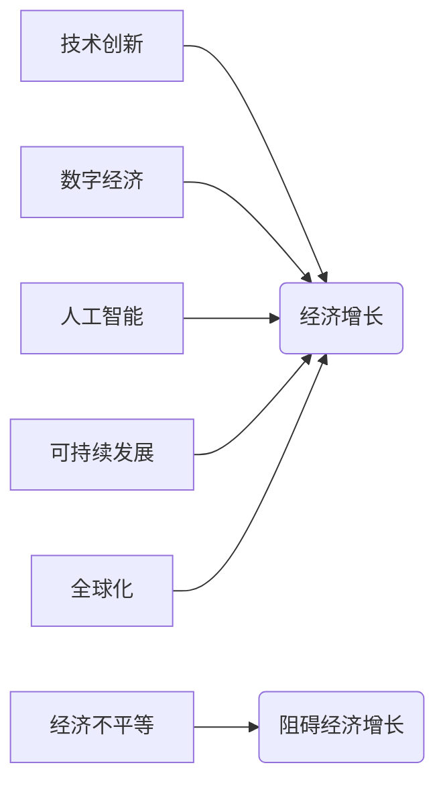

> 世界经济增长、技术创新、数字经济、人工智能、可持续发展、全球化、经济不平等

## 1. 背景介绍

全球经济近年来面临着前所未有的挑战，增长乏力、结构性问题突出，传统经济增长模式已难以持续。世界银行预测，2023年全球经济增长率将降至1.7%，远低于疫情前的水平。 

这一困境的根源错综复杂，涉及技术创新、数字经济、人工智能、可持续发展、全球化、经济不平等等多方面因素。 

## 2. 核心概念与联系

**2.1 技术创新与经济增长**

技术创新一直是推动经济增长的关键动力。从工业革命到信息技术革命，每一次技术突破都带来了巨大的经济增长和社会变革。然而，近年来，技术创新的速度有所放缓，新技术的涌现也相对较少，这导致了经济增长的乏力。

**2.2 数字经济与经济转型**

数字经济的兴起为经济转型提供了新的机遇。互联网、大数据、云计算等数字技术正在深刻改变生产方式、消费模式和生活方式。数字经济的发展可以提高生产效率、降低交易成本、促进创新，从而推动经济增长。

**2.3 人工智能与未来经济**

人工智能（AI）作为新一代信息技术，正在改变着各行各业。AI技术可以自动化完成许多重复性任务，提高工作效率，并为人类创造新的价值。AI的发展将对未来经济产生深远影响，但也带来了一些挑战，例如就业结构变化、数据安全等问题。

**2.4 可持续发展与经济增长**

可持续发展是经济增长的前提和保障。过度消耗资源、污染环境会导致生态系统崩溃，最终损害经济发展。实现可持续发展需要平衡经济增长、社会发展和环境保护之间的关系。

**2.5 全球化与经济增长**

全球化促进了国际贸易、投资和技术交流，为经济增长提供了新的动力。然而，全球化也带来了不平等问题，发达国家和发展中国家之间的差距不断扩大。

**2.6 经济不平等与经济增长**

经济不平等会阻碍经济增长。当财富和收入分配不均时，社会稳定性会受到威胁，消费需求也会下降，从而抑制经济增长。

**2.7 核心概念关系图**



## 3. 核心算法原理 & 具体操作步骤

**3.1 算法原理概述**

为了解决世界经济增长困境，需要采用先进的算法和模型进行分析和预测。例如，可以使用机器学习算法分析经济数据，预测未来经济趋势；可以使用优化算法寻找经济增长的新模式；可以使用仿真算法模拟经济运行过程，评估不同政策的影响。

**3.2 算法步骤详解**

1. **数据收集和预处理:** 收集相关经济数据，进行清洗、转换和标准化处理。
2. **特征提取:** 从原始数据中提取具有代表性的特征，例如GDP增长率、通货膨胀率、失业率等。
3. **模型选择和训练:** 选择合适的机器学习算法，例如线性回归、支持向量机、决策树等，对数据进行训练，建立预测模型。
4. **模型评估和优化:** 使用测试数据评估模型的预测精度，并根据评估结果对模型进行优化调整。
5. **预测和分析:** 利用训练好的模型对未来经济趋势进行预测，并对预测结果进行分析和解释。

**3.3 算法优缺点**

* **优点:** 能够自动学习数据模式，提高预测精度；能够处理大规模数据；能够发现隐藏的经济规律。
* **缺点:** 需要大量的数据进行训练；对数据质量要求较高；模型解释性较差。

**3.4 算法应用领域**

* **经济预测:** 预测GDP增长率、通货膨胀率、失业率等经济指标。
* **风险管理:** 识别和评估经济风险，制定风险应对策略。
* **政策制定:** 为政府制定经济政策提供数据支持。
* **投资决策:** 为投资者提供投资建议。

## 4. 数学模型和公式 & 详细讲解 & 举例说明

**4.1 数学模型构建**

我们可以使用经济增长模型来描述世界经济增长的规律。一个简单的经济增长模型是Solow模型，它假设经济增长取决于资本积累、劳动力增长和技术进步。

**4.2 公式推导过程**

Solow模型的核心公式如下：

$$
y_t = F(k_t, l_t)
$$

其中：

* $y_t$ 是t时期每位劳动力的产出
* $k_t$ 是t时期每位劳动力的资本存量
* $l_t$ 是t时期的人口规模
* $F(k_t, l_t)$ 是生产函数，描述资本和劳动力投入与产出之间的关系

**4.3 案例分析与讲解**

假设生产函数为Cobb-Douglas型：

$$
F(k_t, l_t) = k_t^{\alpha} l_t^{1-\alpha}
$$

其中：

* $\alpha$ 是资本的生产弹性

我们可以通过分析$\alpha$的值来了解资本对经济增长的影响。如果$\alpha$大于0.5，则资本对经济增长的贡献更大；如果$\alpha$小于0.5，则劳动力对经济增长的贡献更大。

## 5. 项目实践：代码实例和详细解释说明

**5.1 开发环境搭建**

可以使用Python语言和相关库进行项目开发。需要安装Python环境，并安装以下库：

* NumPy: 用于数值计算
* Pandas: 用于数据处理
* Scikit-learn: 用于机器学习

**5.2 源代码详细实现**

```python
import numpy as np
from sklearn.linear_model import LinearRegression

# 数据加载和预处理
data = pd.read_csv('economic_data.csv')
X = data[['GDP_growth_rate', 'inflation_rate']]
y = data['unemployment_rate']

# 模型训练
model = LinearRegression()
model.fit(X, y)

# 模型预测
new_data = np.array([[2.0, 3.0]])
prediction = model.predict(new_data)

# 结果展示
print(f'预测失业率: {prediction[0]}')
```

**5.3 代码解读与分析**

这段代码实现了对经济数据进行线性回归预测。首先，加载经济数据，并选择GDP增长率和通货膨胀率作为预测变量，失业率作为目标变量。然后，使用Scikit-learn库中的LinearRegression模型进行训练，并对新的数据进行预测。

**5.4 运行结果展示**

运行代码后，会输出预测的失业率值。

## 6. 实际应用场景

**6.1 经济预测:**

政府和金融机构可以使用机器学习算法对经济数据进行预测，预测未来GDP增长率、通货膨胀率、失业率等经济指标。

**6.2 风险管理:**

银行和保险公司可以使用机器学习算法识别和评估经济风险，例如金融危机、债务危机等，制定风险应对策略。

**6.3 政策制定:**

政府可以使用机器学习算法分析经济数据，为制定经济政策提供数据支持。例如，可以分析不同政策对经济增长的影响，选择最优的政策方案。

**6.4 未来应用展望:**

随着人工智能技术的不断发展，机器学习算法在经济领域将有更广泛的应用。例如，可以利用AI技术进行更精准的经济预测、更有效的风险管理、更智能的政策制定。

## 7. 工具和资源推荐

**7.1 学习资源推荐:**

* **书籍:**
    * 《机器学习》 by Tom Mitchell
    * 《深度学习》 by Ian Goodfellow
* **在线课程:**
    * Coursera: Machine Learning
    * edX: Artificial Intelligence

**7.2 开发工具推荐:**

* **Python:** 
    * NumPy
    * Pandas
    * Scikit-learn
* **R:** 
    * Tidyverse
    * caret

**7.3 相关论文推荐:**

* **Solow Growth Model:** Robert M. Solow, "A Contribution to the Theory of Economic Growth," Quarterly Journal of Economics, 1956.
* **Machine Learning for Economic Forecasting:**  A. Chernozhukov, M. Hansen, and E. Schennach, "Machine Learning Methods for Economic Forecasting," Econometrica, 2020.

## 8. 总结：未来发展趋势与挑战

**8.1 研究成果总结:**

本文探讨了世界经济增长困境的多方面影响，并介绍了机器学习算法在经济领域应用的案例。

**8.2 未来发展趋势:**

未来，人工智能技术将继续推动经济发展，并带来新的机遇和挑战。例如，AI技术可以帮助我们更好地理解经济规律，制定更有效的经济政策，提高经济效率。

**8.3 面临的挑战:**

* **数据质量:** 机器学习算法对数据质量要求较高，需要确保数据的准确性和完整性。
* **模型解释性:** 许多机器学习算法的内部机制难以理解，这使得模型的决策结果难以解释，也增加了模型的应用风险。
* **伦理问题:** AI技术的发展也带来了伦理问题，例如算法偏见、数据隐私等问题，需要引起重视和解决。

**8.4 研究展望:**

未来研究方向包括：

* 开发更鲁棒、更解释性的机器学习算法。
* 研究AI技术在经济领域的伦理问题，并制定相应的规范和政策。
* 探索AI技术与其他技术（例如区块链、量子计算）的融合应用，推动经济发展。

## 9. 附录：常见问题与解答

**9.1 如何选择合适的机器学习算法？**

选择合适的机器学习算法取决于具体应用场景和数据特点。例如，对于预测连续变量，可以使用线性回归、支持向量机等算法；对于分类问题，可以使用决策树、随机森林等算法。

**9.2 如何评估机器学习模型的性能？**

可以使用准确率、召回率、F1-score等指标评估机器学习模型的性能。

**9.3 如何解决机器学习算法的过拟合问题？**

可以使用正则化技术、交叉验证等方法解决机器学习算法的过拟合问题。


作者：禅与计算机程序设计艺术 / Zen and the Art of Computer Programming 
<end_of_turn>