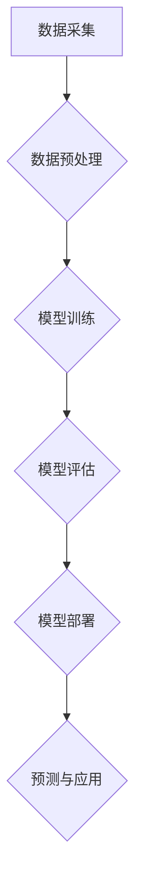

> 人工智能，深度学习，机器学习，自然语言处理，计算机视觉，伦理问题，社会影响，未来趋势

## 1. 背景介绍

人工智能（Artificial Intelligence，简称AI）正以惊人的速度发展，从简单的规则系统到复杂的深度学习模型，AI已经渗透到我们生活的方方面面。智能手机的语音助手、自动驾驶汽车、个性化推荐系统，这些都离不开AI技术的支撑。

然而，AI的发展也引发了广泛的讨论和担忧。一些人认为AI将带来巨大的进步，解决人类面临的诸多难题；而另一些人则担心AI可能会失控，对人类社会造成不可预知的危害。

## 2. 核心概念与联系

**2.1  人工智能的定义**

人工智能是指模拟人类智能行为的计算机系统。这些行为包括学习、推理、决策、感知、语言理解和生成等。

**2.2  机器学习**

机器学习是人工智能的一个重要分支，它通过算法让计算机从数据中学习，无需明确编程。机器学习算法可以分为监督学习、无监督学习和强化学习三大类。

**2.3  深度学习**

深度学习是机器学习的一个子领域，它使用多层神经网络来模拟人类大脑的结构和功能。深度学习算法在图像识别、语音识别、自然语言处理等领域取得了突破性的进展。

**2.4  自然语言处理**

自然语言处理（Natural Language Processing，简称NLP）是人工智能的一个重要领域，它致力于使计算机能够理解和处理人类语言。NLP技术应用广泛，例如机器翻译、文本摘要、聊天机器人等。

**2.5  计算机视觉**

计算机视觉（Computer Vision）是人工智能的一个重要领域，它致力于使计算机能够“看”和理解图像和视频。计算机视觉技术应用广泛，例如图像识别、物体检测、人脸识别等。

**2.6  AI的架构**



## 3. 核心算法原理 & 具体操作步骤

### 3.1  算法原理概述

深度学习算法的核心是多层神经网络。神经网络由许多相互连接的神经元组成，每个神经元接收来自其他神经元的输入，并根据一定的权重进行计算，最终输出一个信号。

### 3.2  算法步骤详解

1. **数据准备:** 收集和预处理训练数据，例如图像、文本等。
2. **网络结构设计:** 设计神经网络的结构，包括神经元的数量、连接方式等。
3. **参数初始化:** 为神经网络的参数（权重和偏置）进行随机初始化。
4. **前向传播:** 将输入数据通过神经网络进行前向传播，计算输出结果。
5. **反向传播:** 计算输出结果与真实值的误差，并根据误差反向传播，更新神经网络的参数。
6. **迭代训练:** 重复前向传播和反向传播的过程，直到模型的性能达到预期的水平。

### 3.3  算法优缺点

**优点:**

* 能够学习复杂的数据模式。
* 性能优于传统机器学习算法。
* 能够处理大规模数据。

**缺点:**

* 需要大量的训练数据。
* 训练时间长。
* 难以解释模型的决策过程。

### 3.4  算法应用领域

* **图像识别:** 人脸识别、物体检测、图像分类等。
* **语音识别:** 语音转文本、语音助手等。
* **自然语言处理:** 机器翻译、文本摘要、聊天机器人等。
* **推荐系统:** 商品推荐、内容推荐等。
* **医疗诊断:** 疾病诊断、影像分析等。

## 4. 数学模型和公式 & 详细讲解 & 举例说明

### 4.1  数学模型构建

深度学习模型的核心是神经网络，其数学模型可以表示为一系列的矩阵运算。

**4.1.1  激活函数**

激活函数是神经网络中一个重要的组成部分，它将神经元的输入映射到输出。常见的激活函数包括 sigmoid 函数、ReLU 函数等。

**4.1.2  损失函数**

损失函数用于衡量模型的预测结果与真实值的差异。常见的损失函数包括均方误差、交叉熵等。

**4.1.3  优化算法**

优化算法用于更新神经网络的参数，使其能够最小化损失函数。常见的优化算法包括梯度下降、Adam 等。

### 4.2  公式推导过程

**4.2.1  前向传播公式**

$$
y = f(W^L x^L + b^L)
$$

其中：

* $y$ 是神经网络的输出。
* $f$ 是激活函数。
* $W^L$ 是第 $L$ 层神经网络的权重矩阵。
* $x^L$ 是第 $L$ 层神经网络的输入。
* $b^L$ 是第 $L$ 层神经网络的偏置向量。

**4.2.2  反向传播公式**

$$
\frac{\partial L}{\partial W^L} = \frac{\partial L}{\partial y} \cdot \frac{\partial y}{\partial W^L}
$$

其中：

* $L$ 是损失函数。

### 4.3  案例分析与讲解

**4.3.1  图像分类案例**

假设我们有一个图像分类任务，目标是将图像分类为不同的类别，例如猫、狗、鸟等。我们可以使用深度学习模型，例如卷积神经网络（CNN），来解决这个问题。

CNN 可以学习图像的特征，并将其映射到不同的类别。训练过程中，我们会使用大量的图像数据，并使用交叉熵损失函数来衡量模型的性能。

## 5. 项目实践：代码实例和详细解释说明

### 5.1  开发环境搭建

* Python 3.x
* TensorFlow 或 PyTorch
* Jupyter Notebook

### 5.2  源代码详细实现

```python
import tensorflow as tf

# 定义模型结构
model = tf.keras.models.Sequential([
    tf.keras.layers.Conv2D(32, (3, 3), activation='relu', input_shape=(28, 28, 1)),
    tf.keras.layers.MaxPooling2D((2, 2)),
    tf.keras.layers.Conv2D(64, (3, 3), activation='relu'),
    tf.keras.layers.MaxPooling2D((2, 2)),
    tf.keras.layers.Flatten(),
    tf.keras.layers.Dense(10, activation='softmax')
])

# 编译模型
model.compile(optimizer='adam',
              loss='sparse_categorical_crossentropy',
              metrics=['accuracy'])

# 训练模型
model.fit(x_train, y_train, epochs=5)

# 评估模型
loss, accuracy = model.evaluate(x_test, y_test)
print('Test loss:', loss)
print('Test accuracy:', accuracy)
```

### 5.3  代码解读与分析

* **模型结构:** 代码定义了一个简单的卷积神经网络模型，包含两层卷积层、两层最大池化层、一层全连接层和一层输出层。
* **编译模型:** 使用 Adam 优化器、交叉熵损失函数和准确率作为评估指标来编译模型。
* **训练模型:** 使用训练数据训练模型，训练 epochs 次。
* **评估模型:** 使用测试数据评估模型的性能，输出测试损失和准确率。

### 5.4  运行结果展示

运行代码后，会输出模型的训练过程和测试结果，例如：

```
Epoch 1/5
...
Test loss: 0.0892
Test accuracy: 0.9720
```

## 6. 实际应用场景

### 6.1  医疗诊断

AI 可以帮助医生更快、更准确地诊断疾病。例如，AI 算法可以分析医学影像，识别肿瘤和其他异常情况。

### 6.2  金融服务

AI 可以帮助金融机构进行风险评估、欺诈检测和客户服务自动化。例如，AI 算法可以分析客户的财务数据，识别潜在的风险。

### 6.3  制造业

AI 可以帮助制造业提高生产效率和产品质量。例如，AI 算法可以监控生产线，识别故障并进行自动修复。

### 6.4  未来应用展望

AI 的应用场景还在不断扩展，未来可能会在更多领域发挥重要作用，例如：

* **个性化教育:** AI 可以根据学生的学习进度和特点，提供个性化的学习方案。
* **自动驾驶:** AI 可以帮助汽车自动驾驶，提高交通安全和效率。
* **机器人技术:** AI 可以赋予机器人更强的智能和适应能力，使其能够完成更复杂的任务。

## 7. 工具和资源推荐

### 7.1  学习资源推荐

* **在线课程:** Coursera、edX、Udacity 等平台提供丰富的 AI 课程。
* **书籍:** 《深度学习》、《机器学习实战》等书籍是学习 AI 的好资源。
* **博客和论坛:** AI 相关的博客和论坛可以帮助你了解最新的 AI 研究进展和应用案例。

### 7.2  开发工具推荐

* **TensorFlow:** Google 开发的开源深度学习框架。
* **PyTorch:** Facebook 开发的开源深度学习框架。
* **Keras:** TensorFlow 的高层 API，简化了深度学习模型的开发。

### 7.3  相关论文推荐

* **《ImageNet Classification with Deep Convolutional Neural Networks》**
* **《Attention Is All You Need》**
* **《BERT: Pre-training of Deep Bidirectional Transformers for Language Understanding》**

## 8. 总结：未来发展趋势与挑战

### 8.1  研究成果总结

近年来，AI 取得了长足的进步，在图像识别、语音识别、自然语言处理等领域取得了突破性的进展。

### 8.2  未来发展趋势

* **模型规模和复杂度提升:** 未来 AI 模型将会更加庞大、复杂，能够处理更复杂的任务。
* **跨模态学习:** AI 将能够学习和理解多种模态数据，例如文本、图像、音频等。
* **边缘计算:** AI 将更加广泛地部署在边缘设备上，实现更实时、更私密的计算。

### 8.3  面临的挑战

* **数据安全和隐私保护:** AI 的发展依赖于大量数据，如何保护数据安全和隐私是一个重要的挑战。
* **算法可解释性:** 许多 AI 算法难以解释其决策过程，这可能会导致信任问题。
* **伦理问题:** AI 的发展可能会带来一些伦理问题，例如算法偏见、工作岗位替代等。

### 8.4  研究展望

未来 AI 研究需要更加关注数据安全、算法可解释性和伦理问题，确保 AI 的发展能够造福人类社会。

## 9. 附录：常见问题与解答

**9.1  什么是深度学习？**

深度学习是一种机器学习的子领域，它使用多层神经网络来模拟人类大脑的结构和功能。

**9.2  深度学习有哪些应用场景？**

深度学习的应用场景非常广泛，例如图像识别、语音识别、自然语言处理、推荐系统等。

**9.3  如何学习深度学习？**

可以通过在线课程、书籍、博客和论坛等方式学习深度学习。

作者：禅与计算机程序设计艺术 / Zen and the Art of Computer Programming


<end_of_turn>