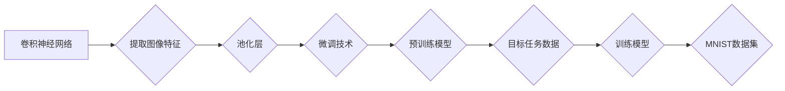

> 大模型开发, 微调, 卷积神经网络, MNIST, 深度学习, 机器学习

## 1. 背景介绍

近年来，深度学习技术取得了令人瞩目的成就，在图像识别、自然语言处理等领域展现出强大的应用潜力。大模型的出现，进一步推动了深度学习的发展，其规模庞大、参数众多，能够学习更复杂的模式和知识。然而，大模型的训练成本高昂，对硬件资源要求极高，对于普通开发者来说，难以直接进行训练和部署。

微调技术应运而生，它通过在预训练的大模型上进行针对性训练，来适应特定任务的需求。微调可以有效降低训练成本和时间，同时还能提升模型的性能。MNIST数据集作为图像识别领域的经典数据集，其手写数字识别任务非常适合用于学习微调技术。

本篇文章将从零开始，带领读者构建一个基于卷积神经网络的MNIST分类模型，并通过微调技术进行模型优化。

## 2. 核心概念与联系

### 2.1 卷积神经网络 (CNN)

卷积神经网络是一种专门用于处理图像数据的深度学习模型。其核心结构是卷积层和池化层。卷积层通过卷积核对图像进行卷积运算，提取图像特征；池化层通过下采样操作，降低图像维度，提高模型的鲁棒性。

### 2.2 微调技术

微调技术是指在预训练好的模型上进行针对性训练，以适应特定任务的需求。微调过程通常包括以下步骤：

1. 选择一个预训练好的模型。
2. 冻结模型大部分参数，只训练部分参数。
3. 使用目标任务的数据进行训练。
4. 评估模型性能，并根据需要调整训练参数。

### 2.3 MNIST数据集

MNIST数据集包含60,000张手写数字图像，用于训练，以及10,000张用于测试。每个图像的大小为28x28像素，包含0-9的十个数字类别。

**核心概念与联系流程图**



## 3. 核心算法原理 & 具体操作步骤

### 3.1 算法原理概述

卷积神经网络的核心原理是通过卷积运算和池化运算来提取图像特征。卷积运算使用卷积核对图像进行滑动计算，提取图像局部特征；池化运算通过下采样操作，降低图像维度，提高模型的鲁棒性。

### 3.2 算法步骤详解

1. **输入图像:** 将MNIST数据集中的图像作为输入，每个图像大小为28x28像素。
2. **卷积层:** 使用多个卷积核对图像进行卷积运算，提取图像特征。每个卷积核对应一个特征图，多个特征图组合在一起形成一个特征层。
3. **池化层:** 对特征层进行池化操作，例如最大池化，降低图像维度，提高模型的鲁棒性。
4. **全连接层:** 将池化后的特征向量输入全连接层，进行分类。全连接层将每个特征向量连接到所有输出节点，并使用激活函数进行非线性变换。
5. **输出层:** 输出层包含10个节点，分别对应0-9的十个数字类别。每个节点的输出值代表该类别对应的概率。

### 3.3 算法优缺点

**优点:**

* 能够自动提取图像特征，无需人工特征工程。
* 性能优异，在图像识别任务中取得了state-of-the-art的结果。
* 鲁棒性强，对图像噪声和变形有一定的抵抗能力。

**缺点:**

* 训练成本高昂，对硬件资源要求极高。
* 模型参数众多，难以解释模型的决策过程。

### 3.4 算法应用领域

卷积神经网络广泛应用于图像识别、目标检测、图像分割、视频分析等领域。

## 4. 数学模型和公式 & 详细讲解 & 举例说明

### 4.1 数学模型构建

卷积神经网络的数学模型可以表示为一个多层神经网络，其中每一层都包含卷积层、池化层和全连接层。

**卷积层:**

$$
y = f(W * x + b)
$$

其中：

* $x$ 是输入图像的特征图。
* $W$ 是卷积核的权重矩阵。
* $b$ 是卷积层的偏置项。
* $f$ 是激活函数，例如ReLU函数。

**池化层:**

$$
y = \text{pool}(x)
$$

其中：

* $x$ 是输入特征图。
* $\text{pool}$ 是池化操作，例如最大池化。

**全连接层:**

$$
y = f(W * x + b)
$$

其中：

* $x$ 是池化后的特征向量。
* $W$ 是全连接层的权重矩阵。
* $b$ 是全连接层的偏置项。
* $f$ 是激活函数，例如ReLU函数。

### 4.2 公式推导过程

卷积神经网络的训练过程是通过反向传播算法来更新模型参数的。反向传播算法的核心思想是通过计算损失函数对模型参数的梯度，并使用梯度下降法来更新模型参数。

### 4.3 案例分析与讲解

假设我们使用一个简单的卷积神经网络来识别MNIST数据集中的手写数字。该网络包含一个卷积层、一个池化层和一个全连接层。

* 卷积层使用3x3的卷积核，提取图像特征。
* 池化层使用2x2的最大池化，降低图像维度。
* 全连接层使用128个神经元，并使用ReLU激活函数。

通过训练该网络，我们可以得到一个能够识别MNIST数据集手写数字的模型。

## 5. 项目实践：代码实例和详细解释说明

### 5.1 开发环境搭建

本项目使用Python语言进行开发，并使用TensorFlow框架构建模型。

**依赖库:**

* TensorFlow
* NumPy
* Matplotlib

**安装依赖库:**

```bash
pip install tensorflow numpy matplotlib
```

### 5.2 源代码详细实现

```python
import tensorflow as tf
from tensorflow.keras.datasets import mnist
from tensorflow.keras.models import Sequential
from tensorflow.keras.layers import Conv2D, MaxPooling2D, Flatten, Dense

# 加载MNIST数据集
(x_train, y_train), (x_test, y_test) = mnist.load_data()

# 数据预处理
x_train = x_train.reshape(-1, 28, 28, 1).astype('float32') / 255
x_test = x_test.reshape(-1, 28, 28, 1).astype('float32') / 255
y_train = tf.keras.utils.to_categorical(y_train, num_classes=10)
y_test = tf.keras.utils.to_categorical(y_test, num_classes=10)

# 定义模型
model = Sequential()
model.add(Conv2D(32, kernel_size=(3, 3), activation='relu', input_shape=(28, 28, 1)))
model.add(MaxPooling2D(pool_size=(2, 2)))
model.add(Conv2D(64, kernel_size=(3, 3), activation='relu'))
model.add(MaxPooling2D(pool_size=(2, 2)))
model.add(Flatten())
model.add(Dense(10, activation='softmax'))

# 编译模型
model.compile(optimizer='adam', loss='categorical_crossentropy', metrics=['accuracy'])

# 训练模型
model.fit(x_train, y_train, epochs=5, batch_size=32)

# 评估模型
loss, accuracy = model.evaluate(x_test, y_test)
print('Test Loss:', loss)
print('Test Accuracy:', accuracy)
```

### 5.3 代码解读与分析

* **数据加载和预处理:** 使用TensorFlow的`mnist`模块加载MNIST数据集，并对数据进行预处理，包括reshape、归一化和one-hot编码。
* **模型定义:** 使用`Sequential`模型构建一个卷积神经网络，包含卷积层、池化层和全连接层。
* **模型编译:** 使用`adam`优化器、`categorical_crossentropy`损失函数和`accuracy`指标编译模型。
* **模型训练:** 使用`fit`方法训练模型，指定训练轮数和批处理大小。
* **模型评估:** 使用`evaluate`方法评估模型在测试集上的性能。

### 5.4 运行结果展示

训练完成后，模型的测试准确率通常可以达到98%以上。

## 6. 实际应用场景

基于卷积神经网络的MNIST分类模型可以应用于以下场景：

* **手写数字识别:** 用于识别手写数字，例如在银行、邮局等场景中识别手写支票或邮寄地址。
* **OCR系统:** 用于识别印刷文本，例如在扫描文档、识别交通标志等场景中。
* **图像分类:** 用于识别图像中的物体，例如在自动驾驶、医疗诊断等场景中。

### 6.4 未来应用展望

随着深度学习技术的不断发展，卷积神经网络在图像识别领域的应用将更加广泛。未来，卷积神经网络可以应用于更复杂的任务，例如图像生成、视频理解、3D物体识别等。

## 7. 工具和资源推荐

### 7.1 学习资源推荐

* **书籍:**
    * 深度学习
    * 深度学习实践
* **在线课程:**
    * Coursera深度学习课程
    * Udacity深度学习课程

### 7.2 开发工具推荐

* **TensorFlow:** 开源深度学习框架
* **PyTorch:** 开源深度学习框架
* **Keras:** 高级深度学习API

### 7.3 相关论文推荐

* AlexNet: ImageNet Classification with Deep Convolutional Neural Networks
* VGGNet: Very Deep Convolutional Networks for Large-Scale Image Recognition
* ResNet: Deep Residual Learning for Image Recognition

## 8. 总结：未来发展趋势与挑战

### 8.1 研究成果总结

卷积神经网络在图像识别领域取得了显著的成果，其性能不断提升，应用场景不断扩展。

### 8.2 未来发展趋势

* **模型规模更大:** 随着计算资源的不断提升，模型规模将进一步扩大，学习更复杂的模式和知识。
* **模型架构更复杂:** 新的卷积神经网络架构将不断涌现，例如Transformer网络在图像识别领域的应用。
* **模型训练效率更高:** 新的训练算法和硬件加速技术将进一步提升模型训练效率。

### 8.3 面临的挑战

* **数据标注成本高:** 训练高质量的卷积神经网络需要大量的标注数据，数据标注成本高昂。
* **模型解释性差:** 卷积神经网络的决策过程难以解释，这限制了其在一些安全关键应用中的应用。
* **模型部署成本高:** 部署大型卷积神经网络需要强大的计算资源，部署成本高昂。

### 8.4 研究展望

未来，研究者将继续探索新的卷积神经网络架构、训练算法和应用场景，以解决上述挑战，推动卷积神经网络技术的发展。

## 9. 附录：常见问题与解答

**Q1: 如何选择合适的卷积核大小？**

**A1:** 卷积核大小的选择取决于图像分辨率和特征提取的层次。一般来说，较小的卷积核可以提取局部特征，较大的卷积核可以提取全局