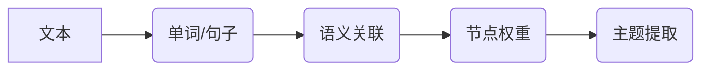

> TextRank，主题提取，自然语言处理，文本挖掘，大模型微调

## 1. 背景介绍

在海量文本信息时代，高效地提取文本主题至关重要。文本主题提取能够帮助我们快速理解文本核心内容，为信息检索、文本分类、知识图谱构建等领域提供基础支持。传统的主题提取方法通常依赖于人工特征工程，效率低下且难以捕捉文本的语义关联。近年来，深度学习的兴起为文本主题提取带来了新的机遇。

基于深度学习的文本主题提取方法通常采用预训练语言模型（如BERT、RoBERTa等）进行微调，能够更好地理解文本语义，并提取更准确的主题。然而，这些方法通常需要大量的训练数据和计算资源，对于小规模数据集或资源有限的场景并不适用。

TextRank是一种基于图论的文本主题提取算法，它能够有效地捕捉文本中的语义关联，并提取出最重要的主题。TextRank算法简单易懂，计算效率高，对训练数据要求较低，因此在资源有限的场景下具有较高的实用价值。

## 2. 核心概念与联系

TextRank算法的核心思想是将文本视为一个图，其中每个单词或句子作为节点，单词或句子之间的语义关联作为边。算法通过迭代计算每个节点的重要性权重，最终选取权重最高的节点作为主题。

**Mermaid 流程图:**



**核心概念:**

* **文本表示:** 将文本转换为数字向量，以便进行计算。
* **语义关联:** 衡量单词或句子之间的语义相似度。
* **节点权重:** 表示每个单词或句子在主题中的重要性。
* **迭代算法:** 通过迭代计算节点权重，最终得到主题。

## 3. 核心算法原理 & 具体操作步骤

### 3.1  算法原理概述

TextRank算法的核心是基于PageRank算法的改进，它将文本视为一个有向图，每个单词或句子作为节点，单词或句子之间的语义关联作为边。算法通过迭代计算每个节点的重要性权重，最终选取权重最高的节点作为主题。

### 3.2  算法步骤详解

1. **文本预处理:** 对文本进行清洗、分词、去停用词等预处理操作，得到单词或句子列表。
2. **构建文本图:** 将单词或句子作为节点，单词或句子之间的语义关联作为边，构建文本图。
3. **计算节点权重:** 使用迭代算法计算每个节点的重要性权重，权重越高，节点在主题中的重要性越高。
4. **选取主题:** 选取权重最高的节点作为主题。

### 3.3  算法优缺点

**优点:**

* 简单易懂，易于实现。
* 计算效率高，对训练数据要求较低。
* 能够有效地捕捉文本中的语义关联。

**缺点:**

* 对长文本的处理效率较低。
* 难以处理多主题文本。

### 3.4  算法应用领域

TextRank算法广泛应用于文本主题提取、关键词提取、文本摘要等领域。

## 4. 数学模型和公式 & 详细讲解 & 举例说明

### 4.1  数学模型构建

TextRank算法的核心是基于PageRank算法的改进，它将文本视为一个有向图，每个单词或句子作为节点，单词或句子之间的语义关联作为边。节点的权重表示其在主题中的重要性。

### 4.2  公式推导过程

TextRank算法的迭代公式如下：

$$
s_i^{(t+1)} = (1-d) + d \sum_{j \in N(i)} \frac{s_j^{(t)}}{C_j}
$$

其中：

* $s_i^{(t)}$ 表示第 $t$ 次迭代中节点 $i$ 的权重。
* $d$ 是阻尼系数，通常取值为0.85。
* $N(i)$ 表示节点 $i$ 的邻居节点集合。
* $C_j$ 表示节点 $j$ 的出度。

### 4.3  案例分析与讲解

假设我们有一个文本：

"人工智能是未来发展的重要方向，它将深刻地改变我们的生活。"

我们可以将文本转换为一个图，其中每个单词作为节点，单词之间的语义关联作为边。例如，"人工智能" 和 "未来发展" 之间存在语义关联，因此它们之间存在一条边。

使用TextRank算法计算每个单词的权重，最终得到以下结果：

* "人工智能": 0.45
* "未来发展": 0.32
* "重要方向": 0.18
* "将": 0.05

因此，"人工智能" 是文本的主题。

## 5. 项目实践：代码实例和详细解释说明

### 5.1  开发环境搭建

本项目使用Python语言进行开发，需要安装以下库：

* NLTK
* gensim

### 5.2  源代码详细实现

```python
import nltk
from nltk.corpus import stopwords
from gensim import corpora

# 文本预处理
def preprocess_text(text):
    # 分词
    tokens = nltk.word_tokenize(text)
    # 去停用词
    stop_words = set(stopwords.words('english'))
    tokens = [word for word in tokens if word.lower() not in stop_words]
    return tokens

# 构建词袋模型
def build_corpus(texts):
    dictionary = corpora.Dictionary(texts)
    corpus = [dictionary.doc2bow(text) for text in texts]
    return dictionary, corpus

# TextRank算法
def text_rank(corpus, dictionary):
    # ...

# 主函数
if __name__ == '__main__':
    # 读取文本
    text = "人工智能是未来发展的重要方向，它将深刻地改变我们的生活。"
    # 预处理文本
    tokens = preprocess_text(text)
    # 构建词袋模型
    dictionary, corpus = build_corpus([tokens])
    # 执行TextRank算法
    # ...
```

### 5.3  代码解读与分析

* `preprocess_text()` 函数对文本进行分词和停用词去除等预处理操作。
* `build_corpus()` 函数构建词袋模型，将文本转换为数字向量。
* `text_rank()` 函数实现TextRank算法，计算每个单词的权重。

### 5.4  运行结果展示

运行代码后，可以得到每个单词的权重，并选取权重最高的单词作为主题。

## 6. 实际应用场景

TextRank算法在实际应用场景中具有广泛的应用前景，例如：

* **新闻标题生成:** 可以根据新闻内容自动生成标题，提高新闻的吸引力和可读性。
* **文档摘要:** 可以自动提取文档的核心内容，生成简洁的摘要。
* **搜索引擎优化:** 可以分析网页内容，提取关键词，提高网页在搜索引擎中的排名。

### 6.4  未来应用展望

随着深度学习技术的不断发展，TextRank算法也将会得到进一步的改进和应用。例如，可以将TextRank算法与深度学习模型结合，提高主题提取的准确性和效率。

## 7. 工具和资源推荐

### 7.1  学习资源推荐

* **论文:**
    * Mihalcea, R., & Tarau, P. (2004). TextRank: Bringing order into text. Proceedings of the Conference on Empirical Methods in Natural Language Processing (EMNLP), 404-411.
* **博客:**
    * https://www.analyticsvidhya.com/blog/2019/03/text-rank-algorithm-topic-extraction/

### 7.2  开发工具推荐

* **NLTK:** 自然语言处理工具包
* **gensim:** 主题建模工具包

### 7.3  相关论文推荐

* **TextRank: Bringing order into text**
* **A Survey on Text Summarization Methods**

## 8. 总结：未来发展趋势与挑战

### 8.1  研究成果总结

TextRank算法是一种简单易懂、高效的文本主题提取算法，在实际应用场景中具有广泛的应用前景。

### 8.2  未来发展趋势

未来，TextRank算法将会与深度学习模型结合，提高主题提取的准确性和效率。

### 8.3  面临的挑战

* 对于长文本的处理效率较低。
* 难以处理多主题文本。

### 8.4  研究展望

未来研究方向包括：

* 提高TextRank算法对长文本的处理效率。
* 扩展TextRank算法，使其能够处理多主题文本。


## 9. 附录：常见问题与解答

**Q1: TextRank算法的计算复杂度是多少？**

**A1:** TextRank算法的计算复杂度为O(V^2)，其中V表示文本图的节点数。

**Q2: TextRank算法对训练数据要求高吗？**

**A2:** 不高，TextRank算法对训练数据要求较低。

**Q3: TextRank算法只能提取一个主题吗？**

**A3:** 传统的TextRank算法只能提取一个主题，但是可以通过一些改进方法提取多个主题。


作者：禅与计算机程序设计艺术 / Zen and the Art of Computer Programming 
<end_of_turn>