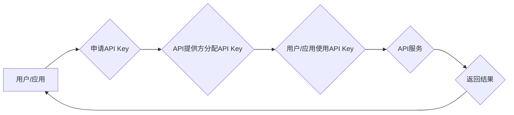

> API Key, 分级授权, 安全访问, 权限控制, API 管理

## 1. 背景介绍

在当今以互联网为核心的时代，API（Application Programming Interface，应用程序接口）已成为软件系统之间通信和互操作的桥梁，推动着数字经济的蓬勃发展。然而，随着API的广泛应用，安全性和权限控制问题也日益凸显。为了有效管理API访问，并确保数据安全和业务稳定性，分级API Key机制应运而生。

分级API Key是一种基于层次结构的API访问授权机制，通过对API Key进行分级管理，实现对不同用户或应用的访问权限进行细粒度控制。这种机制不仅可以提高API的安全性和可靠性，还可以帮助企业更好地管理API资源，并根据业务需求灵活调整访问权限。

## 2. 核心概念与联系

### 2.1 API Key

API Key是一种用于标识和授权API访问的唯一标识符。它通常由一个字符串或数字序列组成，并由API提供方分配给用户或应用。通过在API请求中包含API Key，用户或应用可以证明其身份，并获得访问特定API资源的权限。

### 2.2 分级授权

分级授权是指根据用户或应用的角色、权限和需求，对API访问进行不同级别的授权。通过将API Key分为不同的等级，可以实现对不同用户或应用的访问权限进行细粒度控制。例如，管理员用户可以拥有最高级别的权限，可以访问所有API资源；普通用户只能访问特定类型的API资源；而第三方应用则可能只拥有访问特定功能的权限。

### 2.3 权限控制

权限控制是确保用户或应用只能访问其授权范围内的资源的机制。在分级API Key机制中，权限控制通过API Key的等级来实现。每个API Key等级都对应着特定的权限集，用户或应用只能访问其API Key等级所允许的资源。

**Mermaid 流程图**



## 3. 核心算法原理 & 具体操作步骤

### 3.1 算法原理概述

分级API Key机制的核心算法原理是基于权限控制列表（ACL，Access Control List）和角色管理系统（Role-Based Access Control，RBAC）。

ACL是一种用于控制用户或应用访问资源的列表，其中包含了每个用户或应用的访问权限。RBAC则是一种基于角色的权限管理机制，将用户或应用分配到不同的角色，每个角色对应着特定的权限集。

分级API Key机制将这两个机制结合起来，通过对API Key进行分级管理，实现对不同用户或应用的访问权限进行细粒度控制。

### 3.2 算法步骤详解

1. **API Key分配:** API提供方根据用户的身份验证和权限需求，分配不同的等级的API Key。
2. **权限控制列表维护:** API提供方维护一个权限控制列表，其中包含了每个API Key等级对应的访问权限。
3. **API请求验证:** 当用户或应用发起API请求时，API服务器会验证API Key的等级，并根据权限控制列表判断用户或应用是否具有访问该资源的权限。
4. **权限授权:** 如果用户或应用具有访问权限，API服务器会授权用户或应用访问该资源。否则，API服务器会返回错误信息，拒绝访问请求。

### 3.3 算法优缺点

**优点:**

* **细粒度权限控制:** 可以根据用户的角色、权限和需求，对API访问进行细粒度控制。
* **安全性高:** 通过对API Key进行分级管理，可以有效防止未授权用户或应用访问敏感资源。
* **管理方便:** 可以通过集中管理API Key，方便地对用户或应用的访问权限进行调整。

**缺点:**

* **复杂度高:** 分级API Key机制的实现相对复杂，需要考虑多个因素，例如用户身份验证、权限管理、API请求验证等。
* **维护成本高:** 需要定期维护权限控制列表和角色管理系统，确保其准确性和有效性。

### 3.4 算法应用领域

分级API Key机制广泛应用于各种领域，例如：

* **云计算平台:** 用于控制用户对云资源的访问权限。
* **移动应用开发:** 用于控制用户对移动应用功能的访问权限。
* **金融服务:** 用于控制用户对金融数据的访问权限。
* **物联网:** 用于控制设备对网络资源的访问权限。

## 4. 数学模型和公式 & 详细讲解 & 举例说明

### 4.1 数学模型构建

我们可以用一个集合来表示API Key的等级，并用另一个集合来表示每个等级对应的权限集。

* **API Key等级集合:**  $L = \{L_1, L_2, ..., L_n\}$，其中 $L_i$ 表示第 $i$ 个等级的API Key。
* **权限集集合:** $P = \{P_1, P_2, ..., P_m\}$，其中 $P_j$ 表示第 $j$ 个权限集。

每个API Key等级 $L_i$ 都对应着特定的权限集 $P_j$，我们可以用一个映射关系来表示：

* **API Key等级到权限集的映射关系:** $f: L \rightarrow P$

### 4.2 公式推导过程

我们可以用一个布尔函数来表示用户或应用是否具有访问特定资源的权限。

* **权限访问布尔函数:** $A(L, R) = True$，如果用户或应用的API Key等级 $L$ 属于权限集 $P$，其中 $P$ 包含了访问资源 $R$ 的权限；否则，$A(L, R) = False$。

### 4.3 案例分析与讲解

假设我们有一个API系统，包含以下资源和权限集：

* **资源:** $R_1$ (用户数据), $R_2$ (订单信息), $R_3$ (财务报表)
* **权限集:** $P_1$ (查看用户数据), $P_2$ (创建订单), $P_3$ (查看财务报表)

API Key等级和权限集的映射关系如下：

* $L_1$ (管理员): $P_1 \cup P_2 \cup P_3$
* $L_2$ (普通用户): $P_1$
* $L_3$ (第三方应用): $P_2$

如果一个用户拥有 $L_2$ 级别的API Key，则他可以访问 $R_1$ 资源，但不能访问 $R_2$ 和 $R_3$ 资源。

## 5. 项目实践：代码实例和详细解释说明

### 5.1 开发环境搭建

* 操作系统: Ubuntu 20.04 LTS
* 编程语言: Python 3.8
* 框架: Flask

### 5.2 源代码详细实现

```python
from flask import Flask, request, jsonify

app = Flask(__name__)

# API Key等级和权限集的映射关系
api_key_permissions = {
    "admin": ["user_data", "order_create", "financial_report"],
    "user": ["user_data"],
    "app": ["order_create"],
}

@app.route('/api/user_data', methods=['GET'])
def get_user_data():
    api_key = request.headers.get('Authorization')
    if api_key in api_key_permissions:
        if "user_data" in api_key_permissions[api_key]:
            return jsonify({"message": "User data retrieved successfully"})
        else:
            return jsonify({"error": "Permission denied"}), 403
    else:
        return jsonify({"error": "Invalid API key"}), 401

if __name__ == '__main__':
    app.run(debug=True)
```

### 5.3 代码解读与分析

* **API Key管理:** 代码中定义了一个 `api_key_permissions` 字典，用于存储API Key等级和对应的权限集。
* **权限验证:** 在每个API接口中，代码会从请求头中获取API Key，并根据 `api_key_permissions` 字典进行验证。
* **权限控制:** 如果API Key等级没有对应的权限，则会返回403错误，拒绝访问请求。

### 5.4 运行结果展示

当用户使用 `admin` 级别的API Key访问 `/api/user_data` 接口时，会返回成功消息。

当用户使用 `user` 级别的API Key访问 `/api/order_create` 接口时，会返回403错误，拒绝访问请求。

## 6. 实际应用场景

### 6.1 云计算平台

在云计算平台中，分级API Key机制可以用于控制用户对云资源的访问权限。例如，管理员用户可以拥有最高级别的权限，可以访问所有云资源；普通用户只能访问其分配的云资源；而第三方应用则可能只拥有访问特定云服务的权限。

### 6.2 移动应用开发

在移动应用开发中，分级API Key机制可以用于控制用户对移动应用功能的访问权限。例如，付费用户可以访问所有应用功能，而免费用户只能访问部分功能。

### 6.3 金融服务

在金融服务中，分级API Key机制可以用于控制用户对金融数据的访问权限。例如，银行员工可以访问所有客户数据，而客户只能访问其自己的数据。

### 6.4 未来应用展望

随着API技术的不断发展，分级API Key机制将在更多领域得到应用，例如：

* **物联网:** 用于控制设备对网络资源的访问权限。
* **区块链:** 用于控制用户对区块链数据的访问权限。
* **人工智能:** 用于控制用户对人工智能模型的访问权限。

## 7. 工具和资源推荐

### 7.1 学习资源推荐

* **书籍:**
    * API Design Principles
    * RESTful Web Services
* **在线课程:**
    * Udemy: API Design and Development
    * Coursera: Building Secure APIs

### 7.2 开发工具推荐

* **API Gateway:**
    * AWS API Gateway
    * Azure API Management
    * Google Cloud Endpoints
* **API Testing Tools:**
    * Postman
    * Insomnia

### 7.3 相关论文推荐

* **OAuth 2.0: An Authorization Framework for the Web**
* **API Security: A Comprehensive Guide**

## 8. 总结：未来发展趋势与挑战

### 8.1 研究成果总结

分级API Key机制是一种有效的API访问授权机制，可以提高API的安全性和可靠性，并帮助企业更好地管理API资源。

### 8.2 未来发展趋势

* **更细粒度的权限控制:** 未来，API Key机制将更加细粒度，可以控制用户对特定API资源的访问权限，例如，可以控制用户对特定API方法的访问权限。
* **更智能的权限管理:** 未来，API Key机制将更加智能，可以根据用户的行为和上下文自动调整权限。
* **更安全的API Key管理:** 未来，API Key管理将更加安全，可以使用更安全的加密算法和身份验证机制。

### 8.3 面临的挑战

* **复杂性:** 分级API Key机制的实现相对复杂，需要考虑多个因素，例如用户身份验证、权限管理、API请求验证等。
* **维护成本:** 需要定期维护权限控制列表和角色管理系统，确保其准确性和有效性。
* **兼容性:** 需要确保分级API Key机制与现有的API系统和应用兼容。

### 8.4 研究展望

未来，我们将继续研究分级API Key机制，使其更加安全、可靠、智能和易用。


## 9. 附录：常见问题与解答

**Q1: 如何分配不同的等级的API Key？**

**A1:** API提供方根据用户的身份验证和权限需求，分配不同的等级的API Key。用户可以通过API提供方的网站或API文档申请API Key。

**Q2: 如何验证API Key的等级？**

**A2:** API服务器会从请求头中获取API Key，并根据权限控制列表进行验证。

**