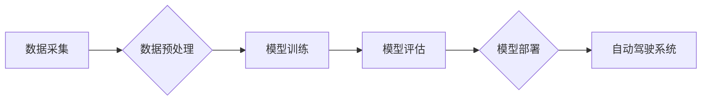

> 自动驾驶、算力、芯片、模型训练、数据中心、云计算、边缘计算

## 1. 背景介绍

自动驾驶技术作为未来交通运输的重要发展方向，其核心在于感知、决策和控制等环节的智能化处理。而这些智能化处理都需要强大的算力支持。近年来，国内自动驾驶行业蓬勃发展，涌现出一批优秀的企业，但算力建设仍然是制约行业发展的关键瓶颈之一。

自动驾驶技术的发展离不开海量数据的训练和模型的迭代优化。训练复杂的自动驾驶模型需要大量的计算资源，而传统的CPU算力已经难以满足需求。因此，自动驾驶公司纷纷转向GPU、TPU等高性能计算芯片，并积极建设自己的数据中心和云计算平台。

## 2. 核心概念与联系

**2.1 算力需求**

自动驾驶算法的训练和推理都需要大量的算力。

* **模型训练:** 自动驾驶模型通常包含数十亿甚至数百亿的参数，需要大量的计算资源进行训练。
* **模型推理:** 在实际应用中，自动驾驶系统需要实时进行感知、决策和控制，这需要高效的模型推理能力。

**2.2 算力架构**

自动驾驶公司的算力架构通常包括以下几个部分：

* **数据中心:** 作为算力的核心基础设施，数据中心提供大量的计算资源和存储空间。
* **云计算平台:** 利用云计算平台可以灵活扩展算力资源，降低成本。
* **边缘计算:** 将部分计算任务下沉到边缘设备，可以降低延迟，提高实时性。

**2.3 算力技术**

自动驾驶公司在算力建设方面采用多种技术，包括：

* **GPU加速:** 利用GPU的并行计算能力加速模型训练和推理。
* **TPU加速:** 使用TPU等专门设计的AI芯片，进一步提升算力效率。
* **模型压缩:** 通过模型压缩技术，减少模型参数量，降低算力需求。
* **分布式训练:** 将模型训练任务分布到多个节点上进行并行计算，提高训练速度。

**Mermaid 流程图**



## 3. 核心算法原理 & 具体操作步骤

**3.1 算法原理概述**

自动驾驶算法的核心是利用机器学习技术，从海量数据中学习驾驶规则和决策策略。常见的自动驾驶算法包括：

* **深度学习:** 利用多层神经网络，学习复杂的感知和决策模型。
* **强化学习:** 通过与环境交互，学习最优的驾驶策略。
* **行为规划:** 根据环境信息和目标，规划驾驶轨迹和控制指令。

**3.2 算法步骤详解**

自动驾驶算法的训练和应用通常包括以下步骤：

1. **数据采集:** 收集各种驾驶场景下的图像、视频、传感器数据等。
2. **数据预处理:** 对采集到的数据进行清洗、标注、格式转换等处理。
3. **模型训练:** 利用训练数据，训练自动驾驶模型。
4. **模型评估:** 使用测试数据评估模型的性能，并进行模型调优。
5. **模型部署:** 将训练好的模型部署到自动驾驶系统中。

**3.3 算法优缺点**

不同的自动驾驶算法各有优缺点，需要根据具体应用场景选择合适的算法。

* **深度学习:** 优点是能够学习复杂的非线性关系，缺点是需要大量的训练数据和计算资源。
* **强化学习:** 优点是能够学习最优的驾驶策略，缺点是训练过程复杂，收敛速度慢。
* **行为规划:** 优点是能够规划合理的驾驶轨迹，缺点是需要精确的环境信息和模型预测。

**3.4 算法应用领域**

自动驾驶算法广泛应用于各种自动驾驶场景，例如：

* **自动驾驶汽车:** 实现车辆的自动驾驶功能。
* **无人机:** 实现无人机的自主飞行和任务执行。
* **自动驾驶机器人:** 实现机器人的自主导航和操作。

## 4. 数学模型和公式 & 详细讲解 & 举例说明

**4.1 数学模型构建**

自动驾驶算法通常基于数学模型进行建模和分析。常见的数学模型包括：

* **状态空间模型:** 描述系统状态和输入输出关系的数学模型。
* **控制理论模型:** 用于设计自动驾驶系统的控制策略的数学模型。
* **概率模型:** 用于处理自动驾驶系统中的不确定性和随机性。

**4.2 公式推导过程**

例如，状态空间模型的推导过程如下：

$$
\dot{x}(t) = f(x(t), u(t))
$$

$$
y(t) = h(x(t))
$$

其中：

* $x(t)$ 是系统的状态向量。
* $u(t)$ 是系统的输入向量。
* $y(t)$ 是系统的输出向量。
* $f(x(t), u(t))$ 是状态方程。
* $h(x(t))$ 是输出方程。

**4.3 案例分析与讲解**

例如，在自动驾驶汽车中，可以使用状态空间模型来描述车辆的运动状态，并设计相应的控制策略。

## 5. 项目实践：代码实例和详细解释说明

**5.1 开发环境搭建**

自动驾驶项目开发通常需要搭建以下开发环境：

* **操作系统:** Linux 或 Windows。
* **编程语言:** Python、C++ 等。
* **深度学习框架:** TensorFlow、PyTorch 等。
* **仿真平台:** CARLA、Gazebo 等。

**5.2 源代码详细实现**

以下是一个简单的自动驾驶模型训练代码示例，使用 TensorFlow 框架：

```python
import tensorflow as tf

# 定义模型结构
model = tf.keras.models.Sequential([
    tf.keras.layers.Conv2D(32, (3, 3), activation='relu', input_shape=(64, 64, 3)),
    tf.keras.layers.MaxPooling2D((2, 2)),
    tf.keras.layers.Conv2D(64, (3, 3), activation='relu'),
    tf.keras.layers.MaxPooling2D((2, 2)),
    tf.keras.layers.Flatten(),
    tf.keras.layers.Dense(10, activation='softmax')
])

# 编译模型
model.compile(optimizer='adam',
              loss='sparse_categorical_crossentropy',
              metrics=['accuracy'])

# 训练模型
model.fit(x_train, y_train, epochs=10)
```

**5.3 代码解读与分析**

这段代码定义了一个简单的卷积神经网络模型，用于图像分类任务。模型包含两层卷积层、两层最大池化层、一层全连接层和一层输出层。模型使用 Adam 优化器、交叉熵损失函数和准确率作为评估指标。

**5.4 运行结果展示**

训练完成后，可以评估模型的性能，并使用模型进行预测。

## 6. 实际应用场景

自动驾驶技术在多个领域都有实际应用场景：

* **自动驾驶汽车:** 实现车辆的自动驾驶功能，提高交通安全和效率。
* **无人机:** 实现无人机的自主飞行和任务执行，例如物流配送、农业监测等。
* **自动驾驶机器人:** 实现机器人的自主导航和操作，例如仓库物流、工业自动化等。

**6.4 未来应用展望**

未来，自动驾驶技术将应用于更多领域，例如：

* **智能交通系统:** 实现交通流量优化、拥堵缓解等。
* **智慧城市:** 实现城市管理、公共服务等方面的智能化。
* **医疗保健:** 实现医疗资源调度、远程医疗等。

## 7. 工具和资源推荐

**7.1 学习资源推荐**

* **书籍:**
    * 《深度学习》
    * 《自动驾驶汽车》
* **在线课程:**
    * Coursera: 自动驾驶汽车
    * Udacity: 自动驾驶工程师
* **开源项目:**
    * CARLA
    * Autoware

**7.2 开发工具推荐**

* **编程语言:** Python、C++
* **深度学习框架:** TensorFlow、PyTorch
* **仿真平台:** CARLA、Gazebo

**7.3 相关论文推荐**

* **论文:**
    * 《End to End Learning for Self-Driving Cars》
    * 《Deep Reinforcement Learning for Autonomous Driving》

## 8. 总结：未来发展趋势与挑战

**8.1 研究成果总结**

近年来，自动驾驶技术取得了显著进展，模型性能不断提升，应用场景不断拓展。

**8.2 未来发展趋势**

未来，自动驾驶技术将朝着以下方向发展：

* **更强的感知能力:** 利用更先进的传感器和算法，提高感知精度和可靠性。
* **更智能的决策能力:** 利用更强大的计算能力和更复杂的算法，提高决策智能和安全性。
* **更广泛的应用场景:** 将自动驾驶技术应用于更多领域，例如物流、农业、医疗等。

**8.3 面临的挑战**

自动驾驶技术还面临着一些挑战：

* **数据安全:** 自动驾驶系统需要处理大量敏感数据，数据安全问题需要得到有效解决。
* **伦理问题:** 自动驾驶系统在遇到紧急情况时，如何做出道德决策是一个需要认真思考的问题。
* **法律法规:** 自动驾驶技术的法律法规体系尚不完善，需要进一步完善。

**8.4 研究展望**

未来，需要继续加强自动驾驶技术的研究和开发，解决技术难题，推动自动驾驶技术更快、更安全地应用于社会。

## 9. 附录：常见问题与解答

**常见问题:**

* **自动驾驶技术什么时候能够普及？**

**解答:** 自动驾驶技术的普及时间取决于技术发展、政策法规、社会接受度等多方面因素。预计在未来几年内，部分自动驾驶功能将会逐步普及。

* **自动驾驶汽车的安全性能如何？**

**解答:** 自动驾驶汽车的安全性能正在不断提升，但仍然存在一些风险。需要加强技术研发、安全测试和监管，确保自动驾驶汽车的安全可靠。


作者：禅与计算机程序设计艺术 / Zen and the Art of Computer Programming 
<end_of_turn>