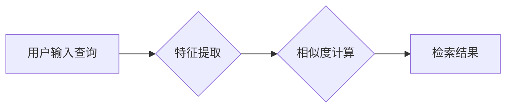

> 深度学习，图像检索，卷积神经网络，特征提取，相似度计算，检索模型

## 1. 背景介绍

图像检索技术是指根据用户提供的查询图像或文本描述，从海量图像数据库中快速准确地检索出与之相似的图像。随着互联网的快速发展和图像数据的爆炸式增长，图像检索技术已成为信息检索领域的重要研究方向，在电子商务、医疗诊断、内容管理、图像搜索等领域有着广泛的应用前景。

传统的图像检索方法主要依赖于手工设计的特征，例如颜色、纹理、形状等。然而，手工设计的特征难以捕捉图像的复杂语义信息，检索效果往往有限。近年来，深度学习技术的发展为图像检索带来了新的突破。深度学习模型能够自动学习图像的特征表示，并有效地捕捉图像的语义信息，从而提高了图像检索的准确性和效率。

## 2. 核心概念与联系

### 2.1  图像特征提取

图像特征提取是图像检索的关键步骤，旨在从图像中提取能够代表图像内容的特征。深度学习模型能够自动学习图像的特征表示，并有效地捕捉图像的语义信息。常用的深度学习模型包括卷积神经网络（CNN）。

### 2.2  相似度计算

相似度计算是衡量图像之间相似程度的指标。常用的相似度计算方法包括欧氏距离、余弦相似度等。

### 2.3  检索模型

检索模型负责根据用户查询和图像特征，从图像数据库中检索出与之相似的图像。常用的检索模型包括基于关键词的检索模型、基于内容的检索模型、基于混合特征的检索模型等。

**Mermaid 流程图**



## 3. 核心算法原理 & 具体操作步骤

### 3.1  算法原理概述

基于深度学习的图像检索算法主要包括以下步骤：

1. **图像预处理:** 对输入图像进行预处理，例如尺寸调整、归一化等。
2. **特征提取:** 使用深度学习模型提取图像特征。
3. **特征表示:** 将提取的特征表示为向量形式。
4. **相似度计算:** 计算查询图像和数据库图像之间的相似度。
5. **检索结果排序:** 根据相似度排序检索结果，并返回前N个结果。

### 3.2  算法步骤详解

1. **图像预处理:** 

   - **尺寸调整:** 将所有图像调整为相同的尺寸，以保证模型输入的图像大小一致。
   - **归一化:** 将图像像素值归一化到[0, 1]区间，以提高模型的训练效率和稳定性。

2. **特征提取:**

   - 使用预训练的深度学习模型，例如ResNet、VGG、Inception等，提取图像特征。
   - 提取的特征通常是图像的中间层或最后层的特征图，这些特征图包含了图像的语义信息。

3. **特征表示:**

   - 将提取的特征图平均池化或最大池化，得到一个固定长度的特征向量。
   - 该特征向量代表了图像的整体语义信息。

4. **相似度计算:**

   - 使用欧氏距离、余弦相似度等方法计算查询图像和数据库图像之间的相似度。
   - 欧氏距离衡量两个向量之间的距离，余弦相似度衡量两个向量的夹角。

5. **检索结果排序:**

   - 根据相似度排序检索结果，并返回前N个结果。

### 3.3  算法优缺点

**优点:**

- 能够自动学习图像的特征表示，并有效地捕捉图像的语义信息。
- 检索效果显著优于传统的基于手工特征的图像检索方法。
- 能够处理高维图像数据，并提高检索效率。

**缺点:**

- 需要大量的训练数据，训练成本较高。
- 模型复杂度高，推理速度相对较慢。
- 对数据噪声和图像质量敏感。

### 3.4  算法应用领域

- 电子商务: 根据用户上传的图片检索相似商品。
- 医疗诊断: 根据病人的影像数据检索相似病例，辅助医生诊断。
- 内容管理: 根据图片内容自动分类和组织图片。
- 图像搜索: 根据用户输入的关键词或图片检索相关图片。

## 4. 数学模型和公式 & 详细讲解 & 举例说明

### 4.1  数学模型构建

**特征提取模型:**

假设输入图像为I，深度学习模型为f，提取的特征向量为F。

$$F = f(I)$$

**相似度计算模型:**

假设查询图像的特征向量为F_q，数据库图像的特征向量为F_i，相似度计算函数为S。

$$S(F_q, F_i) = \frac{F_q \cdot F_i}{||F_q|| ||F_i||}$$

### 4.2  公式推导过程

**余弦相似度公式推导:**

余弦相似度衡量两个向量的夹角，其值范围为[-1, 1]，其中1表示完全相似，-1表示完全不同。

$$S(F_q, F_i) = \cos(\theta) = \frac{F_q \cdot F_i}{||F_q|| ||F_i||}$$

其中:

- $F_q \cdot F_i$ 是查询图像特征向量和数据库图像特征向量的点积。
- $||F_q||$ 和 $||F_i||$ 分别是查询图像特征向量和数据库图像特征向量的模长。

### 4.3  案例分析与讲解

**案例:**

假设查询图像的特征向量为[0.2, 0.3, 0.5, 0.1]，数据库图像的特征向量为[0.1, 0.4, 0.6, 0.2]。

**计算:**

$$S(F_q, F_i) = \frac{[0.2, 0.3, 0.5, 0.1] \cdot [0.1, 0.4, 0.6, 0.2]}{|| [0.2, 0.3, 0.5, 0.1] || || [0.1, 0.4, 0.6, 0.2] ||}$$

$$S(F_q, F_i) = \frac{0.02 + 0.12 + 0.3 + 0.02}{\sqrt{0.04 + 0.09 + 0.25 + 0.01} \sqrt{0.01 + 0.16 + 0.36 + 0.04}}$$

$$S(F_q, F_i) = \frac{0.48}{\sqrt{0.4} \sqrt{0.6}}$$

$$S(F_q, F_i) \approx 0.8$$

**结果:**

查询图像和数据库图像的余弦相似度为0.8，说明两者非常相似。

## 5. 项目实践：代码实例和详细解释说明

### 5.1  开发环境搭建

- 操作系统: Ubuntu 18.04
- Python 版本: 3.7
- 深度学习框架: TensorFlow 2.0
- 图像处理库: OpenCV

### 5.2  源代码详细实现

```python
import tensorflow as tf
from tensorflow.keras.applications import ResNet50
from tensorflow.keras.preprocessing import image
from tensorflow.keras.applications.resnet50 import preprocess_input, decode_predictions

# 加载预训练的ResNet50模型
model = ResNet50(weights='imagenet')

# 定义图像预处理函数
def preprocess_image(image_path):
    img = image.load_img(image_path, target_size=(224, 224))
    x = image.img_to_array(img)
    x = np.expand_dims(x, axis=0)
    x = preprocess_input(x)
    return x

# 定义特征提取函数
def extract_features(image_path):
    x = preprocess_image(image_path)
    features = model.predict(x)
    return features

# 查询图像路径
query_image_path = 'query_image.jpg'

# 数据库图像路径列表
database_image_paths = ['image1.jpg', 'image2.jpg', 'image3.jpg']

# 查询图像特征
query_features = extract_features(query_image_path)

# 数据库图像特征
database_features = []
for image_path in database_image_paths:
    database_features.append(extract_features(image_path))

# 计算相似度
similarities = []
for database_feature in database_features:
    similarity = tf.reduce_sum(query_features * database_feature) / (tf.norm(query_features) * tf.norm(database_feature))
    similarities.append(similarity)

# 排序检索结果
sorted_indices = tf.argsort(similarities)[::-1]
sorted_image_paths = [database_image_paths[i] for i in sorted_indices]

# 打印检索结果
print('检索结果:')
for image_path in sorted_image_paths:
    print(image_path)
```

### 5.3  代码解读与分析

- 代码首先加载预训练的ResNet50模型，并定义图像预处理和特征提取函数。
- 然后，代码获取查询图像和数据库图像路径，并提取它们的特征向量。
- 接着，代码计算查询图像和数据库图像之间的相似度，并根据相似度排序检索结果。
- 最后，代码打印检索结果。

### 5.4  运行结果展示

运行代码后，将输出数据库中与查询图像最相似的图像路径。

## 6. 实际应用场景

### 6.1  电子商务

在电子商务平台上，用户可以通过上传图片检索相似商品。例如，用户上传了一张衣服图片，系统可以检索出与该衣服风格、颜色、款式相似的其他商品。

### 6.2  医疗诊断

在医疗诊断领域，医生可以通过上传病人的影像数据，例如X光片、CT扫描图像等，检索出与之相似的病例，辅助医生诊断疾病。

### 6.3  内容管理

在内容管理系统中，图像检索可以用于自动分类和组织图片。例如，可以根据图片内容自动将图片分类到不同的类别，例如风景、人物、动物等。

### 6.4  未来应用展望

随着深度学习技术的不断发展，图像检索技术将有更广泛的应用前景。例如，可以用于自动生成图像描述、图像编辑、图像合成等领域。

## 7. 工具和资源推荐

### 7.1  学习资源推荐

- **书籍:**
    - Deep Learning with Python by Francois Chollet
    - Computer Vision: Algorithms and Applications by Richard Szeliski
- **在线课程:**
    - Deep Learning Specialization by Andrew Ng (Coursera)
    - Fast.ai Practical Deep Learning for Coders

### 7.2  开发工具推荐

- **深度学习框架:** TensorFlow, PyTorch, Keras
- **图像处理库:** OpenCV, Pillow
- **数据库:** MySQL, PostgreSQL

### 7.3  相关论文推荐

- **ImageNet Classification with Deep Convolutional Neural Networks** by Alex Krizhevsky, Ilya Sutskever, Geoffrey E. Hinton
- **Deep Residual Learning for Image Recognition** by Kaiming He, Xiangyu Zhang, Shaoqing Ren, Jian Sun
- **Inception-v3, Inception-ResNet and the Impact of Residual Connections on Learning** by Christian Szegedy, Sergey Ioffe, Vincent Vanhoucke, Alex Alemi

## 8. 总结：未来发展趋势与挑战

### 8.1  研究成果总结

基于深度学习的图像检索技术取得了显著的进展，检索效果显著优于传统的基于手工特征的图像检索方法。

### 8.2  未来发展趋势

- **模型更深更广:** 探索更深更广的深度学习