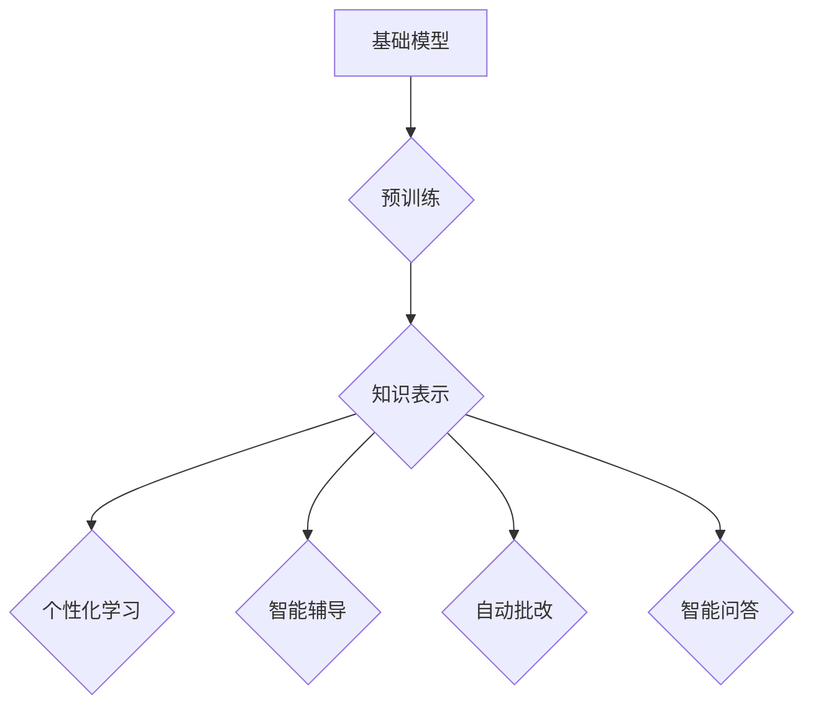

> 基础模型、教育、人工智能、自然语言处理、计算机视觉、个性化学习、智能辅导

## 1. 背景介绍

教育领域一直是人工智能（AI）应用的重要领域之一。随着基础模型技术的快速发展，基础模型在教育领域的应用展现出巨大的潜力。基础模型是指在海量数据上预训练的强大通用模型，能够在各种下游任务中表现出卓越的性能，例如文本生成、图像识别、机器翻译等。

传统的教育模式往往是“一刀切”，难以满足不同学生个性化的学习需求。基础模型的应用可以打破这种局限性，为学生提供更加个性化、高效的学习体验。

## 2. 核心概念与联系

**2.1 基础模型概述**

基础模型是近年来人工智能领域取得重大突破的产物。它们通过在海量文本、图像、音频等多模态数据上进行预训练，学习到丰富的知识和表示能力。

**2.2 教育领域的应用场景**

基础模型在教育领域可以应用于多个场景，例如：

* **智能辅导:** 基于基础模型的智能辅导系统可以根据学生的学习进度和理解情况，提供个性化的学习建议和辅导。
* **自动批改:** 基础模型可以用于自动批改学生的作业和考试，提高教师的工作效率。
* **个性化学习:** 基于基础模型的个性化学习平台可以根据学生的学习风格和兴趣，定制个性化的学习内容和路径。
* **智能问答:** 基于基础模型的智能问答系统可以帮助学生解答学习过程中遇到的问题。

**2.3 核心概念联系**

基础模型的强大能力可以与教育领域的各个环节相结合，实现智能化教育的愿景。



## 3. 核心算法原理 & 具体操作步骤

**3.1 算法原理概述**

基础模型的训练主要基于深度学习算法，例如Transformer模型。Transformer模型通过自注意力机制学习文本之间的上下文关系，能够捕捉到长距离依赖关系，从而实现更准确的文本理解和生成。

**3.2 算法步骤详解**

1. **数据预处理:** 将文本数据进行清洗、分词、标记等预处理操作，使其能够被模型理解。
2. **模型训练:** 使用深度学习框架（例如TensorFlow、PyTorch）训练Transformer模型，通过反向传播算法不断优化模型参数。
3. **模型评估:** 使用测试集评估模型的性能，例如准确率、召回率、F1-score等指标。
4. **模型部署:** 将训练好的模型部署到服务器或云平台，供用户使用。

**3.3 算法优缺点**

**优点:**

* 强大的泛化能力：预训练模型在各种下游任务中表现出色。
* 高效的训练速度：预训练模型可以利用已有知识，减少训练时间。
* 可解释性：Transformer模型的注意力机制可以帮助理解模型的决策过程。

**缺点:**

* 训练成本高：预训练模型需要大量的计算资源和数据。
* 存在偏差：预训练模型可能存在数据偏差，导致模型输出存在偏见。

**3.4 算法应用领域**

基础模型的应用领域非常广泛，除了教育领域外，还包括：

* 自然语言处理：文本生成、机器翻译、问答系统等。
* 计算机视觉：图像识别、物体检测、图像生成等。
* 语音识别：语音转文本、语音合成等。

## 4. 数学模型和公式 & 详细讲解 & 举例说明

**4.1 数学模型构建**

Transformer模型的核心是自注意力机制，其数学模型可以表示为：

$$
Attention(Q, K, V) = \frac{exp(Q \cdot K^T / \sqrt{d_k})}{exp(Q \cdot K^T / \sqrt{d_k})} \cdot V
$$

其中：

* $Q$：查询矩阵
* $K$：键矩阵
* $V$：值矩阵
* $d_k$：键向量的维度

**4.2 公式推导过程**

自注意力机制通过计算查询向量与键向量的点积，来衡量它们之间的相关性。点积结果经过softmax归一化，得到每个键向量的权重，然后将权重与值向量相乘，得到最终的注意力输出。

**4.3 案例分析与讲解**

例如，在机器翻译任务中，查询向量可以表示源语言的词语，键向量和值向量可以表示目标语言的词语。通过自注意力机制，模型可以学习到源语言词语与目标语言词语之间的对应关系，从而实现翻译。

## 5. 项目实践：代码实例和详细解释说明

**5.1 开发环境搭建**

* Python 3.7+
* TensorFlow 2.0+
* PyTorch 1.0+

**5.2 源代码详细实现**

```python
import tensorflow as tf

# 定义Transformer模型
class Transformer(tf.keras.Model):
    def __init__(self, vocab_size, embedding_dim, num_heads, num_layers):
        super(Transformer, self).__init__()
        self.embedding = tf.keras.layers.Embedding(vocab_size, embedding_dim)
        self.transformer_layers = tf.keras.layers.StackedRNNCells([
            tf.keras.layers.MultiHeadAttention(num_heads=num_heads, key_dim=embedding_dim)
            for _ in range(num_layers)
        ])

    def call(self, inputs):
        embeddings = self.embedding(inputs)
        outputs = self.transformer_layers(embeddings)
        return outputs

# 实例化模型
model = Transformer(vocab_size=10000, embedding_dim=128, num_heads=8, num_layers=6)

# 编译模型
model.compile(optimizer='adam', loss='mse')

# 训练模型
model.fit(x_train, y_train, epochs=10)
```

**5.3 代码解读与分析**

* 代码定义了一个Transformer模型，包含嵌入层、多头注意力层和堆叠的RNN单元。
* 嵌入层将输入词语转换为向量表示。
* 多头注意力层学习文本之间的上下文关系。
* 堆叠的RNN单元将注意力输出进行编码，最终得到模型输出。

**5.4 运行结果展示**

训练完成后，可以将模型应用于实际任务，例如文本生成、机器翻译等。

## 6. 实际应用场景

**6.1 智能辅导系统**

基于基础模型的智能辅导系统可以根据学生的学习进度和理解情况，提供个性化的学习建议和辅导。例如，如果学生在某个知识点上表现不佳，系统可以推荐相关的学习资源，或者提供针对性的辅导。

**6.2 自动批改系统**

基础模型可以用于自动批改学生的作业和考试，例如自动批改作文、数学题等。这可以帮助教师节省时间，并将精力集中在更重要的教学工作上。

**6.3 个性化学习平台**

基于基础模型的个性化学习平台可以根据学生的学习风格和兴趣，定制个性化的学习内容和路径。例如，如果学生喜欢阅读，平台可以推荐相关的书籍和文章；如果学生喜欢动手实践，平台可以提供相关的实验和项目。

**6.4 未来应用展望**

基础模型在教育领域的应用前景广阔，未来可能出现以下应用场景：

* **虚拟教师:** 基于基础模型的虚拟教师可以为学生提供一对一辅导，帮助学生更好地理解知识。
* **智能测评:** 基于基础模型的智能测评系统可以更加准确地评估学生的学习水平，并提供个性化的学习建议。
* **沉浸式学习:** 基于基础模型的沉浸式学习环境可以为学生提供更加生动的学习体验。

## 7. 工具和资源推荐

**7.1 学习资源推荐**

* **Transformer模型论文:** https://arxiv.org/abs/1706.03762
* **深度学习框架文档:** https://www.tensorflow.org/，https://pytorch.org/

**7.2 开发工具推荐**

* **TensorFlow:** https://www.tensorflow.org/
* **PyTorch:** https://pytorch.org/
* **HuggingFace Transformers:** https://huggingface.co/transformers/

**7.3 相关论文推荐**

* **BERT:** https://arxiv.org/abs/1810.04805
* **GPT-3:** https://openai.com/blog/gpt-3/
* **T5:** https://arxiv.org/abs/1910.10683

## 8. 总结：未来发展趋势与挑战

**8.1 研究成果总结**

基础模型在教育领域的应用取得了显著的成果，例如智能辅导、自动批改、个性化学习等。这些应用可以帮助提高教育效率，并为学生提供更加个性化的学习体验。

**8.2 未来发展趋势**

未来，基础模型在教育领域的应用将朝着以下方向发展：

* **更加个性化:** 基于基础模型的教育系统将更加注重学生的个性化需求，提供更加定制化的学习内容和路径。
* **更加智能化:** 基于基础模型的教育系统将更加智能化，能够更好地理解学生的学习情况，并提供更加精准的学习建议。
* **更加融合:** 基于基础模型的教育系统将更加融合，将文本、图像、音频等多模态数据整合在一起，提供更加丰富的学习体验。

**8.3 面临的挑战**

基础模型在教育领域的应用也面临一些挑战：

* **数据安全:** 教育数据涉及学生隐私，需要采取有效的措施保障数据安全。
* **算法公平性:** 基础模型可能存在算法偏见，需要确保算法公平性，避免对学生造成不公平的对待。
* **伦理问题:** 基础模型的应用可能引发一些伦理问题，例如教师的角色变化、学生自主学习能力的培养等，需要进行深入的探讨和研究。

**8.4 研究展望**

未来，我们需要继续研究基础模型在教育领域的应用，探索其更大的潜力，并解决其面临的挑战，最终实现人工智能为教育带来的变革。

## 9. 附录：常见问题与解答

**9.1 基础模型的训练成本高吗？**

是的，基础模型的训练成本较高，需要大量的计算资源和数据。

**9.2 基础模型的应用场景有哪些？**

基础模型的应用场景非常广泛，包括自然语言处理、计算机视觉、语音识别等。

**9.3 基础模型存在哪些伦理问题？**

基础模型的应用可能引发一些伦理问题，例如教师的角色变化、学生自主学习能力的培养等。

作者：禅与计算机程序设计艺术 / Zen and the Art of Computer Programming


<end_of_turn>