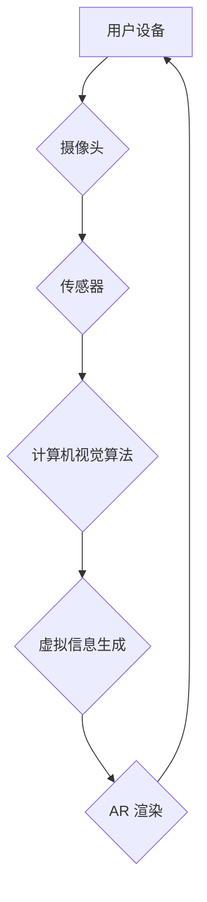

> 增强现实 (AR)、电商、用户体验、虚拟试衣、产品展示、购物场景

## 1. 背景介绍

电子商务的蓬勃发展为消费者提供了便捷的购物体验，但传统的电商模式仍然存在一些局限性，例如缺乏真实的商品感和试用体验。增强现实 (AR) 技术的出现为电商领域带来了新的机遇，它能够将虚拟信息叠加到现实世界中，为消费者提供更加沉浸式的购物体验。

AR 技术在电商领域的应用已经初具规模，从虚拟试衣、产品展示到购物场景的重塑，AR 技术正在改变着消费者的购物方式。本文将深入探讨 AR 技术在电商领域的应用案例，分析其优势和挑战，并展望其未来发展趋势。

## 2. 核心概念与联系

**2.1 增强现实 (AR) 技术**

增强现实 (AR) 技术是指在现实世界中叠加虚拟信息，以增强用户对现实世界的感知和理解的技术。AR 技术通常通过摄像头、传感器和计算机视觉算法将虚拟物体、信息或交互体验叠加到现实世界中。

**2.2 电商领域**

电商是指通过互联网进行商品交易的商业模式。电商平台为消费者提供商品展示、购买、支付等服务，并通过物流配送将商品送达消费者手中。

**2.3 AR 技术与电商的结合**

AR 技术与电商的结合可以为消费者提供更加沉浸式的购物体验，例如：

* **虚拟试衣:** 消费者可以通过 AR 技术在手机或平板电脑上虚拟试穿衣服，无需实际试穿即可了解衣服的款式、颜色和尺寸是否合适。
* **产品展示:** 商家可以通过 AR 技术将产品的三维模型展示给消费者，消费者可以从多个角度观察产品细节，并通过交互体验产品的功能。
* **购物场景重塑:** AR 技术可以将虚拟商品叠加到现实场景中，例如消费者可以在家中通过 AR 技术体验家具的摆放效果。

**2.4 AR 技术架构**



## 3. 核心算法原理 & 具体操作步骤

**3.1 算法原理概述**

AR 技术的核心算法包括计算机视觉、图像处理、三维建模和渲染等。

* **计算机视觉:** 用于识别和理解图像和视频中的物体和场景。
* **图像处理:** 用于对图像进行增强、滤波和变形等操作。
* **三维建模:** 用于创建虚拟物体的三维模型。
* **渲染:** 用于将虚拟物体渲染到现实世界中。

**3.2 算法步骤详解**

1. **环境识别:** 使用计算机视觉算法识别用户周围的环境，例如墙壁、地面等。
2. **物体识别:** 使用计算机视觉算法识别用户想要试穿或查看的物体，例如衣服、家具等。
3. **三维建模:** 根据识别到的物体信息，生成虚拟的三维模型。
4. **虚拟信息生成:** 根据用户操作和环境信息，生成虚拟信息，例如虚拟试衣的衣服颜色、尺寸等。
5. **AR 渲染:** 将虚拟信息渲染到现实世界中，叠加到用户看到的图像上。

**3.3 算法优缺点**

**优点:**

* 能够为消费者提供更加沉浸式的购物体验。
* 可以帮助消费者更好地了解商品的款式、颜色和尺寸。
* 可以减少商品退货率。

**缺点:**

* 需要强大的计算能力和复杂的算法。
* 需要用户设备具备一定的硬件配置。
* 虚拟体验与现实体验之间存在差异。

**3.4 算法应用领域**

AR 技术在电商领域之外，还广泛应用于其他领域，例如：

* 教育: AR 技术可以为学生提供更加生动的学习体验。
* 医疗: AR 技术可以帮助医生进行手术和诊断。
* 旅游: AR 技术可以为游客提供更加丰富的旅游体验。

## 4. 数学模型和公式 & 详细讲解 & 举例说明

**4.1 数学模型构建**

AR 技术的数学模型主要包括以下几个方面:

* **坐标系转换:** 将虚拟物体坐标系转换为现实世界坐标系。
* **投影变换:** 将三维物体投影到二维图像上。
* **深度估计:** 估计虚拟物体与摄像头的距离。

**4.2 公式推导过程**

* **坐标系转换:**

假设虚拟物体坐标系为 $V$，现实世界坐标系为 $W$，转换矩阵为 $T$，则虚拟物体在现实世界坐标系中的位置为：

$$
W = T \cdot V
$$

* **投影变换:**

投影变换矩阵为 $P$，则虚拟物体在图像坐标系中的位置为：

$$
I = P \cdot W
$$

* **深度估计:**

可以使用深度学习算法估计虚拟物体与摄像头的距离，例如深度神经网络。

**4.3 案例分析与讲解**

例如，在虚拟试衣应用中，需要将虚拟衣服叠加到用户的真实身体上。

1. 首先，需要使用计算机视觉算法识别用户的身体轮廓。
2. 然后，将虚拟衣服的坐标系转换为现实世界坐标系。
3. 将虚拟衣服投影到用户的身体轮廓上。
4. 最后，根据用户的动作和姿势，实时更新虚拟衣服的姿态和位置。

## 5. 项目实践：代码实例和详细解释说明

**5.1 开发环境搭建**

* 操作系统: Windows/macOS/Linux
* 编程语言: Python
* AR 库: ARKit (iOS), ARCore (Android)
* 3D 建模软件: Blender, Maya

**5.2 源代码详细实现**

```python
# 导入必要的库
import cv2
import numpy as np

# 加载虚拟衣服的3D模型
model = load_model("clothes.obj")

# 获取摄像头图像
cap = cv2.VideoCapture(0)
ret, frame = cap.read()

# 使用计算机视觉算法识别用户的身体轮廓
# ...

# 将虚拟衣服的坐标系转换为现实世界坐标系
# ...

# 将虚拟衣服投影到用户的身体轮廓上
# ...

# 显示结果
cv2.imshow("AR效果", frame)
cv2.waitKey(0)
```

**5.3 代码解读与分析**

* 代码首先导入必要的库，例如 OpenCV 用于图像处理，NumPy 用于数值计算。
* 然后，加载虚拟衣服的3D模型。
* 使用摄像头获取图像，并使用计算机视觉算法识别用户的身体轮廓。
* 将虚拟衣服的坐标系转换为现实世界坐标系，并将其投影到用户的身体轮廓上。
* 最后，显示结果图像。

**5.4 运行结果展示**

运行代码后，用户将看到虚拟衣服叠加在自己的身体上，可以根据用户的动作和姿势实时更新虚拟衣服的姿态和位置。

## 6. 实际应用场景

**6.1 虚拟试衣**

虚拟试衣应用可以帮助消费者在购买衣服之前，虚拟试穿不同款式、颜色和尺寸的衣服，从而减少退货率，提高购物体验。

**6.2 产品展示**

电商平台可以使用 AR 技术展示产品的3D模型，消费者可以从多个角度观察产品细节，并通过交互体验产品的功能。

**6.3 购物场景重塑**

AR 技术可以将虚拟商品叠加到现实场景中，例如消费者可以在家中通过 AR 技术体验家具的摆放效果。

**6.4 未来应用展望**

AR 技术在电商领域的应用前景广阔，未来可能出现以下应用场景:

* **个性化推荐:** AR 技术可以根据用户的喜好和购物历史，推荐个性化的商品。
* **虚拟购物助手:** AR 技术可以提供虚拟购物助手，帮助用户查找商品、比较价格和完成购买。
* **社交购物:** AR 技术可以将虚拟商品叠加到社交媒体平台，让用户可以与朋友一起虚拟试穿和购物。

## 7. 工具和资源推荐

**7.1 学习资源推荐**

* **书籍:**
    * 《增强现实技术》
    * 《ARKit 编程指南》
    * 《ARCore 开发指南》
* **在线课程:**
    * Coursera: 增强现实技术
    * Udemy: ARKit 开发
    * Udacity: ARCore 开发

**7.2 开发工具推荐**

* **ARKit:** iOS 平台的 AR 开发框架。
* **ARCore:** Android 平台的 AR 开发框架。
* **Unity:** 游戏引擎，支持 AR 开发。
* **Unreal Engine:** 游戏引擎，支持 AR 开发。

**7.3 相关论文推荐**

* **A Survey of Augmented Reality Technologies for E-commerce**
* **Augmented Reality in Retail: A Systematic Literature Review**
* **The Impact of Augmented Reality on Consumer Behavior in E-commerce**

## 8. 总结：未来发展趋势与挑战

**8.1 研究成果总结**

AR 技术在电商领域的应用已经取得了一定的成果，例如虚拟试衣、产品展示等应用场景已经开始商业化。

**8.2 未来发展趋势**

* **更逼真的虚拟体验:** 未来 AR 技术将更加逼真，能够提供更沉浸式的购物体验。
* **更智能的交互体验:** AR 技术将更加智能，能够理解用户的意图，提供更个性化的服务。
* **更广泛的应用场景:** AR 技术将应用于更多的电商场景，例如虚拟试妆、虚拟家居设计等。

**8.3 面临的挑战**

* **技术难题:** AR 技术仍然面临一些技术难题，例如如何实现更逼真的虚拟体验、如何提高 AR 应用的稳定性和可靠性。
* **成本问题:** AR 技术的开发和部署成本较高，需要商家投入更多的资源。
* **用户接受度:** 一些用户可能对 AR 技术感到陌生或不信任，需要商家进行更多的宣传和教育。

**8.4 研究展望**

未来，AR 技术在电商领域的应用将继续发展，并带来更多的创新和变革。研究者需要继续探索 AR 技术的应用潜力，解决技术难题，提高用户体验，推动 AR 技术在电商领域的普及和应用。

## 9. 附录：常见问题与解答

**9.1 Q: AR 技术需要什么样的硬件设备才能运行？**

**A:** AR 技术需要具备摄像头、传感器和一定的计算能力的设备，例如智能手机、平板电脑、AR 眼镜等。

**9.2 Q: AR 技术的应用场景有哪些？**

**A:** AR 技术的应用场景非常广泛，例如虚拟试衣、产品展示、购物场景重塑、教育、医疗、旅游等。

**9.3 Q: AR 技术的未来发展趋势是什么？**

**A:** 未来 AR 技术将更加逼真、智能和广泛应用于各个领域。

作者：禅与计算机程序设计艺术 / Zen and the Art of Computer Programming


<end_of_turn>