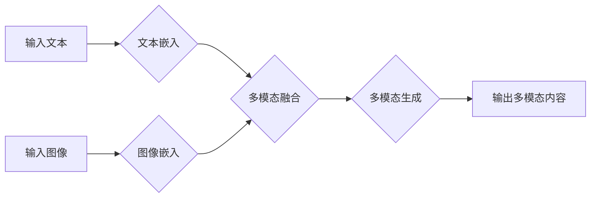

> 多模态生成、自然语言处理、计算机视觉、深度学习、Transformer、生成模型、代码实例

## 1. 背景介绍

近年来，人工智能领域取得了令人瞩目的进展，其中多模态生成技术作为一项前沿研究方向，展现出巨大的潜力。多模态生成是指利用多种模态信息（如文本、图像、音频、视频等）进行联合学习和生成，从而创造出新的多模态内容。

传统的生成模型主要集中在单一模态的生成任务上，例如文本生成、图像生成等。然而，现实世界中信息往往是多模态的，单一模态的生成模型难以捕捉到信息的丰富性和复杂性。多模态生成技术能够克服这一限制，通过融合不同模态的信息，生成更加真实、丰富和有意义的内容。

## 2. 核心概念与联系

多模态生成的核心概念包括：

* **模态:** 指不同类型的表示形式，例如文本、图像、音频、视频等。
* **多模态嵌入:** 将不同模态的信息映射到同一个低维空间，以便进行联合学习和生成。
* **多模态模型:** 能够处理和生成多种模态信息的模型。

**多模态生成流程图:**

## 3. 核心算法原理 & 具体操作步骤

### 3.1  算法原理概述

多模态生成算法通常基于深度学习模型，例如Transformer、生成对抗网络（GAN）等。这些模型能够学习不同模态之间的关系，并生成新的多模态内容。

常见的多模态生成算法包括：

* **Seq2Seq模型:** 将文本作为输入，生成文本或其他模态的输出。
* **图像 captioning模型:** 将图像作为输入，生成描述图像的文本。
* **文本到图像生成模型:** 将文本作为输入，生成相应的图像。

### 3.2  算法步骤详解

以文本到图像生成为例，详细说明算法步骤：

1. **文本嵌入:** 将输入文本转换为向量表示，捕捉文本语义信息。
2. **图像嵌入:** 将图像转换为向量表示，捕捉图像视觉特征。
3. **多模态融合:** 将文本嵌入和图像嵌入进行融合，形成联合表示。
4. **图像生成:** 利用融合后的表示，生成相应的图像。

### 3.3  算法优缺点

**优点:**

* 能够生成更加真实、丰富和有意义的多模态内容。
* 能够跨模态地进行信息传递和理解。

**缺点:**

* 训练数据量大，计算资源消耗高。
* 模型复杂度高，需要专业的技术人员进行开发和维护。

### 3.4  算法应用领域

多模态生成技术在多个领域具有广泛的应用前景，例如：

* **内容创作:** 生成图像、视频、音频等多模态内容。
* **教育培训:** 创建交互式学习内容，提高学习效率。
* **医疗诊断:** 分析医学图像，辅助医生进行诊断。
* **娱乐游戏:** 开发更加沉浸式的游戏体验。

## 4. 数学模型和公式 & 详细讲解 & 举例说明

### 4.1  数学模型构建

多模态生成模型通常采用神经网络结构，例如Transformer、CNN等。这些模型通过学习不同模态之间的关系，构建一个数学模型来表示多模态内容。

**举例说明:**

一个简单的文本到图像生成模型可以采用以下数学模型：

$$
y = f(x, z)
$$

其中：

* $x$ 是输入文本的嵌入向量。
* $z$ 是图像的嵌入向量。
* $f$ 是一个神经网络函数，用于融合文本和图像信息，并生成图像。

### 4.2  公式推导过程

具体的公式推导过程取决于所使用的模型架构和训练目标。例如，Transformer模型的注意力机制可以用于学习文本和图像之间的关系，而GAN模型则通过生成对抗过程来训练生成器和判别器，最终生成高质量的图像。

### 4.3  案例分析与讲解

可以参考一些公开的论文和代码实现，分析具体的数学模型和公式推导过程。例如，OpenAI的DALL-E模型就是一个著名的文本到图像生成模型，其论文和代码开源，可以作为学习参考。

## 5. 项目实践：代码实例和详细解释说明

### 5.1  开发环境搭建

需要安装Python、PyTorch或TensorFlow等深度学习框架，以及相关的库和工具。

### 5.2  源代码详细实现

可以参考开源的代码实现，例如HuggingFace的Transformers库，或者OpenAI的DALL-E模型代码。

### 5.3  代码解读与分析

需要对代码进行逐行解读，理解模型的结构、训练过程和生成过程。

### 5.4  运行结果展示

可以运行代码，生成文本到图像的示例，并展示生成的图像结果。

## 6. 实际应用场景

### 6.1  内容创作

多模态生成技术可以用于生成各种类型的创意内容，例如：

* **图像生成:** 根据文本描述生成图像，例如生成风景、人物、物体等。
* **视频生成:** 根据文本脚本生成视频，例如生成动画、广告、短片等。
* **音频生成:** 根据文本生成语音，例如生成播客、配音、音乐等。

### 6.2  教育培训

多模态生成技术可以用于创建更加生动和交互式的学习内容，例如：

* **虚拟现实教学:** 生成虚拟场景，让学生沉浸式地体验学习内容。
* **个性化学习:** 根据学生的学习进度和需求，生成个性化的学习内容。
* **互动式游戏:** 利用游戏机制，提高学生的学习兴趣和参与度。

### 6.3  医疗诊断

多模态生成技术可以辅助医生进行诊断，例如：

* **医学图像增强:** 生成更加清晰的医学图像，帮助医生更好地观察病灶。
* **虚拟手术模拟:** 生成虚拟手术场景，帮助医生进行手术练习和培训。
* **疾病预测:** 根据患者的医疗记录和图像数据，预测疾病的风险和发展趋势。

### 6.4  未来应用展望

随着多模态生成技术的不断发展，其应用场景将会更加广泛，例如：

* **智能客服:** 利用多模态信息，提供更加智能和人性化的客服服务。
* **个性化推荐:** 根据用户的多模态偏好，提供更加精准的商品和服务推荐。
* **创意设计:** 利用多模态生成技术，辅助设计师进行创意设计和产品开发。

## 7. 工具和资源推荐

### 7.1  学习资源推荐

* **书籍:**
    * 《深度学习》
    * 《自然语言处理》
    * 《计算机视觉》
* **在线课程:**
    * Coursera
    * edX
    * Udacity

### 7.2  开发工具推荐

* **深度学习框架:** PyTorch, TensorFlow
* **图像处理库:** OpenCV, Pillow
* **文本处理库:** NLTK, SpaCy

### 7.3  相关论文推荐

* **DALL-E:** https://openai.com/blog/dall-e/
* **CLIP:** https://arxiv.org/abs/2103.00020
* **Imagen:** https://blog.google/technology/ai/imagen-text-to-image-diffusion-model/

## 8. 总结：未来发展趋势与挑战

### 8.1  研究成果总结

多模态生成技术取得了显著的进展，能够生成更加逼真、多样和有意义的多模态内容。

### 8.2  未来发展趋势

* **模型能力提升:** 进一步提高模型的生成能力和质量，生成更加复杂和精细的多模态内容。
* **跨模态理解增强:** 增强模型对不同模态之间的理解能力，实现更加精准和有效的跨模态交互。
* **个性化生成:** 根据用户的个性化需求，生成更加定制化的多模态内容。

### 8.3  面临的挑战

* **数据获取和标注:** 多模态数据获取和标注成本高，需要开发更加高效的数据标注方法。
* **模型训练效率:** 多模态模型训练复杂度高，需要开发更加高效的训练算法和硬件平台。
* **伦理和安全问题:** 多模态生成技术可能被用于生成虚假信息和恶意内容，需要关注其伦理和安全问题。

### 8.4  研究展望

未来，多模态生成技术将继续朝着更加智能、高效和安全的方向发展，在各个领域发挥越来越重要的作用。

## 9. 附录：常见问题与解答

### 9.1  常见问题

* **多模态生成技术与传统生成模型有什么区别？**
* **如何选择合适的多模态生成模型？**
* **如何评估多模态生成模型的性能？**

### 9.2  解答

...

作者：禅与计算机程序设计艺术 / Zen and the Art of Computer Programming

<end_of_turn>