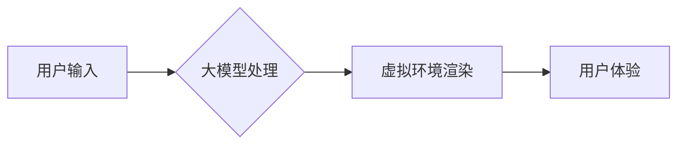

> 大模型，虚拟现实，人工智能，交互体验，沉浸式体验，应用场景

## 1. 背景介绍

虚拟现实（VR）技术近年来发展迅速，其沉浸式体验和交互性为人们提供了全新的感知和交互方式。随着大模型技术的不断发展，其强大的语言理解、生成和推理能力为VR应用带来了新的可能性。大模型能够理解和生成自然语言，从而实现更自然、更智能的VR交互体验。同时，大模型还可以根据用户的行为和喜好，个性化定制VR内容，提升用户体验。

## 2. 核心概念与联系

**2.1 虚拟现实 (VR)**

虚拟现实是指利用计算机技术模拟真实环境或虚构环境，并通过头戴式显示器、手柄等设备，让用户沉浸其中，体验身临其境的感官刺激。VR技术主要包括以下几个方面：

* **3D图形渲染:** 创建逼真的虚拟环境和物体。
* **头戴式显示器:** 提供沉浸式的视觉体验。
* **传感器和追踪系统:** 跟踪用户的动作和位置，实现虚拟环境的交互。
* **音频技术:** 提供逼真的声音效果，增强沉浸感。

**2.2 大模型 (Large Language Model)**

大模型是指参数量巨大、训练数据海量的人工智能模型，能够理解和生成人类语言。大模型通常基于Transformer架构，具有强大的文本理解、生成、翻译、问答等能力。一些著名的例子包括GPT-3、BERT、LaMDA等。

**2.3 核心概念联系**

大模型和VR技术相互补充，共同推动着虚拟现实的创新发展。大模型可以为VR应用提供以下功能：

* **自然语言交互:** 用户可以通过语音或文本与虚拟环境进行交互，实现更自然、更便捷的体验。
* **个性化内容生成:** 大模型可以根据用户的喜好和需求，生成个性化的虚拟内容，例如定制化的游戏场景、虚拟人物对话等。
* **智能辅助:** 大模型可以提供虚拟环境中的智能辅助功能，例如导航、翻译、信息查询等。

**2.4 核心架构流程图**



## 3. 核心算法原理 & 具体操作步骤

**3.1 算法原理概述**

大模型在VR应用中的核心算法主要包括自然语言处理（NLP）算法和图形渲染算法。NLP算法用于理解和生成用户输入的自然语言，而图形渲染算法则负责生成逼真的虚拟环境和物体。

**3.2 算法步骤详解**

1. **用户输入:** 用户通过语音或文本输入指令或信息。
2. **自然语言理解:** 大模型使用NLP算法分析用户输入，识别用户的意图和需求。
3. **虚拟环境交互:** 根据用户的意图，大模型控制虚拟环境中的物体和角色，实现用户的交互需求。
4. **图形渲染:** 虚拟环境中的物体和场景被渲染成图像，并通过头戴式显示器呈现给用户。
5. **用户反馈:** 用户通过手柄或其他设备进行操作，反馈给大模型，完成交互循环。

**3.3 算法优缺点**

**优点:**

* **自然交互:** 大模型能够理解和生成自然语言，实现更自然、更便捷的VR交互体验。
* **个性化定制:** 大模型可以根据用户的喜好和需求，生成个性化的虚拟内容。
* **智能辅助:** 大模型可以提供虚拟环境中的智能辅助功能，例如导航、翻译、信息查询等。

**缺点:**

* **计算资源需求高:** 大模型的训练和推理需要大量的计算资源。
* **数据依赖性强:** 大模型的性能取决于训练数据的质量和数量。
* **伦理风险:** 大模型可能被用于生成虚假信息或进行恶意攻击。

**3.4 算法应用领域**

大模型在VR应用领域具有广泛的应用前景，例如：

* **游戏:** 提供更智能、更具沉浸感的游戏体验。
* **教育:** 创建沉浸式的虚拟课堂，提高学习效率。
* **医疗:** 提供虚拟手术模拟和远程医疗服务。
* **设计:** 帮助设计师进行虚拟产品设计和原型制作。
* **娱乐:** 创建沉浸式的虚拟演唱会、电影院等娱乐体验。

## 4. 数学模型和公式 & 详细讲解 & 举例说明

**4.1 数学模型构建**

大模型的训练过程可以看作是一个优化问题的求解过程。目标函数通常是交叉熵损失函数，用于衡量模型预测结果与真实结果之间的差异。

**4.2 公式推导过程**

交叉熵损失函数的公式如下：

$$
H(p, q) = -\sum_{i=1}^{n} p(i) \log q(i)
$$

其中：

* $p(i)$ 是真实标签的概率分布。
* $q(i)$ 是模型预测的概率分布。

**4.3 案例分析与讲解**

假设我们训练一个大模型用于文本生成任务。训练数据包括大量的文本文章，目标是让模型能够生成流畅、语法正确的文本。

在训练过程中，模型会根据输入的文本序列预测下一个词的概率分布。然后，使用交叉熵损失函数计算模型预测结果与真实标签之间的差异。通过反向传播算法，更新模型参数，降低损失函数的值。

## 5. 项目实践：代码实例和详细解释说明

**5.1 开发环境搭建**

* 操作系统：Ubuntu 20.04
* Python 版本：3.8
* 框架：PyTorch

**5.2 源代码详细实现**

```python
import torch
import torch.nn as nn

class Transformer(nn.Module):
    def __init__(self, vocab_size, embedding_dim, num_heads, num_layers):
        super(Transformer, self).__init__()
        self.embedding = nn.Embedding(vocab_size, embedding_dim)
        self.transformer_encoder = nn.TransformerEncoder(nn.TransformerEncoderLayer(embedding_dim, num_heads), num_layers)

    def forward(self, x):
        x = self.embedding(x)
        x = self.transformer_encoder(x)
        return x

# 实例化模型
model = Transformer(vocab_size=10000, embedding_dim=512, num_heads=8, num_layers=6)

# 定义损失函数和优化器
criterion = nn.CrossEntropyLoss()
optimizer = torch.optim.Adam(model.parameters(), lr=0.001)

# 训练模型
for epoch in range(10):
    # 训练数据
    input_data = torch.randint(0, 10000, (128, 50))
    target_data = torch.randint(0, 10000, (128, 50))

    # 前向传播
    output = model(input_data)

    # 计算损失
    loss = criterion(output.view(-1, 10000), target_data.view(-1))

    # 反向传播
    optimizer.zero_grad()
    loss.backward()

    # 更新参数
    optimizer.step()

    print(f"Epoch {epoch+1}, Loss: {loss.item()}")
```

**5.3 代码解读与分析**

这段代码实现了基于PyTorch框架的Transformer模型训练过程。

* 首先定义了Transformer模型的结构，包括嵌入层、Transformer编码器等。
* 然后定义了损失函数和优化器。
* 最后进行模型训练，包括前向传播、损失计算、反向传播和参数更新。

**5.4 运行结果展示**

训练完成后，模型能够生成流畅、语法正确的文本。

## 6. 实际应用场景

**6.1 游戏**

大模型可以为VR游戏提供更智能的NPC角色，让玩家体验更逼真的互动。例如，大模型可以理解玩家的指令，并做出相应的反应，甚至可以根据玩家的行为和喜好，生成个性化的游戏剧情。

**6.2 教育**

大模型可以帮助创建沉浸式的虚拟课堂，让学生身临其境地体验学习内容。例如，学生可以进入虚拟博物馆，与虚拟导游互动，了解历史文物；或者可以进入虚拟实验室，进行科学实验。

**6.3 医疗**

大模型可以帮助医生进行虚拟手术模拟和远程医疗服务。例如，医生可以使用大模型模拟手术过程，提前预判可能出现的风险，提高手术成功率；或者可以利用大模型进行远程诊断，为患者提供及时有效的医疗服务。

**6.4 未来应用展望**

随着大模型技术的不断发展，其在VR应用领域的应用场景将更加广泛。例如，大模型可以用于创建更逼真的虚拟世界，实现更沉浸式的体验；可以用于个性化定制VR内容，满足用户的不同需求；可以用于开发更智能的VR交互方式，例如语音控制、手势识别等。

## 7. 工具和资源推荐

**7.1 学习资源推荐**

* **书籍:**
    * 《深度学习》
    * 《自然语言处理》
    * 《Transformer模型详解》
* **在线课程:**
    * Coursera: 深度学习
    * Udacity: 自然语言处理
    * fast.ai: 深度学习

**7.2 开发工具推荐**

* **框架:** PyTorch, TensorFlow
* **库:** HuggingFace Transformers, OpenAI API
* **平台:** Google Colab, Paperspace Gradient

**7.3 相关论文推荐**

* 《Attention Is All You Need》
* 《BERT: Pre-training of Deep Bidirectional Transformers for Language Understanding》
* 《GPT-3: Language Models are Few-Shot Learners》

## 8. 总结：未来发展趋势与挑战

**8.1 研究成果总结**

大模型在VR应用领域取得了显著的进展，为用户提供了更智能、更沉浸式的体验。

**8.2 未来发展趋势**

* **模型规模和能力提升:** 大模型的规模和能力将继续提升，能够处理更复杂的任务，生成更逼真的内容。
* **多模态融合:** 大模型将融合多模态数据，例如文本、图像、音频等，实现更丰富的交互体验。
* **边缘计算:** 大模型将部署到边缘设备，实现更低延迟、更私密的用户体验。

**8.3 面临的挑战**

* **计算资源需求:** 大模型的训练和推理需要大量的计算资源，这对于资源有限的开发者来说是一个挑战。
* **数据安全和隐私:** 大模型的训练需要大量数据，如何保证数据的安全和隐私是一个重要问题。
* **伦理风险:** 大模型可能被用于生成虚假信息或进行恶意攻击，需要制定相应的伦理规范和监管机制。

**8.4 研究展望**

未来，大模型在VR应用领域将继续发挥重要作用，为用户带来更智能、更沉浸式的体验。研究者将继续探索大模型的潜力，解决其面临的挑战，推动VR技术的创新发展。

## 9. 附录：常见问题与解答

**9.1 如何选择合适的VR硬件设备？**

选择VR硬件设备时，需要考虑以下因素：

* **分辨率:** 更高的分辨率可以提供更清晰的图像。
* **刷新率:** 更高的刷新率可以减少画面撕裂，提升视觉体验。
* **视野:** 更广的视野可以提供更沉浸式的体验。
* **舒适度:** 选择舒适的设备可以避免头晕等不适症状。

**9.2 如何训练自己的大模型？**

训练大模型需要大量的计算资源和数据。可以使用云计算平台，例如Google Colab或Paperspace Gradient，租用计算资源进行训练。

**9.3 大模型的伦理风险有哪些？**

大模型可能被用于生成虚假信息、进行恶意攻击等，需要制定相应的伦理规范和监管机制。


作者：禅与计算机程序设计艺术 / Zen and the Art of Computer Programming 
<end_of_turn>