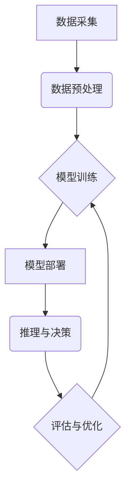

> 大模型、军事应用、人工智能、深度学习、自然语言处理、计算机视觉、无人作战系统、战略决策支持

## 1. 背景介绍

近年来，人工智能（AI）技术取得了飞速发展，特别是大模型技术的突破，为军事领域带来了前所未有的机遇和挑战。大模型，是指参数规模庞大、训练数据海量的人工智能模型，具备强大的泛化能力和学习能力，能够在自然语言处理、计算机视觉、语音识别等多个领域取得突破性进展。

军事领域一直以来都高度依赖于先进的技术，以获取信息优势、提升作战效能。大模型技术的应用，将深刻改变军事作战模式，推动军事力量向智能化、自动化方向发展。

## 2. 核心概念与联系

### 2.1 大模型概述

大模型是指参数规模庞大、训练数据海量的人工智能模型。其核心特点包括：

* **参数规模巨大:** 大模型通常拥有数十亿甚至数千亿个参数，这使得它们能够学习到更复杂的模式和关系。
* **海量训练数据:** 大模型的训练需要大量的文本、图像、音频等数据，这些数据可以帮助模型更好地理解和生成人类语言和信息。
* **强大的泛化能力:** 由于参数规模庞大，大模型能够将学习到的知识应用到新的、未见过的场景中，展现出强大的泛化能力。

### 2.2 军事应用场景

大模型技术在军事领域具有广泛的应用场景，包括：

* **情报分析:** 大模型可以分析海量情报数据，识别潜在威胁、预测敌方行动，为军事决策提供支持。
* **目标识别与跟踪:** 大模型可以识别和跟踪目标，例如人员、车辆、武器装备等，为作战指挥提供实时信息。
* **无人作战系统:** 大模型可以赋予无人机、无人战车等作战平台自主决策能力，提高作战效率和安全性。
* **战术规划与演练:** 大模型可以模拟作战场景，进行战术规划和演练，帮助军事指挥官制定最佳作战方案。
* **战场态势感知:** 大模型可以整合来自不同传感器的数据，构建战场态势感知系统，为指挥官提供全面的战场信息。

### 2.3 核心架构

大模型在军事应用中的核心架构通常包括以下几个部分：

* **数据采集与预处理:** 从各种传感器、通信系统等获取数据，并进行清洗、格式化等预处理。
* **模型训练:** 利用海量数据训练大模型，使其具备所需的军事能力。
* **模型部署与推理:** 将训练好的模型部署到作战平台，并进行实时推理，提供决策支持。
* **评估与优化:** 对模型的性能进行评估，并根据评估结果进行模型优化和迭代。



## 3. 核心算法原理 & 具体操作步骤

### 3.1 算法原理概述

大模型训练的核心算法是深度学习，其中Transformer模型是近年来发展最快的模型架构之一。Transformer模型利用注意力机制，能够有效地捕捉文本序列中的长距离依赖关系，从而实现更准确的理解和生成。

### 3.2 算法步骤详解

大模型训练的具体步骤如下：

1. **数据准备:** 收集并预处理海量文本数据，将其转换为模型可以理解的格式。
2. **模型构建:** 根据任务需求选择合适的模型架构，例如Transformer模型。
3. **模型参数初始化:** 为模型参数赋予初始值。
4. **前向传播:** 将输入数据输入模型，计算输出结果。
5. **损失函数计算:** 计算模型输出与真实值的差异，即损失值。
6. **反向传播:** 计算损失值对模型参数的梯度。
7. **参数更新:** 利用梯度下降算法更新模型参数，降低损失值。
8. **模型评估:** 在验证集上评估模型性能，并根据评估结果调整训练参数。
9. **模型保存:** 保存训练好的模型参数。

### 3.3 算法优缺点

**优点:**

* 强大的泛化能力
* 能够处理复杂的任务
* 训练效率高

**缺点:**

* 训练成本高
* 对数据质量要求高
* 可解释性差

### 3.4 算法应用领域

大模型算法广泛应用于自然语言处理、计算机视觉、语音识别等多个领域，在军事领域也具有广泛的应用前景。

## 4. 数学模型和公式 & 详细讲解 & 举例说明

### 4.1 数学模型构建

大模型训练的核心是优化模型参数，使其能够最小化损失函数。损失函数通常是模型输出与真实值的差异，例如均方误差（MSE）或交叉熵损失（Cross-Entropy Loss）。

### 4.2 公式推导过程

假设模型输出为 $y$，真实值 $y^*$，损失函数为 MSE，则损失函数表达式为：

$$
L(y, y^*) = \frac{1}{n} \sum_{i=1}^{n} (y_i - y_i^*)^2
$$

其中 $n$ 为样本数量。

### 4.3 案例分析与讲解

例如，在目标识别任务中，模型输出为目标类别概率分布，真实值是目标的真实类别。可以使用交叉熵损失函数来衡量模型预测结果与真实结果之间的差异。

## 5. 项目实践：代码实例和详细解释说明

### 5.1 开发环境搭建

大模型训练需要强大的计算资源，通常使用GPU加速训练。常用的开发环境包括PyTorch、TensorFlow等深度学习框架。

### 5.2 源代码详细实现

由于篇幅限制，这里只提供代码片段示例，具体实现细节请参考相关文献和开源项目。

```python
# 使用PyTorch训练Transformer模型
import torch
from torch import nn

class Transformer(nn.Module):
    # ... 模型结构定义 ...

model = Transformer()
optimizer = torch.optim.Adam(model.parameters())
loss_fn = nn.CrossEntropyLoss()

# ... 训练循环 ...
```

### 5.3 代码解读与分析

代码示例展示了使用PyTorch框架训练Transformer模型的基本流程。

* 模型结构定义：定义Transformer模型的架构，包括编码器、解码器等模块。
* 参数初始化：为模型参数赋予初始值。
* 优化器选择：选择合适的优化器，例如Adam优化器。
* 损失函数定义：定义损失函数，例如交叉熵损失函数。
* 训练循环：迭代训练模型，更新模型参数。

### 5.4 运行结果展示

训练完成后，可以评估模型性能，例如在测试集上的准确率、F1-score等指标。

## 6. 实际应用场景

### 6.1 情报分析

大模型可以分析海量情报数据，识别潜在威胁、预测敌方行动，为军事决策提供支持。例如，可以利用大模型分析社交媒体数据，识别敌方宣传和煽动活动，或分析卫星图像，识别敌方军事部署。

### 6.2 目标识别与跟踪

大模型可以识别和跟踪目标，例如人员、车辆、武器装备等，为作战指挥提供实时信息。例如，可以利用大模型分析无人机拍摄的视频，识别敌方目标，并跟踪其运动轨迹。

### 6.3 无人作战系统

大模型可以赋予无人机、无人战车等作战平台自主决策能力，提高作战效率和安全性。例如，可以利用大模型训练无人机进行自主飞行和攻击，或训练无人战车进行自主导航和目标识别。

### 6.4 未来应用展望

随着大模型技术的不断发展，其在军事领域的应用前景更加广阔。例如，可以利用大模型进行战场态势感知、进行战术规划和演练、进行军事模拟训练等。

## 7. 工具和资源推荐

### 7.1 学习资源推荐

* **书籍:**
    * 《深度学习》
    * 《自然语言处理》
    * 《计算机视觉》
* **在线课程:**
    * Coursera
    * edX
    * Udacity

### 7.2 开发工具推荐

* **深度学习框架:**
    * PyTorch
    * TensorFlow
* **云计算平台:**
    * AWS
    * Azure
    * Google Cloud

### 7.3 相关论文推荐

* **Transformer模型:**
    * Attention Is All You Need
* **大模型训练:**
    * BERT: Pre-training of Deep Bidirectional Transformers for Language Understanding
    * GPT-3: Language Models are Few-Shot Learners

## 8. 总结：未来发展趋势与挑战

### 8.1 研究成果总结

大模型技术在军事领域取得了显著进展，为军事作战模式的转型提供了新的技术支撑。

### 8.2 未来发展趋势

未来，大模型技术将继续朝着以下方向发展：

* **模型规模更大:** 参数规模将进一步扩大，模型能力将得到提升。
* **训练效率更高:** 训练算法将更加高效，训练时间将得到缩短。
* **应用场景更广泛:** 大模型将应用于更多军事领域，例如战场态势感知、战术规划等。

### 8.3 面临的挑战

大模型技术在军事应用中也面临一些挑战：

* **数据安全:** 大模型训练需要海量数据，数据安全问题需要得到重视。
* **算法可解释性:** 大模型的决策过程难以解释，这可能导致信任问题。
* **伦理问题:** 大模型的应用可能引发伦理问题，例如无人作战系统的伦理问题。

### 8.4 研究展望

未来，需要加强对大模型技术的安全性、可解释性和伦理性的研究，确保其安全、可控、可解释地应用于军事领域。

## 9. 附录：常见问题与解答

### 9.1 大模型训练需要哪些资源？

大模型训练需要强大的计算资源，通常使用GPU加速训练。还需要海量数据和专业的开发团队。

### 9.2 大模型的安全性如何保障？

大模型的安全性需要从多个方面保障，例如数据安全、模型安全、部署安全等。

### 9.3 大模型的伦理问题如何解决？

大模型的伦理问题需要通过制定相关规范、加强伦理教育、促进社会共识等方式来解决。

作者：禅与计算机程序设计艺术 / Zen and the Art of Computer Programming


<end_of_turn>