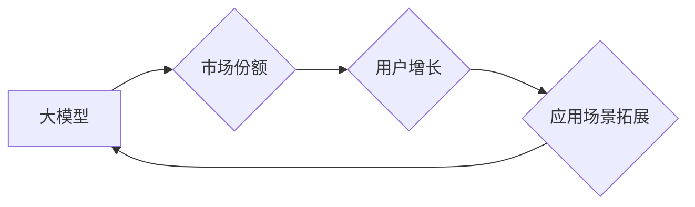

> 大模型，市场份额，用户增长，人工智能，深度学习，模型训练，应用场景

## 1. 背景介绍

近年来，人工智能（AI）技术取得了飞速发展，其中大模型作为AI领域的重要组成部分，展现出强大的学习和推理能力，在自然语言处理、计算机视觉、语音识别等领域取得了突破性进展。大模型的涌现，不仅推动了AI技术的进步，也引发了市场份额和用户增长的激烈竞争。

大模型是指参数规模庞大、训练数据海量的人工智能模型。这些模型通过学习海量数据，能够掌握复杂的知识和模式，从而实现更精准、更智能的应用。例如，GPT-3、LaMDA、BERT等都是著名的代表性大模型，它们在文本生成、对话系统、机器翻译等领域展现出令人惊叹的性能。

大模型的市场份额和用户增长呈现出以下趋势：

* **市场份额集中度不断提高：** 由于大模型的训练成本高昂，技术门槛高，市场份额逐渐集中在少数头部企业手中，例如谷歌、微软、Meta等。
* **用户增长迅速：** 大模型的应用场景不断拓展，用户群体也随之扩大。从个人用户到企业用户，越来越多的用户开始使用大模型提供的服务，例如聊天机器人、智能写作助手、代码生成工具等。
* **应用场景不断丰富：** 大模型的应用场景正在不断拓展，从传统的文本处理、图像识别等领域，到更复杂的科学研究、医疗诊断、金融风险控制等领域，大模型正在发挥越来越重要的作用。

## 2. 核心概念与联系

### 2.1 大模型

大模型是指参数规模庞大、训练数据海量的人工智能模型。其核心特点包括：

* **参数规模：** 大模型的参数数量通常在数十亿甚至数千亿级别，这使得它们能够学习更复杂的知识和模式。
* **训练数据：** 大模型的训练需要海量的数据，通常包含文本、图像、音频等多种类型的数据。
* **计算资源：** 训练大模型需要大量的计算资源，例如高性能GPU和TPU。

### 2.2 市场份额

市场份额是指一家公司或产品在某个市场中的销售额占该市场总销售额的比例。

### 2.3 用户增长

用户增长是指用户数量在一段时间内的增加量。

**Mermaid 流程图**



## 3. 核心算法原理 & 具体操作步骤

### 3.1 算法原理概述

大模型的训练主要基于深度学习算法，其中最常用的算法是Transformer。Transformer是一种基于注意力机制的神经网络架构，能够有效地处理序列数据，例如文本和语音。

Transformer的注意力机制能够学习到输入序列中不同元素之间的关系，从而更好地理解上下文信息。

### 3.2 算法步骤详解

大模型的训练过程可以概括为以下步骤：

1. **数据预处理：** 将原始数据进行清洗、格式化和编码，使其能够被模型理解。
2. **模型构建：** 根据具体的应用场景，选择合适的模型架构，例如Transformer。
3. **模型训练：** 使用训练数据训练模型，调整模型参数，使其能够准确地预测输出。
4. **模型评估：** 使用测试数据评估模型的性能，例如准确率、召回率等。
5. **模型部署：** 将训练好的模型部署到实际应用场景中，例如云平台、边缘设备等。

### 3.3 算法优缺点

**优点：**

* **强大的学习能力：** 大模型能够学习到复杂的知识和模式，实现更精准的预测和推理。
* **广泛的应用场景：** 大模型可以应用于各种领域，例如自然语言处理、计算机视觉、语音识别等。
* **持续的进步：** 随着技术的进步和数据量的增加，大模型的性能将不断提升。

**缺点：**

* **高昂的训练成本：** 训练大模型需要大量的计算资源和时间，成本很高。
* **数据依赖性强：** 大模型的性能取决于训练数据的质量和数量，数据偏差会导致模型性能下降。
* **可解释性差：** 大模型的决策过程复杂，难以解释其背后的逻辑，这可能会导致信任问题。

### 3.4 算法应用领域

大模型的应用领域非常广泛，包括：

* **自然语言处理：** 文本生成、机器翻译、对话系统、问答系统等。
* **计算机视觉：** 图像识别、物体检测、图像分割、视频分析等。
* **语音识别：** 语音转文本、语音合成、语音助手等。
* **科学研究：** 蛋白质结构预测、药物研发、材料科学等。
* **金融服务：** 风险控制、欺诈检测、客户服务等。

## 4. 数学模型和公式 & 详细讲解 & 举例说明

### 4.1 数学模型构建

大模型的训练过程可以看作是一个优化问题，目标是找到模型参数，使得模型在训练数据上的损失函数最小。

损失函数通常是模型预测值与真实值的差值，例如均方误差（MSE）或交叉熵损失（Cross-Entropy Loss）。

### 4.2 公式推导过程

假设模型的输出为 $y$，真实值是 $t$，损失函数为 $L(y,t)$，则模型训练的目标是：

$$
\min_{\theta} \mathcal{L}(\theta) = \frac{1}{N} \sum_{i=1}^{N} L(y_i, t_i)
$$

其中：

* $\theta$ 是模型参数
* $N$ 是训练数据的数量
* $y_i$ 是模型对第 $i$ 个样本的预测值
* $t_i$ 是第 $i$ 个样本的真实值

为了找到最优的模型参数，可以使用梯度下降算法。梯度下降算法通过计算损失函数对模型参数的梯度，不断更新模型参数，使得损失函数逐渐减小。

### 4.3 案例分析与讲解

例如，在文本生成任务中，可以使用Transformer模型进行训练。

训练目标是让模型能够生成与真实文本相似的文本序列。

损失函数可以是交叉熵损失，它衡量模型预测的文本概率分布与真实文本概率分布之间的差异。

通过梯度下降算法，不断更新模型参数，使得模型能够生成更符合真实文本规律的文本序列。

## 5. 项目实践：代码实例和详细解释说明

### 5.1 开发环境搭建

为了开发和训练大模型，需要搭建相应的开发环境。

常用的开发环境包括：

* **操作系统：** Linux 或 macOS
* **编程语言：** Python
* **深度学习框架：** TensorFlow、PyTorch
* **硬件资源：** 高性能GPU或TPU

### 5.2 源代码详细实现

由于大模型的代码实现非常复杂，这里只提供一个简单的示例代码，展示如何使用PyTorch框架构建一个简单的Transformer模型。

```python
import torch
import torch.nn as nn

class Transformer(nn.Module):
    def __init__(self, input_size, hidden_size, num_layers, num_heads):
        super(Transformer, self).__init__()
        self.encoder = nn.TransformerEncoder(nn.TransformerEncoderLayer(d_model=hidden_size, nhead=num_heads), num_layers)
        self.decoder = nn.TransformerDecoder(nn.TransformerDecoderLayer(d_model=hidden_size, nhead=num_heads), num_layers)
        self.linear = nn.Linear(hidden_size, input_size)

    def forward(self, src, tgt, src_mask, tgt_mask):
        src = self.encoder(src, src_mask)
        tgt = self.decoder(tgt, src, tgt_mask)
        output = self.linear(tgt)
        return output
```

### 5.3 代码解读与分析

这个代码示例定义了一个简单的Transformer模型，包含编码器和解码器两个部分。

编码器负责将输入序列编码成隐藏表示，解码器负责根据编码后的表示生成输出序列。

模型的输入和输出都是张量，其中每个元素代表一个词的嵌入向量。

### 5.4 运行结果展示

为了运行这个代码示例，需要准备训练数据和模型参数。

训练完成后，可以使用测试数据评估模型的性能，例如准确率、BLEU分数等。

## 6. 实际应用场景

### 6.1 自然语言处理

大模型在自然语言处理领域有着广泛的应用，例如：

* **文本生成：** 可以生成高质量的文本内容，例如文章、故事、诗歌等。
* **机器翻译：** 可以将文本从一种语言翻译成另一种语言。
* **对话系统：** 可以构建更智能的聊天机器人，能够进行自然流畅的对话。
* **问答系统：** 可以回答用户提出的问题，并提供相关信息。

### 6.2 计算机视觉

大模型在计算机视觉领域也取得了显著的进展，例如：

* **图像识别：** 可以识别图像中的物体、场景和人物。
* **物体检测：** 可以定位图像中物体的边界框。
* **图像分割：** 可以将图像分割成不同的区域。
* **视频分析：** 可以分析视频内容，例如识别动作、跟踪物体等。

### 6.3 语音识别

大模型在语音识别领域也发挥着重要作用，例如：

* **语音转文本：** 可以将语音转换为文本。
* **语音合成：** 可以将文本转换为语音。
* **语音助手：** 可以理解用户的语音指令，并执行相应的操作。

### 6.4 未来应用展望

随着大模型技术的不断发展，其应用场景将更加广泛，例如：

* **科学研究：** 大模型可以帮助科学家进行药物研发、材料科学等方面的研究。
* **医疗诊断：** 大模型可以辅助医生进行疾病诊断和治疗方案制定。
* **金融风险控制：** 大模型可以帮助金融机构识别和控制风险。
* **个性化教育：** 大模型可以根据学生的学习情况提供个性化的学习方案。

## 7. 工具和资源推荐

### 7.1 学习资源推荐

* **书籍：**
    * 《深度学习》
    * 《自然语言处理》
    * 《计算机视觉》
* **在线课程：**
    * Coursera
    * edX
    * Udacity
* **博客和论坛：**
    * TensorFlow Blog
    * PyTorch Blog
    * AI Stack Exchange

### 7.2 开发工具推荐

* **深度学习框架：** TensorFlow、PyTorch
* **编程语言：** Python
* **云平台：** AWS、Azure、Google Cloud

### 7.3 相关论文推荐

* **Attention Is All You Need**
* **BERT: Pre-training of Deep Bidirectional Transformers for Language Understanding**
* **GPT-3: Language Models are Few-Shot Learners**

## 8. 总结：未来发展趋势与挑战

### 8.1 研究成果总结

近年来，大模型技术取得了显著的进展，在自然语言处理、计算机视觉、语音识别等领域取得了突破性进展。大模型的出现，推动了AI技术的进步，也引发了市场份额和用户增长的激烈竞争。

### 8.2 未来发展趋势

未来，大模型技术将朝着以下方向发展：

* **模型规模更大：** 随着计算资源的不断提升，大模型的规模将进一步扩大，从而提升模型的性能。
* **模型训练效率更高：** 研究人员将探索新的训练方法和算法，提高模型训练的效率。
* **模型应用场景更广泛：** 大模型将应用于更多领域，例如科学研究、医疗诊断、金融风险控制等。
* **模型可解释性更强：** 研究人员将致力于提高大模型的可解释性，使其决策过程更加透明。

### 8.3 面临的挑战

大模型技术也面临着一些挑战：

* **训练成本高昂：** 训练大模型需要大量的计算资源和时间，成本很高。
* **数据依赖性强：** 大模型的性能取决于训练