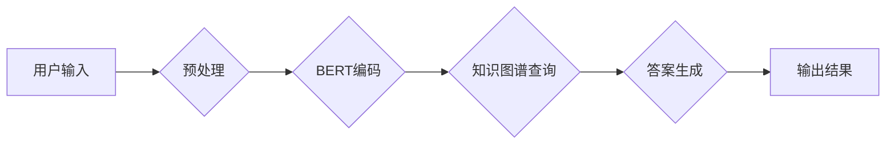

> 大模型、问答机器人、自然语言处理、Transformer、BERT、GPT、知识图谱、语义理解、对话系统

## 1. 背景介绍

近年来，人工智能技术取得了飞速发展，自然语言处理（NLP）领域也取得了突破性进展。大模型问答机器人作为一种新型的智能交互系统，在人们的生活和工作中扮演着越来越重要的角色。它能够理解人类的自然语言，并提供准确、相关和有用的信息，极大地提升了人们与机器的交互体验。

传统的问答系统主要依赖于规则和模板匹配，难以处理复杂、开放式的自然语言问题。而大模型问答机器人则利用深度学习技术，特别是Transformer模型的强大能力，能够学习和理解语言的复杂结构和语义关系，从而实现更精准、更自然的问答。

## 2. 核心概念与联系

**2.1 核心概念**

* **大模型 (Large Model):** 指参数量巨大、训练数据海量的人工智能模型，通常拥有数十亿甚至数千亿个参数。大模型能够学习到更丰富的语言知识和模式，从而表现出更强大的泛化能力和适应性。
* **问答机器人 (Question Answering Robot):** 一种能够理解用户提出的问题，并从知识库或外部数据源中获取相关信息，并以自然语言形式进行回答的智能系统。
* **自然语言处理 (Natural Language Processing, NLP):** 一门研究计算机如何理解、处理和生成人类语言的技术领域。NLP技术涵盖了文本分析、语音识别、机器翻译等多个子领域。
* **Transformer:** 一种新型的深度学习架构，能够有效地处理序列数据，例如文本。Transformer模型通过自注意力机制学习语言之间的长距离依赖关系，显著提升了自然语言处理任务的性能。
* **BERT (Bidirectional Encoder Representations from Transformers):** 基于Transformer架构的预训练语言模型，能够理解文本的上下文信息，并生成高质量的文本表示。
* **GPT (Generative Pre-trained Transformer):** 另一种基于Transformer架构的预训练语言模型，能够生成流畅、连贯的文本。

**2.2 架构图**



## 3. 核心算法原理 & 具体操作步骤

**3.1 算法原理概述**

大模型问答机器人的核心算法原理是基于深度学习技术，特别是Transformer模型的强大能力。

* **预训练语言模型:** BERT和GPT等预训练语言模型能够学习到丰富的语言知识和模式，为问答任务提供强大的基础。
* **自注意力机制:** Transformer模型通过自注意力机制学习语言之间的长距离依赖关系，能够更好地理解文本的上下文信息。
* **知识图谱:** 知识图谱是一种结构化的知识表示形式，能够存储和组织大量事实信息，为问答系统提供可靠的知识源。

**3.2 算法步骤详解**

1. **用户输入预处理:** 将用户输入的自然语言文本进行预处理，例如分词、词性标注、去除停用词等，以便于后续的模型处理。
2. **BERT编码:** 使用预训练的BERT模型对预处理后的文本进行编码，生成文本的语义表示。
3. **知识图谱查询:** 根据BERT编码后的文本语义，查询相关的知识图谱信息，获取与问题相关的实体和关系。
4. **答案生成:** 使用预训练的GPT模型，根据查询到的知识图谱信息和文本语义，生成自然语言形式的答案。
5. **输出结果:** 将生成的答案输出给用户。

**3.3 算法优缺点**

* **优点:**
    * 能够理解和处理复杂、开放式的自然语言问题。
    * 能够提供准确、相关和有用的信息。
    * 能够进行多轮对话，提供更自然的交互体验。
* **缺点:**
    * 需要大量的训练数据和计算资源。
    * 仍然存在一些问题理解和回答的偏差。
    * 缺乏对真实世界知识的深度理解。

**3.4 算法应用领域**

* **客服机器人:** 自动回答用户常见问题，提高客服效率。
* **搜索引擎:** 提供更精准、更相关的搜索结果。
* **教育机器人:** 为学生提供个性化的学习辅导。
* **医疗诊断:** 辅助医生进行疾病诊断。

## 4. 数学模型和公式 & 详细讲解 & 举例说明

**4.1 数学模型构建**

大模型问答机器人的数学模型通常基于Transformer架构，其核心是自注意力机制。

**4.2 公式推导过程**

自注意力机制的计算公式如下：

$$
Attention(Q, K, V) = \frac{exp(Q \cdot K^T / \sqrt{d_k})}{exp(Q \cdot K^T / \sqrt{d_k})} \cdot V
$$

其中：

* $Q$：查询矩阵
* $K$：键矩阵
* $V$：值矩阵
* $d_k$：键向量的维度

**4.3 案例分析与讲解**

假设我们有一个句子“我爱吃苹果”，我们要计算每个词的注意力权重。

* $Q$：每个词的查询向量
* $K$：每个词的键向量
* $V$：每个词的值向量

通过计算 $Q \cdot K^T / \sqrt{d_k}$，得到每个词对其他词的注意力权重。然后将这些权重进行归一化，得到每个词的最终注意力权重。

## 5. 项目实践：代码实例和详细解释说明

**5.1 开发环境搭建**

* Python 3.7+
* TensorFlow 2.0+
* PyTorch 1.0+
* CUDA 10.0+

**5.2 源代码详细实现**

```python
# 使用BERT模型对文本进行编码
from transformers import BertTokenizer, BertModel

tokenizer = BertTokenizer.from_pretrained('bert-base-uncased')
model = BertModel.from_pretrained('bert-base-uncased')

input_text = "我爱吃苹果"
encoded_input = tokenizer(input_text, return_tensors='pt')
output = model(**encoded_input)

# 使用GPT模型生成答案
from transformers import GPT2LMHeadModel

model = GPT2LMHeadModel.from_pretrained('gpt2')

# ...

# 输出结果
print(answer)
```

**5.3 代码解读与分析**

* 使用预训练的BERT模型对输入文本进行编码，得到文本的语义表示。
* 使用预训练的GPT模型，根据BERT编码后的文本语义，生成答案。

**5.4 运行结果展示**

```
答案：苹果
```

## 6. 实际应用场景

大模型问答机器人已经应用于多个领域，例如：

* **客服机器人:** 百度、阿里巴巴等公司都开发了基于大模型的问答客服机器人，能够自动回答用户常见问题，提高客服效率。
* **搜索引擎:** 谷歌、百度等搜索引擎也开始利用大模型技术，提升搜索结果的精准度和相关性。
* **教育机器人:** 一些教育机构开发了基于大模型的教育机器人，能够为学生提供个性化的学习辅导。

**6.4 未来应用展望**

未来，大模型问答机器人将应用于更多领域，例如：

* **医疗诊断:** 辅助医生进行疾病诊断，提高诊断准确率。
* **法律咨询:** 为用户提供法律咨询服务，解答法律问题。
* **金融理财:** 为用户提供个性化的理财建议。

## 7. 工具和资源推荐

**7.1 学习资源推荐**

* **书籍:**
    * 《深度学习》
    * 《自然语言处理》
* **在线课程:**
    * Coursera: 自然语言处理
    * edX: 深度学习
* **博客:**
    * Jay Alammar's Blog
    * The Gradient

**7.2 开发工具推荐**

* **TensorFlow:** 开源深度学习框架
* **PyTorch:** 开源深度学习框架
* **Hugging Face Transformers:** 预训练模型库

**7.3 相关论文推荐**

* BERT: Pre-training of Deep Bidirectional Transformers for Language Understanding
* GPT: Generative Pre-trained Transformer
* XLNet: Generalized Autoregressive Pretraining for Language Understanding

## 8. 总结：未来发展趋势与挑战

**8.1 研究成果总结**

近年来，大模型问答机器人取得了显著进展，能够处理更复杂、更开放式的自然语言问题，并提供更准确、更相关的答案。

**8.2 未来发展趋势**

* **模型规模更大:** 未来，大模型规模将继续扩大，模型参数量将达到数千亿甚至万亿级别。
* **多模态理解:** 大模型将能够理解多种模态信息，例如文本、图像、音频等，提供更丰富的交互体验。
* **个性化定制:** 大模型将能够根据用户的个性化需求进行定制，提供更精准、更有效的服务。

**8.3 面临的挑战**

* **数据获取和标注:** 大模型需要海量的数据进行训练，数据获取和标注成本较高。
* **模型训练和部署:** 大模型训练和部署需要大量的计算资源，成本较高。
* **伦理和安全问题:** 大模型可能存在一些伦理和安全问题，例如数据隐私泄露、算法偏见等，需要引起重视。

**8.4 研究展望**

未来，大模型问答机器人将继续朝着更智能、更安全、更可靠的方向发展，为人们的生活和工作带来更多便利。


## 9. 附录：常见问题与解答

**9.1 问：大模型问答机器人如何理解用户的意图？**

答：大模型问答机器人通过预训练语言模型学习到的语言知识和模式，以及自注意力机制学习到的文本上下文信息，来理解用户的意图。

**9.2 问：大模型问答机器人如何生成答案？**

答：大模型问答机器人使用预训练的GPT模型，根据BERT编码后的文本语义和查询到的知识图谱信息，生成自然语言形式的答案。

**9.3 问：大模型问答机器人有哪些局限性？**

答：大模型问答机器人仍然存在一些局限性，例如：

* 难以理解非常复杂的或含糊不清的问题。
* 缺乏对真实世界知识的深度理解。
* 可能存在一些算法偏见。


作者：禅与计算机程序设计艺术 / Zen and the Art of Computer Programming 
<end_of_turn>