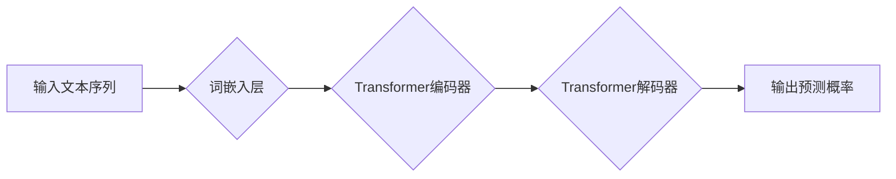

> 大规模语言模型，Transformer，深度学习，自然语言处理，模型训练，参数优化，梯度下降

## 1. 背景介绍

近年来，深度学习技术取得了飞速发展，特别是Transformer模型的出现，为自然语言处理（NLP）领域带来了革命性的变革。大规模语言模型（LLM）作为深度学习在NLP领域的代表，凭借其强大的文本生成、理解和翻译能力，在各个领域得到了广泛应用，例如聊天机器人、机器翻译、文本摘要、代码生成等。

然而，训练大规模语言模型也面临着巨大的挑战，包括海量数据需求、高昂的计算成本、模型参数规模庞大以及训练效率低下等。本文将从理论到实践，深入探讨大规模语言模型的训练过程，涵盖核心概念、算法原理、数学模型、代码实现以及实际应用场景等方面，旨在为读者提供一个全面的理解。

## 2. 核心概念与联系

大规模语言模型的核心概念包括：

* **Transformer:**  一种基于注意力机制的深度学习架构，能够有效捕捉文本序列中的长距离依赖关系。
* **自回归语言模型:**  一种预测下一个词的概率分布的模型，通过训练大量的文本数据，学习语言的语法和语义规律。
* **词嵌入:** 将单词映射到低维向量空间，使得单词之间的语义关系能够被更好地表示。
* **注意力机制:**  一种机制，能够学习文本序列中不同部分之间的重要关系，并根据这些关系调整模型的输出。

**Mermaid 流程图:**



## 3. 核心算法原理 & 具体操作步骤

### 3.1  算法原理概述

大规模语言模型的训练主要基于**自回归语言模型**和**Transformer**架构。

* **自回归语言模型:**  通过训练模型预测下一个词的概率分布，从而学习语言的语法和语义规律。
* **Transformer:**  利用注意力机制有效捕捉文本序列中的长距离依赖关系，提高模型的表达能力。

训练过程可以概括为以下步骤：

1. **数据预处理:** 将原始文本数据进行清洗、分词、词嵌入等预处理操作。
2. **模型训练:** 使用训练数据训练模型，通过反向传播算法更新模型参数，使得模型能够更好地预测下一个词的概率分布。
3. **模型评估:** 使用验证集评估模型的性能，并根据评估结果调整模型参数和训练策略。
4. **模型部署:** 将训练好的模型部署到实际应用场景中，用于文本生成、理解、翻译等任务。

### 3.2  算法步骤详解

1. **数据预处理:**

* **清洗:** 去除文本数据中的停用词、标点符号等无用信息。
* **分词:** 将文本数据分割成单词或子词。
* **词嵌入:** 将单词映射到低维向量空间，例如使用Word2Vec或GloVe等词嵌入模型。

2. **模型训练:**

* **损失函数:** 使用交叉熵损失函数衡量模型预测结果与真实值的差距。
* **优化算法:** 使用梯度下降算法或其变种（例如Adam、RMSprop等）更新模型参数，使得损失函数最小化。
* **批处理:** 将训练数据分成多个小批次，每次训练一个批次，提高训练效率。

3. **模型评估:**

* **指标:** 使用准确率、困惑度等指标评估模型的性能。
* **验证集:** 使用验证集评估模型的泛化能力，避免过拟合。

4. **模型部署:**

* **API接口:** 将模型部署为API接口，方便其他应用程序调用。
* **云平台:** 将模型部署到云平台，实现大规模的文本处理能力。

### 3.3  算法优缺点

**优点:**

* **强大的文本理解和生成能力:**  能够处理复杂的任务，例如文本摘要、机器翻译、对话系统等。
* **可迁移性强:**  预训练模型可以迁移到不同的下游任务，降低训练成本和时间。
* **不断发展:**  随着技术的进步，LLM模型的性能和应用场景不断扩展。

**缺点:**

* **训练成本高:**  需要大量的计算资源和训练数据。
* **模型参数规模庞大:**  难以部署到资源有限的设备上。
* **存在偏差和偏见:**  训练数据可能包含社会偏见，导致模型输出存在偏差。

### 3.4  算法应用领域

* **自然语言处理:** 文本分类、情感分析、问答系统、机器翻译等。
* **人工智能:** 聊天机器人、虚拟助手、智能客服等。
* **代码生成:** 自动生成代码、代码补全等。
* **创意写作:**  诗歌、小说、剧本等创作辅助。

## 4. 数学模型和公式 & 详细讲解 & 举例说明

### 4.1  数学模型构建

大规模语言模型通常基于**自回归语言模型**和**Transformer**架构。

* **自回归语言模型:**  假设下一个词的概率分布取决于前面的词。

* **Transformer:**  利用注意力机制捕捉文本序列中的长距离依赖关系。

### 4.2  公式推导过程

* **交叉熵损失函数:**  衡量模型预测结果与真实值的差距。

$$
Loss = -\sum_{i=1}^{N} y_i \log p(y_i|x_{1:i-1})
$$

其中：

* $N$ 是文本序列的长度。
* $y_i$ 是第 $i$ 个词的真实值。
* $p(y_i|x_{1:i-1})$ 是模型预测第 $i$ 个词的概率分布。

* **注意力机制:**  计算每个词与其他词之间的相关性，并根据相关性调整模型的输出。

$$
Attention(Q,K,V) = softmax(\frac{QK^T}{\sqrt{d_k}})V
$$

其中：

* $Q$, $K$, $V$ 分别是查询矩阵、键矩阵和值矩阵。
* $d_k$ 是键向量的维度。

### 4.3  案例分析与讲解

例如，在机器翻译任务中，可以使用Transformer模型将源语言文本翻译成目标语言文本。模型会首先将源语言文本编码成向量表示，然后利用注意力机制捕捉源语言文本中的长距离依赖关系，最后解码生成目标语言文本。

## 5. 项目实践：代码实例和详细解释说明

### 5.1  开发环境搭建

* **操作系统:**  Linux 或 macOS
* **编程语言:**  Python
* **深度学习框架:**  TensorFlow 或 PyTorch
* **其他依赖库:**  numpy, pandas, matplotlib等

### 5.2  源代码详细实现

```python
# 使用 TensorFlow 实现一个简单的 Transformer 模型

import tensorflow as tf

# 定义 Transformer 的编码器层
class EncoderLayer(tf.keras.layers.Layer):
    def __init__(self, d_model, num_heads, dff):
        super(EncoderLayer, self).__init__()
        self.mha = tf.keras.layers.MultiHeadAttention(num_heads=num_heads, key_dim=d_model)
        self.ffn = tf.keras.layers.Dense(dff, activation='relu')

    def call(self, inputs, mask):
        attn_output = self.mha(inputs, inputs, inputs, mask=mask)
        ffn_output = self.ffn(attn_output)
        return ffn_output

# 定义 Transformer 的解码器层
class DecoderLayer(tf.keras.layers.Layer):
    def __init__(self, d_model, num_heads, dff):
        super(DecoderLayer, self).__init__()
        self.mha1 = tf.keras.layers.MultiHeadAttention(num_heads=num_heads, key_dim=d_model)
        self.mha2 = tf.keras.layers.MultiHeadAttention(num_heads=num_heads, key_dim=d_model)
        self.ffn = tf.keras.layers.Dense(dff, activation='relu')

    def call(self, inputs, encoder_outputs, mask):
        attn1_output = self.mha1(inputs, inputs, inputs, mask=mask)
        attn2_output = self.mha2(attn1_output, encoder_outputs, encoder_outputs, mask=mask)
        ffn_output = self.ffn(attn2_output)
        return ffn_output

# 定义 Transformer 模型
class Transformer(tf.keras.Model):
    def __init__(self, vocab_size, d_model, num_heads, dff, num_layers):
        super(Transformer, self).__init__()
        self.embedding = tf.keras.layers.Embedding(vocab_size, d_model)
        self.encoder = tf.keras.Sequential([
            EncoderLayer(d_model, num_heads, dff) for _ in range(num_layers)
        ])
        self.decoder = tf.keras.Sequential([
            DecoderLayer(d_model, num_heads, dff) for _ in range(num_layers)
        ])
        self.fc_out = tf.keras.layers.Dense(vocab_size)

    def call(self, inputs, encoder_mask, decoder_mask):
        embeddings = self.embedding(inputs)
        encoder_outputs = self.encoder(embeddings, encoder_mask)
        decoder_outputs = self.decoder(embeddings, encoder_outputs, decoder_mask)
        outputs = self.fc_out(decoder_outputs)
        return outputs

```

### 5.3  代码解读与分析

* **模型结构:**  代码实现了一个简单的 Transformer 模型，包含编码器、解码器和输出层。
* **注意力机制:**  模型中使用了 MultiHeadAttention 机制，能够捕捉文本序列中的长距离依赖关系。
* **参数配置:**  模型参数可以根据实际任务进行调整，例如模型层数、隐藏层维度等。

### 5.4  运行结果展示

训练完成后，可以使用模型对新的文本进行预测，例如翻译文本、生成文本等。

## 6. 实际应用场景

### 6.1  聊天机器人

大规模语言模型可以用于构建更智能、更自然的聊天机器人，能够理解用户的意图，并提供更准确、更相关的回复。

### 6.2  机器翻译

大规模语言模型可以用于实现更高质量的机器翻译，能够更好地捕捉语言的语义和文化差异。

### 6.3  文本摘要

大规模语言模型可以用于自动生成文本摘要，能够提取文本的关键信息，并生成简洁、准确的摘要。

### 6.4  未来应用展望

大规模语言模型的应用场景还在不断扩展，未来可能应用于：

* **代码生成:** 自动生成代码，提高开发效率。
* **创意写作:** 辅助创作诗歌、小说、剧本等。
* **个性化教育:** 提供个性化的学习内容和辅导。
* **医疗诊断:** 辅助医生进行疾病诊断和治疗方案制定。

## 7. 工具和资源推荐

### 7.1  学习资源推荐

* **书籍:**
    * 《深度学习》
    * 《自然语言处理》
    * 《Transformer 详解》
* **在线课程:**
    * Coursera: 深度学习
    * Udacity: 自然语言处理
    * fast.ai: 深度学习

### 7.2  开发工具推荐

* **深度学习框架:** TensorFlow, PyTorch
* **文本处理库:** NLTK, spaCy
* **云平台:** Google Cloud Platform, Amazon Web Services, Microsoft Azure

### 7.3  相关论文推荐

* 《Attention Is All You Need》
* 《BERT: Pre-training of Deep Bidirectional Transformers for Language Understanding》
* 《GPT-3: Language Models are Few-Shot Learners》

## 8. 总结：未来发展趋势与挑战

### 8.1  研究成果总结

大规模语言模型在自然语言处理领域取得了显著