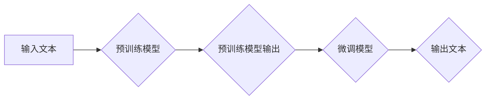

> 大语言模型、Transformer、深度学习、自然语言处理、预训练、微调、训练挑战

## 1. 背景介绍

近年来，深度学习技术取得了飞速发展，特别是Transformer模型的出现，为自然语言处理（NLP）领域带来了革命性的变革。大语言模型（LLM）作为Transformer模型的升级版，拥有海量参数和强大的文本理解和生成能力，在文本分类、机器翻译、问答系统、代码生成等领域展现出令人瞩目的应用潜力。

然而，LLM的训练过程也面临着诸多挑战，包括数据规模、计算资源、训练时间、模型复杂度、可解释性等。本文将深入探讨LLM的原理、训练方法以及面临的挑战，并展望其未来发展趋势。

## 2. 核心概念与联系

大语言模型的核心概念包括：

* **Transformer模型:** Transformer是一种基于注意力机制的深度神经网络架构，能够有效处理长距离依赖关系，是LLM的基础。
* **预训练:** 预训练是指在大量文本数据上训练模型，学习语言的通用表示，为后续特定任务的微调提供基础。
* **微调:** 微调是指在预训练模型的基础上，使用特定任务的数据进行训练，进一步提升模型在该任务上的性能。
* **文本生成:** 文本生成是指根据输入文本或提示，生成新的文本内容。

**Mermaid 流程图:**



## 3. 核心算法原理 & 具体操作步骤

### 3.1  算法原理概述

LLM的核心算法是Transformer模型，其主要特点是：

* **注意力机制:** 注意力机制能够学习文本中不同词语之间的关系，并赋予重要词语更高的权重，从而更好地理解上下文信息。
* **多头注意力:** 多头注意力机制使用多个注意力头，分别关注不同方面的文本信息，并将其融合起来，提高模型的表达能力。
* **编码器-解码器结构:** Transformer模型采用编码器-解码器结构，编码器负责将输入文本编码成语义表示，解码器则根据编码结果生成输出文本。

### 3.2  算法步骤详解

LLM的训练过程可以概括为以下步骤：

1. **数据预处理:** 将原始文本数据进行清洗、分词、标记等预处理操作，使其适合模型训练。
2. **模型初始化:** 初始化Transformer模型的参数，通常使用随机初始化或预训练模型的权重。
3. **前向传播:** 将预处理后的文本数据输入模型，计算模型输出的预测结果。
4. **损失函数计算:** 计算模型预测结果与真实标签之间的差异，使用损失函数衡量模型的训练误差。
5. **反向传播:** 使用梯度下降算法，根据损失函数的梯度更新模型参数，降低模型的训练误差。
6. **模型评估:** 在验证集上评估模型的性能，并根据评估结果调整训练参数。
7. **模型保存:** 将训练好的模型保存下来，以便后续使用。

### 3.3  算法优缺点

**优点:**

* 强大的文本理解和生成能力
* 能够处理长距离依赖关系
* 可迁移性强，可用于多种NLP任务

**缺点:**

* 训练成本高，需要大量数据和计算资源
* 模型复杂度高，难以解释
* 存在潜在的偏差和错误

### 3.4  算法应用领域

LLM在以下领域具有广泛的应用前景：

* 文本分类、情感分析
* 机器翻译、跨语言对话
* 问答系统、知识图谱构建
* 代码生成、软件测试
* 文本摘要、创意写作

## 4. 数学模型和公式 & 详细讲解 & 举例说明

### 4.1  数学模型构建

Transformer模型的核心是注意力机制，其数学模型可以表示为：

$$
Attention(Q, K, V) = softmax(\frac{QK^T}{\sqrt{d_k}})V
$$

其中：

* $Q$：查询矩阵
* $K$：键矩阵
* $V$：值矩阵
* $d_k$：键向量的维度
* $softmax$：softmax函数

### 4.2  公式推导过程

注意力机制的目的是计算每个词语与其他词语之间的相关性，并根据相关性赋予不同的权重。

1. 计算查询矩阵 $Q$ 与键矩阵 $K$ 的点积，得到一个得分矩阵。
2. 对得分矩阵进行归一化，使用softmax函数将得分转换为概率分布。
3. 将概率分布与值矩阵 $V$ 进行加权求和，得到每个词语的最终表示。

### 4.3  案例分析与讲解

例如，在翻译句子“The cat sat on the mat”时，注意力机制可以计算每个词语与其他词语之间的相关性，例如“cat”与“sat”之间的相关性较高，因为它们描述了同一个动作。

## 5. 项目实践：代码实例和详细解释说明

### 5.1  开发环境搭建

LLM的开发环境通常需要以下软件：

* Python 3.x
* PyTorch 或 TensorFlow
* CUDA 和 cuDNN

### 5.2  源代码详细实现

以下是一个使用PyTorch实现Transformer模型的简单代码示例：

```python
import torch
import torch.nn as nn

class Transformer(nn.Module):
    def __init__(self, vocab_size, embedding_dim, num_heads, num_layers):
        super(Transformer, self).__init__()
        self.embedding = nn.Embedding(vocab_size, embedding_dim)
        self.transformer_layers = nn.ModuleList([
            nn.TransformerEncoderLayer(embedding_dim, num_heads)
            for _ in range(num_layers)
        ])
        self.linear = nn.Linear(embedding_dim, vocab_size)

    def forward(self, x):
        x = self.embedding(x)
        for layer in self.transformer_layers:
            x = layer(x)
        x = self.linear(x)
        return x
```

### 5.3  代码解读与分析

该代码定义了一个Transformer模型，包含嵌入层、Transformer编码器层和线性输出层。

* 嵌入层将词语转换为向量表示。
* Transformer编码器层使用多头注意力机制和前馈神经网络，学习文本的语义表示。
* 线性输出层将语义表示转换为预测概率分布。

### 5.4  运行结果展示

训练好的LLM模型可以用于各种NLP任务，例如文本分类、机器翻译等。

## 6. 实际应用场景

LLM在实际应用场景中展现出强大的潜力，例如：

* **聊天机器人:** LLMs可以用于构建更智能、更自然的聊天机器人，能够理解用户意图并提供更精准的回复。
* **文本摘要:** LLMs可以自动生成文本摘要，帮助用户快速了解文章内容。
* **代码生成:** LLMs可以根据自然语言描述生成代码，提高开发效率。

### 6.4  未来应用展望

LLM的未来应用前景广阔，例如：

* **个性化教育:** LLMs可以根据学生的学习进度和需求提供个性化的学习内容和辅导。
* **医疗诊断:** LLMs可以辅助医生进行疾病诊断，提高诊断准确率。
* **科学研究:** LLMs可以帮助科学家分析大规模数据，发现新的科学规律。

## 7. 工具和资源推荐

### 7.1  学习资源推荐

* **书籍:**
    * 《深度学习》
    * 《自然语言处理》
* **在线课程:**
    * Coursera: 自然语言处理
    * Udacity: 深度学习

### 7.2  开发工具推荐

* **PyTorch:** 深度学习框架
* **TensorFlow:** 深度学习框架
* **Hugging Face Transformers:** 预训练模型库

### 7.3  相关论文推荐

* 《Attention Is All You Need》
* 《BERT: Pre-training of Deep Bidirectional Transformers for Language Understanding》
* 《GPT-3: Language Models are Few-Shot Learners》

## 8. 总结：未来发展趋势与挑战

### 8.1  研究成果总结

近年来，LLM取得了显著的进展，在文本理解和生成方面展现出强大的能力。

### 8.2  未来发展趋势

LLM的未来发展趋势包括：

* 模型规模的进一步扩大
* 训练效率的提升
* 可解释性和安全性方面的研究
* 跨模态LLM的开发

### 8.3  面临的挑战

LLM还面临着一些挑战，例如：

* 数据规模和质量
* 计算资源的限制
* 模型复杂度和可解释性
* 潜在的偏差和错误

### 8.4  研究展望

未来，LLM的研究将继续朝着更强大、更安全、更可解释的方向发展，并将在更多领域发挥重要作用。

## 9. 附录：常见问题与解答

**常见问题:**

* LLMs的训练需要多少数据？
* LLMs的训练需要多少计算资源？
* LLMs的训练时间有多长？

**解答:**

* LLMs的训练需要海量文本数据，通常需要数十亿甚至数千亿个词语。
* LLMs的训练需要大量的计算资源，通常需要数百甚至数千个GPU。
* LLMs的训练时间可能需要数周甚至数月。


作者：禅与计算机程序设计艺术 / Zen and the Art of Computer Programming 
<end_of_turn>