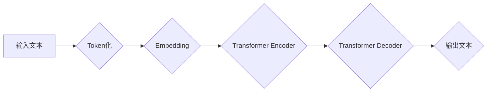

> 大语言模型、Transformer、深度学习、自然语言处理、预训练、微调、参数规模、训练方法

## 1. 背景介绍

近年来，深度学习技术取得了飞速发展，特别是大语言模型（Large Language Models，LLMs）的出现，为自然语言处理（Natural Language Processing，NLP）领域带来了革命性的变革。大语言模型是指参数规模庞大、训练数据海量的人工智能模型，能够理解和生成人类语言，并完成各种复杂的任务，例如文本生成、翻译、问答、代码生成等。

早期的大语言模型主要基于循环神经网络（RNN）架构，但RNN存在梯度消失和训练效率低等问题。随着Transformer架构的提出，大语言模型取得了显著的突破。Transformer模型利用注意力机制，能够有效捕捉文本中的长距离依赖关系，并具有并行训练的优势，显著提高了训练效率和模型性能。

随着模型规模的不断扩大，大语言模型的性能也在不断提升。例如，GPT-3、BERT、LaMDA等模型在各种NLP任务上都取得了state-of-the-art的成绩。然而，训练大型语言模型也面临着巨大的挑战，包括数据获取、计算资源、模型训练时间等。

## 2. 核心概念与联系

大语言模型的核心概念包括：

* **Transformer架构:** Transformer是一种基于注意力机制的神经网络架构，能够有效捕捉文本中的长距离依赖关系。
* **注意力机制:** 注意力机制是一种机制，能够让模型关注输入序列中最重要的部分，从而提高模型的理解能力。
* **预训练:** 预训练是指在大量文本数据上训练模型，使其学习到语言的通用知识和表示。
* **微调:** 微调是指在特定任务数据上对预训练模型进行进一步训练，使其能够完成特定任务。

**Mermaid 流程图:**



## 3. 核心算法原理 & 具体操作步骤

### 3.1  算法原理概述

Transformer模型的核心是其独特的架构和注意力机制。Transformer模型由编码器和解码器两部分组成。编码器负责将输入文本转换为隐藏表示，解码器则根据隐藏表示生成输出文本。

Transformer模型中，注意力机制被广泛应用于编码器和解码器中。注意力机制能够让模型关注输入序列中最重要的部分，从而提高模型的理解能力。

### 3.2  算法步骤详解

1. **Token化:** 将输入文本分割成一个个独立的单词或子词，称为token。
2. **Embedding:** 将每个token映射到一个低维向量空间中，称为embedding。
3. **编码器:** 将每个token的embedding输入到编码器中，编码器通过多层Transformer模块进行处理，最终将每个token的embedding转换为隐藏表示。
4. **解码器:** 将隐藏表示输入到解码器中，解码器通过多层Transformer模块进行处理，并生成输出文本。

### 3.3  算法优缺点

**优点:**

* **并行训练:** Transformer模型的注意力机制使得模型能够并行训练，显著提高了训练效率。
* **长距离依赖关系:** Transformer模型能够有效捕捉文本中的长距离依赖关系，提高了模型的理解能力。
* **可扩展性:** Transformer模型的架构具有良好的可扩展性，可以轻松训练更大的模型。

**缺点:**

* **计算资源:** 训练大型Transformer模型需要大量的计算资源。
* **训练时间:** 训练大型Transformer模型需要很长的训练时间。
* **数据需求:** 训练大型Transformer模型需要海量的训练数据。

### 3.4  算法应用领域

Transformer模型在自然语言处理领域有着广泛的应用，例如：

* **文本生成:** 文本摘要、机器翻译、对话系统等。
* **文本分类:** 情感分析、主题分类、垃圾邮件过滤等。
* **问答系统:** 基于知识图谱的问答系统、对话式问答系统等。
* **代码生成:** 代码补全、代码生成等。

## 4. 数学模型和公式 & 详细讲解 & 举例说明

### 4.1  数学模型构建

Transformer模型的数学模型主要基于线性变换、激活函数和注意力机制。

* **线性变换:** 用于将输入数据映射到不同的维度空间。
* **激活函数:** 用于引入非线性，提高模型的表达能力。常用的激活函数包括ReLU、Sigmoid、Tanh等。
* **注意力机制:** 用于计算输入序列中不同元素之间的相关性，并根据相关性调整每个元素的权重。

### 4.2  公式推导过程

注意力机制的核心公式是：

$$
Attention(Q, K, V) = softmax(\frac{QK^T}{\sqrt{d_k}})V
$$

其中：

* $Q$：查询矩阵
* $K$：键矩阵
* $V$：值矩阵
* $d_k$：键向量的维度
* $softmax$：softmax函数

### 4.3  案例分析与讲解

假设我们有一个句子“The cat sat on the mat”，我们想要计算每个词语对其他词语的注意力权重。

1. 将句子中的每个词语转换为词向量，形成查询矩阵 $Q$、键矩阵 $K$ 和值矩阵 $V$。
2. 计算 $QK^T$，得到每个词语对其他词语的相似度得分。
3. 对相似度得分进行softmax归一化，得到每个词语对其他词语的注意力权重。

通过注意力权重，模型能够更好地理解句子中的语义关系，例如“cat”与“sat”之间的关系，以及“sat”与“mat”之间的关系。

## 5. 项目实践：代码实例和详细解释说明

### 5.1  开发环境搭建

* Python 3.7+
* PyTorch 1.7+
* CUDA 10.2+

### 5.2  源代码详细实现

```python
import torch
import torch.nn as nn

class Transformer(nn.Module):
    def __init__(self, vocab_size, embedding_dim, num_heads, num_layers):
        super(Transformer, self).__init__()
        self.embedding = nn.Embedding(vocab_size, embedding_dim)
        self.transformer_layers = nn.ModuleList([
            nn.TransformerEncoderLayer(embedding_dim, num_heads)
            for _ in range(num_layers)
        ])
        self.linear = nn.Linear(embedding_dim, vocab_size)

    def forward(self, x):
        x = self.embedding(x)
        x = self.transformer_layers(x)
        x = self.linear(x)
        return x
```

### 5.3  代码解读与分析

* `__init__` 方法：初始化模型参数，包括词嵌入层、Transformer编码器层和输出层。
* `forward` 方法：定义模型的正向传播过程，将输入序列转换为输出序列。

### 5.4  运行结果展示

训练完成后，可以使用模型对新的文本进行预测，例如：

```python
model.eval()
input_text = "The dog barked."
input_tokens = tokenizer.encode(input_text)
output_tokens = model(input_tokens)
output_text = tokenizer.decode(output_tokens)
print(output_text)
```

## 6. 实际应用场景

大语言模型在各个领域都有着广泛的应用，例如：

* **搜索引擎:** 提升搜索结果的准确性和相关性。
* **聊天机器人:** 开发更智能、更自然的对话机器人。
* **机器翻译:** 实现更高质量的机器翻译。
* **文本摘要:** 自动生成文本摘要，提高信息获取效率。

### 6.4  未来应用展望

随着大语言模型的不断发展，未来将有更多新的应用场景出现，例如：

* **个性化教育:** 根据学生的学习情况提供个性化的学习内容和辅导。
* **医疗诊断:** 辅助医生进行疾病诊断和治疗方案制定。
* **法律服务:** 自动生成法律文件和提供法律咨询。

## 7. 工具和资源推荐

### 7.1  学习资源推荐

* **书籍:**
    * 《深度学习》
    * 《自然语言处理》
    * 《Transformer模型详解》
* **在线课程:**
    * Coursera: 深度学习
    * Udacity: 自然语言处理
    * fast.ai: 深度学习

### 7.2  开发工具推荐

* **PyTorch:** 深度学习框架
* **TensorFlow:** 深度学习框架
* **HuggingFace Transformers:** 预训练模型库

### 7.3  相关论文推荐

* 《Attention Is All You Need》
* 《BERT: Pre-training of Deep Bidirectional Transformers for Language Understanding》
* 《GPT-3: Language Models are Few-Shot Learners》

## 8. 总结：未来发展趋势与挑战

### 8.1  研究成果总结

近年来，大语言模型取得了显著的进展，在各种NLP任务上都取得了state-of-the-art的成绩。Transformer模型的提出，以及预训练和微调技术的应用，推动了大语言模型的发展。

### 8.2  未来发展趋势

* **模型规模:** 模型规模将继续扩大，训练更大的模型，以提高模型性能。
* **数据质量:** 数据质量将更加重要，需要收集和清洗更高质量的数据，以训练更准确的模型。
* **训练效率:** 训练效率将得到提高，例如通过模型并行、分布式训练等技术。
* **应用场景:** 大语言模型的应用场景将更加广泛，例如在教育、医疗、法律等领域。

### 8.3  面临的挑战

* **计算资源:** 训练大型模型需要大量的计算资源，这对于资源有限的机构来说是一个挑战。
* **数据安全:** 大语言模型需要训练海量数据，数据安全是一个重要的考虑因素。
* **伦理问题:** 大语言模型可能被用于生成虚假信息、进行恶意攻击等，需要关注其伦理问题。

### 8.4  研究展望

未来，大语言模型的研究将更加注重模型的可解释性、鲁棒性和安全性。同时，也将探索新的训练方法和应用场景，以更好地服务于人类社会。

## 9. 附录：常见问题与解答

* **Q: 如何训练一个大语言模型？**

A: 训练一个大语言模型需要大量的计算资源、数据和时间。通常需要使用分布式训练框架，并进行预训练和微调。

* **Q: 如何评估大语言模型的性能？**

A: 大语言模型的性能可以通过各种指标进行评估，例如准确率、BLEU分数、ROUGE分数等。

* **Q: 大语言模型有哪些伦理问题？**

A: 大语言模型可能被用于生成虚假信息、进行恶意攻击等，需要关注其伦理问题，并制定相应的规范和制度。


作者：禅与计算机程序设计艺术 / Zen and the Art of Computer Programming 
<end_of_turn>