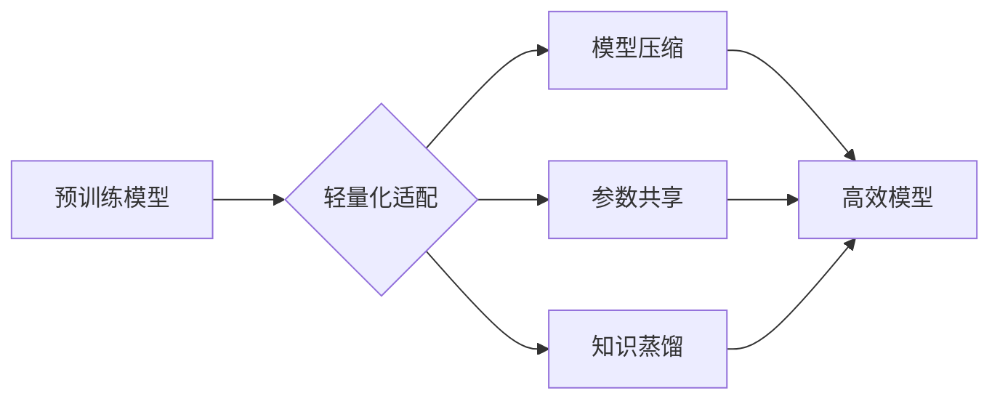

> 大语言模型，Transformer，轻量化，适配，文本生成，自然语言处理

## 1. 背景介绍

近年来，大语言模型（Large Language Models，LLMs）在自然语言处理（NLP）领域取得了显著的突破，展现出强大的文本生成、翻译、问答和代码生成能力。这些模型通常基于Transformer架构，训练于海量文本数据上，拥有数十亿甚至数千亿的参数。然而，由于其庞大的模型规模和高昂的计算成本，LLMs在实际应用中面临着部署和效率方面的挑战。

轻量化适配技术应运而生，旨在通过降低模型规模、优化模型结构或采用高效的训练方法，使LLMs能够在资源有限的设备上高效运行，并针对特定任务进行定制化适配。

## 2. 核心概念与联系

**2.1 大语言模型 (LLMs)**

大语言模型是指参数量巨大、训练数据海量的人工智能模型，能够理解和生成人类语言。它们通常基于Transformer架构，并通过大量的文本数据进行预训练，学习语言的语法、语义和上下文关系。

**2.2 Transformer 架构**

Transformer是一种基于注意力机制的神经网络架构，能够有效处理序列数据，例如文本。它由编码器和解码器两部分组成，编码器将输入文本序列编码成固定长度的向量表示，解码器则根据编码后的向量生成输出文本序列。

**2.3 轻量化适配**

轻量化适配是指通过降低模型规模、优化模型结构或采用高效的训练方法，使大语言模型能够在资源有限的设备上高效运行，并针对特定任务进行定制化适配。

**2.4 适配方法**

常见的轻量化适配方法包括：

* **参数共享:** 在预训练模型的基础上，只训练少量参数，例如分类头或任务特定的层。
* **知识蒸馏:** 将预训练模型的知识迁移到更小的模型中，通过训练一个学生模型来模仿大模型的输出。
* **模型剪枝:** 通过移除模型中不重要的参数或连接，减少模型规模。
* **量化:** 将模型参数的精度降低，例如从32位浮点数转换为8位整数，从而减少模型存储空间和计算成本。

**Mermaid 流程图**



## 3. 核心算法原理 & 具体操作步骤

### 3.1 算法原理概述

轻量化适配的核心思想是通过降低模型规模或优化模型结构，在不显著降低模型性能的前提下，提高模型的效率和部署便捷性。

### 3.2 算法步骤详解

1. **选择预训练模型:** 选择一个合适的预训练模型作为基础，例如BERT、GPT-3等。
2. **进行模型分析:** 分析预训练模型的结构和参数，识别可以进行压缩或共享的部分。
3. **选择适配方法:** 根据具体任务和资源限制，选择合适的适配方法，例如参数共享、知识蒸馏、模型剪枝等。
4. **进行模型适配:** 根据选择的适配方法，对预训练模型进行修改和训练，生成轻量化适配模型。
5. **评估模型性能:** 使用测试数据集评估适配模型的性能，并进行调整和优化。

### 3.3 算法优缺点

**优点:**

* **降低模型规模:** 减少模型参数量，降低模型存储空间和计算成本。
* **提高部署效率:** 能够在资源有限的设备上高效运行。
* **加速训练速度:** 训练时间显著缩短。

**缺点:**

* **可能降低模型性能:** 压缩或共享模型参数可能会导致模型性能下降。
* **适配过程复杂:** 需要对模型结构和参数进行深入理解。

### 3.4 算法应用领域

轻量化适配技术广泛应用于以下领域:

* **移动设备:** 在手机等资源有限的设备上部署LLMs，实现语音助手、文本翻译等功能。
* **嵌入式系统:** 在工业控制、医疗设备等嵌入式系统中部署LLMs，实现智能化控制和诊断。
* **边缘计算:** 在边缘服务器上部署LLMs，实现实时数据分析和决策。

## 4. 数学模型和公式 & 详细讲解 & 举例说明

### 4.1 数学模型构建

轻量化适配的数学模型通常基于预训练模型的结构和参数，通过引入新的参数或调整现有参数来实现模型的适配。例如，在参数共享方法中，会引入一个新的分类头，只训练这个分类头，而预训练模型的其他参数保持不变。

### 4.2 公式推导过程

假设预训练模型的输出为向量 $h$, 适配模型的分类头为 $W_t$, 则适配模型的输出为:

$$
y = softmax(W_t * h)
$$

其中，$softmax$ 函数将输出向量转换为概率分布。

### 4.3 案例分析与讲解

以BERT模型进行参数共享为例，预训练模型的输出为每个词的隐藏状态向量，适配模型只训练一个新的分类头，将隐藏状态向量映射到特定任务的类别标签。

## 5. 项目实践：代码实例和详细解释说明

### 5.1 开发环境搭建

使用Python语言和深度学习框架TensorFlow或PyTorch搭建开发环境。

### 5.2 源代码详细实现

```python
# 使用TensorFlow实现BERT模型参数共享

import tensorflow as tf

# 加载预训练BERT模型
bert_model = tf.keras.applications.BERT_EN_uncased(weights='bert_base_uncased')

# 定义新的分类头
class ClassificationHead(tf.keras.layers.Layer):
    def __init__(self, num_classes):
        super(ClassificationHead, self).__init__()
        self.dense = tf.keras.layers.Dense(num_classes, activation='softmax')

    def call(self, inputs):
        return self.dense(inputs)

# 创建适配模型
model = tf.keras.Sequential([
    bert_model.bert,
    ClassificationHead(num_classes=2)
])

# 编译模型
model.compile(optimizer='adam',
              loss='sparse_categorical_crossentropy',
              metrics=['accuracy'])

# 训练模型
model.fit(train_data, train_labels, epochs=10)
```

### 5.3 代码解读与分析

代码首先加载预训练的BERT模型，然后定义一个新的分类头，将BERT模型的输出映射到特定任务的类别标签。最后，将BERT模型和分类头组合成一个新的适配模型，并进行训练。

### 5.4 运行结果展示

训练完成后，可以使用测试数据评估模型的性能，例如准确率、召回率等。

## 6. 实际应用场景

### 6.1 文本分类

轻量化适配的LLMs可以用于文本分类任务，例如情感分析、垃圾邮件过滤、新闻主题分类等。

### 6.2 文本生成

轻量化适配的LLMs可以用于文本生成任务，例如故事创作、诗歌生成、代码生成等。

### 6.3 聊天机器人

轻量化适配的LLMs可以用于构建聊天机器人，实现与用户的自然语言交互。

### 6.4 未来应用展望

随着轻量化适配技术的不断发展，LLMs将在更多领域得到应用，例如医疗诊断、教育辅助、个性化推荐等。

## 7. 工具和资源推荐

### 7.1 学习资源推荐

* **论文:**
    * BERT: Pre-training of Deep Bidirectional Transformers for Language Understanding
    * GPT-3: Language Models are Few-Shot Learners
    * Adapter: Adapting Large Language Models to New Tasks
* **博客:**
    * Hugging Face Blog
    * TensorFlow Blog
    * PyTorch Blog

### 7.2 开发工具推荐

* **深度学习框架:** TensorFlow, PyTorch
* **预训练模型库:** Hugging Face Transformers
* **代码托管平台:** GitHub

### 7.3 相关论文推荐

* **轻量化模型压缩:**
    * Lottery Ticket Hypothesis: Finding Sparse, Trainable Subnetworks
    * Pruning Filters for Efficient ConvNets
* **知识蒸馏:**
    * Distilling the Knowledge in a Neural Network
    * Teacher-Student Learning for Transfer Learning

## 8. 总结：未来发展趋势与挑战

### 8.1 研究成果总结

轻量化适配技术取得了显著的进展，能够有效降低LLMs的模型规模和计算成本，使其在更多场景下得到应用。

### 8.2 未来发展趋势

* **更有效的适配方法:** 研究更有效的适配方法，例如基于元学习的适配、动态适配等。
* **跨模态适配:** 将LLMs应用于跨模态任务，例如文本-图像、文本-音频等。
* **可解释性增强:** 提高LLMs的解释性，使模型决策更加透明可理解。

### 8.3 面临的挑战

* **适配效果:** 适配后的模型性能可能仍然低于预训练模型。
* **通用性:** 现有的适配方法往往针对特定任务，缺乏通用性。
* **数据效率:** 适配过程需要大量的训练数据，这在数据稀缺的情况下是一个挑战。

### 8.4 研究展望

未来，轻量化适配技术将继续发展，推动LLMs在更多领域得到应用，并解决当前面临的挑战。

## 9. 附录：常见问题与解答

**Q1: 轻量化适配的目的是什么？**

**A1:** 轻量化适配的目的是降低大语言模型的模型规模和计算成本，使其能够在资源有限的设备上高效运行，并针对特定任务进行定制化适配。

**Q2: 轻量化适配有哪些方法？**

**A2:** 常见的轻量化适配方法包括参数共享、知识蒸馏、模型剪枝和量化。

**Q3: 轻量化适配会降低模型性能吗？**

**A3:** 有可能，但通过选择合适的适配方法和训练策略，可以尽量减少性能下降。

**Q4: 如何选择合适的轻量化适配方法？**

**A4:** 需要根据具体任务、资源限制和模型结构等因素进行选择。

**Q5: 轻量化适配技术有哪些应用场景？**

**A5:** 轻量化适配技术广泛应用于移动设备、嵌入式系统、边缘计算等领域，例如文本分类、文本生成、聊天机器人等。


作者：禅与计算机程序设计艺术 / Zen and the Art of Computer Programming 
<end_of_turn>