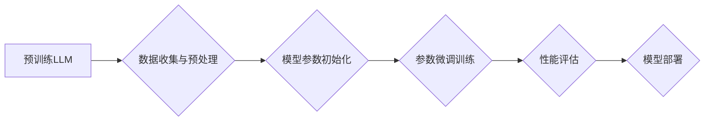

> 大语言模型，参数微调，迁移学习，自然语言处理，深度学习，BERT，GPT

## 1. 背景介绍

近年来，大语言模型（Large Language Models，LLMs）在自然语言处理（Natural Language Processing，NLP）领域取得了显著的进展。这些模型，例如 GPT-3、BERT 和 LaMDA，通过训练在海量文本数据上，展现出强大的文本生成、理解和翻译能力。然而，直接使用预训练的 LLMs 往往需要大量的计算资源和时间，并且可能无法满足特定应用场景的需求。

参数微调（Parameter Fine-tuning） emerged as a powerful technique to adapt pre-trained LLMs to specific tasks with limited resources. 通过在特定数据集上对模型参数进行微调，可以显著提升模型在目标任务上的性能。

## 2. 核心概念与联系

参数微调的核心思想是利用预训练 LLMs 的知识，通过在目标任务的数据集上进行少量训练，进一步优化模型参数，从而提高模型在目标任务上的性能。

**流程图：**



**核心概念：**

* **预训练 LLMs:** 在海量文本数据上进行预训练的语言模型，已经具备了基本的语言理解和生成能力。
* **目标任务:** 需要解决的具体问题，例如文本分类、情感分析、机器翻译等。
* **目标数据集:** 用于训练模型的特定任务数据。
* **参数微调:** 在目标数据集上对预训练 LLMs 的参数进行调整，以提高模型在目标任务上的性能。

## 3. 核心算法原理 & 具体操作步骤

### 3.1  算法原理概述

参数微调算法的基本原理是利用梯度下降法来更新模型参数。

* **梯度下降法:** 是一种迭代优化算法，通过计算目标函数的梯度，不断调整模型参数，以使目标函数的值最小化。

在参数微调过程中，预训练 LLMs 的大部分参数会被冻结，只对一小部分参数进行微调。这可以有效减少训练时间和计算资源，同时避免模型过拟合。

### 3.2  算法步骤详解

1. **数据准备:** 收集和预处理目标任务的数据集。
2. **模型选择:** 选择合适的预训练 LLMs 作为基础模型。
3. **参数初始化:** 将预训练 LLMs 的参数加载到模型中，并对需要微调的参数进行初始化。
4. **模型微调:** 使用目标数据集对模型进行训练，并根据梯度下降法更新模型参数。
5. **性能评估:** 在验证集上评估模型的性能，并根据评估结果调整训练参数。
6. **模型部署:** 将微调后的模型部署到实际应用场景中。

### 3.3  算法优缺点

**优点:**

* **高效:** 相比于从头训练 LLMs，参数微调只需要训练一小部分参数，可以显著减少训练时间和计算资源。
* **效果好:** 可以有效提升模型在目标任务上的性能。
* **易于实现:** 许多深度学习框架都提供了参数微调的工具和接口。

**缺点:**

* **数据依赖:** 参数微调的性能取决于目标数据集的质量和数量。
* **过拟合风险:** 如果目标数据集过小，模型可能会过拟合。
* **模型选择:** 选择合适的预训练 LLMs 对于模型性能至关重要。

### 3.4  算法应用领域

参数微调在许多 NLP 领域都有广泛的应用，例如：

* **文本分类:** 识别文本的类别，例如情感分析、主题分类等。
* **问答系统:** 回答用户提出的问题。
* **机器翻译:** 将文本从一种语言翻译成另一种语言。
* **文本摘要:** 生成文本的简短摘要。
* **对话系统:** 与用户进行自然语言对话。

## 4. 数学模型和公式 & 详细讲解 & 举例说明

### 4.1  数学模型构建

参数微调的数学模型通常基于深度学习框架，例如 TensorFlow 或 PyTorch。模型的结构通常由多个神经网络层组成，例如卷积层、全连接层和注意力层。

### 4.2  公式推导过程

参数微调的目标是优化模型的损失函数，损失函数通常是预测值与真实值的差值。

**损失函数:**

$$
L = \sum_{i=1}^{N} \mathcal{L}(y_i, \hat{y}_i)
$$

其中：

* $L$ 是损失函数的值。
* $N$ 是样本的数量。
* $\mathcal{L}$ 是单个样本的损失函数。
* $y_i$ 是真实值。
* $\hat{y}_i$ 是预测值。

**梯度下降法:**

$$
\theta_{t+1} = \theta_t - \eta \nabla L(\theta_t)
$$

其中：

* $\theta$ 是模型参数。
* $t$ 是迭代次数。
* $\eta$ 是学习率。
* $\nabla L(\theta_t)$ 是损失函数在当前参数 $\theta_t$ 处的梯度。

### 4.3  案例分析与讲解

假设我们想要使用预训练的 BERT 模型进行文本分类任务。

1. **数据准备:** 收集和预处理文本分类数据集，例如 IMDB 电影评论数据集。
2. **模型选择:** 选择预训练的 BERT 模型作为基础模型。
3. **参数初始化:** 将 BERT 模型的预训练参数加载到模型中，并对分类头进行初始化。
4. **模型微调:** 使用目标数据集对 BERT 模型进行训练，并根据梯度下降法更新模型参数。
5. **性能评估:** 在验证集上评估模型的性能，并根据评估结果调整训练参数。
6. **模型部署:** 将微调后的 BERT 模型部署到实际应用场景中，例如用于识别用户评论的正面或负面情感。

## 5. 项目实践：代码实例和详细解释说明

### 5.1  开发环境搭建

* **操作系统:** Linux 或 macOS
* **Python 版本:** 3.6 或更高版本
* **深度学习框架:** TensorFlow 或 PyTorch
* **其他依赖库:** transformers、numpy、pandas 等

### 5.2  源代码详细实现

```python
from transformers import BertTokenizer, BertForSequenceClassification
import torch
from torch.utils.data import DataLoader

# 加载预训练模型和词典
tokenizer = BertTokenizer.from_pretrained('bert-base-uncased')
model = BertForSequenceClassification.from_pretrained('bert-base-uncased', num_labels=2)

# 数据加载
# ...

# 定义训练函数
def train(model, train_dataloader, epochs):
    # ...

# 训练模型
train(model, train_dataloader, epochs=3)

# 保存模型
model.save_pretrained('bert-finetuned-sentiment')
```

### 5.3  代码解读与分析

* **加载预训练模型和词典:** 使用 transformers 库加载预训练的 BERT 模型和词典。
* **数据加载:** 使用 torch.utils.data 库加载训练数据。
* **定义训练函数:** 定义训练模型的函数，包括数据迭代、损失计算、梯度更新等步骤。
* **训练模型:** 使用训练函数训练模型。
* **保存模型:** 使用 save_pretrained 函数保存训练后的模型。

### 5.4  运行结果展示

训练完成后，可以使用验证集评估模型的性能，例如计算准确率、F1 值等指标。

## 6. 实际应用场景

参数微调在许多实际应用场景中都有广泛的应用，例如：

* **搜索引擎:** 提升搜索结果的准确性和相关性。
* **聊天机器人:** 提高聊天机器人的自然语言理解和生成能力。
* **客户服务:** 自动化客户服务，例如回答常见问题。
* **医疗诊断:** 辅助医生进行疾病诊断。
* **金融分析:** 分析金融数据，预测市场趋势。

### 6.4  未来应用展望

随着大语言模型的发展和参数微调技术的进步，未来参数微调将在更多领域得到应用，例如：

* **个性化推荐:** 根据用户的兴趣和偏好提供个性化的推荐。
* **代码生成:** 自动生成代码，提高开发效率。
* **创意写作:** 辅助作家进行创意写作。
* **跨语言理解:** 突破语言障碍，实现跨语言的理解和交流。

## 7. 工具和资源推荐

### 7.1  学习资源推荐

* **Hugging Face Transformers:** https://huggingface.co/docs/transformers/index
* **BERT Paper:** https://arxiv.org/abs/1810.04805
* **GPT Paper:** https://openai.com/blog/language-unsupervised/

### 7.2  开发工具推荐

* **TensorFlow:** https://www.tensorflow.org/
* **PyTorch:** https://pytorch.org/
* **Jupyter Notebook:** https://jupyter.org/

### 7.3  相关论文推荐

* **BERT: Pre-training of Deep Bidirectional Transformers for Language Understanding**
* **GPT: Generative Pre-trained Transformer**
* **Fine-tuning BERT for Text Classification**

## 8. 总结：未来发展趋势与挑战

### 8.1  研究成果总结

参数微调技术在 NLP 领域取得了显著的进展，有效提升了模型在目标任务上的性能。

### 8.2  未来发展趋势

* **更有效的微调方法:** 研究更有效的微调方法，例如知识蒸馏、联邦学习等。
* **更小的模型:** 研究更小的模型，降低计算资源需求。
* **跨模态微调:** 将文本和图像等多模态数据进行微调，提升模型的泛化能力。

### 8.3  面临的挑战

* **数据稀缺:** 许多领域的数据稀缺，难以进行有效微调。
* **模型可解释性:** 大语言模型的决策过程难以解释，需要提高模型的可解释性。
* **伦理问题:** 大语言模型可能被用于生成虚假信息或进行恶意攻击，需要关注模型的伦理问题。

### 8.4  研究展望

未来，参数微调技术将继续发展，在更多领域得到应用，并解决当前面临的挑战。


## 9. 附录：常见问题与解答

**Q1: 参数微调需要多少数据？**

**A1:** 参数微调的数据需求取决于目标任务的复杂度和模型的大小。一般来说，需要至少几千条数据才能进行有效微调。

**Q2: 如何选择合适的预训练模型？**

**A2:** 选择合适的预训练模型取决于目标任务和数据特点。例如，对于文本分类任务，可以使用 BERT 或 RoBERTa 等预训练模型。

**Q3: 如何评估模型的性能？**

**A3:** 可以使用准确率、F1 值、AUC 等指标来评估模型的性能。

**Q4: 如何避免模型过拟合？**

**A4:** 可以使用正则化技术、dropout、数据增强等方法来避免模型过拟合。


作者：禅与计算机程序设计艺术 / Zen and the Art of Computer Programming 
<end_of_turn>