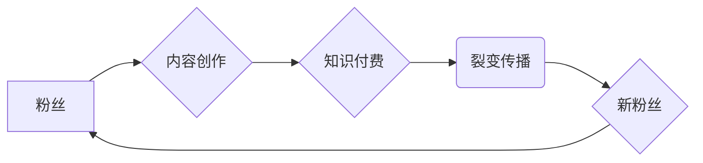

>  粉丝经济、知识付费、裂变传播、内容营销、社区运营、数据分析

## 1. 背景介绍

在互联网时代，信息爆炸和知识更新速度加快，人们对高质量知识的需求日益增长。同时，随着社交媒体平台的兴起，粉丝经济也逐渐成为一种重要的商业模式。知识付费作为一种新型的商业模式，将粉丝经济与知识传播相结合，为创作者提供了新的盈利模式，也为用户提供了便捷获取优质知识的机会。

然而，知识付费市场竞争激烈，如何实现知识付费的裂变传播，让知识价值得到最大化传播，成为众多创作者和平台面临的挑战。

## 2. 核心概念与联系

**2.1  粉丝经济**

粉丝经济是指以粉丝为核心，通过内容创作、互动交流、情感连接等方式，建立起粉丝与创作者之间的长期关系，并通过粉丝的推荐和传播，实现商业价值的模式。

**2.2  知识付费**

知识付费是指创作者将自己的知识、技能、经验等打包成产品或服务，通过线上平台向付费用户提供，获取收益的商业模式。

**2.3  裂变传播**

裂变传播是指通过用户自发分享，实现内容或产品的快速传播，形成指数级的增长效应。

**2.4  核心概念联系**

粉丝经济、知识付费和裂变传播相互关联，形成一个闭环的商业模式：

* **粉丝经济为基础：** 拥有庞大的粉丝群体是知识付费成功的关键。
* **知识付费为驱动：** 高质量的知识产品和服务能够吸引粉丝付费，并提升粉丝粘性。
* **裂变传播为放大：** 通过粉丝的分享和传播，知识付费产品能够快速扩散，吸引更多潜在用户。

**2.5  核心架构流程图**



## 3. 核心算法原理 & 具体操作步骤

**3.1  算法原理概述**

裂变传播的核心算法原理是基于网络效应和社会影响力。通过设计激励机制，鼓励粉丝分享知识付费产品，并利用社交网络的传播特性，实现内容的快速扩散。

**3.2  算法步骤详解**

1. **内容创作：** 创作者需要创作高质量、有价值的知识产品，满足粉丝的需求。
2. **粉丝运营：** 建立粉丝社区，与粉丝进行互动交流，建立情感连接。
3. **激励机制：** 设计合理的激励机制，鼓励粉丝分享知识付费产品，例如优惠券、积分、专属内容等。
4. **数据分析：** 利用数据分析工具，监测粉丝行为，优化内容和传播策略。

**3.3  算法优缺点**

* **优点：**
    * 成本低，传播效率高。
    * 能够有效扩大知识付费产品的覆盖范围。
    * 能够提升品牌知名度和用户粘性。
* **缺点：**
    * 需要持续投入时间和精力进行内容创作和粉丝运营。
    * 难以控制传播效果，存在信息失真和负面影响的风险。

**3.4  算法应用领域**

* 在线教育
* 咨询服务
* 知识库建设
* 社交电商

## 4. 数学模型和公式 & 详细讲解 & 举例说明

**4.1  数学模型构建**

裂变传播的数学模型可以采用指数增长模型，其核心公式为：

$$N(t) = N_0 \cdot r^t$$

其中：

* $N(t)$：t时刻的传播用户数量
* $N_0$：初始用户数量
* $r$：裂变系数，表示每个用户平均能带来多少新用户
* $t$：时间

**4.2  公式推导过程**

该模型假设每个用户都会向其他用户传播信息，并且每个用户带来的新用户数量是固定的。

**4.3  案例分析与讲解**

假设一个知识付费产品初始用户数量为100人，裂变系数为2，则经过t时间，传播用户数量为：

$$N(t) = 100 \cdot 2^t$$

例如，经过1周（t=7），传播用户数量为：

$$N(7) = 100 \cdot 2^7 = 12800$$

可见，裂变传播具有指数级的增长效应，能够快速扩大知识付费产品的传播范围。

## 5. 项目实践：代码实例和详细解释说明

**5.1  开发环境搭建**

* Python 3.x
* Flask 或 Django 框架
* 数据库 (例如 MySQL 或 PostgreSQL)

**5.2  源代码详细实现**

```python
from flask import Flask, render_template

app = Flask(__name__)

@app.route('/')
def index():
    return render_template('index.html')

if __name__ == '__main__':
    app.run(debug=True)
```

**5.3  代码解读与分析**

* 该代码示例是一个简单的Flask web应用，用于展示知识付费产品的页面。
* `render_template('index.html')` 函数渲染了名为`index.html`的模板文件，该文件包含了知识付费产品的介绍、价格、购买按钮等信息。

**5.4  运行结果展示**

运行该代码后，访问`http://127.0.0.1:5000/`，即可看到知识付费产品的页面。

## 6. 实际应用场景

**6.1  在线教育平台**

在线教育平台可以利用粉丝经济和裂变传播，推广课程产品。例如，邀请知名老师进行直播课程，并鼓励学生分享课程内容，吸引更多用户报名学习。

**6.2  咨询服务平台**

咨询服务平台可以利用粉丝经济和裂变传播，推广咨询服务。例如，邀请专家进行线上咨询，并鼓励用户分享咨询经验，吸引更多用户寻求咨询服务。

**6.3  知识库建设平台**

知识库建设平台可以利用粉丝经济和裂变传播，推广知识库内容。例如，邀请专家撰写高质量文章，并鼓励用户分享文章链接，吸引更多用户访问知识库。

**6.4  未来应用展望**

随着粉丝经济和知识付费的不断发展，裂变传播将在未来发挥更加重要的作用。例如，可以利用人工智能技术，实现更精准的粉丝运营和内容推荐，进一步提升裂变传播的效果。

## 7. 工具和资源推荐

**7.1  学习资源推荐**

* 《裂变营销》
* 《粉丝经济》
* 《知识付费》

**7.2  开发工具推荐**

* Flask
* Django
* Node.js
* React

**7.3  相关论文推荐**

* “裂变传播模型的构建与应用研究”
* “粉丝经济与知识付费的融合发展”

## 8. 总结：未来发展趋势与挑战

**8.1  研究成果总结**

本文介绍了粉丝经济、知识付费和裂变传播的概念和原理，并分析了其相互联系和应用场景。

**8.2  未来发展趋势**

* 人工智能技术将被更加广泛地应用于粉丝运营和内容推荐，提升裂变传播的效果。
* 知识付费产品将更加个性化和定制化，满足用户多样化的需求。
* 社交电商将与知识付费深度融合，形成新的商业模式。

**8.3  面临的挑战**

* 如何有效控制裂变传播的负面影响，避免信息失真和谣言传播。
* 如何提升知识付费产品的质量和价值，满足用户对高质量知识的需求。
* 如何建立可持续的粉丝运营模式，避免粉丝流失和用户疲劳。

**8.4  研究展望**

未来，需要进一步研究裂变传播的机制和规律，开发更有效的裂变传播算法和工具，并探索知识付费与其他商业模式的融合发展，推动知识经济的健康发展。

## 9. 附录：常见问题与解答

**9.1  Q：如何提高裂变传播的效率？**

**A：** 可以通过以下方式提高裂变传播的效率：

* 创作高质量、有价值的内容，吸引用户分享。
* 设计合理的激励机制，鼓励用户分享。
* 利用社交网络平台的传播特性，进行精准的推广。
* 利用数据分析工具，监测粉丝行为，优化传播策略。

**9.2  Q：如何避免裂变传播的负面影响？**

**A：** 可以通过以下方式避免裂变传播的负面影响：

* 严格审核内容质量，避免传播虚假信息。
* 建立完善的社区管理机制，引导用户文明传播。
* 及时处理负面信息，维护平台形象。


作者：禅与计算机程序设计艺术 / Zen and the Art of Computer Programming 
<end_of_turn>