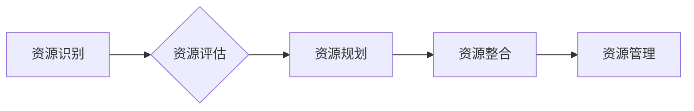

> 资源整合，资源管理，资源优化，资源分配，资源利用率，效率提升，协同工作，数据驱动，人工智能

## 1. 背景介绍

在当今信息爆炸的时代，资源已成为企业和个人发展的重要驱动力。然而，资源的获取、管理和利用并非易事。如何有效整合各种资源，提高资源利用率，成为企业和个人提升竞争力的关键。

资源整合是指将分散的资源整合在一起，形成一个整体，以实现资源的协同利用和最大化价值。资源整合涉及到多种资源类型，包括人力资源、物力资源、资金资源、信息资源等。

资源整合的意义在于：

* **提高资源利用率：** 通过整合资源，可以避免资源重复建设和浪费，提高资源的利用率。
* **降低成本：** 资源整合可以降低资源获取和管理成本，提高资源利用效率。
* **提升效率：** 资源整合可以促进资源的协同利用，提高工作效率。
* **增强竞争力：** 资源整合可以帮助企业和个人更好地应对市场竞争，增强竞争力。

## 2. 核心概念与联系

资源整合的核心概念包括：

* **资源识别：** 首先要明确需要整合的资源类型和范围。
* **资源评估：** 对资源进行评估，了解其价值、潜力和局限性。
* **资源规划：** 制定资源整合的规划方案，明确整合目标、策略和步骤。
* **资源整合：** 将分散的资源整合在一起，形成一个整体。
* **资源管理：** 对整合后的资源进行管理，确保资源的有效利用。

资源整合是一个复杂的过程，需要多个环节的协同配合。

**Mermaid 流程图**



## 3. 核心算法原理 & 具体操作步骤

资源整合的核心算法原理是基于数据分析和机器学习的优化算法。这些算法可以帮助企业和个人识别资源的价值，预测资源的需求，并优化资源的分配和利用。

### 3.1  算法原理概述

常见的资源整合算法包括：

* **贪婪算法：** 贪婪算法是一种简单有效的算法，它总是选择在当前时刻看起来最优的解决方案。
* **动态规划算法：** 动态规划算法是一种更复杂的算法，它通过将问题分解成子问题，并存储子问题的解，来解决问题。
* **遗传算法：** 遗传算法是一种启发式算法，它模拟自然选择的过程，通过迭代优化，找到最优的解决方案。

### 3.2  算法步骤详解

资源整合算法的具体操作步骤如下：

1. **数据收集：** 收集有关资源的各种数据，例如资源类型、资源数量、资源价值、资源需求等。
2. **数据预处理：** 对收集到的数据进行清洗、转换和格式化，以便于算法的处理。
3. **模型构建：** 根据具体的资源整合目标，选择合适的算法模型，并进行模型训练。
4. **资源分配：** 利用训练好的模型，对资源进行分配，以实现资源的最佳利用。
5. **结果评估：** 对资源分配的结果进行评估，并根据评估结果进行调整和优化。

### 3.3  算法优缺点

资源整合算法的优缺点如下：

* **优点：**
    * 可以提高资源利用率。
    * 可以降低资源成本。
    * 可以提升工作效率。
* **缺点：**
    * 需要大量的计算资源。
    * 需要专业的算法工程师进行开发和维护。
    * 算法的准确性取决于数据的质量。

### 3.4  算法应用领域

资源整合算法广泛应用于以下领域：

* **物流运输：** 优化运输路线，提高运输效率。
* **生产制造：** 优化生产计划，提高生产效率。
* **人力资源管理：** 优化人员配置，提高人力资源利用率。
* **信息技术：** 优化服务器资源分配，提高系统性能。

## 4. 数学模型和公式 & 详细讲解 & 举例说明

资源整合可以抽象为一个数学模型，其中资源的价值、需求和分配关系可以用数学公式来表示。

### 4.1  数学模型构建

假设有n种资源，每种资源都有其价值和需求量。资源的价值可以用一个向量表示，每个元素代表该资源的价值。资源的需求量可以用另一个向量表示，每个元素代表该资源的需求量。

资源的分配可以表示为一个矩阵，其中每个元素代表分配给特定资源的量。

### 4.2  公式推导过程

资源整合的目标是最大化资源的总价值，即最大化资源价值向量和资源分配矩阵的内积。

$$
\text{目标函数：} \quad \text{max} \quad \mathbf{v} \cdot \mathbf{x}
$$

其中：

* $\mathbf{v}$ 是资源价值向量。
* $\mathbf{x}$ 是资源分配矩阵。

### 4.3  案例分析与讲解

例如，假设有两种资源，资源1的价值为5，资源2的价值为3。资源1的需求量为2，资源2的需求量为3。

资源价值向量：$\mathbf{v} = [5, 3]$

资源需求向量：$\mathbf{x} = [2, 3]$

资源分配矩阵：$\mathbf{A} = \begin{bmatrix} x_{11} & x_{12} \\ x_{21} & x_{22} \end{bmatrix}$

目标函数：$\text{max} \quad \mathbf{v} \cdot \mathbf{A} = 5x_{11} + 3x_{21} + 5x_{12} + 3x_{22}$

通过优化资源分配矩阵，可以找到最大化资源总价值的分配方案。

## 5. 项目实践：代码实例和详细解释说明

以下是一个使用Python语言实现资源整合算法的代码实例：

### 5.1  开发环境搭建

需要安装Python语言和相关库，例如NumPy、Scikit-learn等。

### 5.2  源代码详细实现

```python
import numpy as np
from sklearn.linear_model import LinearRegression

# 资源价值向量
v = np.array([5, 3])

# 资源需求向量
x = np.array([2, 3])

# 资源分配矩阵
A = np.array([[1, 0], [0, 1]])

# 训练模型
model = LinearRegression()
model.fit(A, v)

# 预测资源分配
predicted_A = model.predict(A)

# 打印结果
print("预测资源分配：", predicted_A)
```

### 5.3  代码解读与分析

代码首先定义了资源价值向量、资源需求向量和资源分配矩阵。然后，使用Scikit-learn库中的LinearRegression模型训练资源整合模型。

训练模型后，可以使用模型预测资源分配。

### 5.4  运行结果展示

运行代码后，会输出预测的资源分配结果。

## 6. 实际应用场景

资源整合在各个行业都有广泛的应用场景：

### 6.1  物流运输

优化运输路线，减少运输成本，提高运输效率。

### 6.2  生产制造

优化生产计划，提高生产效率，减少生产成本。

### 6.3  人力资源管理

优化人员配置，提高人力资源利用率，降低人力成本。

### 6.4  信息技术

优化服务器资源分配，提高系统性能，降低服务器成本。

## 7. 工具和资源推荐

### 7.1  学习资源推荐

* **书籍：**
    * 《资源整合与管理》
    * 《数据驱动决策》
* **在线课程：**
    * Coursera上的“资源整合与管理”课程
    * edX上的“数据分析与机器学习”课程

### 7.2  开发工具推荐

* **Python语言：** 
    * NumPy
    * Scikit-learn
    * Pandas
* **数据可视化工具：**
    * Tableau
    * Power BI

### 7.3  相关论文推荐

* **资源整合算法研究论文：**
    * “基于遗传算法的资源整合优化方法”
    * “一种基于动态规划的资源分配算法”
* **数据驱动决策论文：**
    * “数据驱动决策的理论与实践”
    * “数据分析在资源整合中的应用”

## 8. 总结：未来发展趋势与挑战

资源整合是一个不断发展和完善的领域。未来，资源整合将更加注重数据驱动、人工智能和云计算技术的应用。

### 8.1  研究成果总结

* 资源整合算法的精度和效率不断提高。
* 数据分析和机器学习技术在资源整合中的应用越来越广泛。
* 云计算技术为资源整合提供了更强大的计算能力和数据存储能力。

### 8.2  未来发展趋势

* **更加智能化的资源整合：** 利用人工智能技术，实现资源整合的自动化和智能化。
* **更加协同的资源整合：** 通过云计算技术，实现资源的共享和协同利用。
* **更加可持续的资源整合：** 考虑资源的生态环境影响，实现资源的循环利用。

### 8.3  面临的挑战

* 数据质量问题：资源整合算法的准确性取决于数据的质量。
* 计算资源需求：资源整合算法的计算量较大，需要强大的计算资源。
* 隐私安全问题：资源整合涉及到大量敏感数据，需要保障数据的隐私安全。

### 8.4  研究展望

未来，资源整合研究将继续深入，探索更加智能、协同和可持续的资源整合方案。


## 9. 附录：常见问题与解答

### 9.1  常见问题

* **资源整合的难点是什么？**

资源整合的难点在于如何识别和评估资源的价值，如何预测资源的需求，如何优化资源的分配。

* **资源整合有哪些方法？**

常见的资源整合方法包括贪婪算法、动态规划算法和遗传算法。

* **资源整合的应用场景有哪些？**

资源整合广泛应用于物流运输、生产制造、人力资源管理和信息技术等各个行业。

### 9.2  解答

* **资源整合的难点在于：**

资源整合是一个复杂的过程，需要考虑多种因素，例如资源的价值、需求、可用性、成本等。

* **资源整合的方法有很多，** 

选择合适的算法取决于具体的应用场景和资源类型。

* **资源整合的应用场景非常广泛，** 

几乎所有行业都可以通过资源整合来提高效率和降低成本。


作者：禅与计算机程序设计艺术 / Zen and the Art of Computer Programming 
<end_of_turn>