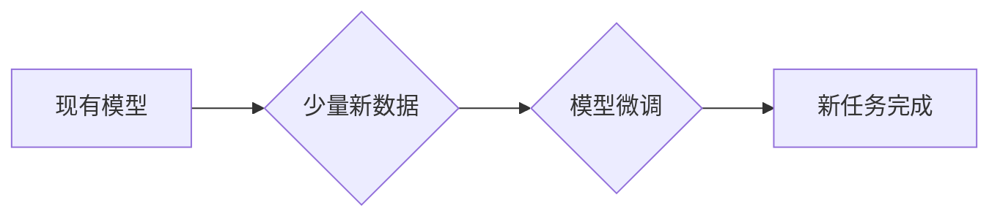

> 小样本学习，Few-Shot Learning，元学习，迁移学习，深度学习，软件开发，代码生成

## 1. 背景介绍

软件开发领域一直面临着挑战，其中之一就是开发新功能需要大量的代码和测试，这对于小型团队和快速迭代项目来说尤其困难。传统的软件开发方法依赖于大量的标注数据和复杂的开发流程，这使得开发周期长，成本高。近年来，深度学习的兴起为软件开发带来了新的希望。

深度学习模型能够从海量数据中学习复杂的模式，并应用于各种任务，例如图像识别、自然语言处理等。然而，深度学习模型通常需要大量的标注数据才能达到最佳性能，而获取高质量的标注数据往往成本高昂且耗时。

小样本学习 (Few-Shot Learning) 作为深度学习的一个重要分支，旨在解决这个问题。它允许模型在极少量的标注数据下学习新的任务，甚至可以从零样本开始学习。

## 2. 核心概念与联系

小样本学习的核心思想是利用模型已有的知识和经验，通过少量新的数据进行快速适应和学习。它可以看作是迁移学习的一种特殊形式，其中源任务和目标任务之间存在一定的相似性。

**小样本学习的流程:**



**核心概念:**

* **元学习 (Meta-Learning):** 元学习旨在训练模型学习学习，即学习如何从少量数据中快速学习新的任务。
* **迁移学习 (Transfer Learning):** 迁移学习是指利用预训练模型在源任务上的知识迁移到目标任务，从而提高目标任务的学习效率。
* **知识蒸馏 (Knowledge Distillation):** 知识蒸馏是一种将知识从大型模型转移到小型模型的技术，可以有效地压缩模型大小，同时保持一定的性能。

## 3. 核心算法原理 & 具体操作步骤

### 3.1  算法原理概述

小样本学习算法通常基于深度学习模型，并结合元学习和迁移学习的思想。常见的算法包括：

* **匹配网络 (Matching Network):** 匹配网络通过计算输入数据与支持集 (少量样本) 的相似度，来预测目标任务的输出。
* **原型网络 (Prototypical Network):** 原型网络将每个类别的样本聚类成一个原型，然后根据输入数据与每个原型的距离来预测类别。
* **关系网络 (Relation Network):** 关系网络通过学习输入数据之间的关系，来预测目标任务的输出。

### 3.2  算法步骤详解

以匹配网络为例，其具体操作步骤如下：

1. **输入数据:** 将输入数据和支持集一起输入到模型中。
2. **特征提取:** 模型提取输入数据和支持集的特征表示。
3. **相似度计算:** 计算输入数据与每个支持样本的相似度。
4. **预测输出:** 根据相似度计算结果，预测目标任务的输出。

### 3.3  算法优缺点

**优点:**

* 能够在极少量的标注数据下学习新的任务。
* 适应性强，可以快速适应新的环境和任务。
* 减少了标注数据的需求，降低了开发成本。

**缺点:**

* 性能通常不如大规模标注数据训练的模型。
* 对于复杂的任务，可能需要更多的支持样本才能达到较好的性能。

### 3.4  算法应用领域

小样本学习在软件开发领域具有广泛的应用前景，例如：

* **代码生成:** 根据少量代码示例，生成新的代码片段。
* **代码修复:** 根据少量错误代码示例，自动修复代码错误。
* **代码翻译:** 将代码从一种编程语言翻译到另一种编程语言。
* **软件测试:** 根据少量测试用例，自动生成新的测试用例。

## 4. 数学模型和公式 & 详细讲解 & 举例说明

### 4.1  数学模型构建

匹配网络的数学模型可以概括为以下公式：

$$
\mathbf{z}_i = f_{\theta}(\mathbf{x}_i)
$$

$$
\mathbf{z}_s = f_{\theta}(\mathbf{x}_s)
$$

$$
\mathbf{y} = g_{\phi}(\mathbf{z}_i, \mathbf{z}_s)
$$

其中：

* $\mathbf{x}_i$ 是输入数据。
* $\mathbf{x}_s$ 是支持集中的样本。
* $\mathbf{z}_i$ 和 $\mathbf{z}_s$ 分别是输入数据和支持集的特征表示。
* $f_{\theta}$ 是特征提取网络。
* $\mathbf{y}$ 是预测输出。
* $g_{\phi}$ 是预测网络。

### 4.2  公式推导过程

匹配网络的目标是找到输入数据与支持集中的样本之间的相似度，并根据相似度预测输出。

相似度计算可以使用余弦相似度或欧氏距离等方法。

### 4.3  案例分析与讲解

假设我们想要训练一个匹配网络来识别手写数字。

* 支持集包含一些标注的手写数字样本。
* 输入数据是一个新的手写数字图像。

匹配网络会将输入数据和支持集中的样本分别映射到特征空间，然后计算它们之间的相似度。

根据相似度计算结果，匹配网络可以预测输入数据的类别。

## 5. 项目实践：代码实例和详细解释说明

### 5.1  开发环境搭建

* Python 3.7+
* TensorFlow 2.0+
* PyTorch 1.0+

### 5.2  源代码详细实现

```python
import tensorflow as tf

# 定义匹配网络模型
class MatchingNetwork(tf.keras.Model):
    def __init__(self, embedding_dim, num_classes):
        super(MatchingNetwork, self).__init__()
        self.embedding = tf.keras.layers.Dense(embedding_dim)
        self.similarity = tf.keras.layers.Dot(axes=1)
        self.classifier = tf.keras.layers.Dense(num_classes)

    def call(self, inputs):
        # 输入数据和支持集
        x_i, x_s = inputs

        # 特征提取
        z_i = self.embedding(x_i)
        z_s = self.embedding(x_s)

        # 计算相似度
        similarity = self.similarity([z_i, z_s])

        # 预测输出
        output = self.classifier(similarity)
        return output

# 实例化模型
model = MatchingNetwork(embedding_dim=128, num_classes=10)

# 训练模型
# ...

```

### 5.3  代码解读与分析

* `MatchingNetwork` 类定义了匹配网络模型的结构。
* `embedding` 层用于提取输入数据的特征表示。
* `similarity` 层计算输入数据与支持集样本之间的相似度。
* `classifier` 层用于预测输出类别。
* `call` 方法定义了模型的输入和输出关系。

### 5.4  运行结果展示

训练完成后，可以将模型应用于新的数据进行预测。

## 6. 实际应用场景

### 6.1  代码生成

小样本学习可以用于生成新的代码片段，例如根据少量代码示例生成函数定义或类结构。

### 6.2  代码修复

小样本学习可以用于自动修复代码错误，例如根据少量错误代码示例自动生成修复代码。

### 6.3  代码翻译

小样本学习可以用于将代码从一种编程语言翻译到另一种编程语言，例如将 Python 代码翻译成 Java 代码。

### 6.4  未来应用展望

小样本学习在软件开发领域具有巨大的潜力，未来可以应用于更多场景，例如：

* 自动化软件测试
* 代码文档生成
* 代码风格检查
* 代码安全分析

## 7. 工具和资源推荐

### 7.1  学习资源推荐

* **书籍:**
    * 《Few-Shot Learning》 by Timothy Hospedales
    * 《Deep Learning》 by Ian Goodfellow
* **论文:**
    * 《Prototypical Networks for Few-Shot Learning》 by Snell et al.
    * 《Matching Networks for One Shot Learning》 by Vinyals et al.
* **在线课程:**
    * Coursera: Deep Learning Specialization
    * Udacity: Deep Learning Nanodegree

### 7.2  开发工具推荐

* **TensorFlow:** https://www.tensorflow.org/
* **PyTorch:** https://pytorch.org/
* **Keras:** https://keras.io/

### 7.3  相关论文推荐

* 《Few-Shot Learning》 by Timothy Hospedales
* 《Prototypical Networks for Few-Shot Learning》 by Snell et al.
* 《Matching Networks for One Shot Learning》 by Vinyals et al.

## 8. 总结：未来发展趋势与挑战

### 8.1  研究成果总结

小样本学习在软件开发领域取得了显著的进展，能够有效地减少标注数据的需求，提高开发效率。

### 8.2  未来发展趋势

未来，小样本学习的研究方向将包括：

* 探索更有效的算法和模型架构。
* 研究如何将小样本学习与其他机器学习技术结合。
* 开发更易于使用的工具和平台，促进小样本学习的应用。

### 8.3  面临的挑战

小样本学习仍然面临一些挑战，例如：

* 对于复杂的任务，可能需要更多的支持样本才能达到较好的性能。
* 如何有效地利用少量数据中的信息，仍然是一个开放问题。
* 如何将小样本学习应用于更广泛的软件开发场景，还需要进一步探索。

### 8.4  研究展望

小样本学习是一个充满潜力的研究方向，相信未来会有更多突破和进展，为软件开发带来新的变革。

## 9. 附录：常见问题与解答

**Q1: 小样本学习与迁移学习有什么区别？**

**A1:** 小样本学习是一种迁移学习的特殊形式，它侧重于利用少量数据进行学习。

**Q2: 小样本学习的应用场景有哪些？**

**A2:** 小样本学习可以应用于代码生成、代码修复、代码翻译等软件开发场景。

**Q3: 如何选择合适的算法？**

**A3:** 选择合适的算法取决于具体的应用场景和数据特点。

**作者：禅与计算机程序设计艺术 / Zen and the Art of Computer Programming**


<end_of_turn>