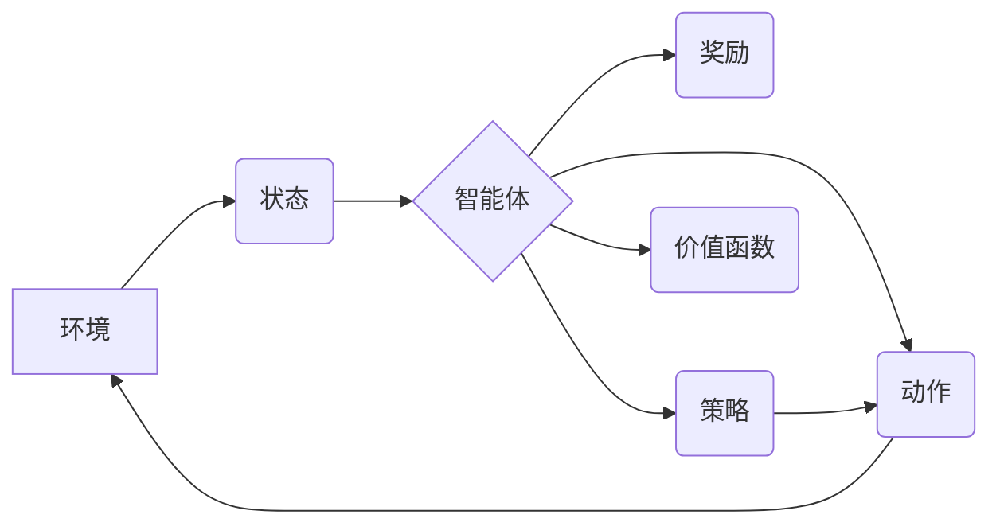

> 强化学习，深度学习，神经网络，强化信号，价值函数，策略梯度，深度强化学习，游戏AI，机器人控制

## 1. 背景介绍

人工智能（AI）领域近年来取得了令人瞩目的进展，其中深度学习（Deep Learning）作为其重要组成部分，在图像识别、自然语言处理等领域取得了突破性成果。然而，深度学习在某些任务，例如机器人控制、游戏AI等方面仍然面临挑战。强化学习（Reinforcement Learning，RL）作为一种学习方法，通过与环境交互，学习最优策略以最大化奖励，在解决这类复杂任务方面展现出巨大的潜力。

强化学习与深度学习的结合，即深度强化学习（Deep Reinforcement Learning，DRL），为解决复杂智能任务提供了新的思路和方法。DRL能够学习复杂的策略，并适应动态变化的环境，在游戏、机器人控制、自动驾驶等领域展现出广阔的应用前景。

## 2. 核心概念与联系

**2.1 强化学习核心概念**

强化学习的核心概念包括：

* **Agent（智能体）：** 与环境交互的实体，例如机器人、游戏角色等。
* **Environment（环境）：** 智能体所处的外部世界，包括状态和动作。
* **State（状态）：** 环境的当前描述，例如机器人位置、游戏棋盘状态等。
* **Action（动作）：** 智能体在特定状态下可以执行的操作，例如机器人移动、游戏角色操作等。
* **Reward（奖励）：** 环境对智能体动作的反馈，可以是正向奖励或负向惩罚。
* **Policy（策略）：** 智能体在不同状态下选择动作的规则，即策略决定了智能体在不同情况下采取哪些行动。
* **Value Function（价值函数）：** 评估智能体在特定状态下采取特定策略的长期奖励的能力。

**2.2 深度学习核心概念**

深度学习的核心概念包括：

* **神经网络：** 仿照人脑神经网络结构的计算模型，能够学习复杂的非线性关系。
* **激活函数：** 用于引入非线性，使神经网络能够学习更复杂的模式。
* **反向传播算法：** 用于训练神经网络，通过调整网络参数，最小化预测误差。

**2.3 强化学习与深度学习的结合**

深度强化学习将深度学习的强大能力应用于强化学习算法中，主要体现在以下方面：

* **策略网络：** 使用深度神经网络来表示策略，能够学习更复杂的策略。
* **价值网络：** 使用深度神经网络来估计价值函数，能够学习更准确的价值估计。
* **强化信号：** 使用深度神经网络来处理强化信号，例如将奖励信号转换为更丰富的特征表示。

**2.4  核心概念关系流程图**



## 3. 核心算法原理 & 具体操作步骤

### 3.1 算法原理概述

深度强化学习算法的核心是通过训练深度神经网络来学习智能体的策略和价值函数。常见的深度强化学习算法包括：

* **DQN（Deep Q-Network）：** 使用深度神经网络来估计状态-动作对的 Q 值，通过最大化 Q 值来学习最优策略。
* **A2C（Advantage Actor-Critic）：** 使用两个神经网络，一个作为策略网络，另一个作为价值网络，通过优势函数来更新策略和价值网络。
* **PPO（Proximal Policy Optimization）：** 通过限制策略更新的范围，提高算法的稳定性和收敛性。

### 3.2 算法步骤详解

以 DQN 算法为例，其具体操作步骤如下：

1. **初始化：** 初始化深度神经网络，并设置学习参数，例如学习率、折扣因子等。
2. **经验回放：** 将智能体与环境交互产生的经验（状态、动作、奖励、下一个状态）存储在经验回放缓冲池中。
3. **训练：** 从经验回放缓冲池中随机采样经验，使用深度神经网络估计 Q 值，并通过反向传播算法更新网络参数。
4. **策略更新：** 根据训练得到的 Q 值，选择最优动作，并执行该动作。
5. **重复步骤 2-4：** 直到达到预设的训练次数或性能指标。

### 3.3 算法优缺点

**优点：**

* 能够学习复杂的策略。
* 能够适应动态变化的环境。
* 在游戏、机器人控制等领域取得了显著成果。

**缺点：**

* 训练过程可能需要大量的时间和计算资源。
* 算法的稳定性和收敛性需要仔细调参。
* 对于某些任务，例如需要大量先验知识的任务，算法可能难以学习。

### 3.4 算法应用领域

深度强化学习算法在以下领域具有广泛的应用前景：

* **游戏AI：** 训练智能体玩游戏，例如 AlphaGo、AlphaStar 等。
* **机器人控制：** 训练机器人执行复杂的任务，例如导航、抓取等。
* **自动驾驶：** 训练自动驾驶系统，例如路径规划、避障等。
* **医疗保健：** 辅助医生诊断疾病、制定治疗方案等。
* **金融市场：** 进行投资决策、风险管理等。

## 4. 数学模型和公式 & 详细讲解 & 举例说明

### 4.1 数学模型构建

强化学习的核心数学模型是价值函数和策略函数。

* **价值函数：** 评估智能体在特定状态下采取特定策略的长期奖励的能力。

$$
V^{\pi}(s) = E_{\pi}[R_{t+1} + \gamma R_{t+2} + \gamma^2 R_{t+3} + ... | S_t = s]
$$

其中：

* $V^{\pi}(s)$ 是状态 $s$ 下策略 $\pi$ 的价值函数。
* $E_{\pi}[...]$ 表示根据策略 $\pi$ 采样的期望。
* $R_t$ 是时间步 $t$ 的奖励。
* $\gamma$ 是折扣因子，控制未来奖励的权重。

* **策略函数：** 决定智能体在特定状态下采取的动作。

$$
\pi(a|s) = P(A_t = a | S_t = s)
$$

其中：

* $\pi(a|s)$ 是状态 $s$ 下采取动作 $a$ 的概率。

### 4.2 公式推导过程

深度强化学习算法通常使用蒙特卡罗方法或时序差分方法来估计价值函数和更新策略函数。

* **蒙特卡罗方法：** 通过收集经验轨迹，直接估计价值函数。
* **时序差分方法：** 通过利用当前状态和下一个状态的价值函数估计，逐步更新价值函数。

### 4.3 案例分析与讲解

例如，在玩游戏时，智能体可以根据当前游戏状态和策略函数选择最优动作，例如移动、攻击等。通过与环境交互，智能体获得奖励，并根据奖励更新价值函数和策略函数。最终，智能体能够学习到最优策略，从而赢得游戏。

## 5. 项目实践：代码实例和详细解释说明

### 5.1 开发环境搭建

* **操作系统：** Ubuntu 18.04 或更高版本
* **Python 版本：** 3.6 或更高版本
* **深度学习框架：** TensorFlow 或 PyTorch
* **其他依赖库：** NumPy、OpenAI Gym 等

### 5.2 源代码详细实现

以下是一个使用 TensorFlow 实现 DQN 算法的简单代码示例：

```python
import tensorflow as tf

# 定义神经网络模型
model = tf.keras.models.Sequential([
    tf.keras.layers.Dense(128, activation='relu', input_shape=(state_size,)),
    tf.keras.layers.Dense(64, activation='relu'),
    tf.keras.layers.Dense(action_size)
])

# 定义损失函数和优化器
loss_fn = tf.keras.losses.MeanSquaredError()
optimizer = tf.keras.optimizers.Adam(learning_rate=0.001)

# 训练模型
for episode in range(num_episodes):
    state = env.reset()
    done = False
    while not done:
        # 选择动作
        action = model.predict(state[None, :])[0]
        # 执行动作
        next_state, reward, done, _ = env.step(action)
        # 更新经验回放缓冲池
        experience_replay.append((state, action, reward, next_state, done))
        # 训练模型
        if len(experience_replay) >= batch_size:
            batch = random.sample(experience_replay, batch_size)
            # 计算目标 Q 值
            target_q_values = ...
            # 更新模型参数
            with tf.GradientTape() as tape:
                q_values = model(state[None, :])
                loss = loss_fn(target_q_values, q_values)
            gradients = tape.gradient(loss, model.trainable_variables)
            optimizer.apply_gradients(zip(gradients, model.trainable_variables))
        state = next_state

```

### 5.3 代码解读与分析

* 代码首先定义了神经网络模型，包括输入层、隐藏层和输出层。
* 然后定义了损失函数和优化器，用于训练神经网络。
* 训练过程包括以下步骤：
    * 初始化环境。
    * 在环境中进行交互，收集经验。
    * 从经验回放缓冲池中采样经验，训练模型。
    * 更新模型参数。
* 训练完成后，可以使用训练好的模型在环境中进行测试。

### 5.4 运行结果展示

训练结果可以包括以下指标：

* **奖励总和：** 智能体在训练过程中获得的总奖励。
* **平均奖励：** 每回合的平均奖励。
* **收敛速度：** 模型训练所需的时间。

## 6. 实际应用场景

### 6.1 游戏AI

深度强化学习在游戏AI领域取得了突破性进展，例如 AlphaGo、AlphaStar 等。这些系统能够学习复杂的策略，并战胜人类顶尖选手。

### 6.2 机器人控制

深度强化学习可以用于训练机器人执行复杂的任务，例如导航、抓取、组装等。

### 6.3 自动驾驶

深度强化学习可以用于训练自动驾驶系统，例如路径规划、避障、决策控制等。

### 6.4 未来应用展望

深度强化学习在未来将有更广泛的应用，例如：

* **医疗保健：** 辅助医生诊断疾病、制定治疗方案。
* **金融市场：** 进行投资决策、风险管理。
* **个性化教育：** 根据学生的学习情况定制学习方案。

## 7. 工具和资源推荐

### 7.1 学习资源推荐

* **书籍：**
    * Reinforcement Learning: An Introduction by Richard S. Sutton and Andrew G. Barto
    * Deep Reinforcement Learning Hands-On by Maxim Lapan
* **在线课程：**
    * Deep Reinforcement Learning Specialization by DeepLearning.AI
    * Reinforcement Learning by David Silver (University of DeepMind)

### 7.2 开发工具推荐

* **深度学习框架：** TensorFlow、PyTorch
* **游戏环境：** OpenAI Gym
* **强化学习库：** Stable Baselines3

### 7.3 相关论文推荐

* Deep Q-Network (DQN)
* Proximal Policy Optimization (PPO)
* Asynchronous Advantage Actor-Critic (A2C)

## 8. 总结：未来发展趋势与挑战

### 8.1 研究成果总结

深度强化学习取得了显著的成果，在游戏AI、机器人控制、自动驾驶等领域取得了突破性进展。

###