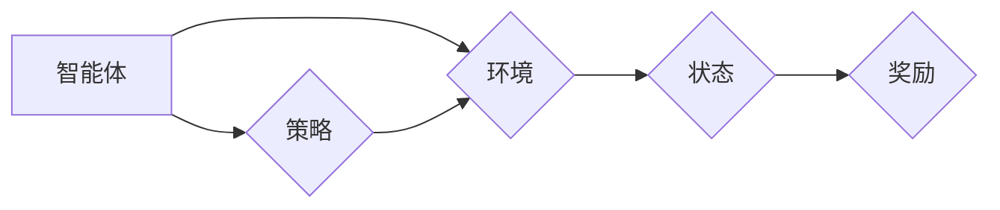

> 强化学习，人工智能，艺术创作，深度学习，奖励机制，策略梯度，生成对抗网络

## 1. 背景介绍

人工智能（AI）近年来取得了令人瞩目的进展，尤其是在图像识别、自然语言处理等领域。然而，AI在艺术创作领域的应用仍然处于探索阶段。传统艺术创作依赖于人类的创造力和情感表达，而AI如何学习并模仿这些复杂的能力一直是一个挑战。

强化学习（RL）作为一种机器学习范式，通过奖励机制引导智能体学习最优策略，在解决复杂决策问题方面展现出强大的潜力。将RL应用于艺术创作，可以为AI赋予创造力和表达能力，开拓新的艺术创作模式。

## 2. 核心概念与联系

**2.1 强化学习概述**

强化学习是一种基于交互学习的机器学习方法。智能体（agent）在环境（environment）中采取行动（action），环境会根据行动产生状态变化（state）和奖励（reward）。智能体的目标是通过学习策略（policy），在环境中采取最优行动，最大化累积的奖励。

**2.2 艺术创作与强化学习的联系**

在艺术创作领域，我们可以将智能体视为艺术家，环境视为艺术创作的领域，行动视为艺术创作的步骤，奖励视为艺术作品的评价。通过强化学习，我们可以训练智能体学习创作出符合特定风格、主题或审美标准的艺术作品。

**2.3 强化学习在艺术创作中的应用架构**



**2.4 核心概念原理**

* **状态（State）：** 代表艺术创作过程中的当前情况，例如画布上的颜色、形状、构图等。
* **行动（Action）：** 代表艺术家在创作过程中的操作，例如绘制线条、填充颜色、调整构图等。
* **奖励（Reward）：** 代表艺术作品的评价，例如美观度、创意度、情感表达等。
* **策略（Policy）：** 代表智能体根据当前状态选择行动的规则。

## 3. 核心算法原理 & 具体操作步骤

**3.1 算法原理概述**

强化学习算法的核心是通过不断地与环境交互，学习最优策略。常见的强化学习算法包括：

* **Q-学习:** 通过构建Q表，学习每个状态-行动对的价值函数，选择最大价值的行动。
* **策略梯度:** 直接优化策略参数，通过梯度上升算法更新策略，使其能够最大化奖励。
* **深度强化学习:** 将深度神经网络与强化学习算法结合，能够学习更复杂的策略。

**3.2 算法步骤详解**

1. **初始化:** 初始化智能体、环境、策略和奖励函数。
2. **交互:** 智能体与环境交互，根据策略选择行动，观察环境状态变化和奖励。
3. **更新策略:** 根据奖励信号更新策略参数，使其能够选择更优的行动。
4. **重复:** 重复步骤2和3，直到策略收敛或达到预设目标。

**3.3 算法优缺点**

* **优点:** 能够学习复杂决策问题，适应动态环境。
* **缺点:** 训练过程可能需要大量数据和计算资源，容易陷入局部最优。

**3.4 算法应用领域**

强化学习在艺术创作领域有广泛的应用前景，例如：

* **图像生成:** 训练智能体生成符合特定风格或主题的图像。
* **音乐创作:** 训练智能体创作新的音乐旋律和和声。
* **文本创作:** 训练智能体创作诗歌、小说等文学作品。

## 4. 数学模型和公式 & 详细讲解 & 举例说明

**4.1 数学模型构建**

强化学习的数学模型通常由以下几个部分组成：

* **状态空间 (S):** 所有可能的艺术创作状态的集合。
* **行动空间 (A):** 所有可能的艺术创作行动的集合。
* **奖励函数 (R):** 描述智能体在特定状态采取特定行动后获得的奖励。
* **策略函数 (π):** 描述智能体在特定状态下选择行动的概率分布。

**4.2 公式推导过程**

* **Bellman方程:** 描述状态价值函数与奖励函数和策略函数之间的关系。

$$
V(s) = \max_a \left[ R(s, a) + \gamma \sum_{s'} P(s' | s, a) V(s') \right]
$$

其中：

* $V(s)$ 是状态 $s$ 的价值函数。
* $R(s, a)$ 是在状态 $s$ 采取行动 $a$ 后获得的奖励。
* $\gamma$ 是折扣因子，控制未来奖励的权重。
* $P(s' | s, a)$ 是从状态 $s$ 采取行动 $a$ 到达状态 $s'$ 的概率。

* **策略梯度更新公式:**

$$
\theta = \theta + \alpha \nabla_{\theta} J(\theta)
$$

其中：

* $\theta$ 是策略函数的参数。
* $\alpha$ 是学习率。
* $J(\theta)$ 是策略函数的效用函数。

**4.3 案例分析与讲解**

例如，训练一个智能体生成风格化的图像，我们可以将状态空间定义为图像像素的集合，行动空间定义为图像像素的修改操作，奖励函数定义为图像与目标风格的相似度。通过强化学习算法，智能体可以学习到最优的修改操作，生成符合目标风格的图像。

## 5. 项目实践：代码实例和详细解释说明

**5.1 开发环境搭建**

* Python 3.x
* TensorFlow 或 PyTorch 深度学习框架
* 其他必要的库，例如 NumPy、Matplotlib 等。

**5.2 源代码详细实现**

```python
import tensorflow as tf

# 定义神经网络模型
model = tf.keras.Sequential([
    tf.keras.layers.Input(shape=(image_height, image_width, 3)),
    # ... 其他层
    tf.keras.layers.Dense(num_actions, activation='softmax')
])

# 定义奖励函数
def reward_function(image, target_image):
    # 计算图像相似度
    similarity = tf.reduce_mean(tf.abs(image - target_image))
    # 返回奖励
    return -similarity

# 定义策略梯度更新函数
def update_policy(model, states, actions, rewards):
    # 计算策略梯度
    gradient = tf.gradients(rewards, model.trainable_variables)
    # 更新策略参数
    model.trainable_variables.assign_add(learning_rate * gradient)

# 训练循环
for episode in range(num_episodes):
    # 初始化状态
    state = env.reset()
    # 训练循环
    while True:
        # 选择行动
        action = model.predict(state)[0]
        # 执行行动
        next_state, reward, done = env.step(action)
        # 更新策略
        update_policy(model, state, action, reward)
        # 更新状态
        state = next_state
        # 如果完成一轮
        if done:
            break
```

**5.3 代码解读与分析**

* 代码首先定义了神经网络模型，用于将状态映射到行动概率分布。
* 然后定义了奖励函数，用于评估智能体采取行动后的效果。
* 策略梯度更新函数用于根据奖励信号更新策略参数。
* 训练循环中，智能体与环境交互，采取行动，获得奖励，并更新策略参数。

**5.4 运行结果展示**

训练完成后，智能体可以生成符合目标风格的艺术作品。

## 6. 实际应用场景

**6.1 艺术创作辅助工具**

强化学习可以用于开发艺术创作辅助工具，帮助艺术家快速生成创意构思、调整色彩搭配、优化构图等。

**6.2 个性化艺术作品生成**

根据用户的喜好和风格偏好，训练智能体生成个性化的艺术作品，例如定制肖像画、风景画等。

**6.3 艺术风格迁移**

利用强化学习，可以将一种艺术风格迁移到另一幅图像上，例如将梵高的风格应用到现代照片上。

**6.4 艺术作品修复与重建**

利用强化学习，可以修复损坏的艺术作品，甚至重建丢失的部分。

**6.5 未来应用展望**

随着人工智能技术的不断发展，强化学习在艺术创作领域的应用将更加广泛和深入。未来，我们可以期待看到更多基于强化学习的艺术创作工具和作品，推动艺术创作的创新和发展。

## 7. 工具和资源推荐

**7.1 学习资源推荐**

* 强化学习：强化学习算法的原理和应用
* 深度强化学习：深度神经网络与强化学习的结合
* TensorFlow 强化学习教程：https://www.tensorflow.org/tutorials/agents/reinforcement_learning

**7.2 开发工具推荐**

* TensorFlow：https://www.tensorflow.org/
* PyTorch：https://pytorch.org/
* OpenAI Gym：https://gym.openai.com/

**7.3 相关论文推荐**

* Deep Reinforcement Learning with Double Q-Learning
* Proximal Policy Optimization Algorithms
* Generative Adversarial Networks

## 8. 总结：未来发展趋势与挑战

**8.1 研究成果总结**

强化学习在艺术创作领域取得了显著的进展，例如生成风格化的图像、音乐和文本。这些成果证明了强化学习在艺术创作中的潜力，为艺术创作提供了新的可能性。

**8.2 未来发展趋势**

* **更复杂的艺术创作任务:** 训练智能体进行更复杂的艺术创作任务，例如创作完整的电影、戏剧剧本等。
* **多模态艺术创作:** 融合不同模态的艺术创作，例如将图像、音乐、文本等结合起来创作艺术作品。
* **人类-AI 协作创作:** 探索人类和AI之间的协作创作模式，让AI成为艺术家的助手，共同创作出更具创意和情感的作品。

**8.3 面临的挑战**

* **奖励函数设计:** 设计合适的奖励函数是强化学习的关键，但对于艺术创作领域，如何量化和评估艺术作品的价值仍然是一个挑战。
* **数据获取和标注:** 强化学习算法需要大量的训练数据，而艺术作品的数据获取和标注成本较高。
* **伦理问题:** AI生成的艺术作品的版权问题、艺术价值的评估等伦理问题需要得到进一步探讨。

**8.4 研究展望**

未来，强化学习在艺术创作领域的应用将继续深入发展，为艺术创作带来新的变革。我们需要不断探索新的算法、模型和应用场景，并积极应对挑战，推动人工智能与艺术的融合发展。

## 9. 附录：常见问题与解答

**9.1 如何评估AI生成的艺术作品的价值？**

评估AI生成的艺术作品的价值是一个复杂的问题，需要考虑多个因素，例如美观度、创意度、情感表达、技术难度等。目前还没有一个统一的标准，可以用来客观地评估AI艺术作品的价值。

**9.2 AI生成的艺术作品的版权问题如何解决？**

AI生成的艺术作品的版权问题是一个尚未完全解决的法律问题。目前，大多数国家法律规定，只有人类创作的作品才享有版权保护。但是，随着AI技术的不断发展，法律法规也需要不断更新，以适应新的技术发展和社会需求。

**9.3 强化学习是否会取代人类艺术家？**

强化学习可以帮助艺术家提高效率、激发创意，但它并不会取代人类艺术家。人类艺术家拥有独特的创造力和情感表达能力，这些是AI目前无法替代的。


作者：禅与计算机程序设计艺术 / Zen and the Art of Computer Programming 
<end_of_turn>