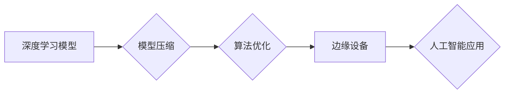

> Lepton AI, 计算机视觉, 深度学习, 模型压缩, 算法优化, 市场教育, 技术壁垒

## 1. 背景介绍

Lepton AI 是一家致力于开发高性能、低功耗的边缘人工智能芯片和软件平台的公司。其核心技术是基于深度学习的模型压缩和算法优化技术，旨在将强大的人工智能能力部署到资源受限的边缘设备上。Lepton AI 的目标是推动人工智能的普及，让每个人都能体验到人工智能带来的便利。

然而，Lepton AI 的推广面临着巨大的挑战。一方面，人工智能技术本身仍然处于发展初期，其复杂性和技术门槛较高，需要专业的技术人员才能理解和应用。另一方面，市场对人工智能的认知度和接受度还不足，许多用户对人工智能的应用场景和价值还缺乏了解。

## 2. 核心概念与联系

Lepton AI 的核心技术是基于深度学习的模型压缩和算法优化技术。

**模型压缩**是指通过各种算法将深度学习模型的大小和参数量进行压缩，从而降低模型的存储空间和计算资源需求。

**算法优化**是指通过对深度学习算法进行改进和优化，提高模型的训练效率和推理速度。

Lepton AI 通过将模型压缩和算法优化技术结合起来，实现了在边缘设备上运行高性能人工智能模型的目标。

**Lepton AI 技术架构**

## 3. 核心算法原理 & 具体操作步骤

### 3.1  算法原理概述

Lepton AI 的模型压缩和算法优化技术主要包括以下几种方法：

* **量化技术:** 将模型参数的精度降低，例如将32位浮点数转换为8位整数，从而减少模型的大小和计算量。
* **剪枝技术:** 移除模型中不重要的权重参数，从而减少模型的复杂度和参数量。
* **知识蒸馏技术:** 将大型模型的知识迁移到小型模型中，从而实现模型压缩的同时保持模型性能。
* **高效神经网络结构设计:** 设计新的神经网络结构，例如MobileNet、EfficientNet等，使其更适合在边缘设备上运行。

### 3.2  算法步骤详解

**模型压缩步骤:**

1. 选择合适的模型压缩方法，例如量化、剪枝、知识蒸馏等。
2. 对模型进行预处理，例如数据归一化、特征提取等。
3. 应用选择的模型压缩方法，对模型进行压缩。
4. 对压缩后的模型进行评估，例如精度、速度、内存占用等。
5. 根据评估结果，调整模型压缩参数，优化模型性能。

**算法优化步骤:**

1. 分析模型的计算瓶颈，例如卷积层、全连接层等。
2. 选择合适的算法优化方法，例如并行计算、算子融合、指令级优化等。
3. 对模型进行优化，例如并行化卷积操作、融合多个算子等。
4. 对优化后的模型进行评估，例如速度、精度、功耗等。
5. 根据评估结果，调整优化参数，优化模型性能。

### 3.3  算法优缺点

**模型压缩算法:**

* **优点:** 可以有效降低模型的大小和计算量，适合部署在资源受限的边缘设备上。
* **缺点:** 可能会导致模型精度下降。

**算法优化算法:**

* **优点:** 可以提高模型的训练效率和推理速度。
* **缺点:** 需要专业的技术人员进行优化，并且可能会增加模型的复杂度。

### 3.4  算法应用领域

Lepton AI 的模型压缩和算法优化技术应用于以下领域:

* **智能家居:** 语音识别、图像识别、人脸识别等。
* **智能交通:** 自动驾驶、交通监控、车联网等。
* **医疗保健:** 病人诊断、图像分析、药物研发等。
* **工业自动化:** 机器视觉、质量检测、预测维护等。

## 4. 数学模型和公式 & 详细讲解 & 举例说明

### 4.1  数学模型构建

Lepton AI 的模型压缩和算法优化技术基于以下数学模型:

* **量化模型:** 将模型参数的精度降低到k位整数，可以使用以下公式表示:

$$
q(w) = round(w / 2^{k-1}) * 2^{k-1}
$$

其中，w是原始模型参数，q(w)是量化后的参数，k是量化精度。

* **剪枝模型:** 通过移除模型中不重要的权重参数，可以使用以下公式表示:

$$
w' = \begin{cases}
w, & \text{if } |w| > \theta \\
0, & \text{otherwise}
\end{cases}
$$

其中，w是原始模型参数，w'是剪枝后的参数，θ是剪枝阈值。

### 4.2  公式推导过程

量化模型的公式推导过程如下:

1. 假设原始模型参数为w，其精度为32位浮点数。
2. 为了将模型参数量化为k位整数，需要将w除以2^(k-1)，然后取整，最后乘以2^(k-1)。
3. 这样可以将w映射到k位整数范围内，从而实现模型参数的量化。

### 4.3  案例分析与讲解

**量化案例:**

假设一个模型参数为w = 3.14159，需要将其量化为8位整数。

根据量化公式:

$$
q(w) = round(3.14159 / 2^{8-1}) * 2^{8-1} = round(3.14159 / 2^7) * 2^7 = 3.14 * 128 = 400
$$

因此，量化后的参数为400。

## 5. 项目实践：代码实例和详细解释说明

### 5.1  开发环境搭建

Lepton AI 的开发环境搭建需要以下软件:

* **操作系统:** Linux
* **编译器:** GCC
* **深度学习框架:** TensorFlow, PyTorch
* **Lepton AI SDK:** Lepton AI 提供了 SDK，用于开发基于其芯片的应用程序。

### 5.2  源代码详细实现

Lepton AI 的源代码实现较为复杂，涉及到硬件驱动、模型压缩、算法优化等多个方面。

### 5.3  代码解读与分析

Lepton AI 的源代码主要包含以下几个模块:

* **硬件驱动模块:** 用于与Lepton AI芯片进行通信，控制芯片的运行。
* **模型压缩模块:** 用于对深度学习模型进行压缩，例如量化、剪枝等。
* **算法优化模块:** 用于对深度学习算法进行优化，例如并行计算、算子融合等。
* **应用程序模块:** 用于开发基于Lepton AI芯片的应用程序。

### 5.4  运行结果展示

Lepton AI 的运行结果展示可以包括以下方面:

* **模型精度:** 压缩后的模型的精度与原始模型的精度比较。
* **推理速度:** 压缩后的模型的推理速度与原始模型的推理速度比较。
* **功耗:** 压缩后的模型的功耗与原始模型的功耗比较。

## 6. 实际应用场景

Lepton AI 的实际应用场景包括:

* **智能家居:** 语音助手、图像识别、人脸识别等。
* **智能交通:** 自动驾驶、交通监控、车联网等。
* **医疗保健:** 病人诊断、图像分析、药物研发等。
* **工业自动化:** 机器视觉、质量检测、预测维护等。

### 6.4  未来应用展望

Lepton AI 的未来应用展望包括:

* **更小、更低功耗的芯片:** Lepton AI 将继续致力于开发更小、更低功耗的芯片，使其能够部署在更广泛的设备上。
* **更强大的人工智能能力:** Lepton AI 将继续提升其芯片的计算能力，使其能够支持更复杂的深度学习模型。
* **更广泛的应用场景:** Lepton AI 将继续探索新的应用场景，将人工智能技术应用到更多领域。

## 7. 工具和资源推荐

### 7.1  学习资源推荐

* **Lepton AI 官网:** https://www.lepton.ai/
* **深度学习教程:** https://www.deeplearning.ai/
* **TensorFlow 官方文档:** https://www.tensorflow.org/

### 7.2  开发工具推荐

* **Lepton AI SDK:** https://www.lepton.ai/sdk
* **TensorFlow:** https://www.tensorflow.org/
* **PyTorch:** https://pytorch.org/

### 7.3  相关论文推荐

* **MobileNet: Efficient Convolutional Neural Networks for Mobile Vision Applications:** https://arxiv.org/abs/1704.04861
* **EfficientNet: Rethinking Model Scaling for Convolutional Neural Networks:** https://arxiv.org/abs/1905.11946

## 8. 总结：未来发展趋势与挑战

### 8.1  研究成果总结

Lepton AI 在模型压缩和算法优化技术方面取得了显著的成果，成功开发了高性能、低功耗的边缘人工智能芯片和软件平台。

### 8.2  未来发展趋势

Lepton AI 将继续致力于以下几个方面:

* **更先进的模型压缩和算法优化技术:** 开发更有效的模型压缩和算法优化技术，进一步降低模型的大小和计算量，提高模型的性能。
* **更强大的芯片架构:** 设计更强大的芯片架构，支持更复杂的深度学习模型，提高芯片的计算能力。
* **更广泛的应用场景:** 将人工智能技术应用到更多领域，推动人工智能的普及。

### 8.3  面临的挑战

Lepton AI 面临的挑战包括:

* **技术壁垒:** 深度学习技术本身仍然处于发展初期，其复杂性和技术门槛较高，需要不断进行研究和创新。
* **市场教育:** 市场对人工智能的认知度和接受度还不足，需要进行有效的市场教育，提高用户对人工智能的了解和信任。
* **竞争压力:** 人工智能领域竞争激烈，Lepton AI 需要不断提升其技术实力和市场竞争力。

### 8.4  研究展望

Lepton AI 将继续投入研发，不断突破技术瓶颈，推动人工智能技术的发展，为人类社会创造更多价值。

## 9. 附录：常见问题与解答

**常见问题:**

* Lepton AI 的芯片支持哪些深度学习框架?
* Lepton AI 的 SDK 如何使用?
* Lepton AI 的芯片价格是多少?

**解答:**

* Lepton AI 的芯片支持 TensorFlow 和 PyTorch 等主流深度学习框架。
* Lepton AI 的 SDK 提供了详细的文档和示例代码，方便用户进行开发。
* Lepton AI 的芯片价格根据型号和配置不同而有所差异，请咨询 Lepton AI 官方网站或销售人员获取具体价格信息。

作者：禅与计算机程序设计艺术 / Zen and the Art of Computer Programming 
<end_of_turn>