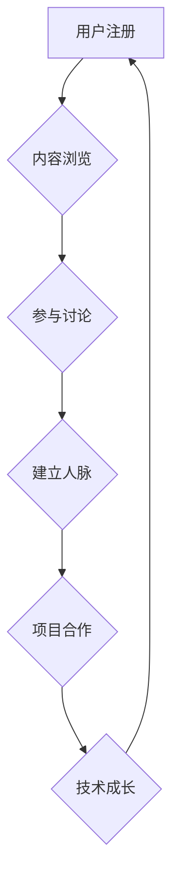

> 技术社区,用户增长,内容运营,社群管理,社区建设,用户粘性,线上社区,线下活动

## 1. 背景介绍

在当今数字化时代，技术社区已成为技术人员交流、学习、分享和合作的重要平台。一个成功的技术社区能够聚集大量专业人才，促进技术创新，并为企业带来商业价值。然而，从零用户到10万用户的社区建设是一个充满挑战的过程，需要精心规划和持续的努力。

## 2. 核心概念与联系

**2.1 技术社区的定义**

技术社区是指围绕特定技术领域或兴趣爱好，由技术人员、爱好者、专家等组成的网络或线下群体。其核心特征包括：

* **专业性:**  围绕特定技术领域或兴趣爱好，成员拥有共同的技术背景或兴趣。
* **互动性:**  成员之间可以通过线上或线下交流平台进行互动，分享知识、经验和资源。
* **共建性:**  社区成员共同参与社区建设，贡献内容、组织活动，推动社区发展。

**2.2 技术社区的价值**

技术社区为成员和企业带来多重价值：

* **成员价值:**  获取技术知识、技能和经验，拓展人脉，获得职业发展机会。
* **企业价值:**  吸引人才，获取技术洞察，促进产品创新，提升品牌影响力。

**2.3 技术社区的架构**

技术社区的架构通常包括以下几个关键部分：

* **平台:**  提供社区功能的线上平台，包括论坛、博客、社交网络等。
* **内容:**  社区的核心资产，包括技术文章、代码库、案例分享等。
* **社群:**  社区成员的聚集地，通过线上或线下活动进行互动交流。
* **运营:**  负责社区的日常运营和管理，包括内容审核、用户管理、活动组织等。

**2.4 Mermaid 流程图**



## 3. 核心算法原理 & 具体操作步骤

**3.1 算法原理概述**

社区建设的核心算法原理在于用户增长和用户粘性。用户增长是指不断吸引新用户加入社区，而用户粘性是指用户在社区内停留时间和参与度。

**3.2 算法步骤详解**

1. **用户获取:** 通过多种渠道吸引目标用户，例如搜索引擎优化、社交媒体推广、线下活动等。
2. **内容运营:**  发布高质量、有价值的内容，吸引用户阅读、参与讨论和分享。
3. **社群管理:**  建立活跃的社群，组织线上线下活动，促进用户互动和交流。
4. **用户体验优化:**  不断优化社区平台和用户体验，提高用户粘性和满意度。
5. **数据分析:**  收集和分析用户数据，了解用户行为和需求，不断改进社区运营策略。

**3.3 算法优缺点**

* **优点:**  能够有效提升用户增长和用户粘性，促进社区发展。
* **缺点:**  需要投入大量时间和资源，需要不断迭代优化。

**3.4 算法应用领域**

该算法适用于所有类型的技术社区，例如开源社区、行业论坛、技术博客等。

## 4. 数学模型和公式 & 详细讲解 & 举例说明

**4.1 数学模型构建**

用户增长模型可以采用指数增长模型，公式如下：

$$
N(t) = N_0 * e^{rt}
$$

其中：

* $N(t)$:  t时刻的用户数量
* $N_0$:  初始用户数量
* $r$:  增长率
* $t$:  时间

**4.2 公式推导过程**

指数增长模型假设用户增长率与现有用户数量成正比。

**4.3 案例分析与讲解**

假设一个技术社区初始用户数量为1000人，增长率为0.1，则经过10个月的用户数量为：

$$
N(10) = 1000 * e^{0.1 * 10} \approx 2718
$$

## 5. 项目实践：代码实例和详细解释说明

**5.1 开发环境搭建**

* 操作系统: Ubuntu 20.04
* 编程语言: Python 3.8
* 框架: Django 3.2

**5.2 源代码详细实现**

```python
# models.py
from django.db import models

class User(models.Model):
    username = models.CharField(max_length=255)
    email = models.EmailField()
    # ...其他字段

class Post(models.Model):
    title = models.CharField(max_length=255)
    content = models.TextField()
    author = models.ForeignKey(User, on_delete=models.CASCADE)
    # ...其他字段

# views.py
from django.shortcuts import render
from .models import Post

def index(request):
    posts = Post.objects.all()
    return render(request, 'index.html', {'posts': posts})
```

**5.3 代码解读与分析**

* models.py 文件定义了用户和帖子模型，用于存储用户和帖子数据。
* views.py 文件定义了首页视图，用于展示所有帖子。

**5.4 运行结果展示**

运行代码后，可以访问 http://localhost:8000/，查看技术社区首页。

## 6. 实际应用场景

技术社区可以应用于各种场景，例如：

* **开源软件社区:**  例如 GitHub, GitLab, SourceForge 等，为开源软件开发人员提供协作平台。
* **行业论坛:**  例如 Stack Overflow, Reddit 等，为特定行业的技术人员提供交流平台。
* **企业内部社区:**  帮助企业员工进行知识共享、项目协作和沟通交流。

**6.4 未来应用展望**

未来技术社区将更加智能化、个性化和沉浸式。例如：

* **人工智能驱动的社区运营:**  利用人工智能技术自动审核内容、推荐用户和组织活动。
* **虚拟现实和增强现实技术:**  打造更加沉浸式的社区体验，例如虚拟会议室和虚拟展览会。
* **区块链技术:**  实现社区数据透明化和去中心化管理。

## 7. 工具和资源推荐

**7.1 学习资源推荐**

* **书籍:**  《社区运营实战》、《用户增长黑客》、《社交网络分析》
* **网站:**  社区运营博客、技术社区论坛

**7.2 开发工具推荐**

* **社区平台:**  Discourse, NodeBB, Flarum
* **内容管理系统:**  WordPress, Drupal, Ghost
* **社交媒体平台:**  Twitter, Facebook, LinkedIn

**7.3 相关论文推荐**

* **社区网络分析:**  Newman, M. E. J. (2010). Networks: An introduction. Oxford University Press.
* **用户增长模型:**  Kohavi, R., & Longbotham, R. (2012). Online controlled experiments. In Handbook of online marketing (pp. 17-36). Springer, Berlin, Heidelberg.

## 8. 总结：未来发展趋势与挑战

**8.1 研究成果总结**

本文介绍了技术社区建设的原理、算法、实践案例和未来发展趋势。

**8.2 未来发展趋势**

技术社区将更加智能化、个性化和沉浸式。

**8.3 面临的挑战**

* **用户增长:**  吸引和留住用户是社区建设的关键挑战。
* **内容运营:**  提供高质量、有价值的内容是社区发展的基石。
* **社群管理:**  建立活跃的社群需要投入大量时间和精力。
* **技术创新:**  社区需要不断采用新技术，提升用户体验。

**8.4 研究展望**

未来研究将重点关注以下几个方面：

* **人工智能驱动的社区运营:**  利用人工智能技术提高社区运营效率。
* **虚拟现实和增强现实技术:**  打造更加沉浸式的社区体验。
* **区块链技术:**  实现社区数据透明化和去中心化管理。

## 9. 附录：常见问题与解答

**9.1 如何吸引新用户？**

* 通过搜索引擎优化、社交媒体推广、线下活动等渠道吸引目标用户。
* 提供高质量、有价值的内容，吸引用户阅读、参与讨论和分享。

**9.2 如何提高用户粘性？**

* 建立活跃的社群，组织线上线下活动，促进用户互动和交流。
* 提供个性化的内容推荐和服务，提升用户体验。

**9.3 如何管理社区？**

* 制定社区规则和规范，维护社区秩序。
* 积极回应用户反馈，及时解决问题。
* 培养社区管理员和志愿者，共同维护社区健康发展。


作者：禅与计算机程序设计艺术 / Zen and the Art of Computer Programming 
<end_of_turn>