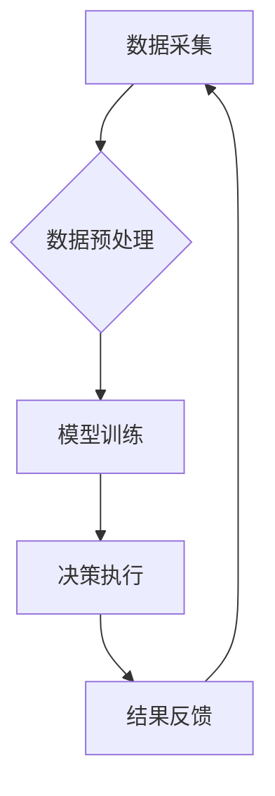

> 数字实体、自动化、人工智能、机器学习、自然语言处理、数据可视化、未来挑战

## 1. 背景介绍

数字实体自动化正处于蓬勃发展的阶段，它正在深刻地改变着我们与数字世界的交互方式。数字实体，也称为数字孪生，是指与物理实体相对应的虚拟模型，它可以实时反映物理实体的状态、行为和环境信息。通过对数字实体的自动化管理和控制，我们可以实现对物理实体的远程监控、预测性维护、优化运营等功能，从而提高效率、降低成本，并创造新的商业价值。

然而，数字实体自动化的发展也面临着诸多挑战。这些挑战主要体现在以下几个方面：

* **数据获取和整合**: 数字实体的构建和运行依赖于海量数据，而这些数据往往分散在不同的系统和平台中，难以获取和整合。
* **数据质量和一致性**: 数字实体的数据需要保持高精度和一致性，否则会影响自动化决策的准确性。
* **模型复杂性和可解释性**: 数字实体的自动化模型往往非常复杂，难以理解和解释，这会阻碍用户对模型的信任和接受。
* **安全性和隐私性**: 数字实体涉及到大量敏感数据，需要采取有效的安全措施来保护数据安全和用户隐私。

## 2. 核心概念与联系

数字实体自动化涉及到多个核心概念和技术，它们相互关联，共同构成了数字实体自动化的生态系统。

**2.1 数字实体**

数字实体是数字孪生的一种形式，它是一个虚拟模型，可以实时反映物理实体的状态、行为和环境信息。数字实体可以包含各种数据，例如传感器数据、历史数据、模型数据等。

**2.2 自动化**

自动化是指通过程序或算法自动执行任务，减少人工干预。在数字实体自动化中，自动化可以应用于各种场景，例如数据采集、模型训练、决策执行等。

**2.3 人工智能 (AI)**

人工智能是指模拟人类智能的计算机系统。在数字实体自动化中，人工智能技术可以用于数据分析、模型预测、智能决策等方面。

**2.4 机器学习 (ML)**

机器学习是人工智能的一个子领域，它通过算法学习数据，并从中提取规律和知识。在数字实体自动化中，机器学习可以用于模型训练、异常检测、预测维护等方面。

**2.5 自然语言处理 (NLP)**

自然语言处理是指计算机理解和处理人类语言的技术。在数字实体自动化中，NLP可以用于数据提取、文本分析、用户交互等方面。

**2.6 数据可视化**

数据可视化是指将数据以图形、图表等形式呈现出来，以便于人类理解和分析。在数字实体自动化中，数据可视化可以用于监控实体状态、分析数据趋势、发现异常情况等。

**2.7 架构图**



## 3. 核心算法原理 & 具体操作步骤

### 3.1  算法原理概述

数字实体自动化的核心算法主要包括：

* **数据采集和预处理**: 从各种数据源收集数据，并进行清洗、转换、格式化等预处理操作，以确保数据质量和一致性。
* **模型训练**: 使用机器学习算法对预处理后的数据进行训练，建立数字实体的自动化模型。
* **决策执行**: 根据模型的预测结果，自动执行相应的控制指令，实现对物理实体的自动化管理和控制。
* **结果反馈**: 收集模型执行结果，并反馈到数据采集环节，用于模型的持续优化和改进。

### 3.2  算法步骤详解

**数据采集和预处理**:

1. 确定数据源和采集方式。
2. 使用数据采集工具从数据源获取数据。
3. 对数据进行清洗，去除噪声、缺失值等异常数据。
4. 对数据进行转换，将数据转换为模型可识别的格式。
5. 对数据进行格式化，确保数据结构和一致性。

**模型训练**:

1. 选择合适的机器学习算法，例如回归、分类、聚类等。
2. 将预处理后的数据分为训练集、验证集和测试集。
3. 使用训练集训练模型，并使用验证集进行模型调参。
4. 使用测试集评估模型的性能，例如准确率、召回率、F1-score等。

**决策执行**:

1. 将模型部署到生产环境中。
2. 收集实时数据，并将其输入到模型中。
3. 根据模型的预测结果，自动执行相应的控制指令。
4. 监控模型的执行结果，并进行必要的调整和优化。

**结果反馈**:

1. 收集模型执行结果，并将其反馈到数据采集环节。
2. 使用反馈结果进行模型的持续优化和改进。

### 3.3  算法优缺点

**优点**:

* 自动化程度高，可以提高效率和降低成本。
* 数据驱动决策，可以提高决策的准确性和有效性。
* 可持续优化，可以不断提升模型的性能。

**缺点**:

* 数据依赖性强，需要海量高质量的数据支持。
* 模型复杂性高，需要专业的技术人员进行开发和维护。
* 可解释性差，难以理解模型的决策逻辑。

### 3.4  算法应用领域

数字实体自动化技术在各个领域都有广泛的应用，例如：

* **制造业**: 智能工厂、预测性维护、生产优化。
* **能源行业**: 电网优化、能源管理、风力发电预测。
* **交通运输**: 智能交通、车辆管理、物流优化。
* **医疗保健**: 远程医疗、疾病诊断、个性化治疗。

## 4. 数学模型和公式 & 详细讲解 & 举例说明

### 4.1  数学模型构建

数字实体自动化的数学模型通常基于统计学、概率论和机器学习等数学理论。

**4.1.1 概率模型**: 

用于描述数字实体状态和行为的概率分布，例如贝叶斯网络、马尔科夫链等。

**4.1.2 回归模型**: 

用于预测数字实体的连续性输出，例如线性回归、逻辑回归等。

**4.1.3 分类模型**: 

用于将数字实体分类到不同的类别，例如支持向量机、决策树等。

### 4.2  公式推导过程

**4.2.1 贝叶斯网络**:

贝叶斯网络是一种概率图模型，用于表示随机变量之间的依赖关系。其核心公式是贝叶斯定理：

$$P(A|B) = \frac{P(B|A)P(A)}{P(B)}$$

其中：

* $P(A|B)$ 是在已知事件 B 发生的情况下，事件 A 发生的概率。
* $P(B|A)$ 是在已知事件 A 发生的情况下，事件 B 发生的概率。
* $P(A)$ 是事件 A 发生的概率。
* $P(B)$ 是事件 B 发生的概率。

**4.2.2 线性回归**:

线性回归模型试图找到一条直线，将输入变量和输出变量之间建立线性关系。其目标函数是：

$$J(\theta) = \frac{1}{2m} \sum_{i=1}^{m} (h_\theta(x^{(i)}) - y^{(i)})^2$$

其中：

* $J(\theta)$ 是损失函数，用于衡量模型预测结果与真实值的误差。
* $m$ 是训练样本的数量。
* $h_\theta(x^{(i)})$ 是模型对第 i 个样本的预测结果。
* $y^{(i)}$ 是第 i 个样本的真实值。
* $\theta$ 是模型参数。

### 4.3  案例分析与讲解

**4.3.1 预测性维护**:

在制造业中，可以使用数字实体自动化技术对设备进行预测性维护。通过收集设备的传感器数据，建立一个预测设备故障的模型，可以提前预警设备故障，避免设备停机和生产损失。

**4.3.2 智能交通**:

在交通运输领域，可以使用数字实体自动化技术构建智能交通系统。通过收集车辆、道路、交通信号灯等数据，可以实现交通流量优化、拥堵缓解、事故预防等功能。

## 5. 项目实践：代码实例和详细解释说明

### 5.1  开发环境搭建

* 操作系统：Ubuntu 20.04 LTS
* Python 版本：3.8.10
* 虚拟环境：venv
* 库依赖：pandas, numpy, scikit-learn, matplotlib

### 5.2  源代码详细实现

```python
import pandas as pd
from sklearn.model_selection import train_test_split
from sklearn.linear_model import LinearRegression
from sklearn.metrics import mean_squared_error

# 加载数据
data = pd.read_csv('sensor_data.csv')

# 划分训练集和测试集
X = data[['temperature', 'pressure']]
y = data['vibration']
X_train, X_test, y_train, y_test = train_test_split(X, y, test_size=0.2, random_state=42)

# 创建线性回归模型
model = LinearRegression()

# 训练模型
model.fit(X_train, y_train)

# 预测测试集数据
y_pred = model.predict(X_test)

# 计算模型性能
mse = mean_squared_error(y_test, y_pred)
print(f'Mean Squared Error: {mse}')

# 保存模型
import joblib
joblib.dump(model, 'vibration_prediction_model.pkl')
```

### 5.3  代码解读与分析

* 代码首先加载传感器数据，并划分训练集和测试集。
* 然后创建线性回归模型，并使用训练集训练模型。
* 接着使用测试集数据预测模型输出，并计算模型性能。
* 最后将训练好的模型保存为文件，以便后续使用。

### 5.4  运行结果展示

运行代码后，会输出模型的均方误差值，以及模型保存的路径。

## 6. 实际应用场景

### 6.1 智能制造

数字实体自动化技术可以应用于智能制造领域，例如：

* **预测性维护**: 通过对设备传感器数据的分析，预测设备故障，提前进行维护，避免设备停机和生产损失。
* **生产优化**: 通过对生产过程数据的分析，优化生产流程，提高生产效率和产品质量。
* **质量控制**: 通过对产品数据的分析，识别产品缺陷，提高产品质量。

### 6.2 智能能源

数字实体自动化技术可以应用于智能能源领域，例如：

* **电网优化**: 通过对电网数据的分析，优化电网调度，提高电网运行效率和可靠性。
* **能源管理**: 通过对能源消耗数据的分析，优化能源使用，降低能源成本。
* **可再生能源预测**: 通过对风力、太阳能等可再生能源数据的分析，预测能源发电量，提高能源利用效率。

### 6.3 智能交通

数字实体自动化技术可以应用于智能交通领域，例如：

* **智能交通信号灯**: 通过对交通流量数据的分析，优化交通信号灯控制策略，缓解交通拥堵。
* **车辆管理**: 通过对车辆数据的分析，实现车辆定位、轨迹追踪、安全预警等功能。
* **自动驾驶**: 通过对车辆传感器数据的分析，实现车辆自动驾驶功能。

### 6.4  未来应用展望

数字实体自动化技术的发展前景广阔，未来将应用于更多领域，例如：

* **医疗保健**: 数字人体模型可以用于疾病诊断、个性化治疗、远程医疗等。
* **教育**: 数字学习环境可以提供个性化学习体验，提高学习效率。
* **娱乐**: 数字游戏角色可以更加逼真、智能，提供更沉浸式的游戏体验。

## 7. 工具和资源推荐

### 7.1  学习资源推荐

* **书籍**:
    * 《数字孪生：构建数字实体的实践指南》
    * 《人工智能：一种现代方法》
    * 《机器学习实战》
*