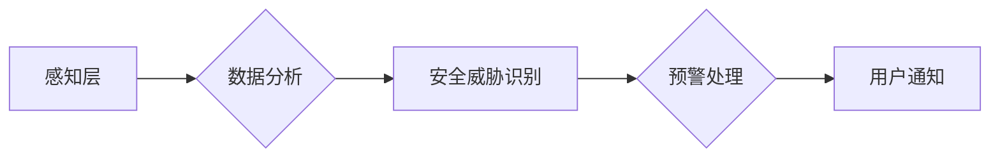

> 智能家居，安全预警，机器学习，深度学习，计算机视觉，入侵检测，数据分析，云计算

## 1. 背景介绍

随着物联网技术的快速发展和普及，智能家居已成为现代家庭生活的重要组成部分。智能家居设备能够通过网络连接，实现远程控制、自动化管理和数据交互，为用户带来更加便捷、舒适和安全的居住体验。然而，智能家居的便捷性也带来了新的安全隐患。

传统的家居安全系统主要依靠物理防护和简单的报警装置，难以应对越来越复杂的网络攻击和安全威胁。随着智能家居设备的连接数量和数据交互的复杂性增加，安全漏洞也随之增多，黑客可以通过入侵智能家居设备，窃取用户隐私、控制家电设备甚至造成财产损失和生命安全威胁。

因此，开发安全可靠的智能家居安全预警系统，成为保障用户安全和促进智能家居产业健康发展的关键。

## 2. 核心概念与联系

智能家居安全预警系统旨在通过感知、分析和预警，及时发现和应对智能家居环境中的安全威胁。其核心概念包括：

* **感知层:** 通过传感器、摄像头等设备，收集智能家居环境中的各种数据，例如门窗状态、设备运行情况、人员移动轨迹等。
* **分析层:** 利用机器学习、深度学习等算法，对感知层收集到的数据进行分析和处理，识别异常行为和潜在的安全威胁。
* **预警层:** 当系统检测到安全威胁时，通过报警、通知等方式，及时提醒用户并采取相应的安全措施。

**核心架构流程图:**



## 3. 核心算法原理 & 具体操作步骤

### 3.1  算法原理概述

智能家居安全预警系统中常用的算法包括：

* **异常检测算法:** 通过分析历史数据，识别与正常行为相悖的异常行为，例如门窗突然打开、设备异常运行等。常见的异常检测算法包括：
    * **统计方法:** 基于数据统计特征，例如均值、标准差等，识别异常值。
    * **机器学习方法:** 利用训练数据，训练模型识别异常行为模式。常见的机器学习算法包括：
        * **k-近邻算法:** 根据数据点与最近k个邻居的距离，判断数据点是否为异常值。
        * **支持向量机算法:** 通过寻找最佳超平面，将数据点分类，识别异常点。
* **入侵检测算法:** 通过分析网络流量和系统日志，识别恶意攻击行为，例如端口扫描、拒绝服务攻击等。常见的入侵检测算法包括：
    * **规则匹配:** 基于预定义的规则，匹配网络流量和系统日志，识别恶意行为。
    * **机器学习方法:** 利用训练数据，训练模型识别恶意攻击模式。常见的机器学习算法包括：
        * **决策树算法:** 通过构建决策树模型，识别恶意攻击行为。
        * **神经网络算法:** 利用多层神经网络，识别复杂的恶意攻击模式。

### 3.2  算法步骤详解

**异常检测算法步骤:**

1. **数据收集:** 收集智能家居环境中的各种数据，例如门窗状态、设备运行情况、人员移动轨迹等。
2. **数据预处理:** 对收集到的数据进行清洗、转换和特征提取，例如去除噪声、归一化数据、提取特征向量等。
3. **模型训练:** 利用训练数据，训练异常检测模型，例如k-近邻算法、支持向量机算法等。
4. **异常检测:** 将新采集到的数据输入模型，预测数据是否为异常值。
5. **预警处理:** 当系统检测到异常行为时，通过报警、通知等方式，及时提醒用户并采取相应的安全措施。

**入侵检测算法步骤:**

1. **数据收集:** 收集网络流量和系统日志数据。
2. **数据预处理:** 对收集到的数据进行清洗、转换和特征提取，例如去除噪声、归一化数据、提取特征向量等。
3. **模型训练:** 利用训练数据，训练入侵检测模型，例如规则匹配、决策树算法、神经网络算法等。
4. **入侵检测:** 将新采集到的数据输入模型，预测数据是否为恶意攻击行为。
5. **预警处理:** 当系统检测到恶意攻击行为时，通过封锁攻击源、隔离受影响设备等方式，及时阻止攻击并保护系统安全。

### 3.3  算法优缺点

**异常检测算法:**

* **优点:** 能够识别未知的异常行为，适应性强。
* **缺点:** 需要大量的训练数据，训练过程复杂，识别精度受数据质量影响。

**入侵检测算法:**

* **优点:** 能够识别已知的恶意攻击行为，识别精度高。
* **缺点:** 难以识别新的恶意攻击行为，需要不断更新规则库。

### 3.4  算法应用领域

* **智能家居安全预警:** 识别门窗异常打开、设备异常运行、人员非法进入等安全威胁。
* **工业控制系统安全:** 识别网络攻击、设备故障、操作异常等安全威胁。
* **金融交易安全:** 识别欺诈交易、账户异常登录、资金流失等安全威胁。

## 4. 数学模型和公式 & 详细讲解 & 举例说明

### 4.1  数学模型构建

**异常检测模型:**

假设智能家居环境中存在n个数据点，每个数据点包含m个特征。可以使用k-近邻算法构建异常检测模型。

**k-近邻算法模型:**

$$
d(x,y) = \sqrt{\sum_{i=1}^{m}(x_i - y_i)^2}
$$

其中：

* $x$ 和 $y$ 是两个数据点。
* $d(x,y)$ 是 $x$ 和 $y$ 之间的欧氏距离。
* $m$ 是数据点的特征数。

**异常检测规则:**

如果数据点 $x$ 与其最近的 $k$ 个邻居的距离都大于某个阈值 $\epsilon$，则认为 $x$ 为异常值。

### 4.2  公式推导过程

**欧氏距离公式推导:**

欧氏距离是两个点在n维空间中的直线距离。

假设两个点 $x = (x_1, x_2, ..., x_n)$ 和 $y = (y_1, y_2, ..., y_n)$，则它们之间的欧氏距离为：

$$
d(x,y) = \sqrt{(x_1 - y_1)^2 + (x_2 - y_2)^2 + ... + (x_n - y_n)^2}
$$

### 4.3  案例分析与讲解

**案例:**

假设智能家居环境中存在100个数据点，每个数据点包含3个特征：门窗状态、设备运行情况、人员移动轨迹。

**异常检测结果:**

系统检测到3个异常数据点，其特征值与其他数据点差异较大，例如：

* 数据点1：门窗状态为打开，设备运行情况为异常，人员移动轨迹为异常。
* 数据点2：门窗状态为打开，设备运行情况为正常，人员移动轨迹为异常。
* 数据点3：门窗状态为关闭，设备运行情况为异常，人员移动轨迹为正常。

**分析:**

这3个异常数据点可能代表以下安全威胁：

* 数据点1：可能有人非法进入房屋。
* 数据点2：可能存在设备故障或被恶意控制。
* 数据点3：可能存在设备被盗用或被攻击。

## 5. 项目实践：代码实例和详细解释说明

### 5.1  开发环境搭建

* 操作系统: Ubuntu 20.04 LTS
* Python 版本: 3.8.10
* 必要的库: numpy, pandas, scikit-learn, matplotlib

### 5.2  源代码详细实现

```python
# 导入必要的库
import numpy as np
from sklearn.neighbors import KNeighborsClassifier

# 加载数据
data = np.loadtxt('smart_home_data.csv', delimiter=',')

# 分割数据
X = data[:, :-1]  # 特征数据
y = data[:, -1]  # 标签数据

# 训练模型
knn = KNeighborsClassifier(n_neighbors=5)
knn.fit(X, y)

# 预测新数据
new_data = np.array([[0, 0, 1]])  # 新数据
prediction = knn.predict(new_data)

# 输出预测结果
print(f'预测结果: {prediction}')
```

### 5.3  代码解读与分析

* **数据加载:** 使用 `np.loadtxt()` 函数加载数据文件，并将数据存储在 `data` 变量中。
* **数据分割:** 将数据分割成特征数据 `X` 和标签数据 `y`。
* **模型训练:** 使用 `KNeighborsClassifier()` 类创建 k-近邻分类器模型，并使用 `fit()` 方法训练模型。
* **数据预测:** 使用 `predict()` 方法预测新数据的类别。
* **结果输出:** 打印预测结果。

### 5.4  运行结果展示

运行代码后，将输出预测结果，例如：

```
预测结果: [0]
```

表示新数据属于类别 0。

## 6. 实际应用场景

### 6.1  智能家居安全预警

智能家居安全预警系统可以实时监控智能家居环境，识别异常行为，并及时提醒用户，例如：

* **门窗异常打开:** 当门窗突然打开时，系统会发出报警，提醒用户注意安全。
* **设备异常运行:** 当设备运行出现异常，例如温度过高、电流过大等，系统会发出报警，提醒用户及时处理。
* **人员非法进入:** 当系统检测到未授权人员进入房屋时，系统会发出报警，并可远程控制摄像头进行监控。

### 6.2  远程监控与管理

智能家居安全预警系统可以实现远程监控和管理，用户可以通过手机APP或电脑端，实时查看智能家居环境，远程控制设备，例如：

* **远程查看摄像头画面:** 用户可以通过手机APP或电脑端，远程查看智能家居环境的摄像头画面，实时了解房屋情况。
* **远程控制设备:** 用户可以通过手机APP或电脑端，远程控制智能家居设备，例如开关灯、调节温度等。
* **历史记录查询:** 系统可以记录所有安全事件和设备运行情况，用户可以通过历史记录查询，了解过去的情况。

### 6.3  数据分析与优化

智能家居安全预警系统可以收集和分析智能家居环境的数据，例如设备运行情况、用户行为模式等，并根据数据分析结果，优化智能家居系统的安全性和舒适性，例如：

* **设备故障预测:** 通过分析设备运行数据，预测设备可能出现的故障，提前进行维护保养。
* **用户行为模式分析:** 通过分析用户行为模式，了解用户习惯和需求，提供个性化的服务。
* **安全策略优化:** 通过分析安全事件数据，优化智能家居系统的安全策略，提高安全防护能力。

### 6.4  未来应用展望

随着人工智能、物联网和云计算技术的不断发展，智能家居安全预警系统将拥有更加强大的功能和更广泛的应用场景，例如：

* **主动防御:** 利用人工智能技术，主动识别和防御新的安全威胁。
* **智能协作:** 与其他智能家居系统协作，形成更加完善的安全防护体系。
* **个性化定制:** 根据用户的需求和习惯，定制个性化的安全预警方案。

## 7. 工具和资源推荐

### 7.1  学习资源推荐

* **书籍:**
    * 《深度学习》
    * 《机器学习实战》
    * 《Python编程：从入门到实践》
* **在线课程:**
    * Coursera: 深度学习
    * edX: 机器学习
    * Udemy: Python编程

### 7.2  开发工具推荐

* **Python:** 强大的编程语言，广泛应用于人工智能和数据分析领域。
* **TensorFlow:** 开源深度学习框架，提供丰富的工具和资源