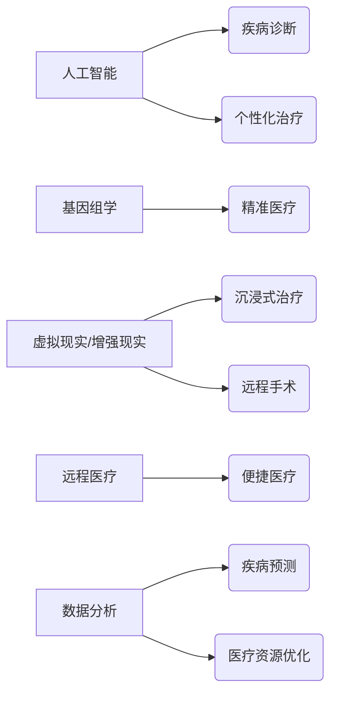

> 人工智能，医疗保健，疾病诊断，个性化治疗，基因编辑，虚拟现实，增强现实，远程医疗，数据分析，机器学习

## 1. 背景介绍

医疗保健领域正处于前所未有的变革时期。人工智能（AI）、大数据、基因组学和生物技术等技术的快速发展，正在重塑医疗保健的未来。到2050年，我们预计将看到医疗保健的彻底转型，从传统的疾病治疗模式向更加注重预防、个性化和精准医疗的模式转变。

## 2. 核心概念与联系

未来医疗的核心概念包括：

* **人工智能驱动的诊断和治疗:** AI 算法能够分析海量医疗数据，识别疾病模式，辅助医生进行诊断和制定个性化治疗方案。
* **基因组学和精准医疗:** 基因组学技术的进步将使我们能够更深入地了解个体差异，并根据基因信息进行精准的疾病预防和治疗。
* **虚拟现实和增强现实:** VR/AR 技术将为患者提供沉浸式的治疗体验，并帮助医生进行远程手术和培训。
* **远程医疗和移动医疗:** 远程医疗和移动医疗将使医疗服务更加便捷，并缩小医疗资源的地域差距。
* **数据分析和预测:** 大数据分析技术将帮助我们预测疾病流行趋势，优化医疗资源配置，并提高医疗服务效率。

**核心概念架构图:**



## 3. 核心算法原理 & 具体操作步骤

### 3.1  算法原理概述

未来医疗的核心算法包括机器学习、深度学习、自然语言处理等。这些算法能够从海量医疗数据中学习模式，并进行预测和决策。

* **机器学习:** 机器学习算法能够从数据中学习规律，并根据学习到的规律进行预测。例如，可以使用机器学习算法预测患者的疾病风险。
* **深度学习:** 深度学习算法是一种更高级的机器学习算法，它能够学习更复杂的模式。例如，可以使用深度学习算法识别医学影像中的异常。
* **自然语言处理:** 自然语言处理算法能够理解和处理人类语言。例如，可以使用自然语言处理算法分析患者的病历记录，并从中提取有用的信息。

### 3.2  算法步骤详解

以下是一个使用机器学习算法进行疾病预测的具体操作步骤：

1. **数据收集:** 收集患者的医疗数据，包括病历记录、实验室检查结果、影像学检查结果等。
2. **数据预处理:** 对收集到的数据进行清洗、转换和特征提取。
3. **模型训练:** 选择合适的机器学习算法，并使用训练数据对模型进行训练。
4. **模型评估:** 使用测试数据评估模型的性能，例如准确率、召回率、F1-score等。
5. **模型部署:** 将训练好的模型部署到生产环境中，用于预测新的患者的疾病风险。

### 3.3  算法优缺点

**优点:**

* 能够从海量数据中发现隐藏的模式。
* 能够进行精准的预测和决策。
* 能够提高医疗服务的效率和质量。

**缺点:**

* 需要大量的训练数据。
* 算法的解释性较差。
* 算法可能存在偏差。

### 3.4  算法应用领域

机器学习、深度学习和自然语言处理等算法在医疗保健领域有广泛的应用，例如：

* 疾病诊断
* 药物研发
* 个性化治疗
* 医疗影像分析
* 患者管理
* 医疗资源优化

## 4. 数学模型和公式 & 详细讲解 & 举例说明

### 4.1  数学模型构建

在未来医疗中，数学模型被广泛用于模拟疾病发展、预测患者风险、优化治疗方案等。例如，可以使用微分方程模型模拟疾病的传播过程，并预测疫情的流行趋势。

### 4.2  公式推导过程

假设一个疾病的传播过程可以用以下微分方程模型表示：

$$
\frac{dS}{dt} = -\beta SI
$$

$$
\frac{dI}{dt} = \beta SI - \gamma I
$$

其中：

* $S$ 表示健康人群的数量
* $I$ 表示感染人群的数量
* $\beta$ 表示感染率
* $\gamma$ 表示恢复率
* $t$ 表示时间

通过解上述微分方程，可以得到疾病传播过程的演变趋势。

### 4.3  案例分析与讲解

例如，我们可以使用上述模型来预测新冠疫情的流行趋势。通过收集疫情期间的感染率和恢复率数据，我们可以将这些数据代入模型中，并模拟疾病传播过程。通过模拟结果，我们可以预测疫情的峰值时间、感染人数等信息。

## 5. 项目实践：代码实例和详细解释说明

### 5.1  开发环境搭建

未来医疗项目可以使用 Python 语言进行开发，并结合 TensorFlow、PyTorch 等深度学习框架。

### 5.2  源代码详细实现

以下是一个使用 TensorFlow 框架进行疾病诊断的代码示例：

```python
import tensorflow as tf

# 定义模型结构
model = tf.keras.models.Sequential([
    tf.keras.layers.Dense(128, activation='relu', input_shape=(1024,)),
    tf.keras.layers.Dense(64, activation='relu'),
    tf.keras.layers.Dense(1, activation='sigmoid')
])

# 编译模型
model.compile(optimizer='adam',
              loss='binary_crossentropy',
              metrics=['accuracy'])

# 训练模型
model.fit(x_train, y_train, epochs=10)

# 评估模型
loss, accuracy = model.evaluate(x_test, y_test)
print('Loss:', loss)
print('Accuracy:', accuracy)
```

### 5.3  代码解读与分析

这段代码定义了一个简单的深度学习模型，用于进行疾病诊断。模型输入是患者的医疗数据，输出是疾病存在的概率。

### 5.4  运行结果展示

训练完成后，我们可以使用测试数据评估模型的性能。模型的性能指标包括准确率、召回率、F1-score等。

## 6. 实际应用场景

未来医疗的应用场景非常广泛，例如：

* **疾病诊断:** AI 算法能够分析患者的症状、病史、实验室检查结果等信息，辅助医生进行疾病诊断。
* **个性化治疗:** 基于患者的基因信息、生活方式、病史等数据，AI 算法可以制定个性化的治疗方案。
* **药物研发:** AI 算法可以加速药物研发过程，例如预测药物的疗效和安全性。
* **远程医疗:** 远程医疗平台可以连接患者和医生，提供远程咨询、诊断和治疗服务。
* **医疗影像分析:** AI 算法可以辅助医生分析医学影像，例如 X 光片、CT 扫描、MRI 扫描等。

### 6.4  未来应用展望

未来医疗将更加智能化、个性化和精准化。AI 算法将发挥越来越重要的作用，帮助我们更好地预防、诊断和治疗疾病。

## 7. 工具和资源推荐

### 7.1  学习资源推荐

* **在线课程:** Coursera、edX、Udacity 等平台提供人工智能、机器学习、深度学习等方面的在线课程。
* **书籍:** 《深度学习》、《机器学习实战》、《人工智能：一种现代方法》等书籍。
* **开源项目:** TensorFlow、PyTorch、Scikit-learn 等开源项目。

### 7.2  开发工具推荐

* **Python:** Python 是一种流行的编程语言，广泛用于人工智能开发。
* **TensorFlow:** TensorFlow 是一个开源的深度学习框架。
* **PyTorch:** PyTorch 是另一个流行的深度学习框架。
* **Jupyter Notebook:** Jupyter Notebook 是一个交互式编程环境，方便进行数据分析和模型开发。

### 7.3  相关论文推荐

* **AlphaFold:** https://deepmind.com/blog/alphafold-a-solution-to-a-50-year-old-grand-challenge-in-biology
* **BERT:** https://arxiv.org/abs/1810.04805
* **GPT-3:** https://openai.com/blog/gpt-3/

## 8. 总结：未来发展趋势与挑战

### 8.1  研究成果总结

未来医疗领域取得了显著的进展，AI 算法在疾病诊断、个性化治疗、药物研发等方面展现出巨大的潜力。

### 8.2  未来发展趋势

未来医疗将更加智能化、个性化和精准化。AI 算法将发挥越来越重要的作用，帮助我们更好地预防、诊断和治疗疾病。

### 8.3  面临的挑战

未来医疗的发展也面临着一些挑战，例如：

* **数据隐私和安全:** 医疗数据非常敏感，需要采取有效的措施保护患者隐私和数据安全。
* **算法解释性和可信度:** AI 算法的决策过程往往难以解释，这可能会影响患者的信任和接受度。
* **伦理问题:** AI 算法在医疗保健中的应用可能会引发一些伦理问题，例如算法偏见、责任归属等。

### 8.4  研究展望

未来，我们需要继续加强对未来医疗技术的研发和应用，并积极应对相关挑战，以确保 AI 技术能够真正惠及人类健康。

## 9. 附录：常见问题与解答

**常见问题:**

* AI 算法是否能够完全取代医生？
* AI 算法的决策是否可靠？
* AI 算法如何保护患者隐私？

**解答:**

* AI 算法可以辅助医生进行诊断和治疗，但不能完全取代医生。医生仍然需要根据患者的具体情况进行判断和决策。
* AI 算法的决策可靠性取决于算法的训练数据和模型的复杂度。需要不断改进算法和模型，提高其准确性和可靠性。
* 医疗数据需要采取有效的措施进行加密和匿名处理，以保护患者隐私。


作者：禅与计算机程序设计艺术 / Zen and the Art of Computer Programming 


<end_of_turn>