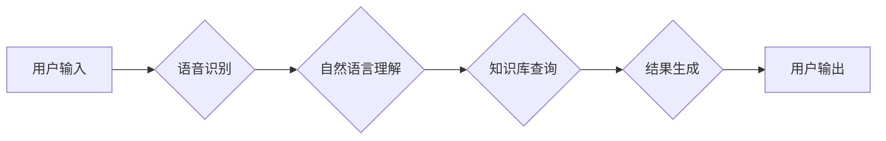

> 苹果, AI应用, 深度学习, 自然语言处理, 计算机视觉, 机器学习, 人工智能

## 1. 背景介绍

近年来，人工智能（AI）技术飞速发展，已渗透到生活的方方面面。苹果公司作为科技巨头，也积极拥抱AI技术，将其应用于其产品和服务中。2023年，苹果发布了一系列AI应用，引发了业界和消费者的广泛关注。

苹果的AI应用并非一蹴而就，而是经过多年的积累和探索。早在2016年，苹果就收购了语音识别公司Siri，并将其整合到其产品中。随后，苹果持续投入AI研究，建立了强大的AI团队，并开发了一系列AI芯片，例如A系列芯片和M系列芯片。这些芯片拥有强大的计算能力，能够高效地运行AI算法。

苹果的AI应用涵盖多个领域，包括自然语言处理、计算机视觉、机器学习等。例如，Siri可以理解用户的语音指令，并提供相应的服务；Face ID可以识别用户的面部特征，实现安全解锁；照片应用可以自动识别物体和场景，并进行智能排序。

## 2. 核心概念与联系

### 2.1 自然语言处理 (NLP)

自然语言处理是人工智能领域的一个重要分支，旨在使计算机能够理解和处理人类语言。NLP技术广泛应用于语音识别、机器翻译、文本摘要等领域。

### 2.2 计算机视觉 (CV)

计算机视觉是人工智能领域另一个重要分支，旨在使计算机能够“看”和理解图像和视频。CV技术广泛应用于图像识别、物体检测、人脸识别等领域。

### 2.3 机器学习 (ML)

机器学习是人工智能领域的核心技术之一，旨在通过算法训练模型，使模型能够从数据中学习并做出预测。机器学习算法可以分为监督学习、无监督学习和强化学习等类型。

**Mermaid 流程图**



## 3. 核心算法原理 & 具体操作步骤

### 3.1 算法原理概述

苹果的AI应用基于深度学习算法，深度学习是一种机器学习算法，它利用多层神经网络来模拟人类大脑的学习过程。深度学习算法能够从海量数据中学习复杂的特征，从而实现更准确的预测和识别。

### 3.2 算法步骤详解

1. **数据收集和预处理:** 收集大量相关数据，并进行清洗、格式化等预处理操作。
2. **模型构建:** 根据任务需求，选择合适的深度学习模型架构，例如卷积神经网络（CNN）或循环神经网络（RNN）。
3. **模型训练:** 使用训练数据训练模型，调整模型参数，使模型能够准确地完成任务。
4. **模型评估:** 使用测试数据评估模型的性能，例如准确率、召回率等指标。
5. **模型部署:** 将训练好的模型部署到实际应用场景中，例如手机应用程序、服务器等。

### 3.3 算法优缺点

**优点:**

* 能够学习复杂的特征，实现更准确的预测和识别。
* 能够处理海量数据，具有强大的泛化能力。

**缺点:**

* 需要大量的训练数据，训练成本较高。
* 模型训练时间较长，需要强大的计算资源。
* 模型解释性较差，难以理解模型的决策过程。

### 3.4 算法应用领域

深度学习算法广泛应用于以下领域：

* **图像识别:** 人脸识别、物体检测、图像分类等。
* **语音识别:** 语音转文本、语音助手等。
* **自然语言处理:** 机器翻译、文本摘要、情感分析等。
* **推荐系统:** 商品推荐、内容推荐等。

## 4. 数学模型和公式 & 详细讲解 & 举例说明

### 4.1 数学模型构建

深度学习模型通常由多层神经网络组成，每层神经网络包含多个神经元。每个神经元接收来自上一层的输入信号，并通过激活函数进行处理，输出到下一层。

**神经网络模型**

```latex
y = f(W_1 * x_1 + W_2 * x_2 + ... + W_n * x_n + b)
```

其中：

* $y$ 是输出值
* $x_1, x_2, ..., x_n$ 是输入值
* $W_1, W_2, ..., W_n$ 是权重参数
* $b$ 是偏置参数
* $f$ 是激活函数

### 4.2 公式推导过程

深度学习模型的训练过程是通过反向传播算法来进行的。反向传播算法利用梯度下降法来更新模型参数，使模型的预测结果与真实值之间的误差最小化。

**梯度下降法**

```latex
W = W - \alpha \frac{\partial Loss}{\partial W}
```

其中：

* $W$ 是权重参数
* $\alpha$ 是学习率
* $\frac{\partial Loss}{\partial W}$ 是损失函数对权重参数的梯度

### 4.3 案例分析与讲解

例如，在图像分类任务中，深度学习模型可以学习图像的特征，并将其映射到不同的类别。训练过程中，模型会根据图像标签进行调整，使模型能够准确地识别图像的类别。

## 5. 项目实践：代码实例和详细解释说明

### 5.1 开发环境搭建

* 操作系统：macOS, Windows, Linux
* Python 版本：3.7+
* 深度学习框架：TensorFlow, PyTorch

### 5.2 源代码详细实现

```python
import tensorflow as tf

# 定义模型结构
model = tf.keras.models.Sequential([
    tf.keras.layers.Conv2D(32, (3, 3), activation='relu', input_shape=(28, 28, 1)),
    tf.keras.layers.MaxPooling2D((2, 2)),
    tf.keras.layers.Conv2D(64, (3, 3), activation='relu'),
    tf.keras.layers.MaxPooling2D((2, 2)),
    tf.keras.layers.Flatten(),
    tf.keras.layers.Dense(10, activation='softmax')
])

# 编译模型
model.compile(optimizer='adam',
              loss='sparse_categorical_crossentropy',
              metrics=['accuracy'])

# 训练模型
model.fit(x_train, y_train, epochs=5)

# 评估模型
loss, accuracy = model.evaluate(x_test, y_test)
print('Test loss:', loss)
print('Test accuracy:', accuracy)
```

### 5.3 代码解读与分析

这段代码定义了一个简单的卷积神经网络模型，用于手写数字识别任务。模型包含两层卷积层、两层最大池化层、一层全连接层和一层输出层。

* **Conv2D层:** 用于提取图像特征。
* **MaxPooling2D层:** 用于降维，减少计算量。
* **Flatten层:** 将多维数据转换为一维数据。
* **Dense层:** 全连接层，用于分类。

### 5.4 运行结果展示

训练完成后，模型可以用于识别新的手写数字图像。

## 6. 实际应用场景

### 6.1 语音助手

苹果的Siri语音助手利用自然语言处理技术，能够理解用户的语音指令，并提供相应的服务，例如设置提醒、发送邮件、播放音乐等。

### 6.2 人脸识别

Face ID是苹果手机的安全解锁功能，它利用计算机视觉技术识别用户的面部特征，实现安全解锁。

### 6.3 智能照片排序

照片应用可以自动识别照片中的物体和场景，并进行智能排序，例如将所有宠物照片归类到一起。

### 6.4 未来应用展望

苹果的AI应用未来将更加智能化和个性化。例如，AI助手将能够更好地理解用户的需求，提供更精准的服务；智能家居将能够更加智能地控制家电设备；医疗领域将能够利用AI技术辅助诊断和治疗疾病。

## 7. 工具和资源推荐

### 7.1 学习资源推荐

* **书籍:**
    * 深度学习
    * 人工智能：一种现代方法
* **在线课程:**
    * Coursera 深度学习课程
    * Udacity 机器学习工程师 Nanodegree

### 7.2 开发工具推荐

* **Python:** 
* **TensorFlow:** 深度学习框架
* **PyTorch:** 深度学习框架
* **Keras:** 深度学习框架

### 7.3 相关论文推荐

* **ImageNet Classification with Deep Convolutional Neural Networks**
* **Attention Is All You Need**

## 8. 总结：未来发展趋势与挑战

### 8.1 研究成果总结

苹果的AI应用取得了显著的成果，在语音助手、人脸识别、智能照片排序等领域取得了领先地位。

### 8.2 未来发展趋势

* **更智能的AI助手:** AI助手将能够更好地理解用户的需求，提供更精准的服务。
* **更安全的AI应用:** AI技术将被用于增强安全保障，例如身份验证、欺诈检测等。
* **更个性化的AI体验:** AI应用将根据用户的喜好和需求进行个性化定制。

### 8.3 面临的挑战

* **数据隐私和安全:** AI应用需要大量数据进行训练，如何保护用户数据隐私和安全是一个重要的挑战。
* **算法偏见:** AI算法可能存在偏见，导致不公平的结果，需要进行算法调优和监督。
* **伦理问题:** AI技术的发展引发了一些伦理问题，例如人工智能的责任和义务等，需要进行深入探讨和研究。

### 8.4 研究展望

未来，人工智能技术将继续发展，并对我们的生活产生更深远的影响。苹果公司将继续投入AI研究，开发更智能、更安全、更个性化的AI应用，为用户提供更好的体验。

## 9. 附录：常见问题与解答

**Q1: 苹果的AI应用是如何训练的？**

**A1:** 苹果的AI应用使用大量的训练数据，并通过深度学习算法进行训练。

**Q2: 苹果的AI应用有哪些应用场景？**

**A2:** 苹果的AI应用广泛应用于语音助手、人脸识别、智能照片排序等领域。

**Q3: 苹果的AI应用如何保证数据隐私和安全？**

**A3:** 苹果公司重视数据隐私和安全，采取了多种措施来保护用户数据，例如数据加密、匿名化处理等。


作者：禅与计算机程序设计艺术 / Zen and the Art of Computer Programming 
<end_of_turn>