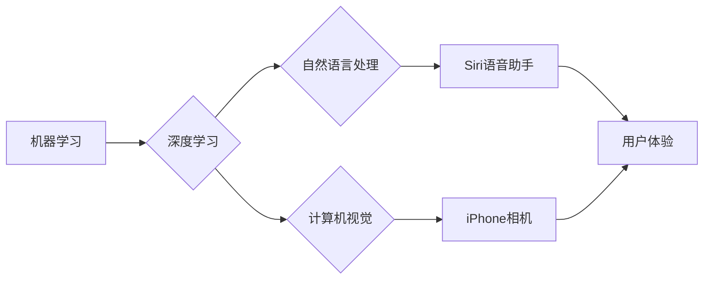

> 苹果, AI, 应用生态,  机器学习, 深度学习, 自然语言处理, 计算机视觉, 数据安全

## 1. 背景介绍

近年来，人工智能（AI）技术飞速发展，已渗透到生活的方方面面。苹果公司作为科技巨头，也积极布局AI领域，并将其融入到产品和服务中。2023年，苹果发布了一系列AI应用，旨在构建一个开放、安全、便捷的AI应用生态。

苹果的AI战略的核心是将AI技术融入到用户体验中，提升用户生活品质。苹果认为，AI技术应该服务于用户，而不是取代用户。因此，苹果在开发AI应用时，始终坚持以下原则：

* **隐私保护:** 苹果高度重视用户隐私，并将其作为AI应用开发的首要原则。苹果承诺不会收集用户的个人数据用于训练AI模型，也不会将用户的个人数据用于广告推送。
* **安全可靠:** 苹果致力于开发安全可靠的AI应用，确保用户使用AI应用时不会受到任何安全威胁。苹果采用多层安全机制，保护用户的个人数据和设备安全。
* **易用性:** 苹果希望AI应用能够被每个人轻松使用，因此苹果在设计AI应用时，注重用户体验，使其易于理解和操作。

## 2. 核心概念与联系

苹果构建AI应用生态的核心概念包括：

* **机器学习（Machine Learning）:** 机器学习是AI领域的核心技术之一，它允许计算机从数据中学习，并根据学习到的知识进行预测或决策。苹果在开发AI应用时，广泛应用机器学习算法，例如监督学习、无监督学习和强化学习。
* **深度学习（Deep Learning）:** 深度学习是机器学习的一种高级形式，它使用多层神经网络来模拟人类大脑的学习过程。深度学习在图像识别、语音识别和自然语言处理等领域取得了突破性进展。苹果也积极探索深度学习技术，并将其应用于其AI产品和服务中。
* **自然语言处理（Natural Language Processing）:** 自然语言处理是指计算机理解和处理人类语言的技术。苹果在Siri语音助手、iMessage智能回复等产品中应用了自然语言处理技术，使用户能够更自然地与设备进行交互。
* **计算机视觉（Computer Vision）:** 计算机视觉是指计算机理解和处理图像和视频的技术。苹果在iPhone相机、Face ID人脸识别等产品中应用了计算机视觉技术，使用户能够更便捷地使用设备。

**核心概念与联系流程图:**



## 3. 核心算法原理 & 具体操作步骤

### 3.1  算法原理概述

苹果在AI应用中广泛应用各种机器学习算法，例如：

* **线性回归:** 用于预测连续值，例如房价、股票价格等。
* **逻辑回归:** 用于分类问题，例如垃圾邮件过滤、用户画像等。
* **决策树:** 用于分类和回归问题，能够处理非线性关系。
* **支持向量机:** 用于分类问题，能够处理高维数据。
* **神经网络:** 用于复杂问题，例如图像识别、语音识别等。

### 3.2  算法步骤详解

以线性回归为例，其算法步骤如下：

1. **数据收集和预处理:** 收集相关数据，并进行清洗、转换、特征工程等预处理操作。
2. **模型构建:** 根据数据特征选择合适的线性回归模型。
3. **模型训练:** 使用训练数据训练模型，调整模型参数，使模型能够准确预测目标值。
4. **模型评估:** 使用测试数据评估模型性能，例如R方、均方误差等指标。
5. **模型部署:** 将训练好的模型部署到实际应用场景中，用于预测新的数据。

### 3.3  算法优缺点

**线性回归算法的优点:**

* 算法简单易懂，易于实现。
* 计算效率高，适合处理大规模数据。
* 可解释性强，能够直观地理解模型的决策过程。

**线性回归算法的缺点:**

* 只能处理线性关系，对于非线性关系的预测效果较差。
* 对异常值敏感，容易受到异常值的影响。

### 3.4  算法应用领域

线性回归算法广泛应用于以下领域：

* **金融预测:** 预测股票价格、房价、贷款风险等。
* **市场营销:** 预测客户购买行为、广告效果等。
* **医疗诊断:** 预测疾病风险、治疗效果等。

## 4. 数学模型和公式 & 详细讲解 & 举例说明

### 4.1  数学模型构建

线性回归模型的数学模型如下：

$$
y = \beta_0 + \beta_1x_1 + \beta_2x_2 + ... + \beta_nx_n + \epsilon
$$

其中：

* $y$ 是目标变量。
* $x_1, x_2, ..., x_n$ 是特征变量。
* $\beta_0, \beta_1, \beta_2, ..., \beta_n$ 是模型参数。
* $\epsilon$ 是误差项。

### 4.2  公式推导过程

线性回归模型的目标是找到最佳的模型参数，使模型能够最准确地预测目标变量。可以使用最小二乘法来求解模型参数。最小二乘法的原理是：

* 计算模型预测值与实际值之间的误差平方和。
* 找到使误差平方和最小的模型参数。

### 4.3  案例分析与讲解

假设我们想要预测房屋价格，特征变量包括房屋面积、房间数量、地理位置等。我们可以使用线性回归模型来建立房屋价格预测模型。

例如，我们可以得到以下线性回归模型：

$$
y = 10000 + 500x_1 + 1000x_2
$$

其中：

* $y$ 是房屋价格。
* $x_1$ 是房屋面积。
* $x_2$ 是房间数量。

这个模型表示，房屋面积每增加1平方米，房屋价格增加500元；房间数量每增加1个，房屋价格增加1000元。

## 5. 项目实践：代码实例和详细解释说明

### 5.1  开发环境搭建

* 操作系统：macOS, Windows, Linux
* Python版本：3.7+
* 库依赖：scikit-learn, numpy, pandas

### 5.2  源代码详细实现

```python
import pandas as pd
from sklearn.linear_model import LinearRegression
from sklearn.model_selection import train_test_split

# 加载数据
data = pd.read_csv('house_price.csv')

# 选择特征变量和目标变量
X = data[['面积', '房间']]
y = data['价格']

# 将数据划分为训练集和测试集
X_train, X_test, y_train, y_test = train_test_split(X, y, test_size=0.2, random_state=42)

# 创建线性回归模型
model = LinearRegression()

# 训练模型
model.fit(X_train, y_train)

# 预测测试集数据
y_pred = model.predict(X_test)

# 评估模型性能
from sklearn.metrics import mean_squared_error
mse = mean_squared_error(y_test, y_pred)
print(f'均方误差: {mse}')
```

### 5.3  代码解读与分析

* 首先，我们加载数据，选择特征变量和目标变量。
* 然后，我们将数据划分为训练集和测试集，用于训练和评估模型。
* 接下来，我们创建线性回归模型，并使用训练集数据训练模型。
* 训练完成后，我们使用测试集数据预测目标变量，并评估模型性能。

### 5.4  运行结果展示

运行代码后，会输出模型的均方误差值。均方误差值越小，模型的预测效果越好。

## 6. 实际应用场景

苹果的AI应用生态已在多个领域得到应用，例如：

* **Siri语音助手:** 使用自然语言处理技术，能够理解用户的语音指令，并执行相应的操作。
* **Face ID人脸识别:** 使用计算机视觉技术，能够识别用户的面部特征，用于解锁设备和进行身份验证。
* **智能回复:** 使用自然语言处理技术，能够自动生成智能回复，提高用户沟通效率。
* **照片识别:** 使用计算机视觉技术，能够识别照片中的物体和场景，并进行自动分类和搜索。

### 6.4  未来应用展望

苹果的AI应用生态未来将更加广泛地应用于各个领域，例如：

* **医疗保健:** 使用AI技术辅助医生诊断疾病、制定治疗方案。
* **教育:** 使用AI技术个性化学习，提高学习效率。
* **交通运输:** 使用AI技术实现自动驾驶，提高交通安全和效率。

## 7. 工具和资源推荐

### 7.1  学习资源推荐

* **Coursera:** 提供丰富的AI课程，例如Andrew Ng的机器学习课程。
* **Udacity:** 提供AI相关的职业培训课程。
* **Kaggle:** 提供AI竞赛和数据集，可以用于练习和学习。

### 7.2  开发工具推荐

* **TensorFlow:** 开源深度学习框架。
* **PyTorch:** 开源深度学习框架。
* **scikit-learn:** 开源机器学习库。

### 7.3  相关论文推荐

* **《ImageNet Classification with Deep Convolutional Neural Networks》:** 
* **《Attention Is All You Need》:** 

## 8. 总结：未来发展趋势与挑战

### 8.1  研究成果总结

苹果在AI领域取得了显著的成果，其AI应用生态已成为行业标杆。苹果的AI技术在用户体验、隐私保护、安全可靠等方面都表现出色。

### 8.2  未来发展趋势

未来，苹果的AI应用生态将朝着以下方向发展：

* **更智能的应用:** AI应用将更加智能化，能够更好地理解用户的需求，并提供更个性化的服务。
* **更广泛的应用场景:** AI技术将应用于更多领域，例如医疗保健、教育、交通运输等。
* **更强大的计算能力:** AI模型的规模和复杂度将不断增加，需要更强大的计算能力来支持。

### 8.3  面临的挑战

苹果的AI应用生态也面临一些挑战：

* **数据安全和隐私保护:** AI模型的训练需要大量数据，如何确保数据的安全和隐私保护是一个重要挑战。
* **算法偏见:** AI算法可能存在偏见，导致不公平的结果。如何解决算法偏见是一个重要的研究课题。
* **可解释性:** 许多AI模型是黑箱模型，难以解释其决策过程。如何提高AI模型的可解释性是一个重要的挑战。

### 8.4  研究展望

未来，苹果将继续加大对AI技术的投入，并致力于构建一个安全、可靠、便捷的AI应用生态。


## 9. 附录：常见问题与解答

**Q1: 苹果的AI应用是如何保证用户隐私的？**

**A1:** 苹果在开发AI应用时，始终坚持隐私保护原则。苹果承诺不会收集用户的个人数据用于训练AI模型，也不会将用户的个人数据用于广告推送。

**Q2: 苹果的AI应用是否会存在算法偏见？**

**A2:** 苹果意识到算法偏见是一个重要问题，并正在积极研究解决方案。苹果正在开发新的算法和技术，以减少算法偏见。

**Q3: 苹果的AI应用是否可以解释其决策过程？**

**A3:** 苹果正在努力提高AI模型的可解释性。苹果正在开发新的技术，使AI模型的决策过程更加透明。


作者：禅与计算机程序设计艺术 / Zen and the Art of Computer Programming 
<end_of_turn>