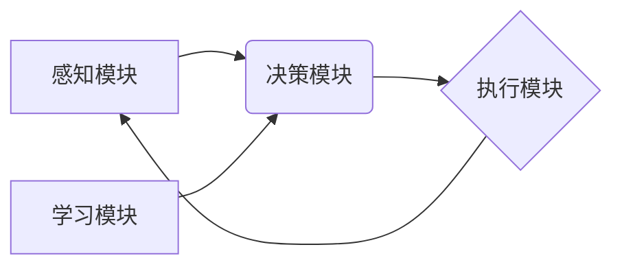

> AI Agent, 强化学习, 决策理论, 知识表示, 自然语言处理, 机器学习

## 1. 背景介绍

在人工智能领域，AI Agent（智能代理）作为一种能够感知环境、做出决策并与环境交互的智能体，扮演着越来越重要的角色。从自动驾驶汽车到智能家居，从医疗诊断到金融交易，AI Agent正在深刻地改变着我们的生活。构建一个高效、智能、可靠的AI Agent，是人工智能领域的核心挑战之一。

传统的AI系统通常依赖于人工设计的规则和知识库，而AI Agent则更侧重于通过学习和经验积累来提升其智能水平。这使得AI Agent能够更好地适应复杂、动态的环境，并解决传统方法难以处理的复杂问题。

## 2. 核心概念与联系

**2.1 AI Agent的构成**

AI Agent通常由以下几个核心组件组成：

* **感知模块:** 用于收集环境信息，例如传感器数据、文本信息、图像信息等。
* **决策模块:** 基于感知到的信息，做出最优决策，例如选择行动、制定策略等。
* **执行模块:** 将决策转化为实际行动，与环境进行交互。
* **学习模块:** 通过经验积累，不断优化决策策略，提升AI Agent的智能水平。

**2.2 核心概念关系图**



**2.3 核心技术**

构建AI Agent的核心技术包括：

* **强化学习:**  通过奖励机制，训练AI Agent在环境中学习最优策略。
* **决策理论:** 提供决策分析和选择框架，帮助AI Agent做出理性决策。
* **知识表示:**  用于表示和处理AI Agent的知识和推理能力。
* **自然语言处理:**  使AI Agent能够理解和生成自然语言，与人类进行交互。
* **机器学习:**  用于训练AI Agent的感知、决策和学习模块。

## 3. 核心算法原理 & 具体操作步骤

**3.1 算法原理概述**

强化学习是构建AI Agent的核心算法之一。它是一种基于奖励机制的机器学习方法，通过不断地与环境交互，学习最优策略。

**3.2 算法步骤详解**

1. **环境建模:** 建立一个数学模型来描述环境的状态、动作和奖励。
2. **策略选择:** AI Agent选择一个策略，用于根据当前状态选择动作。
3. **环境交互:** AI Agent执行选择的动作，并观察环境状态的变化和获得奖励。
4. **价值函数估计:**  估计每个状态下采取不同动作的长期价值。
5. **策略更新:** 根据价值函数的估计，更新策略，使其能够选择更优的动作。
6. **重复步骤3-5:**  不断地与环境交互，更新策略，直到达到预设的目标。

**3.3 算法优缺点**

* **优点:** 能够学习复杂、动态的环境，并找到最优策略。
* **缺点:** 训练过程可能需要大量的时间和资源，并且容易陷入局部最优解。

**3.4 算法应用领域**

* 自动驾驶
* 游戏人工智能
* 机器人控制
* 医疗诊断
* 金融交易

## 4. 数学模型和公式 & 详细讲解 & 举例说明

**4.1 数学模型构建**

强化学习的数学模型通常由以下几个要素组成：

* **状态空间:**  所有可能的环境状态的集合。
* **动作空间:**  AI Agent可以采取的所有动作的集合。
* **奖励函数:**  描述AI Agent在每个状态下采取每个动作后获得的奖励。
* **价值函数:**  估计每个状态下采取不同动作的长期价值。

**4.2 公式推导过程**

* **Bellman方程:**  用于更新价值函数的公式。

$$
V(s) = \max_a \sum_{s'} P(s'|s,a) [r(s,a,s') + \gamma V(s')]
$$

其中：

* $V(s)$ 是状态 $s$ 的价值。
* $a$ 是AI Agent可以采取的动作。
* $s'$ 是状态 $s$ 采取动作 $a$ 后可能到达的下一个状态。
* $P(s'|s,a)$ 是从状态 $s$ 采取动作 $a$ 到达状态 $s'$ 的概率。
* $r(s,a,s')$ 是在状态 $s$ 采取动作 $a$ 后到达状态 $s'$ 获得的奖励。
* $\gamma$ 是折扣因子，控制未来奖励的权重。

**4.3 案例分析与讲解**

例如，在一个简单的迷宫环境中，AI Agent的目标是找到通往出口的路径。

* 状态空间: 迷宫中的所有位置。
* 动作空间: 向上、向下、向左、向右四个方向移动。
* 奖励函数: 抵达出口获得最大奖励，迷宫中其他位置获得较小的奖励，撞墙获得惩罚。
* 价值函数: 估计每个位置到达出口的期望奖励。

通过Bellman方程，AI Agent可以不断更新价值函数，并选择最优路径到达出口。

## 5. 项目实践：代码实例和详细解释说明

**5.1 开发环境搭建**

* Python 3.x
* TensorFlow 或 PyTorch
* OpenAI Gym

**5.2 源代码详细实现**

```python
import gym
import numpy as np

# 定义环境
env = gym.make('CartPole-v1')

# 定义学习率
learning_rate = 0.1

# 定义折扣因子
gamma = 0.99

# 定义状态空间维度
state_dim = env.observation_space.shape[0]

# 定义动作空间维度
action_dim = env.action_space.n

# 初始化Q表
Q_table = np.zeros((state_dim, action_dim))

# 训练循环
for episode in range(1000):
    # 重置环境
    state = env.reset()

    # 训练过程
    done = False
    while not done:
        # 选择动作
        action = np.argmax(Q_table[state])

        # 执行动作
        next_state, reward, done, _ = env.step(action)

        # 更新Q表
        Q_table[state, action] = (1 - learning_rate) * Q_table[state, action] + learning_rate * (reward + gamma * np.max(Q_table[next_state]))

        # 更新状态
        state = next_state

    # 打印进度
    print(f"Episode {episode+1} completed")

# 测试
state = env.reset()
while True:
    # 选择动作
    action = np.argmax(Q_table[state])

    # 执行动作
    next_state, reward, done, _ = env.step(action)

    # 显示环境
    env.render()

    # 更新状态
    state = next_state

    # 结束游戏
    if done:
        break

env.close()
```

**5.3 代码解读与分析**

这段代码实现了基于Q学习的CartPole环境的AI Agent训练。

* 首先，定义了环境、学习率、折扣因子、状态空间维度和动作空间维度。
* 然后，初始化了一个Q表，用于存储每个状态下每个动作的价值。
* 训练循环中，AI Agent会根据当前状态选择最优动作，执行动作，并根据奖励更新Q表。
* 训练完成后，可以测试AI Agent在环境中的表现。

**5.4 运行结果展示**

运行代码后，AI Agent会学习如何在CartPole环境中保持平衡，并最终能够长时间保持平衡。

## 6. 实际应用场景

**6.1 自动驾驶**

AI Agent可以用于控制自动驾驶汽车，感知周围环境，做出最优决策，例如加速、减速、转向等。

**6.2 游戏人工智能**

AI Agent可以用于开发游戏中的智能对手，例如围棋、象棋、Go等。

**6.3 机器人控制**

AI Agent可以用于控制机器人，使其能够完成各种任务，例如搬运物体、清洁环境等。

**6.4 医疗诊断**

AI Agent可以用于辅助医生进行医疗诊断，例如分析医学影像、预测疾病风险等。

**6.5 金融交易**

AI Agent可以用于进行金融交易，例如股票交易、期货交易等。

**6.6 未来应用展望**

随着人工智能技术的不断发展，AI Agent的应用场景将会更加广泛，例如：

* 个性化教育
* 智能客服
* 智慧城市
* 医疗保健

## 7. 工具和资源推荐

**7.1 学习资源推荐**

* **书籍:**
    * Reinforcement Learning: An Introduction by Richard S. Sutton and Andrew G. Barto
    * Artificial Intelligence: A Modern Approach by Stuart Russell and Peter Norvig
* **在线课程:**
    * Coursera: Reinforcement Learning Specialization
    * Udacity: Intro to Artificial Intelligence
* **博客和网站:**
    * OpenAI Blog
    * DeepMind Blog

**7.2 开发工具推荐**

* **Python:** 广泛用于人工智能开发的编程语言。
* **TensorFlow:** Google开发的开源机器学习框架。
* **PyTorch:** Facebook开发的开源机器学习框架。
* **OpenAI Gym:** 用于训练强化学习算法的环境库。

**7.3 相关论文推荐**

* Deep Reinforcement Learning with Double Q-learning
* Proximal Policy Optimization Algorithms
* Asynchronous Methods for Deep Reinforcement Learning

## 8. 总结：未来发展趋势与挑战

**8.1 研究成果总结**

近年来，强化学习取得了显著的进展，在许多领域取得了成功应用。例如，AlphaGo击败了世界围棋冠军，AlphaStar在星际争霸2中取得了职业水平的表现。

**8.2 未来发展趋势**

* **更强大的算法:**  开发更强大、更鲁棒的强化学习算法，能够解决更复杂的问题。
* **更丰富的环境:**  构建更丰富的、更真实的模拟环境，以便AI Agent能够更好地学习和训练。
* **更安全的AI Agent:**  确保AI Agent的安全性和可靠性，避免其产生不可预知的行为。

**8.3 面临的挑战**

* **样本效率:** 强化学习算法通常需要大量的样本数据进行训练，这在现实世界中可能难以实现。
* **可解释性:** 强化学习模型的决策过程往往难以解释，这可能会导致人们对AI Agent的信任度降低。
* **伦理问题:**  AI Agent的应用可能会引发一些伦理问题，例如算法偏见、隐私泄露等。

**8.4 研究展望**

未来，强化学习的研究将继续朝着更强大、更安全、更可解释的方向发展。


## 9. 附录：常见问题与解答

**9.1 Q: 强化学习和监督学习有什么区别？**

**A:** 强化学习和监督学习都是机器学习的范畴，但它们的区别在于数据来源和学习目标。

* **监督学习:**  使用标记数据进行训练，目标是学习一个能够将输入映射到输出的函数。
* **强化学习:**  使用奖励机制进行训练，目标是学习一个能够在环境中取得最大奖励的策略。

**9.2 Q: 如何评估AI Agent的性能？**

**A:** AI Agent的性能可以通过各种指标进行评估，例如：

* **奖励总和:**  AI Agent在环境中获得的总奖励。
* **成功率:**  AI Agent完成目标任务的成功率。
* **平均回报:**  AI Agent在每个时间步长的平均回报。

**9.3 Q: 强化学习算法有哪些？**

**A:** 强化学习算法有很多种，例如：

* **Q学习:**  一种经典的强化学习算法，通过更新Q表来学习策略。
* **SARSA:**  一种基于状态-动作-奖励-状态-动作的强化学习算法。
* **Deep Q-Network (DQN):**  使用深度神经网络来估计Q值。
* **Policy Gradient:**  直接优化策略，而不是Q值。


作者：禅与计算机程序设计