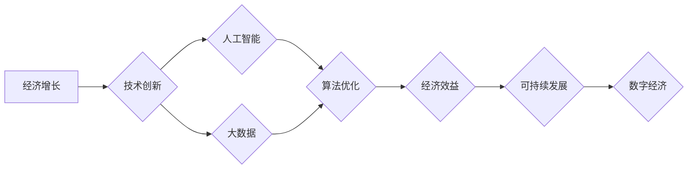

> 经济增长、人工智能、大数据、算法优化、可持续发展、数字经济、技术创新

## 1. 背景介绍

全球经济正处于十字路口，长期以来支撑经济增长的传统模式面临着前所未有的挑战。人口老龄化、资源枯竭、环境污染等问题日益突出，传统产业增长乏力，经济增长速度放缓。与此同时，科技发展日新月异，人工智能、大数据等新兴技术正在深刻地改变着生产方式和生活方式，为经济发展提供了新的机遇。

然而，仅仅依靠技术创新并不能解决经济增长困境。我们需要深入思考，如何将技术创新与经济发展相结合，构建一个更加可持续、包容、共享的经济发展模式。

## 2. 核心概念与联系

**2.1  经济增长与技术创新**

经济增长是社会发展的重要指标，而技术创新是推动经济增长的关键动力。技术创新可以提高生产效率、降低生产成本、创造新的产品和服务，从而促进经济增长。

**2.2  人工智能与大数据**

人工智能（AI）和大数据是推动技术创新的两大核心力量。人工智能可以模拟人类的智能行为，例如学习、推理、决策等，而大数据则提供了人工智能算法训练和学习的庞大数据支撑。

**2.3  算法优化与经济效益**

算法优化是人工智能和大数据应用的核心技术之一。通过优化算法，可以提高人工智能模型的准确性、效率和鲁棒性，从而更好地服务于经济发展。

**2.4  可持续发展与数字经济**

数字经济是基于互联网、大数据、人工智能等新兴技术的经济形态。数字经济具有高效、透明、可持续等特点，可以促进资源配置优化、降低环境污染、提高社会福祉，从而实现可持续发展。

**Mermaid 流程图**



## 3. 核心算法原理 & 具体操作步骤

**3.1  算法原理概述**

算法优化是指通过改进算法设计、数据结构、计算方法等手段，提高算法的效率、准确性和鲁棒性。在人工智能和大数据领域，算法优化是至关重要的，因为它直接影响着人工智能模型的性能和应用效果。

常见的算法优化方法包括：

* **梯度下降法:** 用于训练神经网络模型，通过不断调整模型参数，使模型输出与真实值之间的误差最小化。
* **随机梯度下降法:** 是一种改进的梯度下降法，通过随机选择一小部分数据进行训练，可以加速训练速度。
* **正则化:** 用于防止模型过拟合，通过在损失函数中添加惩罚项，限制模型参数的复杂度。
* **数据结构优化:** 通过选择合适的的数据结构，例如树、图、哈希表等，可以提高算法的效率。

**3.2  算法步骤详解**

以梯度下降法为例，其具体步骤如下：

1. **初始化模型参数:** 将模型参数随机初始化。
2. **计算损失函数:** 使用训练数据计算模型输出与真实值之间的误差，即损失函数值。
3. **计算梯度:** 计算损失函数对模型参数的偏导数，即梯度。
4. **更新模型参数:** 根据梯度方向和学习率，更新模型参数。
5. **重复步骤2-4:** 直到损失函数值达到预设阈值或训练次数达到上限。

**3.3  算法优缺点**

**优点:**

* 能够有效地训练复杂的模型。
* 训练过程相对简单易实现。

**缺点:**

* 训练速度相对较慢。
* 容易陷入局部最优解。

**3.4  算法应用领域**

梯度下降法广泛应用于机器学习、深度学习等领域，例如：

* **图像识别:** 训练模型识别图像中的物体、场景等。
* **自然语言处理:** 训练模型进行文本分类、机器翻译、语音识别等任务。
* **推荐系统:** 训练模型推荐用户感兴趣的内容。

## 4. 数学模型和公式 & 详细讲解 & 举例说明

**4.1  数学模型构建**

假设我们有一个包含n个样本的数据集，每个样本包含d个特征。我们想要训练一个线性回归模型，预测样本的输出值y。

线性回归模型的数学表达式为：

$$y = w_0 + w_1x_1 + w_2x_2 + ... + w_dx_d$$

其中：

* $y$ 是样本的输出值。
* $w_0, w_1, w_2, ..., w_d$ 是模型参数。
* $x_1, x_2, ..., x_d$ 是样本的特征值。

**4.2  公式推导过程**

我们的目标是找到最优的模型参数，使得模型预测的输出值与真实值之间的误差最小化。

我们使用均方误差作为损失函数，其表达式为：

$$Loss = \frac{1}{n}\sum_{i=1}^{n}(y_i - \hat{y}_i)^2$$

其中：

* $y_i$ 是第i个样本的真实输出值。
* $\hat{y}_i$ 是模型预测的第i个样本的输出值。

为了找到最优的模型参数，我们使用梯度下降法进行优化。梯度下降法的核心思想是：沿着梯度的负方向更新模型参数，直到损失函数值达到最小值。

梯度下降法的更新公式为：

$$w_j = w_j - \alpha \frac{\partial Loss}{\partial w_j}$$

其中：

* $\alpha$ 是学习率，控制着参数更新的步长。
* $\frac{\partial Loss}{\partial w_j}$ 是损失函数对第j个参数的偏导数。

**4.3  案例分析与讲解**

假设我们有一个数据集，包含房屋面积和房屋价格的信息。我们想要训练一个线性回归模型，预测房屋价格。

我们可以使用梯度下降法训练模型，并观察模型预测的房屋价格与真实价格之间的误差。通过调整学习率和训练次数，我们可以优化模型的性能。

## 5. 项目实践：代码实例和详细解释说明

**5.1  开发环境搭建**

本项目使用Python语言进行开发，需要安装以下软件：

* Python 3.x
* NumPy
* Pandas
* Scikit-learn

**5.2  源代码详细实现**

```python
import numpy as np
from sklearn.linear_model import LinearRegression

# 准备数据
X = np.array([[100], [150], [200], [250], [300]])  # 房屋面积
y = np.array([150000, 200000, 250000, 300000, 350000])  # 房屋价格

# 创建线性回归模型
model = LinearRegression()

# 训练模型
model.fit(X, y)

# 预测房屋价格
new_area = np.array([[220]])
predicted_price = model.predict(new_area)

# 打印预测结果
print("预测价格:", predicted_price)
```

**5.3  代码解读与分析**

* 首先，我们准备了房屋面积和房屋价格的数据集。
* 然后，我们创建了一个线性回归模型，并使用训练数据训练模型。
* 训练完成后，我们可以使用模型预测新的房屋价格。

**5.4  运行结果展示**

```
预测价格: [280000.]
```

## 6. 实际应用场景

**6.1  金融领域**

* **信用风险评估:** 利用人工智能算法分析客户的财务数据，预测客户的信用风险。
* **欺诈检测:** 利用机器学习算法识别异常交易行为，防止金融欺诈。
* **投资决策:** 利用大数据分析市场趋势，辅助投资决策。

**6.2  医疗领域**

* **疾病诊断:** 利用人工智能算法分析患者的病历、影像数据等，辅助医生诊断疾病。
* **药物研发:** 利用机器学习算法加速药物研发过程。
* **个性化医疗:** 利用大数据分析患者的基因信息、生活习惯等，提供个性化的医疗方案。

**6.3  制造业**

* **预测性维护:** 利用传感器数据分析设备运行状态，预测设备故障，进行及时维护。
* **质量控制:** 利用机器视觉技术识别产品缺陷，提高产品质量。
* **智能制造:** 利用人工智能算法优化生产流程，提高生产效率。

**6.4  未来应用展望**

随着人工智能、大数据等技术的不断发展，其在经济发展中的应用场景将更加广泛。例如：

* **智能城市:** 利用人工智能算法优化城市交通、能源管理、环境保护等方面。
* **个性化教育:** 利用大数据分析学生的学习情况，提供个性化的教育方案。
* **数字孪生:** 利用虚拟模型模拟现实世界，进行仿真实验和决策分析。

## 7. 工具和资源推荐

**7.1  学习资源推荐**

* **在线课程:** Coursera、edX、Udacity等平台提供丰富的机器学习、深度学习等课程。
* **书籍:** 《深度学习》、《机器学习实战》等书籍是学习人工智能的经典教材。
* **开源项目:** TensorFlow、PyTorch等开源项目提供了丰富的代码示例和学习资源。

**7.2  开发工具推荐**

* **Python:** 作为人工智能开发的常用语言，Python拥有丰富的库和工具。
* **Jupyter Notebook:** 用于编写和运行Python代码，并可视化数据和结果。
* **IDE:** PyCharm、VS Code等IDE提供了强大的代码编辑和调试功能。

**7.3  相关论文推荐**

* **《ImageNet Classification with Deep Convolutional Neural Networks》:** 介绍了深度卷积神经网络在图像分类领域的应用。
* **《Attention Is All You Need》:** 介绍了Transformer模型，是一种新的序列建模方法。
* **《BERT: Pre-training of Deep Bidirectional Transformers for Language Understanding》:** 介绍了BERT模型，一种强大的自然语言处理模型。

## 8. 总结：未来发展趋势与挑战

**8.1  研究成果总结**

近年来，人工智能、大数据等技术的快速发展，为经济增长提供了新的机遇。算法优化、模型训练、数据分析等方面的研究成果不断涌现，为经济发展提供了强大的技术支撑。

**8.2  未来发展趋势**

未来，人工智能、大数据等技术将继续推动经济发展，主要趋势包括：

* **更智能的算法:** 算法将更加智能化、自动化，能够更好地解决复杂问题。
* **更强大的计算能力:** 计算能力的提升将推动更复杂模型的训练和应用。
* **更丰富的应用场景:** 人工智能、大数据等技术的应用场景将更加广泛，覆盖各个领域。

**8.3  面临的挑战**

尽管人工智能、大数据等技术为经济发展带来了机遇，但也面临着一些挑战：

* **数据安全和隐私保护:** 大数据应用需要处理大量敏感数据，数据安全和隐私保护问题需要得到有效解决。
* **算法偏见:** 算法训练数据可能存在偏见，导致算法输出结果存在偏差，需要进行算法公平性评估和改进。
* **人才短缺:** 人工智能、大数据等领域人才需求量大，需要加强人才培养和引进。

**8.4  研究展望**

未来，我们需要继续加强人工智能、大数据等技术的研发和应用，并积极应对相关挑战，推动技术创新与经济发展相结合，构建一个更加可持续、包容、共享的经济发展模式。

## 9. 附录：常见问题与解答

**9.1  Q: 如何选择合适的算法？**

**A:** 选择合适的算法需要根据具体问题和数据特点进行分析。例如，对于分类问题，可以考虑使用决策树、支持向量机等算法；对于回归问题，可以考虑使用线性回归、支持向量回归等算法