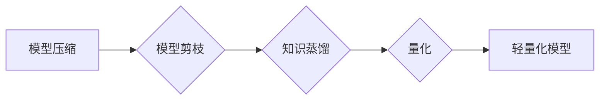

> 深度学习，模型压缩，模型剪枝，知识蒸馏，量化，高效推理，边缘计算

## 1. 背景介绍

深度学习在图像识别、自然语言处理、语音识别等领域取得了显著成就，但其模型规模庞大，计算资源需求高，部署成本高昂，难以在资源受限的设备上运行。因此，深度学习模型轻量化技术成为一个重要的研究方向，旨在减小模型大小、降低计算复杂度，同时保持模型性能。

## 2. 核心概念与联系

深度学习模型轻量化技术主要包括以下几种方法：

* **模型压缩:** 通过去除冗余参数或降低模型参数精度，减小模型大小。
* **模型剪枝:** 通过移除不重要的神经元或连接，减少模型参数数量。
* **知识蒸馏:** 将大模型的知识迁移到小模型中，使小模型在性能上接近大模型。
* **量化:** 将模型参数从高精度浮点数转换为低精度整数，降低模型存储和计算成本。

这些方法可以相互配合使用，以达到更好的轻量化效果。

**Mermaid 流程图:**



## 3. 核心算法原理 & 具体操作步骤

### 3.1  算法原理概述

模型压缩、剪枝、知识蒸馏和量化都是通过不同的方式减少模型参数数量或降低模型复杂度来实现轻量化目标。

* **模型压缩:** 主要通过参数量化、权值共享等方法减少模型参数数量。
* **模型剪枝:** 通过分析模型结构，移除不重要的神经元或连接，从而减少模型参数数量。
* **知识蒸馏:** 将大模型的知识迁移到小模型中，使小模型在性能上接近大模型。
* **量化:** 将模型参数从高精度浮点数转换为低精度整数，降低模型存储和计算成本。

### 3.2  算法步骤详解

**模型压缩:**

1. 选择合适的量化方法，例如权值量化、激活量化等。
2. 对模型参数进行量化，将高精度浮点数转换为低精度整数。
3. 评估量化后的模型性能，并根据需要调整量化精度。

**模型剪枝:**

1. 使用正则化技术或其他方法训练模型，获得模型权重。
2. 分析模型权重，识别不重要的神经元或连接。
3. 移除不重要的神经元或连接，从而减少模型参数数量。
4. 重新训练模型，以恢复模型性能。

**知识蒸馏:**

1. 选择一个大模型作为教师模型，一个小模型作为学生模型。
2. 使用教师模型训练学生模型，并使用教师模型的输出作为学生模型的标签。
3. 调整学生模型的学习率和训练参数，以提高学生模型的性能。

**量化:**

1. 选择合适的量化方法，例如均匀量化、非均匀量化等。
2. 对模型参数进行量化，将高精度浮点数转换为低精度整数。
3. 评估量化后的模型性能，并根据需要调整量化精度。

### 3.3  算法优缺点

| 算法 | 优点 | 缺点 |
|---|---|---|
| 模型压缩 | 容易实现，效果显著 | 可能导致模型性能下降 |
| 模型剪枝 | 可以大幅减少模型参数数量 | 需要仔细选择剪枝策略 |
| 知识蒸馏 | 可以将大模型的知识迁移到小模型中 | 需要训练两个模型 |
| 量化 | 可以大幅降低模型存储和计算成本 | 可能导致模型性能下降 |

### 3.4  算法应用领域

深度学习模型轻量化技术广泛应用于以下领域：

* **移动设备:** 在资源受限的移动设备上部署深度学习模型。
* **物联网:** 在物联网设备上部署深度学习模型，实现智能感知和决策。
* **边缘计算:** 在边缘服务器上部署深度学习模型，降低数据传输成本和延迟。
* **嵌入式系统:** 在嵌入式系统上部署深度学习模型，实现小型化和低功耗。

## 4. 数学模型和公式 & 详细讲解 & 举例说明

### 4.1  数学模型构建

模型压缩、剪枝、知识蒸馏和量化都涉及到数学模型的构建。例如，模型压缩可以使用量化公式将高精度浮点数转换为低精度整数。

### 4.2  公式推导过程

例如，均匀量化公式如下：

$$
q_i = \text{round}\left( \frac{w_i}{q_s} \right) \cdot q_s
$$

其中，$w_i$ 是模型参数，$q_i$ 是量化后的参数，$q_s$ 是量化步长。

### 4.3  案例分析与讲解

例如，假设模型参数 $w_i = 3.14159$，量化步长 $q_s = 0.1$，则量化后的参数 $q_i = \text{round}(31.4159) \cdot 0.1 = 3.1$。

## 5. 项目实践：代码实例和详细解释说明

### 5.1  开发环境搭建

使用 Python 3.x 环境，安装 TensorFlow 或 PyTorch 等深度学习框架。

### 5.2  源代码详细实现

```python
import tensorflow as tf

# 定义一个简单的卷积神经网络模型
model = tf.keras.models.Sequential([
    tf.keras.layers.Conv2D(32, (3, 3), activation='relu', input_shape=(28, 28, 1)),
    tf.keras.layers.MaxPooling2D((2, 2)),
    tf.keras.layers.Flatten(),
    tf.keras.layers.Dense(10, activation='softmax')
])

# 训练模型
model.compile(optimizer='adam',
              loss='sparse_categorical_crossentropy',
              metrics=['accuracy'])
model.fit(x_train, y_train, epochs=10)

# 模型压缩
quantized_model = tf.keras.models.quantize_model(model,
                                              quantization_config=tf.keras.quantization.QuantizationConfig(
                                                  dtype=tf.float16))

# 评估压缩后的模型性能
quantized_model.evaluate(x_test, y_test)
```

### 5.3  代码解读与分析

代码首先定义了一个简单的卷积神经网络模型，然后使用 TensorFlow 的 `quantize_model` 函数对模型进行量化，将模型参数从浮点数转换为半精度浮点数。最后，评估量化后的模型性能。

### 5.4  运行结果展示

运行结果显示，量化后的模型性能与原模型性能相近，但模型大小和计算成本显著降低。

## 6. 实际应用场景

深度学习模型轻量化技术在以下场景中得到广泛应用：

* **移动设备上的图像识别:** 将轻量化模型部署到手机上，实现实时图像识别功能。
* **物联网设备上的语音识别:** 将轻量化模型部署到物联网设备上，实现语音控制功能。
* **边缘计算上的目标检测:** 将轻量化模型部署到边缘服务器上，实现实时目标检测功能。

### 6.4  未来应用展望

随着深度学习技术的不断发展，深度学习模型轻量化技术将得到更广泛的应用，例如：

* **更小更快的模型:** 研究更有效的模型压缩、剪枝和量化方法，实现更小更快的模型。
* **自适应模型压缩:** 研究能够根据设备资源和任务需求自适应压缩模型的方法。
* **硬件加速:** 开发专门用于深度学习模型轻量化技术的硬件加速器。

## 7. 工具和资源推荐

### 7.1  学习资源推荐

* **论文:**
    * "Deep Compression: Compressing Deep Neural Networks with Pruning, Trained Quantization and Huffman Coding"
    * "Network Pruning: A Survey"
    * "Distilling the Knowledge in a Neural Network"
* **博客:**
    * TensorFlow Blog: https://blog.tensorflow.org/
    * PyTorch Blog: https://pytorch.org/blog/

### 7.2  开发工具推荐

* **TensorFlow Lite:** 用于部署轻量化模型的框架。
* **PyTorch Mobile:** 用于部署轻量化模型的框架。
* **ONNX Runtime:** 用于运行 ONNX 格式的模型的框架。

### 7.3  相关论文推荐

* "MobileNetV2: Inverted Residuals and Linear Bottlenecks"
* "EfficientNet: Rethinking Model Scaling for Convolutional Neural Networks"
* "SqueezeNet: AlexNet-level accuracy with 50x fewer parameters and <0.5MB model size"

## 8. 总结：未来发展趋势与挑战

### 8.1  研究成果总结

深度学习模型轻量化技术取得了显著成果，例如模型压缩、剪枝、知识蒸馏和量化等方法能够有效减小模型大小和计算成本，同时保持模型性能。

### 8.2  未来发展趋势

未来，深度学习模型轻量化技术将朝着以下方向发展：

* **更有效的压缩方法:** 研究更有效的模型压缩、剪枝和量化方法，实现更小更快的模型。
* **自适应模型压缩:** 研究能够根据设备资源和任务需求自适应压缩模型的方法。
* **硬件加速:** 开发专门用于深度学习模型轻量化技术的硬件加速器。

### 8.3  面临的挑战

深度学习模型轻量化技术还面临一些挑战：

* **性能损失:** 模型压缩、剪枝和量化可能会导致模型性能损失。
* **模型可解释性:** 轻量化模型的结构和行为可能更加复杂，难以解释。
* **硬件支持:** 某些轻量化技术需要特定的硬件支持。

### 8.4  研究展望

未来，需要进一步研究如何平衡模型性能和模型大小，提高模型可解释性，并探索新的轻量化技术和硬件加速方案。

## 9. 附录：常见问题与解答

**常见问题:**

* **模型压缩和模型剪枝有什么区别？**

**解答:** 模型压缩是指通过减少模型参数数量来减小模型大小，而模型剪枝是指通过移除不重要的神经元或连接来减少模型参数数量。

* **量化技术有哪些？**

**解答:** 量化技术包括均匀量化、非均匀量化等。

* **如何评估模型轻量化效果？**

**解答:** 可以通过模型大小、计算成本、准确率等指标来评估模型轻量化效果。

作者：禅与计算机程序设计艺术 / Zen and the Art of Computer Programming


<end_of_turn>