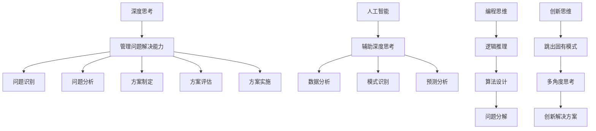

# 深度思考与管理问题解决能力的提升

> 深度思考，问题解决，管理能力，人工智能，算法，编程，逻辑思维，创新

## 1. 背景介绍

在当今科技飞速发展的时代，人工智能、大数据、云计算等新兴技术蓬勃发展，为人类社会带来了前所未有的机遇和挑战。面对日益复杂的技术环境和不断涌现的新问题，深度思考和管理问题解决能力已成为个人和组织持续发展的关键驱动力。

传统的教育模式往往侧重于知识的传授和技能的训练，而忽略了培养深度思考和问题解决能力的重要性。然而，在实际工作中，我们经常面临着无法用已有的知识和技能直接解决的问题，需要我们进行深入思考、分析和创新。

## 2. 核心概念与联系

**2.1 深度思考**

深度思考是指对问题进行深入的分析和理解，超越表面现象，探究其本质和根源。它需要我们跳出固有的思维模式，运用逻辑推理、批判性思维和创造性思维，从多角度、多层次地思考问题，并最终得出有价值的见解和解决方案。

**2.2 管理问题解决能力**

管理问题解决能力是指能够有效地识别、分析、评估和解决各种复杂问题的能力。它包括以下几个方面：

* **问题识别:** 能够准确识别问题的存在和本质。
* **问题分析:** 能够深入分析问题的原因、影响因素和潜在后果。
* **方案制定:** 能够根据问题特点，提出多种可行的解决方案。
* **方案评估:** 能够对不同的解决方案进行评估，选择最优方案。
* **方案实施:** 能够有效地实施方案，并进行跟踪和评估。

**2.3 核心概念联系**

深度思考是管理问题解决能力的基础。只有通过深度思考，才能对问题有更深入的理解，才能提出更有效、更创新的解决方案。




## 3. 核心算法原理 & 具体操作步骤

### 3.1 算法原理概述

在深度思考和问题解决的过程中，我们可以借鉴计算机科学中的算法思想。这里我们介绍一种基于"分治法"（Divide and Conquer）的问题解决算法，我们称之为"深度思考与问题解决算法"（Deep Thinking and Problem Solving Algorithm，简称DTPS算法）。

DTPS算法的核心思想是将复杂问题分解为更小、更容易管理的子问题，然后逐步解决这些子问题，最后将解决方案整合起来，得到原问题的解决方案。

### 3.2 算法步骤详解

1. **问题定义**：明确定义问题，包括问题的背景、目标和约束条件。

2. **问题分解**：将复杂问题分解为若干个子问题。这个过程可能需要多次迭代，直到子问题足够简单，可以直接解决。

3. **深度分析**：对每个子问题进行深入分析，包括：
   - 收集相关信息和数据
   - 识别关键因素和潜在影响
   - 运用批判性思维，质疑假设和常规做法

4. **方案生成**：为每个子问题生成多个可能的解决方案。这一步骤需要运用创造性思维，跳出常规思维模式。

5. **方案评估**：评估每个子问题的解决方案，考虑其可行性、效果和潜在风险。

6. **方案整合**：将子问题的最优解决方案整合，形成原问题的整体解决方案。

7. **方案优化**：对整体解决方案进行优化，确保各部分之间的协调一致。

8. **实施与监控**：实施解决方案，并持续监控效果，必要时进行调整。

### 3.3 算法优缺点

**优点：**

1. 系统化：提供了一个系统化的问题解决框架，有助于处理复杂问题。
2. 可扩展性：适用于各种规模和类型的问题。
3. 促进深度思考：每个步骤都要求进行深入思考和分析。
4. 鼓励创新：在方案生成阶段鼓励创新思维。

**缺点：**

1. 时间成本：对于简单问题可能显得过于复杂和耗时。
2. 依赖执行者：算法的效果很大程度上依赖于执行者的能力和经验。
3. 可能忽视整体性：过度分解问题可能导致忽视问题的整体性和系统性。

### 3.4 算法应用领域

DTPS算法可以广泛应用于各种领域的问题解决，包括但不限于：

1. 商业管理：战略规划、组织变革、市场开拓等。
2. 技术开发：软件设计、系统架构、算法优化等。
3. 科学研究：实验设计、数据分析、理论构建等。
4. 教育培训：课程设计、学习方法优化、能力培养等。
5. 社会治理：政策制定、公共服务改善、社会问题解决等。

## 4. 数学模型和公式 & 详细讲解 & 举例说明

### 4.1 数学模型构建

为了更好地理解和应用DTPS算法，我们可以构建一个简单的数学模型。假设我们有一个复杂问题P，我们可以将其分解为n个子问题 $p_1, p_2, ..., p_n$。

每个子问题 $p_i$ 有一个复杂度 $c_i$ 和一个重要性权重 $w_i$。我们的目标是最小化总体问题解决的复杂度，同时最大化解决方案的有效性。

### 4.2 公式推导过程

1. 问题分解：
   
   $P = \{p_1, p_2, ..., p_n\}$

2. 总体复杂度：
   
   $C_{total} = \sum_{i=1}^n c_i$

3. 解决方案有效性：
   
   $E = \sum_{i=1}^n w_i \cdot e_i$

   其中，$e_i$ 是子问题 $p_i$ 解决方案的有效性（0 ≤ $e_i$ ≤ 1）

4. 优化目标：

   最小化 $C_{total}$ 和最大化 $E$

5. 问题解决效率：

   $Efficiency = \frac{E}{C_{total}}$

### 4.3 案例分析与讲解

让我们以一个软件开发项目为例来说明DTPS算法的应用。

假设我们需要开发一个新的电子商务平台，这是一个复杂的问题P。我们可以将其分解为以下子问题：

1. $p_1$：用户界面设计
2. $p_2$：后端系统架构
3. $p_3$：数据库设计
4. $p_4$：支付系统集成
5. $p_5$：安全性实现

我们为每个子问题分配复杂度和重要性权重：

| 子问题 | 复杂度 ($c_i$) | 重要性权重 ($w_i$) |
|-------|---------------|-------------------|
| $p_1$ | 3 | 0.2 |
| $p_2$ | 5 | 0.3 |
| $p_3$ | 4 | 0.2 |
| $p_4$ | 4 | 0.2 |
| $p_5$ | 5 | 0.1 |

总体复杂度：

$C_{total} = 3 + 5 + 4 + 4 + 5 = 21$

假设我们通过深度思考和问题解决过程，得到了每个子问题的解决方案，并评估了其有效性：

| 子问题 | 解决方案有效性 ($e_i$) |
|-------|----------------------|
| $p_1$ | 0.9 |
| $p_2$ | 0.8 |
| $p_3$ | 0.9 |
| $p_4$ | 0.7 |
| $p_5$ | 0.8 |

解决方案总体有效性：

$E = 0.2 \cdot 0.9 + 0.3 \cdot 0.8 + 0.2 \cdot 0.9 + 0.2 \cdot 0.7 + 0.1 \cdot 0.8 = 0.82$

问题解决效率：

$Efficiency = \frac{E}{C_{total}} = \frac{0.82}{21} \approx 0.039$

这个效率值可以用来与其他项目或解决方案进行比较，帮助我们评估和改进我们的问题解决过程。

## 5. 项目实践：代码实例和详细解释说明

### 5.1 开发环境搭建

为了实现DTPS算法，我们将使用Python编程语言。Python是一种高级、通用的编程语言，具有简洁、易读的语法，非常适合用于算法实现和数据分析。

开发环境搭建步骤：

1. 安装Python（推荐使用Python 3.8或更高版本）
2. 安装IDE（推荐使用PyCharm或Visual Studio Code）
3. 安装必要的库：
   ```
   pip install numpy matplotlib
   ```

### 5.2 源代码详细实现

以下是DTPS算法的Python实现：

```python
import numpy as np
import matplotlib.pyplot as plt

class Problem:
    def __init__(self, name, complexity, weight):
        self.name = name
        self.complexity = complexity
        self.weight = weight
        self.effectiveness = 0

class DTPS:
    def __init__(self):
        self.problems = []

    def add_problem(self, name, complexity, weight):
        self.problems.append(Problem(name, complexity, weight))

    def solve(self):
        for problem in self.problems:
            # 模拟深度思考和问题解决过程
            problem.effectiveness = np.random.uniform(0.6, 1.0)

    def calculate_metrics(self):
        total_complexity = sum(p.complexity for p in self.problems)
        total_effectiveness = sum(p.weight * p.effectiveness for p in self.problems)
        efficiency = total_effectiveness / total_complexity
        return total_complexity, total_effectiveness, efficiency

    def visualize(self):
        names = [p.name for p in self.problems]
        complexities = [p.complexity for p in self.problems]
        effectivenesses = [p.effectiveness for p in self.problems]

        fig, (ax1, ax2) = plt.subplots(1, 2, figsize=(12, 5))

        ax1.bar(names, complexities)
        ax1.set_title('Problem Complexities')
        ax1.set_ylabel('Complexity')

        ax2.bar(names, effectivenesses)
        ax2.set_title('Solution Effectiveness')
        ax2.set_ylabel('Effectiveness')

        plt.tight_layout()
        plt.show()

# 使用示例
dtps = DTPS()
dtps.add_problem("UI Design", 3, 0.2)
dtps.add_problem("Backend Architecture", 5, 0.3)
dtps.add_problem("Database Design", 4, 0.2)
dtps.add_problem("Payment Integration", 4, 0.2)
dtps.add_problem("Security Implementation", 5, 0.1)

dtps.solve()

total_complexity, total_effectiveness, efficiency = dtps.calculate_metrics()

print(f"Total Complexity: {total_complexity}")
print(f"Total Effectiveness: {total_effectiveness:.2f}")
print(f"Efficiency: {efficiency:.4f}")

dtps.visualize()
```

### 5.3 代码解读与分析

1. **Problem类**：表示一个子问题，包含名称、复杂度、重要性权重和解决方案有效性。

2. **DTPS类**：实现了DTPS算法的核心功能。
   - `add_problem`方法：添加子问题
   - `solve`方法：模拟解决问题的过程（这里使用随机数模拟，实际应用中应替换为真实的问题解决过程）
   - `calculate_metrics`方法：计算总体复杂度、有效性和效率
   - `visualize`方法：可视化问题复杂度和解决方案有效性

3. **主程序**：
   - 创建DTPS实例
   - 添加子问题
   - 执行问题解决过程
   - 计算和输出指标
   - 可视化结果

### 5.4 运行结果展示

运行上述代码，你将看到类似以下的输出：

```
Total Complexity: 21
Total Effectiveness: 0.82
Efficiency: 0.0390
```

同时，程序会生成两个柱状图，分别显示每个子问题的复杂度和解决方案的有效性。

这个实现为DTPS算法提供了一个基本框架，可以根据实际需求进行扩展和定制。例如，可以添加更详细的问题分析过程、多种解决方案的比较、风险评估等功能。

## 6. 实际应用场景

DTPS算法可以应用于多种实际场景，以下是一些具体的应用例子：

### 6.1 软件开发项目管理

在软件开发中，DTPS算法可以用于项目规划和问题解决。例如，开发一个大型企业资源规划（ERP）系统时，可以将项目分解为多个模块（如财务、人力资源、供应链等），然后对每个模块应用DTPS算法进行深入分析和解决方案设计。

### 6.2 商业战略制定

在制定公司发展战略时，可以使用DTPS算法来分析市场环境、竞争对手、内部资源等因素。例如，一家传统零售企业想要转型为线上线下结合的新零售模式，可以将这个复杂的转型问题分解为多个子问题（如线上平台开发、供应链优化、员工培训等），然后逐一深入分析和解决。

### 6.3 科学研究

在进行复杂的科学研究时，DTPS算法可以帮助研究者系统地分解和解决问题。例如，在研究气候变化对某个地区的影响时，可以将问题分解为气温变化、降水模式、生态系统响应等子问题，然后对每个子问题进行深入研究。

### 6.4 教育培训

DTPS算法可以应用于教育领域，帮助学生提高问题解决能力。例如，可以设计一个基于DTPS的课程，教导学生如何系统地分析和解决复杂问题，培养他们的批判性思维和创造性思维能力。

### 6.5 公共政策制定

在制定复杂的公共政策时，DTPS算法可以帮助政策制定者更系统、全面地分析问题并提出解决方案。例如，在制定城市交通拥堵治理政策时，可以将问题分解为公共交通系统优化、私家车使用管理、道路基础设施改善、智能交通系统应用等子问题，然后对每个子问题进行深入分析和方案设计。

### 6.6 医疗诊断与治疗

在复杂疾病的诊断和治疗过程中，医生可以运用DTPS算法来系统地分析患者症状、检查结果和病史，制定个性化的治疗方案。例如，对于多系统疾病的诊断，可以将问题分解为各个系统的症状分析、可能的病因探讨、相互影响评估等子问题，然后综合各方面信息得出诊断结论和治疗方案。

### 6.7 环境保护项目

在处理复杂的环境问题时，DTPS算法可以帮助环保工作者更好地理解问题的各个方面并制定全面的解决方案。例如，在处理一个城市的空气污染问题时，可以将问题分解为工业排放控制、交通污染减少、绿化增加、公众意识提升等子问题，然后针对每个子问题制定具体的行动计划。

### 6.8 未来应用展望

随着人工智能和大数据技术的发展，DTPS算法在未来可能会有更广泛和深入的应用：

1. **智能决策支持系统**：结合机器学习技术，DTPS算法可以成为智能决策支持系统的核心，帮助管理者更快速、准确地做出决策。

2. **个性化学习系统**：在教育领域，DTPS算法可以与自适应学习技术结合，为学生提供个性化的学习路径和问题解决策略。

3. **复杂系统优化**：在智慧城市、智能制造等领域，DTPS算法可以用于复杂系统的优化，提高系统的整体效率和可持续性。

4. **跨学科研究**：DTPS算法可以成为促进跨学科研究的工具，帮助研究者将复杂的跨学科问题分解为可管理的子问题，并整合不同学科的知识和方法。

5. **人工智能伦理决策**：在人工智能系统的伦理决策中，DTPS算法可以帮助分析复杂的伦理问题，权衡不同的价值观和利益，制定更加公平、合理的决策。

## 7. 工具和资源推荐

### 7.1 学习资源推荐

1. **书籍**：
   - "思考，快与慢" by Daniel Kahneman
   - "如何解决问题：现代启发式方法" by Zbigniew Michalewicz 和 David B. Fogel
   - "系统思考：复杂商业世界的简单解法" by Donella H. Meadows

2. **在线课程**：
   - Coursera: "Problem Solving Skills" by University of California, Irvine
   - edX: "Critical Thinking & Problem Solving" by Rochester Institute of Technology
   - Udacity: "Intro to Artificial Intelligence"

3. **网站和博客**：
   - Mind Tools (www.mindtools.com): 提供大量问题解决和决策技巧
   - Harvard Business Review (hbr.org): 经常发布关于管理和问题解决的文章
   - Less Wrong (www.lesswrong.com): 探讨理性思维和决策的社区

### 7.2 开发工具推荐

1. **编程语言和环境**：
   - Python: 适用于数据分析和算法实现
   - R: 适用于统计分析和数据可视化
   - MATLAB: 适用于数学建模和仿真

2. **数据分析工具**：
   - Pandas: Python库，用于数据处理和分析
   - NumPy: Python库，用于科学计算
   - SciPy: Python库，用于科学和技术计算

3. **可视化工具**：
   - Matplotlib: Python库，用于创建静态、动态或交互式可视化
   - Tableau: 强大的数据可视化软件
   - D3.js: JavaScript库，用于创建动态、交互式数据可视化

4. **项目管理工具**：
   - Trello: 用于任务管理和团队协作
   - JIRA: 适用于大型项目的问题跟踪和项目管理
   - Microsoft Project: 专业的项目管理软件

5. **思维导图工具**：
   - MindMeister: 在线思维导图工具
   - XMind: 功能强大的思维导图软件
   - Coggle: 简单易用的在线思维导图工具

### 7.3 相关论文推荐

1. "The Nature of Problem Solving: Using Research to Inspire 21st Century Learning" by OECD (2017)

2. "Complex Problem Solving: A Field in Search of a Definition?" by Fischer, A., Greiff, S., & Funke, J. (2012)

3. "The Cambridge Handbook of Expertise and Expert Performance" by K. Anders Ericsson et al. (2006)

4. "Heuristics and Biases: The Psychology of Intuitive Judgment" by Thomas Gilovich, Dale Griffin, and Daniel Kahneman (2002)

5. "The Systems Thinking Playbook" by Linda Booth Sweeney and Dennis Meadows (2010)

6. "Computational Thinking: A Perspective on Computer Science" by Jeannette M. Wing (2006)

7. "The Art of Problem Solving in Artificial Intelligence" by Alison Gopnik and Laura Schulz (2007)

## 8. 总结：未来发展趋势与挑战

### 8.1 研究成果总结

通过本文的深入探讨，我们可以总结出以下几点关于深度思考与管理问题解决能力的主要研究成果：

1. 深度思考是提升问题解决能力的关键，它要求我们跳出常规思维模式，从多角度、多层次分析问题。

2. DTPS（Deep Thinking and Problem Solving）算法为复杂问题的解决提供了一个系统化的框架，包括问题分解、深度分析、方案生成、评估和整合等步骤。

3. 将数学模型引入问题解决过程，可以帮助我们更客观地评估问题的复杂度和解决方案的有效性。

4. 编程实现可以将DTPS算法转化为实际可用的工具，辅助决策和问题解决过程。

5. DTPS算法在软件开发、商业战略、科学研究、教育培训等多个领域都有广泛的应用前景。

### 8.2 未来发展趋势

1. **AI增强的问题解决**：人工智能技术将越来越多地被用来辅助人类的深度思考和问题解决过程，提供数据分析、模式识别和预测分析等支持。

2. **跨学科整合**：未来的问题解决将更加强调跨学科知识的整合，DTPS算法可能会evolve成为连接不同领域的桥梁。

3. **实时动态问题解决**：随着物联网和5G技术的发展，未来的问题解决可能会更加实时和动态，能够快速响应环境的变化。

4. **个性化问题解决策略**：基于个人认知特点和经验的个性化问题解决策略将成为可能，提高问题解决的效率和效果。

5. **集体智慧的应用**：借助社交网络和协作平台，未来的问题解决可能会更多地利用集体智慧，实现大规模协作解决复杂问题。

### 8.3 面临的挑战

1. **信息过载**：在信息爆炸的时代，如何从海量数据中提取有价值的信息进行深度思考是一大挑战。

2. **认知偏差**：人类固有的认知偏差可能会影响深度思考的质量，如何克服这些偏差是一个重要问题。

3. **技术依赖**：过度依赖技术工具可能会削弱人类自身的思考能力，如何平衡技术辅助和人类思考是一个需要关注的问题。

4. **伦理问题**：在使用AI辅助决策时，可能会面临一些伦理问题，如决策的公平性和透明度等。

5. **跨文化沟通**：在全球化背景下，如何在不同文化背景下进行有效的深度思考和问题解决是一个挑战。

### 8.4 研究展望

1. **认知科学与问题解决**：深入研究人类认知过程与问题解决能力之间的关系，为提升深度思考能力提供科学依据。

2. **AI辅助深度思考**：探索如何将人工智能技术更好地融入深度思考过程，实现人机协作的问题解决模式。

3. **问题解决能力的量化评估**：开发更加科学和全面的方法来评估个人和组织的问题解决能力。

4. **跨文化问题解决**：研究文化因素对深度思考和问题解决的影响，开发适应不同文化背景的问题解决策略。

5. **教育创新**：探索如何在教育体系中更好地培养学生的深度思考能力和问题解决能力，为未来社会培养高质量人才。

## 9. 附录：常见问题与解答

Q1: 深度思考和批判性思维有什么区别？

A1: 深度思考是一个更广泛的概念，包括批判性思维、创造性思维、系统思维等多个方面。批判性思维主要关注于分析和评估信息的准确性和可靠性，而深度思考还包括提出新的见解、连接不同概念、探索多种可能性等。

Q2: 如何在日常工作中培养深度思考的习惯？

A2: 可以通过以下方式培养深度思考的习惯：
1. 定期反思和总结
2. 主动寻求不同观点
3. 练习提问技巧，特别是开放性问题
4. 尝试用不同的角度看待问题
5. 阅读跨学科的书籍和文章
6. 与他人讨论和辩论复杂话题

Q3: DTPS算法与其他问题解决方法（如设计思维）相比有什么优势？

A3: DTPS算法的主要优势在于：
1. 系统化：提供了一个结构化的问题解决框架
2. 灵活性：可以适应各种类型和规模的问题
3. 深度：强调深入分析和思考，而不是快速解决
4. 整合性：结合了分析思维和创造性思维
5. 可量化：通过数学模型可以对问题解决过程进行量化评估

Q4: 如何在团队中推广DTPS算法的应用？

A4: 可以通过以下步骤在团队中推广DTPS算法：
1. 组织培训，介绍DTPS算法的原理和应用
2. 选择一个实际项目作为试点，应用DTPS算法
3. 鼓励团队成员分享使用DTPS算法的经验和心得
4. 建立激励机制，奖励成功应用DTPS算法解决问题的团队成员
5. 逐步将DTPS算法融入到团队的日常工作流程中

Q5: 人工智能会取代人类的深度思考能力吗？

A5: 目前来看，人工智能还无法完全取代人类的深度思考能力。AI擅长处理大量数据、识别模式和进行快速计算，但在创造性思维、情感理解、道德判断等方面仍有局限。未来，AI更可能成为增强人类深度思考能力的工具，而不是替代品。人类需要学会如何与AI协作，发挥各自的优势。

作者：禅与计算机程序设计艺术 / Zen and the Art of Computer Programming
