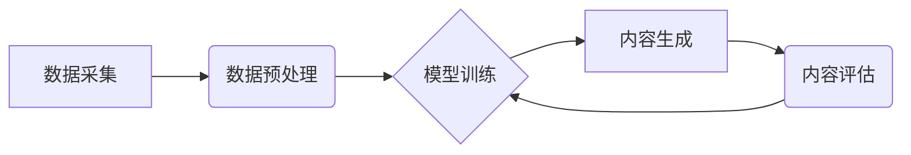

> 生成式AI，AIGC，自然语言处理，深度学习，Transformer，文本生成，图像生成，商业应用

## 1. 背景介绍

近年来，人工智能（AI）技术取得了飞速发展，特别是深度学习的突破，使得生成式人工智能（AIGC）技术迅速崛起。AIGC是指利用人工智能技术，从已有的数据中学习模式，并生成新的、原创的内容，例如文本、图像、音频、视频等。

与传统的AI技术相比，AIGC更注重内容的创造性和表达能力。它能够理解和生成人类语言，创作出逼真的图像和视频，甚至能够进行音乐创作和代码生成。AIGC的出现，标志着人工智能进入了一个新的时代，它将深刻地改变我们的生活和工作方式。

## 2. 核心概念与联系

**2.1 生成式AI的概念**

生成式AI是指能够根据输入数据生成新数据的AI模型。它不同于传统的AI模型，例如分类或预测模型，这些模型主要用于分析和理解现有数据。生成式AI的目标是学习数据背后的模式和规律，并利用这些知识生成新的、原创的数据。

**2.2 AIGC的应用场景**

AIGC技术在各个领域都有着广泛的应用场景，例如：

* **内容创作:** 自动生成新闻报道、广告文案、小说、诗歌等。
* **图像生成:** 生成逼真的图像、艺术作品、产品设计等。
* **音频生成:** 生成音乐、语音合成、音效等。
* **视频生成:** 生成动画、视频剪辑、虚拟现实体验等。
* **代码生成:** 自动生成代码、修复代码错误等。

**2.3 AIGC的架构**

AIGC的架构通常包括以下几个部分：

* **数据采集和预处理:** 收集大量的数据，并进行清洗、格式化等预处理工作。
* **模型训练:** 利用深度学习算法，训练生成式AI模型。
* **内容生成:** 将输入数据输入到训练好的模型中，生成新的内容。
* **内容评估和优化:** 对生成的內容进行评估，并根据评估结果进行优化。



## 3. 核心算法原理 & 具体操作步骤

**3.1 算法原理概述**

生成式AI的核心算法主要包括：

* **变分自编码器 (VAE):** 通过学习数据的潜在表示，生成新的数据。
* **生成对抗网络 (GAN):** 由生成器和判别器两部分组成，生成器生成数据，判别器判断数据是否真实，两者相互竞争，最终生成逼真的数据。
* **Transformer:** 基于注意力机制的深度学习模型，能够处理序列数据，例如文本和音频，并生成高质量的文本。

**3.2 算法步骤详解**

以生成对抗网络 (GAN) 为例，详细说明其算法步骤：

1. **初始化生成器和判别器:** 生成器和判别器都是神经网络模型，初始参数随机初始化。
2. **生成器生成数据:** 生成器根据随机噪声输入，生成新的数据样本。
3. **判别器判断真实性:** 判别器接收真实数据和生成器生成的假数据，并判断其真实性。
4. **更新生成器和判别器:** 根据判别器的判断结果，更新生成器的参数，使其生成的假数据更接近真实数据。同时，也更新判别器的参数，使其能够更好地区分真实数据和假数据。
5. **重复步骤2-4:** 重复上述步骤，直到生成器生成的假数据与真实数据难以区分。

**3.3 算法优缺点**

* **优点:** 能够生成逼真的数据，在图像、文本、音频等领域都有着广泛的应用。
* **缺点:** 训练过程复杂，容易陷入局部最优解，生成的数据可能存在不稳定性。

**3.4 算法应用领域**

* **图像生成:** 生成逼真的图像、艺术作品、产品设计等。
* **文本生成:** 自动生成新闻报道、广告文案、小说、诗歌等。
* **音频生成:** 生成音乐、语音合成、音效等。

## 4. 数学模型和公式 & 详细讲解 & 举例说明

**4.1 数学模型构建**

生成式AI模型通常使用概率模型来表示数据分布。例如，GAN模型使用两个概率分布来表示真实数据和生成数据：

* **真实数据分布:** $p_{data}(x)$
* **生成数据分布:** $p_{g}(x)$

其中，$x$ 表示数据样本。

**4.2 公式推导过程**

GAN模型的目标是使生成数据分布 $p_{g}(x)$ 尽可能接近真实数据分布 $p_{data}(x)$。

GAN模型使用两个损失函数来实现这个目标：

* **生成器损失函数:** $L_g = E_{x \sim p_{data}(x)}[log(D(x))]$
* **判别器损失函数:** $L_d = E_{x \sim p_{data}(x)}[log(D(x))] + E_{x \sim p_g(x)}[log(1-D(x))]$

其中，$D(x)$ 表示判别器对数据样本 $x$ 的判断概率。

**4.3 案例分析与讲解**

例如，在图像生成任务中，GAN模型可以学习图像的像素分布，并生成新的、逼真的图像。

## 5. 项目实践：代码实例和详细解释说明

**5.1 开发环境搭建**

* Python 3.7+
* TensorFlow 或 PyTorch
* CUDA 和 cuDNN

**5.2 源代码详细实现**

```python
# 生成器模型
class Generator(nn.Module):
    def __init__(self):
        super(Generator, self).__init__()
        # ...

    def forward(self, z):
        # ...

# 判别器模型
class Discriminator(nn.Module):
    def __init__(self):
        super(Discriminator, self).__init__()
        # ...

    def forward(self, x):
        # ...

# 训练循环
for epoch in range(num_epochs):
    for batch_idx, (real_images, _) in enumerate(train_loader):
        # ...
```

**5.3 代码解读与分析**

* 生成器模型负责生成新的图像数据。
* 判别器模型负责判断图像数据是否真实。
* 训练循环中，生成器和判别器模型交替训练，直到生成器生成的图像与真实图像难以区分。

**5.4 运行结果展示**

训练完成后，可以利用生成器模型生成新的图像数据，并与真实图像进行比较。

## 6. 实际应用场景

**6.1 内容创作**

* 自动生成新闻报道、广告文案、小说、诗歌等。
* 创建个性化内容，例如根据用户的喜好生成推荐内容。

**6.2 图像生成**

* 生成逼真的图像、艺术作品、产品设计等。
* 用于游戏开发、电影制作、建筑设计等领域。

**6.3 音频生成**

* 生成音乐、语音合成、音效等。
* 用于语音助手、音乐创作、配音等领域。

**6.4 视频生成**

* 生成动画、视频剪辑、虚拟现实体验等。
* 用于电影制作、游戏开发、教育培训等领域。

**6.5 代码生成**

* 自动生成代码、修复代码错误等。
* 用于软件开发、代码审查等领域。

**6.6 未来应用展望**

AIGC技术将继续发展，并应用于更多领域，例如：

* **医疗保健:** 自动生成医学影像诊断报告、辅助医生进行手术。
* **教育:** 个性化学习内容、自动生成学习材料。
* **金融:** 自动生成财务报表、识别欺诈行为。

## 7. 工具和资源推荐

**7.1 学习资源推荐**

* **书籍:**
    * 《深度学习》
    * 《生成对抗网络》
* **在线课程:**
    * Coursera: 深度学习
    * Udacity: 生成对抗网络

**7.2 开发工具推荐**

* **TensorFlow:** 开源深度学习框架
* **PyTorch:** 开源深度学习框架
* **HuggingFace:** 提供预训练的生成式AI模型

**7.3 相关论文推荐**

* 《Generative Adversarial Networks》
* 《Variational Autoencoders for Generation》
* 《Attention Is All You Need》

## 8. 总结：未来发展趋势与挑战

**8.1 研究成果总结**

AIGC技术取得了显著的进展，能够生成逼真的文本、图像、音频等内容。

**8.2 未来发展趋势**

* **模型能力提升:** 模型规模和能力将继续提升，生成更逼真、更复杂的內容。
* **应用场景拓展:** AIGC技术将应用于更多领域，例如医疗保健、教育、金融等。
* **伦理与安全问题:** 需要关注AIGC技术的伦理和安全问题，例如数据隐私、内容虚假等。

**8.3 面临的挑战**

* **数据获取和标注:** 训练AIGC模型需要大量高质量的数据，数据获取和标注成本较高。
* **模型训练效率:** 训练AIGC模型需要大量的计算资源，训练效率较低。
* **模型可解释性:** AIGC模型的决策过程难以理解，缺乏可解释性。

**8.4 研究展望**

未来研究方向包括：

* 开发更高效、更强大的AIGC模型。
* 探索新的AIGC应用场景。
* 研究AIGC技术的伦理和安全问题。

## 9. 附录：常见问题与解答

**9.1 如何选择合适的AIGC模型？**

选择合适的AIGC模型需要根据具体的应用场景和需求进行选择。例如，用于图像生成任务，可以选择GAN模型；用于文本生成任务，可以选择Transformer模型。

**9.2 如何训练AIGC模型？**

训练AIGC模型需要准备大量的数据，并使用深度学习框架进行训练。

**9.3 如何评估AIGC模型的性能？**

AIGC模型的性能可以根据具体的应用场景进行评估，例如图像生成任务可以使用PSNR、FID等指标进行评估。

作者：禅与计算机程序设计艺术 / Zen and the Art of Computer Programming


<end_of_turn>