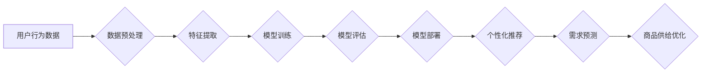

> 用户行为分析，AI，机器学习，深度学习，推荐系统，需求预测，商品供给优化

## 1. 背景介绍

在当今数据爆炸的时代，用户行为数据已成为企业宝贵的财富。通过对用户行为的深入分析，企业可以洞察用户需求，优化商品供给，提升用户体验，最终实现商业目标。传统的用户行为分析方法往往依赖于人工经验和规则，效率低下，难以捕捉到复杂的用户行为模式。而人工智能（AI）技术的兴起，为用户行为分析带来了新的机遇。

AI算法能够从海量用户行为数据中自动学习用户行为模式，并进行精准预测，为企业提供更深入的洞察和决策支持。例如，AI驱动的推荐系统能够根据用户的历史浏览记录、购买行为等数据，推荐个性化的商品，提升用户转化率；AI驱动的需求预测模型能够预测未来用户对特定商品的需求量，帮助企业优化库存管理和生产计划。

## 2. 核心概念与联系

**2.1 用户行为分析**

用户行为分析是指通过收集、分析和解读用户在使用产品或服务过程中所表现出的行为模式，以了解用户需求、偏好和行为动机。

**2.2 人工智能 (AI)**

人工智能是指模拟人类智能的计算机系统。AI技术涵盖了机器学习、深度学习、自然语言处理等多个领域。

**2.3 机器学习 (ML)**

机器学习是人工智能的一个分支，它通过算法训练模型，使模型能够从数据中学习并进行预测。

**2.4 深度学习 (DL)**

深度学习是机器学习的一个子领域，它使用多层神经网络来模拟人类大脑的学习过程，能够处理更复杂的数据模式。

**2.5 推荐系统**

推荐系统是利用机器学习算法，根据用户的历史行为和偏好，推荐用户可能感兴趣的商品或内容。

**2.6 需求预测**

需求预测是指预测未来一段时间内用户对特定商品的需求量。

**2.7 商品供给优化**

商品供给优化是指根据用户需求预测，调整商品库存和生产计划，以满足用户需求，降低库存成本和生产浪费。

**2.8 流程图**



## 3. 核心算法原理 & 具体操作步骤

### 3.1 算法原理概述

用户行为分析常用的算法包括：

* **协同过滤算法:** 基于用户的相似性或商品的相似性进行推荐。
* **内容过滤算法:** 基于商品的特征或内容进行推荐。
* **基于知识的推荐算法:** 基于用户和商品之间的知识关系进行推荐。
* **深度学习推荐算法:** 使用深度神经网络学习用户行为模式，进行个性化推荐。

### 3.2 算法步骤详解

以协同过滤算法为例，其步骤如下：

1. **数据收集:** 收集用户行为数据，例如用户对商品的评分、购买记录、浏览记录等。
2. **数据预处理:** 对数据进行清洗、转换和格式化，例如处理缺失值、去除重复数据等。
3. **特征提取:** 从用户行为数据中提取特征，例如用户评分的平均值、用户购买的商品类别等。
4. **相似度计算:** 计算用户之间的相似度或商品之间的相似度，例如使用余弦相似度或皮尔逊相关系数。
5. **推荐生成:** 根据用户与商品的相似度，推荐用户可能感兴趣的商品。

### 3.3 算法优缺点

**协同过滤算法:**

* **优点:** 可以发现隐含的用户偏好，推荐个性化商品。
* **缺点:** 数据稀疏性问题，新用户或新商品难以推荐。

**内容过滤算法:**

* **优点:** 不需要用户历史数据，可以推荐与用户兴趣相符的商品。
* **缺点:** 容易陷入“信息茧房”问题，推荐结果缺乏多样性。

### 3.4 算法应用领域

用户行为分析算法广泛应用于以下领域：

* **电商推荐:** 推荐商品、优惠券、促销活动等。
* **内容推荐:** 推荐新闻、视频、音乐等内容。
* **社交媒体推荐:** 推荐好友、群组、话题等。
* **金融服务:** 推荐理财产品、贷款服务等。
* **医疗保健:** 推荐医生、医院、药品等。

## 4. 数学模型和公式 & 详细讲解 & 举例说明

### 4.1 数学模型构建

协同过滤算法的数学模型可以表示为用户-商品评分矩阵，其中每个元素表示用户对商品的评分。

**用户-商品评分矩阵:**

```
| 用户 | 商品1 | 商品2 | 商品3 |
|---|---|---|---|
| 用户1 | 5 | 3 | 4 |
| 用户2 | 4 | 5 | 2 |
| 用户3 | 3 | 4 | 5 |
```

### 4.2 公式推导过程

**余弦相似度:**

$$
\text{相似度} = \frac{\mathbf{u} \cdot \mathbf{v}}{\|\mathbf{u}\| \|\mathbf{v}\|}
$$

其中：

* $\mathbf{u}$ 和 $\mathbf{v}$ 是两个用户的评分向量。
* $\cdot$ 表示点积运算。
* $\|\mathbf{u}\|$ 和 $\|\mathbf{v}\|$ 表示向量的模长。

### 4.3 案例分析与讲解

假设有两个用户，用户1的评分向量为 [5, 3, 4]，用户2的评分向量为 [4, 5, 2]。

使用余弦相似度公式计算用户1和用户2的相似度：

$$
\text{相似度} = \frac{(5 \times 4) + (3 \times 5) + (4 \times 2)}{( \sqrt{5^2 + 3^2 + 4^2}) \times (\sqrt{4^2 + 5^2 + 2^2})} = 0.78
$$

相似度为0.78，表明用户1和用户2的兴趣偏好相似。

## 5. 项目实践：代码实例和详细解释说明

### 5.1 开发环境搭建

* Python 3.x
* scikit-learn
* pandas
* numpy

### 5.2 源代码详细实现

```python
import pandas as pd
from sklearn.metrics.pairwise import cosine_similarity

# 加载用户-商品评分数据
data = pd.read_csv('user_item_rating.csv')

# 提取用户评分矩阵
user_item_matrix = data.pivot_table(index='user_id', columns='item_id', values='rating')

# 计算用户之间的余弦相似度
user_similarity = cosine_similarity(user_item_matrix)

# 获取用户1的相似用户
user1_id = 1
similar_users = user_similarity[user1_id].argsort()[:-6:-1]  # 排序获取相似度最高的5个用户

# 推荐商品
recommended_items = []
for similar_user in similar_users:
    rated_items = data[data['user_id'] == similar_user]['item_id'].unique()
    for item in rated_items:
        if item not in data[data['user_id'] == user1_id]['item_id'].unique():
            recommended_items.append(item)

# 打印推荐结果
print(f'用户{user1_id}的推荐商品：{recommended_items}')
```

### 5.3 代码解读与分析

* 代码首先加载用户-商品评分数据，并提取用户评分矩阵。
* 然后使用scikit-learn库中的cosine_similarity函数计算用户之间的余弦相似度。
* 通过获取用户1的相似用户，并遍历相似用户的评分记录，推荐用户1没有评分过的商品。

### 5.4 运行结果展示

运行代码后，将输出用户1的推荐商品列表。

## 6. 实际应用场景

### 6.1 电商推荐

电商平台可以利用用户行为分析算法，推荐个性化的商品，提升用户转化率。例如，淘宝、京东等电商平台都使用AI驱动的推荐系统，根据用户的浏览记录、购买历史等数据，推荐用户可能感兴趣的商品。

### 6.2 内容推荐

新闻网站、视频平台、音乐平台等都可以利用用户行为分析算法，推荐个性化的内容，提升用户粘性。例如，抖音、B站等平台都使用AI驱动的推荐系统，根据用户的观看记录、点赞记录等数据，推荐用户可能感兴趣的视频。

### 6.3 社交媒体推荐

社交媒体平台可以利用用户行为分析算法，推荐好友、群组、话题等，提升用户活跃度。例如，微信、QQ等平台都使用AI驱动的推荐系统，根据用户的社交关系、兴趣爱好等数据，推荐用户可能感兴趣的朋友、群组、话题。

### 6.4 未来应用展望

随着人工智能技术的不断发展，用户行为分析将应用于更多领域，例如：

* **医疗保健:** 推荐医生、医院、药品等。
* **金融服务:** 推荐理财产品、贷款服务等。
* **教育:** 推荐学习资源、课程等。

## 7. 工具和资源推荐

### 7.1 学习资源推荐

* **书籍:**
    * 《推荐系统》
    * 《深度学习》
* **在线课程:**
    * Coursera: Machine Learning
    * Udacity: Deep Learning Nanodegree

### 7.2 开发工具推荐

* **Python:** 
    * scikit-learn
    * pandas
    * numpy
* **Spark:** 
    * Apache Spark

### 7.3 相关论文推荐

* **Collaborative Filtering for Implicit Feedback Datasets**
* **Deep Learning for Recommender Systems**

## 8. 总结：未来发展趋势与挑战

### 8.1 研究成果总结

用户行为分析已经取得了显著的成果，AI算法能够从海量用户行为数据中自动学习用户行为模式，并进行精准预测，为企业提供更深入的洞察和决策支持。

### 8.2 未来发展趋势

* **个性化推荐:** 更加精准、个性化的推荐，满足用户多样化的需求。
* **跨平台推荐:** 将用户行为数据整合到多个平台，提供更全面的用户画像。
* **解释性AI:** 使推荐结果更加透明，用户能够理解推荐背后的逻辑。

### 8.3 面临的挑战

* **数据隐私:** 如何保护用户隐私，同时利用用户行为数据进行分析。
* **算法公平性:** 避免算法产生偏见，确保推荐结果公平公正。
* **解释性问题:** 如何解释AI推荐的结果，提高用户信任度。

### 8.4 研究展望

未来，用户行为分析将继续朝着更加智能、个性化、透明的方向发展，为用户提供更优质的体验，帮助企业更好地理解用户需求，优化商品供给。

## 9. 附录：常见问题与解答

**Q1: 如何处理用户行为数据中的缺失值？**

**A1:** 可以使用多种方法处理缺失值，例如：

* **删除缺失值:** 如果缺失值较少，可以删除包含缺失值的记录。
* **填充缺失值:** 使用平均值、中位数或其他统计方法填充缺失值。
* **使用机器学习算法:** 使用机器学习算法预测缺失值。

**Q2: 如何评估推荐系统的性能？**

**A2:** 可以使用多种指标评估推荐系统的性能，例如：

* **准确率:** 推荐结果与用户真实偏好的一致性。
* **召回率:** 推荐结果包含用户真实偏好的商品比例。
* **点击率:** 用户点击推荐结果的比例。
* **转化率:** 用户点击推荐结果后完成购买的比例。


作者：禅与计算机程序设计艺术 / Zen and the Art of Computer Programming 
<end_of_turn>