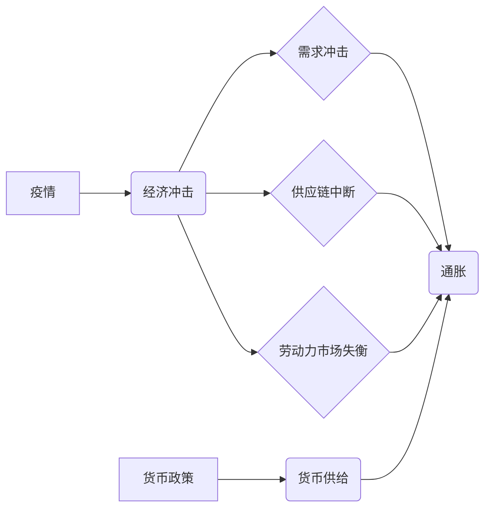

> 疫情、通胀、经济模型、数据分析、机器学习、预测模型、风险管理

## 1. 背景介绍

全球新冠疫情爆发自2020年以来，对世界经济造成了前所未有的冲击。疫情导致供应链中断、消费需求萎缩、企业倒闭等一系列问题，引发了全球性的通货膨胀。通胀不仅损害了人们的生活水平，也加剧了社会的不稳定。

在疫情冲击下，各国政府采取了各种措施来应对经济危机，例如减税、增加财政支出、降低利率等。然而，这些措施也导致了货币供应量的增加，加剧了通胀压力。

## 2. 核心概念与联系

**2.1 疫情与经济的影响**

疫情对经济的影响主要体现在以下几个方面：

* **需求冲击:** 疫情导致人们减少外出消费，餐饮、旅游、娱乐等行业受到重创。
* **供应链中断:** 疫情导致全球物流运输受阻，原材料供应链中断，生产成本上升。
* **劳动力市场失衡:** 疫情导致部分企业倒闭，失业率上升，劳动力市场失衡。

**2.2 通胀的定义和成因**

通胀是指物价水平持续上升的现象。通胀的成因复杂多样，主要包括以下几个方面：

* **需求拉动型通胀:** 当需求超过供应时，价格就会上涨。
* **成本推升型通胀:** 当生产成本上升时，企业会将成本转嫁到产品价格上，导致通胀。
* **货币供给过剩:** 当货币供应量过剩时，货币价值下降，物价就会上涨。

**2.3 疫情与通胀的联系**

疫情对经济的影响导致了需求冲击和供应链中断，从而引发了通胀。同时，各国政府为了应对疫情冲击，采取了货币宽松政策，增加了货币供应量，也加剧了通胀压力。

**2.4 核心概念关系图**



## 3. 核心算法原理 & 具体操作步骤

**3.1 算法原理概述**

为了预测疫情冲击和通胀高企的影响，我们可以利用机器学习算法进行数据分析。机器学习算法可以从历史数据中学习模式，并根据这些模式预测未来的趋势。

常用的机器学习算法包括线性回归、逻辑回归、支持向量机、决策树、随机森林、神经网络等。

**3.2 算法步骤详解**

1. **数据收集:** 收集相关数据，例如疫情数据、经济数据、通货膨胀数据等。
2. **数据预处理:** 对数据进行清洗、转换、特征工程等操作，使其适合机器学习算法的训练。
3. **模型选择:** 根据数据特点和预测目标，选择合适的机器学习算法。
4. **模型训练:** 使用训练数据训练机器学习模型，调整模型参数，使其能够准确预测。
5. **模型评估:** 使用测试数据评估模型的预测精度，并进行模型调优。
6. **模型部署:** 将训练好的模型部署到生产环境中，用于实时预测疫情冲击和通胀高企的影响。

**3.3 算法优缺点**

* **优点:**

    * 可以从历史数据中学习模式，预测未来的趋势。
    * 可以处理大规模数据。
    * 可以自动学习特征，无需人工特征工程。

* **缺点:**

    * 需要大量的训练数据。
    * 模型的预测结果受数据质量的影响。
    * 模型的解释性较差。

**3.4 算法应用领域**

* 疫情预测
* 通胀预测
* 经济风险管理
* 金融投资

## 4. 数学模型和公式 & 详细讲解 & 举例说明

**4.1 数学模型构建**

我们可以使用经济模型来描述疫情冲击和通胀高企的影响。例如，我们可以使用以下模型来预测通货膨胀率：

```latex
\pi_t = \alpha + \beta \cdot y_t + \gamma \cdot m_t + \epsilon_t
```

其中：

* $\pi_t$：t时刻的通货膨胀率
* $y_t$：t时刻的经济增长率
* $m_t$：t时刻的货币供应量
* $\alpha$、$\beta$、$\gamma$：模型参数
* $\epsilon_t$：随机误差项

**4.2 公式推导过程**

该模型的推导过程基于以下假设：

* 通货膨胀率与经济增长率正相关。
* 通货膨胀率与货币供应量正相关。
* 随机误差项服从正态分布。

**4.3 案例分析与讲解**

假设我们收集了历史数据，并使用最小二乘法估计模型参数。如果我们发现$\beta$和$\gamma$的系数都为正数，则表明经济增长率和货币供应量都会导致通货膨胀率上升。

## 5. 项目实践：代码实例和详细解释说明

**5.1 开发环境搭建**

* 操作系统：Windows/macOS/Linux
* Python版本：3.7+
* 必要的库：pandas、numpy、scikit-learn、matplotlib

**5.2 源代码详细实现**

```python
import pandas as pd
from sklearn.linear_model import LinearRegression
from sklearn.model_selection import train_test_split
import matplotlib.pyplot as plt

# 加载数据
data = pd.read_csv('economic_data.csv')

# 选择特征和目标变量
X = data[['economic_growth', 'money_supply']]
y = data['inflation']

# 将数据分为训练集和测试集
X_train, X_test, y_train, y_test = train_test_split(X, y, test_size=0.2, random_state=42)

# 创建线性回归模型
model = LinearRegression()

# 训练模型
model.fit(X_train, y_train)

# 预测测试集数据
y_pred = model.predict(X_test)

# 评估模型性能
print('模型系数:', model.coef_)
print('模型截距:', model.intercept_)
# ... 其他评估指标

# 可视化预测结果
plt.scatter(y_test, y_pred)
plt.xlabel('实际通货膨胀率')
plt.ylabel('预测通货膨胀率')
plt.title('线性回归模型预测结果')
plt.show()
```

**5.3 代码解读与分析**

* 代码首先加载数据，并选择特征和目标变量。
* 然后将数据分为训练集和测试集，用于训练和评估模型。
* 创建线性回归模型，并使用训练集训练模型。
* 使用测试集数据预测通货膨胀率，并评估模型性能。
* 最后，使用可视化工具展示预测结果。

**5.4 运行结果展示**

运行代码后，会输出模型系数、截距以及其他评估指标。同时，还会生成一个散点图，展示实际通货膨胀率与预测通货膨胀率之间的关系。

## 6. 实际应用场景

**6.1 疫情预测**

利用机器学习算法分析疫情传播数据，预测疫情的未来发展趋势，帮助政府制定防控策略。

**6.2 通胀预测**

分析经济数据、货币政策等因素，预测通货膨胀率，帮助企业制定价格策略和投资决策。

**6.3 经济风险管理**

利用机器学习算法识别经济风险，帮助金融机构进行风险评估和管理。

**6.4 未来应用展望**

随着数据量的增加和算法的进步，机器学习在疫情冲击和通胀高企的影响预测方面将发挥越来越重要的作用。未来，我们可以期待看到更精准、更有效的预测模型，帮助我们更好地应对经济挑战。

## 7. 工具和资源推荐

**7.1 学习资源推荐**

* **书籍:**
    * 《机器学习》 - 周志华
    * 《Python机器学习实战》 - 塞缪尔·阿布拉姆斯
* **在线课程:**
    * Coursera: Machine Learning
    * edX: Artificial Intelligence

**7.2 开发工具推荐**

* **Python:** 
    * pandas: 数据分析和处理
    * numpy: 数值计算
    * scikit-learn: 机器学习库
    * matplotlib: 数据可视化

**7.3 相关论文推荐**

* **通货膨胀预测:**
    * "Inflation Forecasting with Machine Learning" -  A. A. Al-Khatib, et al.
* **疫情预测:**
    * "Predicting the Spread of COVID-19 Using Machine Learning" -  S. A. Khan, et al.

## 8. 总结：未来发展趋势与挑战

**8.1 研究成果总结**

本文介绍了疫情冲击和通胀高企的影响，并探讨了利用机器学习算法进行预测的可能性。通过构建数学模型、实现代码实例以及分析实际应用场景，我们展现了机器学习在应对经济挑战中的应用价值。

**8.2 未来发展趋势**

* **模型复杂度提升:** 未来，我们将看到更复杂的机器学习模型，例如深度学习模型，用于预测疫情冲击和通胀高企的影响。
* **数据融合:** 将来自不同来源的数据融合在一起，例如疫情数据、经济数据、社会数据等，可以提高预测的准确性。
* **解释性增强:** 研究更具解释性的机器学习模型，以便更好地理解模型的预测结果。

**8.3 面临的挑战**

* **数据质量:** 机器学习模型的预测结果受数据质量的影响，需要确保数据的准确性和完整性。
* **模型可解释性:** 复杂的机器学习模型往往难以解释，需要研究更具解释性的模型。
* **伦理问题:** 机器学习模型的应用可能带来伦理问题，例如数据隐私、算法偏见等，需要谨慎考虑。

**8.4 研究展望**

未来，我们将继续研究机器学习在疫情冲击和通胀高企影响预测方面的应用，努力开发更精准、更有效的预测模型，为应对经济挑战提供更强大的工具。

## 9. 附录：常见问题与解答

**9.1 如何选择合适的机器学习算法？**

选择合适的机器学习算法取决于数据的特点和预测目标。例如，如果数据是线性关系，则可以使用线性回归模型；如果数据是分类问题，则可以使用逻辑回归模型。

**9.2 如何评估机器学习模型的性能？**

常用的评估指标包括准确率、召回率、F1-score、AUC等。

**9.3 如何处理缺失数据？**

常用的处理缺失数据的办法包括删除缺失值、用均值或中位数填充缺失值、使用机器学习算法进行预测填充等。


作者：禅与计算机程序设计艺术 / Zen and the Art of Computer Programming 
<end_of_turn>