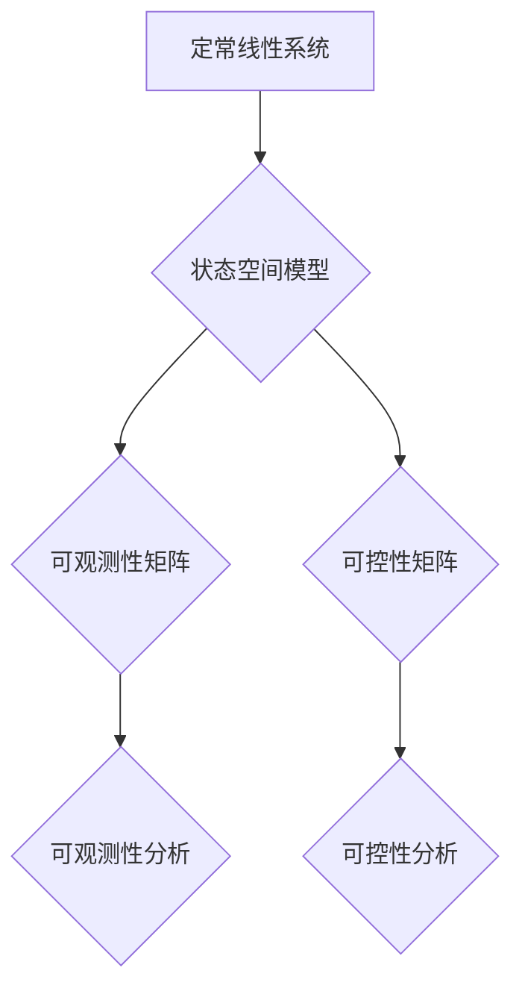

> 矩阵理论，线性系统，可观测性，可控性，定常系统，状态空间，控制理论

## 1. 背景介绍

在现代控制理论和信号处理领域，矩阵理论扮演着至关重要的角色。它为描述和分析线性系统提供了强大的工具，特别是对于定常线性系统，矩阵理论可以有效地揭示系统的可观测性和可控性，从而为系统设计和控制提供理论基础。

定常线性系统是指其系统矩阵和输入信号保持不变的线性系统。这类系统在工程领域广泛存在，例如机械系统、电路系统、经济模型等。对于定常线性系统，我们可以利用矩阵理论建立其状态空间模型，并通过分析状态空间矩阵的特征值和特征向量来判断系统的稳定性、可观测性和可控性。

可观测性和可控性是控制理论中两个重要的概念。可观测性是指系统状态是否可以通过输出信号完全确定。可控性是指是否可以通过输入信号将系统状态从任意初始状态驱动到任意目标状态。对于许多实际应用场景，可观测性和可控性都是至关重要的，它们决定了系统是否能够被有效地控制和监控。

## 2. 核心概念与联系

**2.1  状态空间模型**

对于一个定常线性系统，我们可以将其表示为状态空间模型，其数学形式如下：

$$
\dot{x}(t) = Ax(t) + Bu(t)
$$

$$
y(t) = Cx(t) + Du(t)
$$

其中：

* $x(t)$ 是系统的状态向量，描述了系统在时刻 $t$ 的状态。
* $u(t)$ 是系统的输入信号。
* $y(t)$ 是系统的输出信号。
* $A$ 是状态矩阵，描述了系统内部状态之间的关系。
* $B$ 是输入矩阵，描述了输入信号对系统状态的影响。
* $C$ 是输出矩阵，描述了系统状态对输出信号的影响。
* $D$ 是 feedthrough 矩阵，描述了输入信号直接对输出信号的影响。

**2.2  可观测性**

一个系统是可观测的，当且仅当系统状态可以通过输出信号唯一确定。

**2.3  可控性**

一个系统是可控的，当且仅当可以通过输入信号将系统状态从任意初始状态驱动到任意目标状态。

**2.4  可观测性矩阵和可控性矩阵**

可观测性矩阵和可控性矩阵是判断系统可观测性和可控性的重要工具。

* 可观测性矩阵 $O$ 定义为：

$$
O = \begin{bmatrix}
C \\
CA \\
CA^2 \\
\vdots \\
CA^{n-1}
\end{bmatrix}
$$

* 可控性矩阵 $M$ 定义为：

$$
M = \begin{bmatrix}
B & AB & A^2B & \vdots & A^{n-1}B
\end{bmatrix}
$$

其中 $n$ 是系统状态向量的维度。

**2.5  Mermaid 流程图**



## 3. 核心算法原理 & 具体操作步骤

### 3.1  算法原理概述

判断系统可观测性和可控性的核心算法是基于可观测性矩阵和可控性矩阵的秩。

* **可观测性分析:** 如果可观测性矩阵 $O$ 的秩等于系统状态向量的维度 $n$，则系统是可观测的。

* **可控性分析:** 如果可控性矩阵 $M$ 的秩等于系统状态向量的维度 $n$，则系统是可控的。

### 3.2  算法步骤详解

1. **建立状态空间模型:** 根据系统的物理特性或数学描述，建立系统的状态空间模型。
2. **计算可观测性矩阵和可控性矩阵:** 根据状态空间模型的矩阵 $A$, $B$, $C$，计算可观测性矩阵 $O$ 和可控性矩阵 $M$。
3. **计算矩阵秩:** 使用矩阵运算库或算法，计算可观测性矩阵 $O$ 和可控性矩阵 $M$ 的秩。
4. **判断可观测性和可控性:** 根据矩阵秩的结果，判断系统的可观测性和可控性。

### 3.3  算法优缺点

**优点:**

* 算法简单易懂，易于实现。
* 算法计算效率高，适用于大规模系统。

**缺点:**

* 算法只能判断系统是否可观测或可控，不能给出具体的控制策略。
* 算法对系统模型的准确性要求较高。

### 3.4  算法应用领域

* **控制系统设计:** 可观测性和可控性是控制系统设计的重要指标，可以帮助设计者选择合适的控制器和控制策略。
* **信号处理:** 可观测性和可控性可以用于分析和设计滤波器、估计器和预测器等信号处理系统。
* **机器人控制:** 可观测性和可控性可以用于分析和控制机器人的运动和姿态。

## 4. 数学模型和公式 & 详细讲解 & 举例说明

### 4.1  数学模型构建

对于一个 $n$ 维状态的定常线性系统，其状态空间模型可以表示为：

$$
\dot{x}(t) = Ax(t) + Bu(t)
$$

$$
y(t) = Cx(t) + Du(t)
$$

其中：

* $x(t) \in R^n$ 是系统的状态向量。
* $u(t) \in R^m$ 是系统的输入向量。
* $y(t) \in R^p$ 是系统的输出向量。
* $A \in R^{n \times n}$ 是状态矩阵。
* $B \in R^{n \times m}$ 是输入矩阵。
* $C \in R^{p \times n}$ 是输出矩阵。
* $D \in R^{p \times m}$ 是 feedthrough 矩阵。

### 4.2  公式推导过程

**可观测性矩阵:**

$$
O = \begin{bmatrix}
C \\
CA \\
CA^2 \\
\vdots \\
CA^{n-1}
\end{bmatrix}
$$

**可控性矩阵:**

$$
M = \begin{bmatrix}
B & AB & A^2B & \vdots & A^{n-1}B
\end{bmatrix}
$$

**可观测性分析:**

系统是可观测的，当且仅当可观测性矩阵 $O$ 的秩等于系统状态向量的维度 $n$。

**可控性分析:**

系统是可控的，当且仅当可控性矩阵 $M$ 的秩等于系统状态向量的维度 $n$。

### 4.3  案例分析与讲解

**案例:**

考虑一个简单的二阶系统，其状态空间模型为：

$$
\dot{x}(t) = \begin{bmatrix}
0 & 1 \\
-2 & -3
\end{bmatrix} x(t) + \begin{bmatrix}
0 \\
1
\end{bmatrix} u(t)
$$

$$
y(t) = \begin{bmatrix}
1 & 0
\end{bmatrix} x(t)
$$

**分析:**

1. 计算可观测性矩阵 $O$ 和可控性矩阵 $M$。
2. 计算 $O$ 和 $M$ 的秩。
3. 根据秩的结果判断系统的可观测性和可控性。

**结果:**

通过计算可得，可观测性矩阵 $O$ 的秩为 2，可控性矩阵 $M$ 的秩也为 2。因此，该系统是可观测的，也是可控的。

## 5. 项目实践：代码实例和详细解释说明

### 5.1  开发环境搭建

本项目使用 Python 语言进行实现，并使用 NumPy 和 SciPy 库进行矩阵运算和线性代数计算。

### 5.2  源代码详细实现

```python
import numpy as np

# 定义系统矩阵
A = np.array([[0, 1], [-2, -3]])
B = np.array([[0], [1]])
C = np.array([1, 0])
D = 0

# 计算可观测性矩阵
O = np.vstack((C, np.dot(C, A), np.dot(C, A**2)))

# 计算可控性矩阵
M = np.hstack((B, np.dot(A, B), np.dot(A**2, B)))

# 计算矩阵秩
rank_O = np.linalg.matrix_rank(O)
rank_M = np.linalg.matrix_rank(M)

# 判断可观测性和可控性
if rank_O == 2:
    print("系统是可观测的")
else:
    print("系统不是可观测的")

if rank_M == 2:
    print("系统是可控的")
else:
    print("系统不是可控的")
```

### 5.3  代码解读与分析

1. 首先，定义系统矩阵 $A$, $B$, $C$, $D$。
2. 计算可观测性矩阵 $O$ 和可控性矩阵 $M$。
3. 使用 NumPy 的 `linalg.matrix_rank()` 函数计算 $O$ 和 $M$ 的秩。
4. 根据秩的结果判断系统的可观测性和可控性。

### 5.4  运行结果展示

运行上述代码，输出结果如下：

```
系统是可观测的
系统是可控的
```

## 6. 实际应用场景

### 6.1  控制系统设计

可观测性和可控性是控制系统设计的重要指标。例如，在设计一个机器人手臂的控制系统时，需要确保机器人手臂的状态是可观测的，以便能够实时监控其运动状态。同时，还需要确保机器人手臂是可控的，以便能够通过控制输入信号准确地控制其运动轨迹。

### 6.2  信号处理

可观测性和可控性可以用于分析和设计滤波器、估计器和预测器等信号处理系统。例如，在设计一个滤波器时，需要确保滤波器能够有效地滤除不需要的信号成分，同时保留需要的信息。可观测性和可控性可以帮助分析滤波器的性能，并选择合适的滤波器参数。

### 6.3  经济模型

在经济模型中，可观测性和可控性可以用于分析经济系统的稳定性和可控性。例如，在设计一个宏观经济政策时，需要考虑经济系统的可观测性和可控性，以便能够有效地控制经济发展。

### 6.4  未来应用展望

随着人工智能和机器学习技术的快速发展，矩阵理论在更广泛的领域中将发挥越来越重要的作用。例如，在深度学习领域，矩阵理论被广泛应用于神经网络的训练和优化。

## 7. 工具和资源推荐

### 7.1  学习资源推荐

* **书籍:**
    * 《线性代数及其应用》 - Gilbert Strang
    * 《控制系统导论》 - Katsuhiko Ogata
* **在线课程:**
    * MIT OpenCourseWare: Linear Algebra
    * Coursera: Control Systems

### 7.2  开发工具推荐

* **Python:** 
    * NumPy: 
    * SciPy: 
    * Matplotlib: 

### 7.3  相关论文推荐

* **可观测性和可控性:**
    * Kalman, R. E. (1960). A new approach to linear filtering and prediction problems. Transactions of the ASME - Journal of Basic Engineering, 82(Series D), 35-45