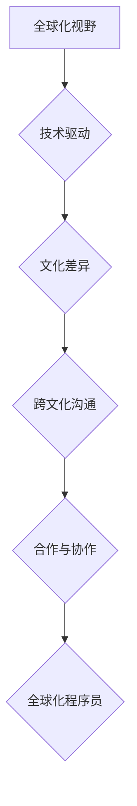

> 程序员，全球化，机遇，挑战，技术，文化，沟通，合作，跨文化

## 1. 背景介绍

在当今全球化加速发展的时代，科技创新日新月异，互联网无处不在，程序员作为推动科技进步的基石，也面临着前所未有的机遇和挑战。全球化的浪潮正在深刻地改变着程序员的工作方式、思维方式和职业发展路径。

一方面，全球化为程序员提供了更广阔的舞台和更丰富的资源。全球性的技术平台、开源社区和跨国合作项目为程序员提供了展示才华、学习新技术和拓展人脉的绝佳机会。另一方面，全球化也带来了新的挑战，例如跨文化沟通、语言障碍、时差差异等，这些因素可能会阻碍程序员的协作和交流。

## 2. 核心概念与联系

**2.1 全球化视野**

全球化视野是指程序员能够从全球角度看待问题，理解不同文化背景下的需求和挑战，并能够有效地与来自不同国家和地区的团队成员合作。

**2.2 技术驱动**

全球化进程的加速离不开技术的驱动。互联网、云计算、大数据等技术的快速发展，打破了地域的限制，促进了全球范围内的信息共享和资源整合。

**2.3 文化差异**

不同国家和地区的文化背景差异很大，这可能会导致程序员在沟通、合作和项目管理方面遇到困难。

**2.4 跨文化沟通**

跨文化沟通是程序员在全球化环境下必须掌握的重要技能。它不仅需要掌握基本的语言知识，更需要理解不同文化背景下的沟通方式和禁忌。

**2.5 合作与协作**

全球化项目往往需要跨国团队的合作和协作。程序员需要具备良好的团队合作精神和沟通能力，才能有效地完成项目目标。

**Mermaid 流程图**



## 3. 核心算法原理 & 具体操作步骤

**3.1 算法原理概述**

在全球化环境下，程序员需要掌握一些核心算法，例如：

* **数据结构算法**: 用于高效地存储和处理数据，例如树、图、链表等。
* **机器学习算法**: 用于从数据中学习模式和规律，例如决策树、支持向量机、神经网络等。
* **自然语言处理算法**: 用于处理和理解自然语言，例如词性标注、文本分类、机器翻译等。

**3.2 算法步骤详解**

以数据结构算法为例，其基本步骤包括：

1. **定义数据结构**: 根据具体需求选择合适的算法和数据结构，例如使用链表存储有序数据。
2. **实现算法**: 根据算法步骤编写代码，实现数据结构的创建、操作和查询。
3. **测试算法**: 使用测试用例验证算法的正确性和效率。
4. **优化算法**: 根据测试结果，对算法进行优化，提高其效率和性能。

**3.3 算法优缺点**

不同的算法具有不同的优缺点，程序员需要根据具体需求选择合适的算法。例如，链表的优点是插入和删除元素效率高，缺点是查找元素效率低。

**3.4 算法应用领域**

数据结构算法广泛应用于各个领域，例如：

* **软件开发**: 用于实现数据存储、排序、查找等功能。
* **人工智能**: 用于实现机器学习、自然语言处理等功能。
* **数据库管理**: 用于实现数据存储、检索和管理。

## 4. 数学模型和公式 & 详细讲解 & 举例说明

**4.1 数学模型构建**

在程序设计中，数学模型可以用来描述算法的逻辑关系和计算过程。例如，排序算法可以使用数学公式来描述其时间复杂度。

**4.2 公式推导过程**

时间复杂度是衡量算法效率的重要指标。例如，冒泡排序算法的时间复杂度为 O(n^2)，其中 n 是数据元素的个数。

**4.3 案例分析与讲解**

假设我们有一个包含 n 个元素的数组，我们需要对其进行排序。冒泡排序算法的工作原理是：

1. 从数组的第一个元素开始，与后面的元素进行比较，如果前面的元素大于后面的元素，则交换它们的位置。
2. 重复步骤 1，直到数组的最后一个元素。
3. 重复步骤 1 和 2，直到数组中的所有元素都已排序。

**数学公式推导过程：**

* 冒泡排序算法需要进行 n-1 轮比较，每轮比较需要进行 n-i 次比较，其中 i 是当前轮数。
* 因此，冒泡排序算法的总比较次数为：

$$
\sum_{i=1}^{n-1}(n-i) = \frac{n(n-1)}{2} = O(n^2)
$$

**举例说明：**

如果数组包含 10 个元素，则冒泡排序算法需要进行 9 轮比较，每轮比较需要进行 9-i 次比较，总比较次数为 45 次。

## 5. 项目实践：代码实例和详细解释说明

**5.1 开发环境搭建**

程序员需要选择合适的开发环境，例如：

* **操作系统**: Windows、Linux、macOS 等。
* **编程语言**: Java、Python、C++ 等。
* **IDE**: Eclipse、IntelliJ IDEA、Visual Studio Code 等。

**5.2 源代码详细实现**

以 Python 语言为例，实现一个简单的冒泡排序算法：

```python
def bubble_sort(arr):
  n = len(arr)
  for i in range(n):
    for j in range(0, n-i-1):
      if arr[j] > arr[j+1]:
        arr[j], arr[j+1] = arr[j+1], arr[j]
  return arr

# 测试代码
arr = [64, 34, 25, 12, 22, 11, 90]
sorted_arr = bubble_sort(arr)
print("排序后的数组:", sorted_arr)
```

**5.3 代码解读与分析**

* 函数 `bubble_sort(arr)` 接受一个数组 `arr` 作为参数。
* 外层循环 `for i in range(n)` 控制排序轮数。
* 内层循环 `for j in range(0, n-i-1)` 控制比较和交换元素的次数。
* 如果 `arr[j]` 大于 `arr[j+1]`，则交换这两个元素的位置。
* 最后返回排序后的数组 `sorted_arr`。

**5.4 运行结果展示**

运行上述代码，输出结果为：

```
排序后的数组: [11, 12, 22, 25, 34, 64, 90]
```

## 6. 实际应用场景

**6.1 软件开发**

程序员在软件开发过程中需要使用各种算法来实现软件的功能，例如：

* **排序算法**: 用于对数据进行排序，例如用户列表、商品价格等。
* **搜索算法**: 用于在数据中查找特定元素，例如搜索引擎、数据库查询等。
* **图算法**: 用于处理图结构的数据，例如社交网络、地图导航等。

**6.2 数据分析**

程序员在数据分析过程中需要使用算法来处理和分析数据，例如：

* **聚类算法**: 用于将数据分成不同的类别，例如客户画像、市场细分等。
* **回归算法**: 用于预测数据未来的趋势，例如股票预测、天气预报等。
* **异常检测算法**: 用于识别数据中的异常值，例如欺诈检测、故障诊断等。

**6.3 机器学习**

程序员在机器学习领域需要使用算法来训练机器学习模型，例如：

* **决策树算法**: 用于分类和回归问题，例如垃圾邮件分类、信用风险评估等。
* **支持向量机算法**: 用于分类问题，例如图像识别、文本分类等。
* **神经网络算法**: 用于复杂问题，例如语音识别、图像识别等。

**6.4 未来应用展望**

随着人工智能、大数据、云计算等技术的快速发展，程序员将面临更多新的挑战和机遇。例如：

* **量子计算**: 量子计算将颠覆传统的计算模式，为程序员提供新的编程 paradigms。
* **区块链**: 区块链技术将改变数据存储和管理的方式，为程序员提供新的应用场景。
* **虚拟现实/增强现实**: 虚拟现实和增强现实技术将改变人们与数字世界的交互方式，为程序员提供新的开发方向。

## 7. 工具和资源推荐

**7.1 学习资源推荐**

* **在线课程**: Coursera、edX、Udacity 等平台提供丰富的编程和算法课程。
* **书籍**: 《算法导论》、《编程珠玑》、《深入理解计算机系统》等经典书籍。
* **开源社区**: GitHub、Stack Overflow 等社区提供丰富的代码示例和技术支持。

**7.2 开发工具推荐**

* **IDE**: Eclipse、IntelliJ IDEA、Visual Studio Code 等。
* **版本控制系统**: Git、SVN 等。
* **云平台**: AWS、Azure、GCP 等。

**7.3 相关论文推荐**

* **算法**: 《算法导论》
* **数据结构**: 《数据结构与算法分析》
* **机器学习**: 《机器学习》

## 8. 总结：未来发展趋势与挑战

**8.1 研究成果总结**

全球化对程序员的影响是多方面的，既带来了机遇，也带来了挑战。程序员需要不断学习新的技术和知识，提升自己的全球化视野和跨文化沟通能力，才能在全球化竞争中脱颖而出。

**8.2 未来发展趋势**

未来，程序员将面临以下发展趋势：

* **人工智能**: 人工智能技术将越来越普及，程序员需要学习人工智能相关的知识和技能。
* **云计算**: 云计算将成为主流的计算模式，程序员需要掌握云计算相关的技术。
* **大数据**: 大数据分析将成为重要的应用领域，程序员需要学习大数据处理和分析技术。

**8.3 面临的挑战**

程序员在全球化环境下面临的挑战包括：

* **跨文化沟通**: 跨文化沟通需要程序员具备良好的语言能力和文化敏感度。
* **时差差异**: 时差差异可能会影响程序员的协作效率。
* **竞争加剧**: 全球化竞争加剧，程序员需要不断提升自己的竞争力。

**8.4 研究展望**

未来，研究者将继续探索全球化对程序员的影响，并提出相应的解决方案，帮助程序员更好地适应全球化环境。

## 9. 附录：常见问题与解答

**9.1 如何提升跨文化沟通能力？**

* 学习其他语言
* 阅读不同文化背景的书籍和文章
* 参加跨文化交流活动

**9.2 如何应对时差差异？**

* 使用协作工具，例如 Slack、Zoom 等
* 灵活安排工作时间
* 提前沟通和协商

**9.3 如何提升自己的竞争力？**

* 持续学习新的技术和知识
* 积累项目经验
* 提升软技能，例如沟通能力、团队合作能力等


作者：禅与计算机程序设计艺术 / Zen and the Art of Computer Programming 
<end_of_turn>