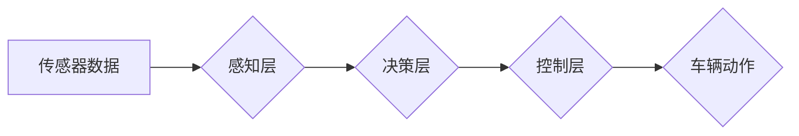

> 自动驾驶, 端到端学习, 深度学习, 可解释性, 安全性, 鲁棒性

## 1. 背景介绍

自动驾驶技术作为未来交通运输的重要发展方向，近年来取得了显著进展。其中，端到端自动驾驶凭借其学习能力强、架构简洁等优势，成为研究热点。端到端自动驾驶系统通过深度学习模型直接将传感器数据映射到控制指令，无需人工设计复杂的中间特征，简化了系统设计和开发过程。然而，端到端自动驾驶的不可预知性风险也日益凸显，成为该技术发展面临的重大挑战。

## 2. 核心概念与联系

端到端自动驾驶的核心概念是利用深度学习模型实现从感知到决策的全流程自动化。

**2.1. 感知层:** 负责获取车辆周围环境信息，包括图像、激光雷达数据、雷达数据等。

**2.2. 决策层:** 基于感知层获取的信息，预测未来环境变化，并做出相应的控制指令，例如转向、加速、制动等。

**2.3. 控制层:** 将决策层的指令转化为车辆实际动作。

**2.4. 训练过程:** 端到端自动驾驶系统通过大量的真实驾驶数据进行训练，学习驾驶规则和驾驶策略。

**Mermaid 流程图:**



## 3. 核心算法原理 & 具体操作步骤

**3.1. 算法原理概述**

端到端自动驾驶的核心算法是深度神经网络，主要包括卷积神经网络（CNN）、循环神经网络（RNN）和强化学习（RL）。

* **CNN:** 用于处理图像数据，提取特征信息。
* **RNN:** 用于处理时间序列数据，例如车辆速度、方向等。
* **RL:** 用于训练驾驶策略，通过奖励机制引导模型学习最佳驾驶行为。

**3.2. 算法步骤详解**

1. **数据收集:** 收集大量的真实驾驶数据，包括图像、激光雷达数据、雷达数据、车辆状态信息等。
2. **数据预处理:** 对收集到的数据进行清洗、格式化、标注等处理，使其适合深度学习模型训练。
3. **模型构建:** 根据任务需求，选择合适的深度神经网络架构，并进行参数初始化。
4. **模型训练:** 使用训练数据训练深度神经网络模型，通过反向传播算法优化模型参数，使其能够准确预测环境信息和做出合理的驾驶决策。
5. **模型评估:** 使用测试数据评估模型性能，例如准确率、召回率、平均位移误差等。
6. **模型部署:** 将训练好的模型部署到自动驾驶系统中，实现自动驾驶功能。

**3.3. 算法优缺点**

**优点:**

* 学习能力强，能够从大量数据中学习复杂的驾驶规则和驾驶策略。
* 架构简洁，易于实现和部署。

**缺点:**

* 数据依赖性强，需要大量的真实驾驶数据进行训练。
* 可解释性差，难以理解模型决策过程。
* 鲁棒性差，容易受到环境变化和异常情况的影响。

**3.4. 算法应用领域**

端到端自动驾驶算法广泛应用于自动驾驶汽车、无人机、机器人等领域。

## 4. 数学模型和公式 & 详细讲解 & 举例说明

**4.1. 数学模型构建**

端到端自动驾驶系统可以看作是一个复杂的非线性映射关系，可以用数学模型来描述。

假设输入数据为 $X = \{x_1, x_2, ..., x_n\}$, 输出数据为 $Y = \{y_1, y_2, ..., y_m\}$, 则端到端自动驾驶系统的数学模型可以表示为：

$$Y = f(X; \theta)$$

其中，$f$ 为深度神经网络模型，$\theta$ 为模型参数。

**4.2. 公式推导过程**

深度神经网络模型的训练过程是通过优化模型参数 $\theta$ 来实现的，目标是使模型输出 $Y$ 与真实值 $Y^*$ 的误差最小化。常用的优化算法包括梯度下降法、Adam 算法等。

**4.3. 案例分析与讲解**

例如，在自动驾驶汽车中，输入数据可以包括摄像头图像、激光雷达数据、雷达数据等，输出数据可以包括转向角度、加速量、制动量等。通过训练深度神经网络模型，可以学习到从传感器数据到控制指令的映射关系，从而实现自动驾驶功能。

## 5. 项目实践：代码实例和详细解释说明

**5.1. 开发环境搭建**

* 操作系统：Ubuntu 20.04
* 编程语言：Python 3.8
* 深度学习框架：TensorFlow 2.0

**5.2. 源代码详细实现**

```python
import tensorflow as tf

# 定义模型架构
model = tf.keras.models.Sequential([
    tf.keras.layers.Conv2D(32, (3, 3), activation='relu', input_shape=(64, 64, 3)),
    tf.keras.layers.MaxPooling2D((2, 2)),
    tf.keras.layers.Conv2D(64, (3, 3), activation='relu'),
    tf.keras.layers.MaxPooling2D((2, 2)),
    tf.keras.layers.Flatten(),
    tf.keras.layers.Dense(10, activation='softmax')
])

# 编译模型
model.compile(optimizer='adam',
              loss='sparse_categorical_crossentropy',
              metrics=['accuracy'])

# 训练模型
model.fit(x_train, y_train, epochs=10)

# 评估模型
loss, accuracy = model.evaluate(x_test, y_test)
print('Loss:', loss)
print('Accuracy:', accuracy)
```

**5.3. 代码解读与分析**

这段代码定义了一个简单的卷积神经网络模型，用于图像分类任务。模型包含两个卷积层、两个最大池化层、一个全连接层和一个softmax输出层。

**5.4. 运行结果展示**

训练完成后，可以将模型部署到自动驾驶系统中，用于识别道路标志、车辆、行人等。

## 6. 实际应用场景

端到端自动驾驶技术在自动驾驶汽车、无人机、机器人等领域有着广泛的应用场景。

**6.1. 自动驾驶汽车:**

端到端自动驾驶技术可以实现车辆的自动驾驶功能，例如自动泊车、自动变道、自动巡航等。

**6.2. 无人机:**

端到端自动驾驶技术可以实现无人机的自主飞行，例如自动避障、自动航线规划等。

**6.3. 机器人:**

端到端自动驾驶技术可以实现机器人的自主导航，例如自动避障、自动路径规划等。

**6.4. 未来应用展望**

随着技术的不断发展，端到端自动驾驶技术将在更多领域得到应用，例如物流运输、城市配送、医疗救护等。

## 7. 工具和资源推荐

**7.1. 学习资源推荐**

* **书籍:**
    * 《深度学习》
    * 《自动驾驶汽车》
* **在线课程:**
    * Coursera: 深度学习
    * Udacity: 自动驾驶工程师

**7.2. 开发工具推荐**

* **TensorFlow:** 深度学习框架
* **PyTorch:** 深度学习框架
* **ROS:** 机器人操作系统

**7.3. 相关论文推荐**

* **End to End Learning for Self-Driving Cars**
* **Deep Reinforcement Learning for End-to-End Autonomous Driving**

## 8. 总结：未来发展趋势与挑战

**8.1. 研究成果总结**

端到端自动驾驶技术取得了显著进展，但仍面临着许多挑战。

**8.2. 未来发展趋势**

* **模型复杂度提升:** 探索更深、更复杂的深度神经网络模型，提高模型的学习能力和泛化能力。
* **数据增强技术:** 开发新的数据增强技术，提高训练数据的质量和多样性。
* **可解释性研究:** 研究如何提高端到端自动驾驶模型的可解释性，使其决策过程更加透明。
* **安全性和鲁棒性:** 加强对安全性和鲁棒性的研究，提高模型在复杂环境下的可靠性。

**8.3. 面临的挑战**

* **数据获取和标注:** 高质量的自动驾驶数据获取和标注成本高昂。
* **模型复杂度和训练时间:** 训练大型深度神经网络模型需要大量的计算资源和时间。
* **安全性和可靠性:** 端到端自动驾驶系统需要具备高安全性、可靠性和鲁棒性，以确保乘客和行人的安全。

**8.4. 研究展望**

未来，端到端自动驾驶技术将继续朝着更安全、更可靠、更智能的方向发展。


## 9. 附录：常见问题与解答

**9.1. 什么是端到端自动驾驶？**

端到端自动驾驶是指利用深度学习模型直接将传感器数据映射到控制指令，无需人工设计复杂的中间特征，简化了系统设计和开发过程。

**9.2. 端到端自动驾驶有哪些优势？**

端到端自动驾驶的优势包括学习能力强、架构简洁、易于实现和部署等。

**9.3. 端到端自动驾驶有哪些挑战？**

端到端自动驾驶面临着数据依赖性强、可解释性差、鲁棒性差等挑战。

**9.4. 如何提高端到端自动驾驶的安全性？**

提高端到端自动驾驶的安全性可以通过以下方式实现：

* 使用更安全的深度学习算法。
* 增强模型的鲁棒性，使其能够应对各种复杂环境和异常情况。
* 进行严格的测试和验证，确保模型在实际应用中能够安全可靠地工作。


作者：禅与计算机程序设计艺术 / Zen and the Art of Computer Programming 
<end_of_turn>