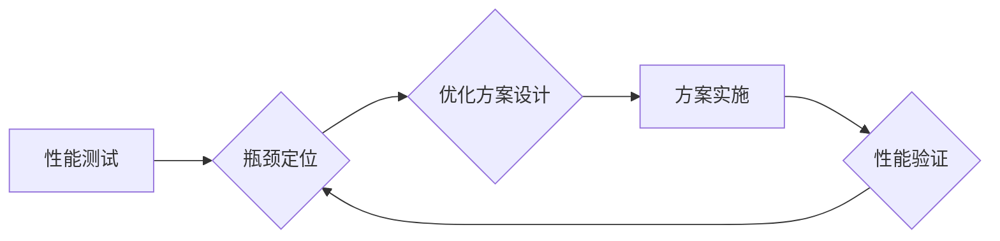

> 系统瓶颈，性能优化，负载测试，性能调优，数据库优化，缓存机制，代码优化，系统架构

## 1. 背景介绍

在当今以数字化转型为核心的时代，软件系统扮演着越来越重要的角色。无论是电商平台、金融系统还是社交网络，都依赖于高效、稳定的软件系统来支撑其业务发展。然而，随着业务规模的不断扩大和用户需求的不断变化，软件系统也面临着越来越多的性能挑战。系统瓶颈问题，即系统某一环节的性能无法满足整体需求，从而导致系统整体性能下降，成为制约软件系统发展的重要因素。

本篇文章将深入探讨系统瓶颈分析与优化案例，从理论到实践，全面阐述如何识别、分析和解决系统瓶颈问题，帮助读者提升软件系统的性能和稳定性。

## 2. 核心概念与联系

**2.1 系统瓶颈的概念**

系统瓶颈是指系统中某一环节的性能无法满足整体需求，从而导致系统整体性能下降的现象。它就像一条“漏水”的管道，即使其他环节性能良好，也无法保证整个系统的正常运行。

**2.2 系统瓶颈的类型**

系统瓶颈可以分为多种类型，常见的有：

* **硬件瓶颈:** CPU、内存、硬盘等硬件资源不足，导致系统性能下降。
* **软件瓶颈:** 代码逻辑缺陷、算法效率低下、数据库查询效率低等软件问题导致系统性能下降。
* **网络瓶颈:** 网络带宽不足、网络延迟高等网络问题导致系统性能下降。
* **数据库瓶颈:** 数据库查询效率低、数据库连接数过多等数据库问题导致系统性能下降。

**2.3 系统瓶颈分析与优化流程**

系统瓶颈分析与优化是一个迭代的过程，通常包括以下步骤：

1. **性能测试:** 通过负载测试等手段，模拟真实用户场景，找出系统性能瓶颈。
2. **瓶颈定位:** 分析性能测试结果，定位系统性能瓶颈所在环节。
3. **优化方案设计:** 根据瓶颈类型，设计相应的优化方案。
4. **方案实施:** 将优化方案实施到系统中。
5. **性能验证:** 再次进行性能测试，验证优化方案的效果。

**2.4 Mermaid 流程图**



## 3. 核心算法原理 & 具体操作步骤

**3.1 算法原理概述**

在系统瓶颈分析与优化过程中，常用的算法包括：

* **时间复杂度分析:** 通过分析算法的时间复杂度，可以评估算法的效率。
* **空间复杂度分析:** 通过分析算法的空间复杂度，可以评估算法的内存占用。
* **性能基准测试:** 通过比较不同算法在特定场景下的性能表现，可以选取最优的算法。

**3.2 算法步骤详解**

* **时间复杂度分析:**

1. 确定算法执行的基本操作。
2. 统计算法中基本操作的执行次数。
3. 根据操作次数和输入数据大小，推导算法的时间复杂度。

* **空间复杂度分析:**

1. 确定算法使用的内存空间。
2. 统计算法中变量、数组等数据结构的大小。
3. 根据数据结构的大小和输入数据大小，推导算法的空间复杂度。

* **性能基准测试:**

1. 定义测试用例，模拟真实用户场景。
2. 使用性能测试工具，对不同算法进行测试。
3. 分析测试结果，比较不同算法的性能表现。

**3.3 算法优缺点**

* **时间复杂度分析:**

优点: 能够直观地评估算法的效率。
缺点: 无法完全反映实际性能，因为实际性能还受硬件、软件环境等因素影响。

* **空间复杂度分析:**

优点: 能够评估算法的内存占用。
缺点: 无法完全反映实际性能，因为实际性能还受硬件、软件环境等因素影响。

* **性能基准测试:**

优点: 可以更准确地反映实际性能。
缺点: 需要花费较多时间和精力进行测试。

**3.4 算法应用领域**

* **时间复杂度分析:** 用于评估算法效率，选择最优算法。
* **空间复杂度分析:** 用于评估算法内存占用，避免内存溢出。
* **性能基准测试:** 用于比较不同算法的性能表现，优化系统性能。

## 4. 数学模型和公式 & 详细讲解 & 举例说明

**4.1 数学模型构建**

系统瓶颈分析与优化可以利用数学模型进行建模和分析。例如，可以建立一个描述系统性能的数学模型，其中包括硬件资源、软件资源、网络资源等因素。通过分析模型的解，可以找出系统性能瓶颈所在环节。

**4.2 公式推导过程**

假设系统性能可以用一个函数来描述，该函数的输入是系统资源的配置，输出是系统性能指标。例如，系统吞吐量可以表示为：

$$吞吐量 = f(CPU,内存,网络带宽)$$

其中，CPU、内存、网络带宽分别表示系统的CPU资源、内存资源和网络带宽。

通过分析该函数的导数，可以找出影响系统吞吐量最大的资源。

**4.3 案例分析与讲解**

假设一个电商平台的系统性能瓶颈是数据库查询效率低。可以通过以下步骤进行分析和优化：

1. **数据分析:** 分析数据库查询语句的执行时间和资源消耗。
2. **索引优化:** 建立合适的索引，提高数据库查询效率。
3. **数据库配置优化:** 调整数据库配置参数，例如连接池大小、查询缓存大小等。
4. **数据库分库分表:** 将数据库数据分库分表，减少单个数据库的压力。

## 5. 项目实践：代码实例和详细解释说明

**5.1 开发环境搭建**

* 操作系统: Ubuntu 20.04
* 编程语言: Python 3.8
* 框架: Django 3.2
* 数据库: MySQL 8.0

**5.2 源代码详细实现**

```python
# views.py
from django.shortcuts import render
from django.db import connection

def index(request):
    with connection.cursor() as cursor:
        cursor.execute("SELECT * FROM products")
        products = cursor.fetchall()
    return render(request, 'index.html', {'products': products})
```

**5.3 代码解读与分析**

* `connection.cursor()` 创建数据库连接对象。
* `cursor.execute("SELECT * FROM products")` 执行查询语句，获取所有产品信息。
* `cursor.fetchall()` 获取查询结果。
* `render(request, 'index.html', {'products': products})` 将查询结果传递给模板文件。

**5.4 运行结果展示**

运行上述代码，访问网站首页，可以查看所有产品信息。

## 6. 实际应用场景

系统瓶颈分析与优化在各个领域都有广泛的应用场景，例如：

* **电商平台:** 优化商品搜索、订单处理、支付流程等环节，提升用户体验。
* **金融系统:** 优化交易处理、风险控制、报表生成等环节，保障系统稳定性和安全性。
* **社交网络:** 优化用户注册、好友关系维护、信息推送等环节，提升系统性能和用户粘性。

**6.4 未来应用展望**

随着人工智能、云计算等技术的不断发展，系统瓶颈分析与优化将更加智能化、自动化。未来，我们可以期待：

* 基于机器学习的系统瓶颈预测和诊断工具。
* 自动化的系统性能优化方案生成工具。
* 基于云计算的弹性资源调度和性能优化机制。

## 7. 工具和资源推荐

**7.1 学习资源推荐**

* **书籍:**
    * 《系统设计与架构》
    * 《性能优化》
    * 《深入理解计算机系统》
* **在线课程:**
    * Coursera: 系统设计与架构
    * Udemy: 性能优化
* **博客:**
    * 高性能计算博客
    * 系统架构博客

**7.2 开发工具推荐**

* **性能测试工具:** JMeter, LoadRunner, Gatling
* **数据库监控工具:** MySQL Workbench, phpMyAdmin
* **系统监控工具:** Zabbix, Nagios

**7.3 相关论文推荐**

* 《系统瓶颈分析与优化方法研究》
* 《基于机器学习的系统性能预测方法》
* 《云计算环境下系统性能优化策略》

## 8. 总结：未来发展趋势与挑战

**8.1 研究成果总结**

本文深入探讨了系统瓶颈分析与优化案例，从理论到实践，全面阐述了如何识别、分析和解决系统瓶颈问题。

**8.2 未来发展趋势**

系统瓶颈分析与优化将更加智能化、自动化，并与人工智能、云计算等新技术深度融合。

**8.3 面临的挑战**

* 系统架构越来越复杂，瓶颈分析与优化更加困难。
* 数据量不断增长，对数据库性能提出了更高的要求。
* 系统安全问题日益突出，需要兼顾性能和安全。

**8.4 研究展望**

未来，我们将继续深入研究系统瓶颈分析与优化领域，探索更智能、更有效的解决方案，帮助软件系统更好地应对挑战，实现持续发展。

## 9. 附录：常见问题与解答

**9.1 如何识别系统瓶颈？**

可以通过性能测试、日志分析、监控工具等手段识别系统瓶颈。

**9.2 如何解决系统瓶颈？**

根据瓶颈类型，可以采取相应的优化方案，例如硬件升级、代码优化、数据库优化等。

**9.3 如何评估优化方案的效果？**

可以通过再次进行性能测试，比较优化前后系统性能指标的变化，评估优化方案的效果。


作者：禅与计算机程序设计艺术 / Zen and the Art of Computer Programming 
<end_of_turn>