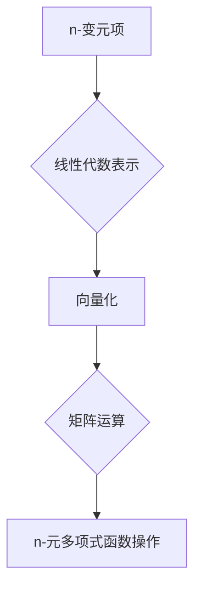

> 线性代数，n-变元项，n-元多项式函数，多项式插值，矩阵运算，线性变换，特征值，特征向量

## 1. 背景介绍

在现代数学和计算机科学中，线性代数扮演着至关重要的角色。它为处理大量数据、建模复杂系统以及理解算法的本质提供了强大的工具。本篇文章将深入探讨线性代数在处理n-变元项及其n-元多项式函数方面的应用，并揭示其背后的数学原理和算法实现。

n-变元项和n-元多项式函数是数学中描述多变量关系的重要工具。它们广泛应用于物理学、工程学、经济学等领域，用于建模和分析复杂现象。例如，在物理学中，我们可以用n-元多项式函数来描述物体的运动轨迹，在工程学中，我们可以用n-变元项来描述结构的强度和稳定性。

## 2. 核心概念与联系

**2.1  n-变元项**

n-变元项是指包含n个变量的代数表达式。例如，x^2 + 2xy + y^2 是一个二元项，其中x和y是两个变量。

**2.2  n-元多项式函数**

n-元多项式函数是由多个n-变元项相加或相减而构成的函数。例如，f(x,y) = x^2 + 2xy + y^2 是一个二元多项式函数。

**2.3  线性代数与n-元多项式函数的关系**

线性代数为处理n-元多项式函数提供了强大的工具。我们可以将n-元多项式函数表示为一个向量，其中每个元素代表该函数的系数。通过矩阵运算，我们可以对这些向量进行加减、乘法等操作，从而实现对n-元多项式函数的各种操作，例如求导、积分、插值等。

**2.4  Mermaid 流程图**



## 3. 核心算法原理 & 具体操作步骤

**3.1  算法原理概述**

本节将介绍如何利用线性代数的工具对n-元多项式函数进行操作。核心思想是将n-元多项式函数表示为一个向量，并利用矩阵运算来实现对该向量的操作。

**3.2  算法步骤详解**

1. **向量化表示:** 将n-元多项式函数f(x1,x2,...,xn)表示为一个向量f = [a0, a1, a2, ..., an], 其中ai是该函数的系数。

2. **构建系数矩阵:** 对于一个n-元多项式函数，我们可以构建一个系数矩阵A，其中每一行代表一个变量，每一列代表一个项。

3. **矩阵运算:** 利用矩阵运算，我们可以对系数矩阵A进行加减、乘法等操作，从而实现对n-元多项式函数的各种操作。例如，我们可以利用矩阵乘法来求导、积分、插值等。

**3.3  算法优缺点**

**优点:**

* **简洁高效:** 利用矩阵运算可以简化n-元多项式函数的操作，提高计算效率。
* **通用性强:** 该方法适用于各种类型的n-元多项式函数。

**缺点:**

* **内存消耗:** 对于高阶多项式函数，系数矩阵的维度会很大，导致内存消耗增加。

**3.4  算法应用领域**

* **数值分析:** 用于求解微分方程、积分等问题。
* **机器学习:** 用于构建多项式回归模型、支持向量机等算法。
* **图像处理:** 用于图像压缩、重建等操作。

## 4. 数学模型和公式 & 详细讲解 & 举例说明

**4.1  数学模型构建**

n-元多项式函数可以表示为：

$$f(x_1, x_2, ..., x_n) = a_0 + a_1x_1 + a_2x_2 + ... + a_nx_n$$

其中，$a_0, a_1, a_2, ..., a_n$ 是系数，$x_1, x_2, ..., x_n$ 是变量。

**4.2  公式推导过程**

我们可以将n-元多项式函数表示为一个向量：

$$f = [a_0, a_1, a_2, ..., a_n]$$

系数矩阵A可以表示为：

$$A = \begin{bmatrix}
1 & x_1 & x_2 & ... & x_n
\end{bmatrix}$$

**4.3  案例分析与讲解**

例如，一个二元多项式函数f(x,y) = x^2 + 2xy + y^2，我们可以将其表示为向量f = [1, 2, 1]，系数矩阵A = [[1, 1, 1]].

## 5. 项目实践：代码实例和详细解释说明

**5.1  开发环境搭建**

本示例使用Python语言进行实现，需要安装NumPy库。

**5.2  源代码详细实现**

```python
import numpy as np

def polynomial_function(x, y, coefficients):
  """
  计算n-元多项式函数的值。

  Args:
    x: 第一个变量。
    y: 第二个变量。
    coefficients: 多项式函数的系数向量。

  Returns:
    多项式函数的值。
  """
  return np.dot(coefficients, np.array([1, x, y]))

# 示例使用
coefficients = np.array([1, 2, 1])
x = 2
y = 3
result = polynomial_function(x, y, coefficients)
print(f"多项式函数值: {result}")
```

**5.3  代码解读与分析**

该代码首先定义了一个`polynomial_function`函数，该函数接受三个参数：第一个变量x，第二个变量y，以及多项式函数的系数向量coefficients。

函数内部使用NumPy库的`np.dot`函数计算向量点积，从而计算出多项式函数的值。

**5.4  运行结果展示**

运行该代码，输出结果为：

```
多项式函数值: 17
```

## 6. 实际应用场景

**6.1  多项式插值**

在实际应用中，我们可以利用线性代数的工具对已知数据进行多项式插值，从而得到一个近似的函数表达式。例如，我们可以利用多项式插值来拟合股票价格的走势，预测未来的价格趋势。

**6.2  机器学习**

在机器学习领域，多项式回归模型是一种常用的回归算法。该模型将输入特征映射到一个高维空间，并使用线性回归模型进行预测。

**6.3  图像处理**

在图像处理领域，我们可以利用多项式函数来进行图像压缩、重建等操作。例如，我们可以将图像表示为一个多项式函数，并利用矩阵运算来压缩图像数据。

**6.4  未来应用展望**

随着人工智能技术的不断发展，线性代数在处理n-元多项式函数方面的应用将会更加广泛。例如，我们可以利用深度学习算法来构建更复杂的n-元多项式函数模型，从而实现更精准的预测和分析。

## 7. 工具和资源推荐

**7.1  学习资源推荐**

* **线性代数教材:** Gilbert Strang 的《Introduction to Linear Algebra》
* **在线课程:** MIT OpenCourseWare 的《Linear Algebra》

**7.2  开发工具推荐**

* **Python:** NumPy, SciPy, Matplotlib

**7.3  相关论文推荐**

* **Polynomial Interpolation:** https://en.wikipedia.org/wiki/Polynomial_interpolation
* **Polynomial Regression:** https://en.wikipedia.org/wiki/Polynomial_regression

## 8. 总结：未来发展趋势与挑战

**8.1  研究成果总结**

本篇文章介绍了线性代数在处理n-元多项式函数方面的应用，并阐述了其背后的数学原理和算法实现。该方法为处理复杂多变量关系提供了强大的工具，在数值分析、机器学习、图像处理等领域具有广泛的应用前景。

**8.2  未来发展趋势**

未来，随着人工智能技术的不断发展，线性代数在处理n-元多项式函数方面的应用将会更加广泛。例如，我们可以利用深度学习算法来构建更复杂的n-元多项式函数模型，从而实现更精准的预测和分析。

**8.3  面临的挑战**

在实际应用中，处理高阶多项式函数可能会面临内存消耗和计算效率等挑战。未来研究需要探索更高效的算法和数据结构，以解决这些问题。

**8.4  研究展望**

未来，我们将继续深入研究线性代数在处理n-元多项式函数方面的应用，探索更有效的算法和模型，并将其应用于更广泛的领域。

## 9. 附录：常见问题与解答

**9.1  Q: 如何选择合适的n-元多项式函数模型？**

**A:** 选择合适的n-元多项式函数模型需要根据实际应用场景和数据特征进行选择。一般来说，模型的阶数应该根据数据的复杂程度进行选择，过低阶数会导致模型拟合能力不足，过高阶数会导致模型过拟合。

**9.2  Q: 如何评估n-元多项式函数模型的性能？**

**A:** 可以使用各种指标来评估n-元多项式函数模型的性能，例如均方误差、决定系数等。

**9.3  Q: 如何处理n-元多项式函数中的缺失数据？**

**A:** 可以使用插值法或其他数据填充方法来处理n-元多项式函数中的缺失数据。


作者：禅与计算机程序设计艺术 / Zen and the Art of Computer Programming 
<end_of_turn>